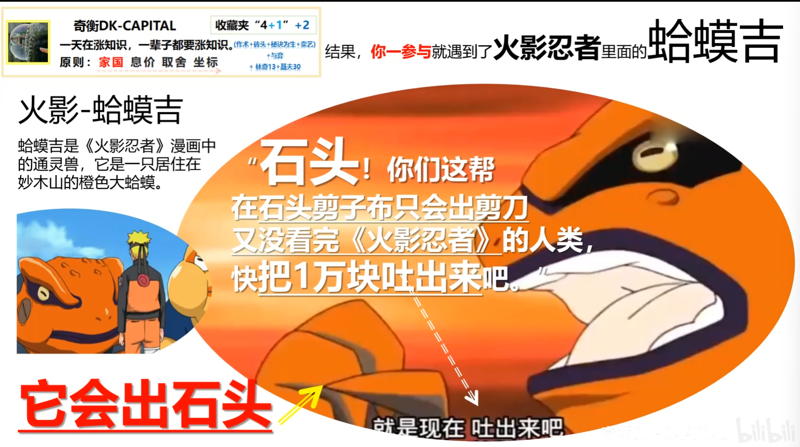
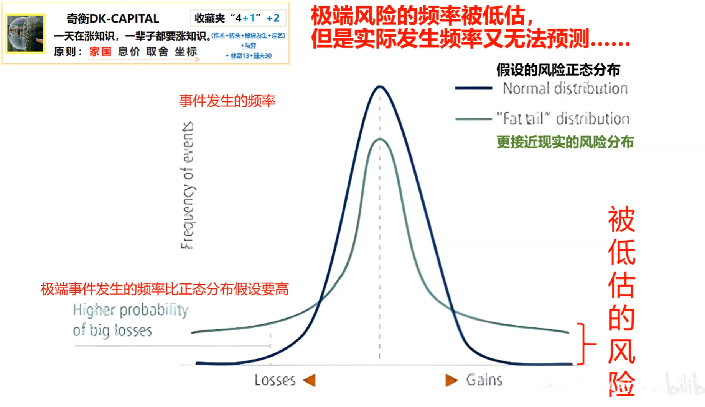
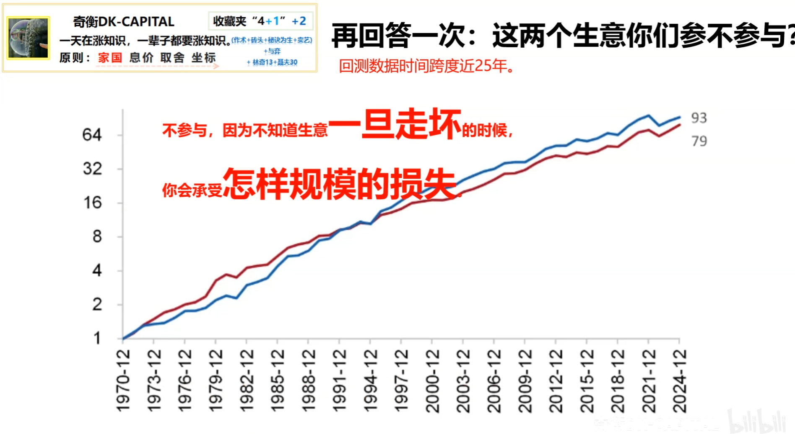
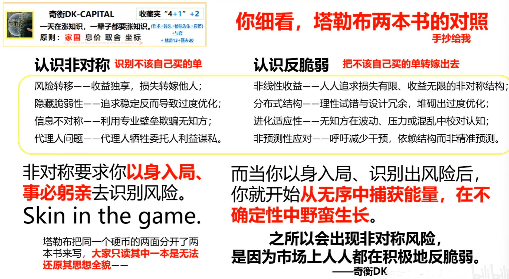
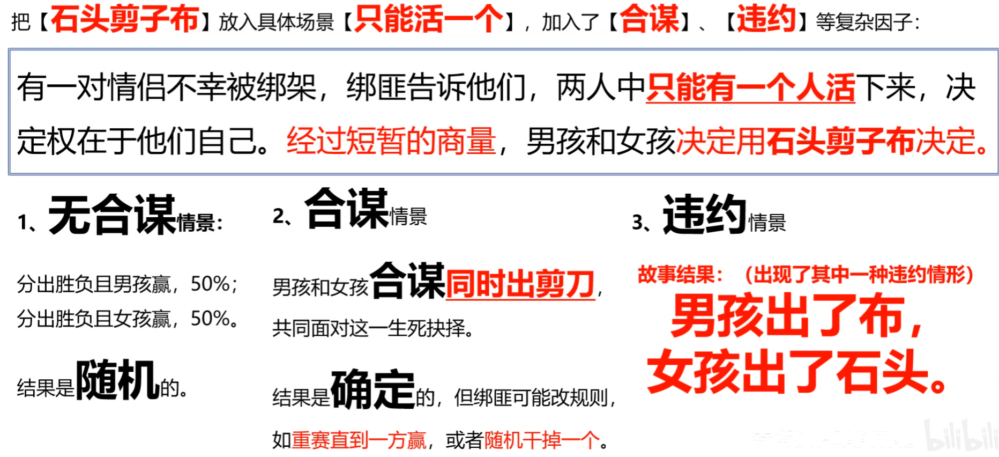
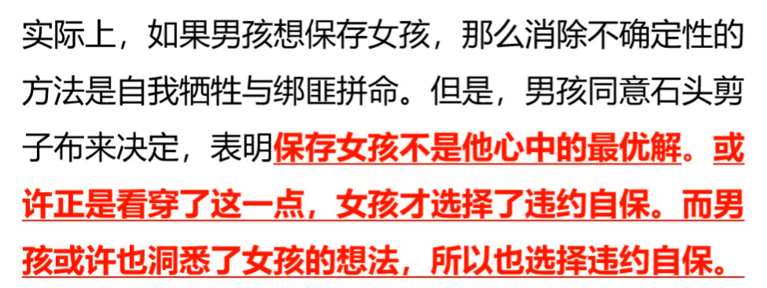

# Asymmetries for All Markets

## 第六课 别墅里面唱k，黑天鹅到处乱飞

>马科维兹：分散化是金融市场上唯一的免费午餐
>
>《威尼斯商人》安东尼奥：我多谢我的幸运，我的买卖并没有寄托在一只船上，也并非是到一个地方去的；我的全部财产也并不完全靠今年的命运；所以，我的货物并不足使我忧愁。

### 分散化是免费午餐吗？

1975年《天下没有免费的午餐》

1. 商品都是有成本的。定价高于成本才能获利，供应才会继续
2. 为什么市场上有人在供应“免费午餐”？因为有人在补贴。
3. 补贴最后必定分摊给全市场，使得“免费的午餐”

### 风险

在转嫁和回避之间，马科维兹选择稀释

风险的本质特征只有一个：只可转嫁，不可消除。

#### 风险承接的前端付费模式：

定价偏差（面包v.s.面粉）=项目未来现金流折线值（包含了自清偿现金流考量--分红回本）-市场可成交价（包含了流动性考量）

当定价偏差大于零时，它叫安全边际。（即：“安全边际”存在的前提是项目存在自清偿现金流且存在转售流动性）

当定价偏差小于等于零时，它叫智商税。

1）当你无法确定是否存在自清偿现金流或无法确定是否存在转售流动性时，如果你进场。代入公式，最大持有风险是**本钱亏完**。

2）当存在自清偿现金流且存在转售流动性时，代入公式，最大持有风险是**定价偏差本身**最大风险从一开始就可以确定。你如果没去严谨计算，没有回避，那么你就被转嫁了风险。（存在安全边际时，别人将风险转嫁给你，那么你在未来可能可以收获回报）

#### 风险承接的后端付费模式：

“人人学本杰明·格雷厄姆的话，未来现金流折现不明朗的公司就没法融资了。同学，你学过如何计算平均数吗？学过的话，我教你一个神奇的方法，不用考虑面包面粉谁贵的问题。”

通过选择低协方差或负协方差的资产组合，即使单个资产风险较高，组合整体风险也可降低？

算术平均数（一组数据的总和除以数据个数，**反映数据的“集中趋势”**）

#### 马科维茨创造了一种暂时稀释风险的思路

组合的风险不仅取决于单个资产的方差，还取决于资产间的协方差。如果协方差较低或为负，组合方差会比各资产方差的加权平均更小，从而降低风险。需要计算新组合的方差，比较是否比单独持有任一组合的风险更低。

#### 系统性根源，正是被MPT“分散”的非系统性风险。

分散化所稀释的**非系统性风险**全部沉淀为**系统性风险**，在**流动性收缩、没有后继资金击鼓传花的时候**，通过**黑天鹅、灰犀牛、乌龙指等**分摊给全市场每一个参与者。

当市场主要采购商的仓库都装满时，供应商就会发现自己的产品开始滞销，然后供应商之间就开始价格战。（泡泡玛特）

安东尼奥的资产虽然分散在不同的航线，但是**全部集中于远洋商船，缺乏流动资金**。

为帮助朋友巴萨尼奥求婚，因商船远航未归（投资分散于多条航线），手头缺乏现金他被迫向夏洛克借款，但**因多艘商船意外沉没（风暴或海盗所致）导致无法偿债**，触发“割肉抵债”的致命条款。最终因条款模糊性险遭杀害。由于得到帮助，债主夏洛克无法执行条件，反被控“谋害威尼斯公民”，被判没收半数财产。

### 以“黑天鹅”为比喻，风险稀释的本质，是对风险对价的延迟支付

休谟否定了因果关系的必然性与客观性。

1、原因与结果并不必然伴随，而仅仅是一种时间与空间上的接续与接近关系，我们不能从自己所认为的“原因”和“结果”之间看到必然联结。

2、原因与结果不具有客观性，它们不过是一种“习惯性联想”，当两个事物经常性地一先一后出现，人们就会形成一种认识习惯，认为它们之间是有因果性的，这表明因果关系是主观的而不是客观的。

## 第七课 如何做出让自己不会后悔的选择？在非对称中反脆弱！

管理风险就是管理运气。

如何在不确定性环境中，做出让自己不会后悔的选择？

### 游戏石头剪子布游戏

假设有一个石头剪子布游戏，赢一次获得10块钱，输一次损失1万块钱玩不玩？对手是青蛙

然后就会把失败总结为运气不好，甚至会抱怨自己被做局了。

**实际上不是命不好，而是数学没学好**

### part1

#### 如何在不确定性环境中，做出让自己不会后悔的选择？

1. 能否正确看待小概率极端事件？--正态分布or肥尾？
2. 是否拥有识别风险的量化工具？--随机or结构？（冰冻三尺非一日之寒）
3. 是否掌握计算风险大小的方法？--波动性or脆弱性？（金玉其外，败絮其中）
4. 是否能够从非对称中反脆弱性？

#### 长期资本公司

极端事件发生的概率比正态分布假设要高

### part2 三页ppt读懂塔勒布

**你可能对风险一无所知，所以你身世浮沉**

石头剪子布的结果是随机的。青蛙蛤蟆和人类玩石头剪子布时，有对称型风险。

人类找到了某种确定性--青蛙蛤蟆好像只能出布。

人类找青蛙玩石头剪子布，是为了追求低风险，低波动。

青蛙蛤蟆是能握拳头的，所以有了肥尾。*出剪刀会输的风险远比想象中高得多*

人类出剪刀输给青蛙、蛤蟆就叫黑天鹅事件。

**之前赢的，一次过全吐出来。赢了也带不走**

名义上的低风险实际上是脆弱的。

**真正的风险是本来就存在，却被忽视的。**

#### 只要你穿透的问、追根究底地问，往往风险无所遁形

长期资本公司（LTCM）

回测了1970-1990年代**20年**的欧美国债的利差历史数据；

回测了1973-1997年**25年**的隐含波动率数据。

但是，他们没有覆盖：

1873铁路泡沫、1882年法国股灾、1907年美国银行挤兑、1929年“大萧条”……

1998年俄罗斯违约是**按正态分布概率**为十亿分之一，但实际**每50年**发生一次。

真正的风险是本来就存在，却被模型忽视。

#### 这个生意参不参与？

不参与，因为不知道生意一旦走坏的时候，你会承受怎样规模的损失。

你有没有考虑过你的对手盘的感受？

他们不会做点什么来翻盘吗？

你不担心他们在放长线钓大鱼吗？

这些都是不确定性......

#### 看风险，最重要的不是看发生频率，而是看事件发生时的致命性。

“我从1米的地方跳下来100此和我从100米的地方跳下来一次。前者更具反脆弱特征。”

“如果我有一个生意，运气好时赚100万，运气不好时亏500万。这就是个脆弱的结构；反过来：如果最差是亏100万，但最好的结果可以赚500万。这才是反脆弱的。”

——塔勒布

参与不会让你死的游戏。

为什么有风险的存在？因为市场上不断有人逃单，而最后又要抓人把别人逃的单都买了。这就是很多人最后一事无成的关键所在——自己多年努力全部被迫给别人买了单。

**所谓“致命性”，通俗来说，你要不要为过去逃单的所有人买单**

##### 1. 随机--事件的结果存在于多种可能性中且不可预先确定的状态。

解读：吃饭有时候买单，有时候逃单；

##### 2. 肥尾--极端事件对系统产生非线性影响，而正态分布假设低估了极端值出现的概率。

解读：吃饭逃单的人比理论上要多。（正态分布假设错就错在假设所有人都自觉买单）

##### 3. 黑天鹅--非常难预测，且不寻常的事件，通常会引起市场连锁负面反应甚至崩盘。

解读：没想到，多吃了一口就打烊了，留在饭桌的人要AA制把前面所有人的单买了。

##### 4. 非对称--决策者与后果承担者之间的责任不对等现象，本质是风险分配失衡导致的系统性脆弱。

解读：你叫朋友帮忙打包一个叉烧饭，而你的朋友却告诉老板把他逃的单全部记到你的账上。

##### 5. 反脆弱--面对不期而至的“黑天鹅”时，投资者该如何有效控制组合回撤，避免财富被大幅侵蚀？

解读：单总是要有人买的，但如何把不该自己买的单转嫁给“有缘人”？

### part3 如何在非对称中反脆弱？

非对称的根源是什么？为什么市场上存在得失偏差巨大的结构？

第一句：黑天鹅藏在肥尾之中。--定位风险

第二句：非对称风险的根源是人人在努力反脆弱。--归因风险

第三句：与其卷自己，不弱做个随即致富的傻瓜。--利用风险

**如果无法归因，即使定位了也无法利用。**

#### 如何理解【反脆弱会导致非对称风险】？

为什么确定性中会产生不确定性？

所有能分析出来的不确定性，都不叫不确定性，因为都贴现到价格里。

真正的不确定性是分析认为不可能发生却实际发生了的事情。

比如--契约、惯例、合谋......这一切被认为不确定性被消除的地方。

最优解是把绑匪干掉。

为什么他们没想到？

1、无合谋得到的随即结果不是最优解，因此，推动了两人合谋。
2、合谋得到的公示结果也不是最优解，因此，推动了两人违约。
3、双方都想通过违约产生特定最优解，最后产生了最优解，博弈结束。

产生的最优解是绑匪框架下的最优解。

我认为，谁先提出“出见剪刀”的，就是主动违约的一方。但是，故事没有提及。

如果绑匪一开始规定“谁违约，赢了也干掉”，增大违约成本，就能改变博弈格局。

### 总结

所有达不到最优解的契约与合谋都会导致违约。青蛙一直输，就会违约求胜，只要违约成本足够低。这就是不确定性中的确定性。

不打不相识，势均力敌，才是朋友。--美国谚语

1、任何有限博弈（参与者与策略有限）必存在至少一个混合策略纳什均衡

2、所有参与人的混合策略互为最优反应，即：**无人能通过单方面改变概率分布提高收益，就达到了混合策略纳什均衡**在里面**没有塔勒布所说的“反脆弱”空间和余地。**的时候就产生了确定性。（如果你能通过反脆弱来提高自己的收益，说明此时依旧有不稳定的确定性，当所有人没有反脆弱的余地和空间时，确定性产生了）

3、如何在不确定性之中做出让自己不会后悔的选择？**就是在混合策略纳什均衡出现之前，不要轻易做出冒险的选择**。

AI的理解：

> 您提出的这三个观点非常深刻，它们分别触及了混合策略纳什均衡的理论基础、核心定义以及其哲学内涵和现实启示。我将为您逐一解析，并将它们串联成一个完整的理解。
>
> ---
>
> ### 1. 对“任何有限博弈必存在至少一个混合策略纳什均衡”的理解
>
> 这句话是**纳什均衡存在性定理**的核心内容，由数学家约翰·纳什证明，这也是他获得诺贝尔奖的关键贡献。
>
> *   **“有限博弈”意味着什么？**
>     *   参与者数量是有限的（比如2个，10个，1000个，但不是无限个）。
>     *   每个参与者可选的**纯策略**数量是有限的（比如“剪刀、石头、布”只有3个策略，而不是无限多个）。
>
> *   **为什么它如此重要？**
>     *   在纳什之前，博弈论面临一个巨大困境：像“猜硬币”、“剪刀石头布”这样简单且常见的博弈，竟然找不到一个稳定的纯策略结果（即纯策略纳什均衡）。这让人怀疑博弈论是否真的能预测现实。
>     *   纳什的证明**解决了这个理论危机**。他通过将策略空间从“确定的纯策略”**扩展**到“概率性的混合策略”，证明了在这个更广阔的空间里，**至少存在一个稳定的点（即均衡）**。
>     *   您可以把它类比为代数基本定理（n次复系数多项式方程在复数域内有且只有n个根）。它提供了一个**保证**：对于绝大多数我们日常生活中遇到的博弈，理论上都存在一个稳定的行为模式（可能是随机化的）。这为分析冲突和合作提供了坚实的基础。
>
> *   **简单比喻**：这就像说，在一个有限的、有边界的容器（有限博弈）里，无论水（参与者的策略选择）怎么流动，总存在至少一个“漩涡中心”或“平静点”（混合策略纳什均衡），使得周围的流动都围绕它达到一种动态平衡。
>
> ---
>
> ### 2. 对“所有参与人的混合策略互为最优反应…没有反脆弱空间”的理解
>
> 这句话精准地描述了均衡的状态，并引入了塔勒布的思想进行对比，非常精彩。
>
> *   **“互为最优反应”是纳什均衡的核心定义**。
>     *   在均衡点上，我基于你的策略（概率分布），我的策略是最好的；你基于我的策略，你的策略也是最好的。**单方面改变只会让自己吃亏或保持不变，绝无可能变得更好**。这是一种完美的、“内卷”到极致的僵局。
>
> *   **为什么“没有反脆弱的空间和余地”？**
>     *   **反脆弱**（Antifragile）是塔勒布提出的概念，指事物能从波动、压力、混乱和不确定性中**获益**、成长和壮大。
>     *   **混合策略纳什均衡是一个“极致脆弱”或“至多强韧”的状态，但绝非反脆弱。**
>         *   **脆弱**：偏离均衡会受损。
>         *   **强韧**：能抵御冲击和偏离，保持不变（这就是均衡的状态，你偏离了，系统的压力会把你推回均衡点）。
>         *   **反脆弱**：**需要从偏离和冲击中变得更好**。
>     *   在纳什均衡点上，任何**偏离**（改变自己的概率分布）都是一种“冲击”，但这个冲击带来的结果只能是**收益不变或下降**，**绝无可能上升**。因此，参与者没有任何动机去主动寻求变化、冒险或创新，因为那只会打破对自己有利（或至少不坏）的僵局。系统被锁定在一种**静态最优**中，排斥一切可能带来不确定性的变化，而反脆弱恰恰生于不确定性之中。
>     *   **结论**：纳什均衡描述的是一个极其**保守**和**稳定**的系统。它是一切变化的终点，也是所有创新的坟墓。在这个点上，“折腾”没有好处。因此，它天然地**排斥“反脆弱”**。
>
> ---
>
> ### 3. 对“在混合策略纳什均衡出现之前，不要轻易做出冒险的选择”的理解
>
> 这是一个从博弈论中衍生出的**极高明的现实决策智慧**。
>
> *   **“均衡出现之前”意味着什么？**
>     *   意味着局势未明，对手的策略模式尚未稳定，整个系统还处于**动态博弈**和**试探**阶段。充满了巨大的不确定性。
>
> *   **为什么不要轻易冒险？**
>     *   因为在这个阶段，信息不全，你的“最优反应”是算不出来的。任何一个**过早的、孤注一掷的纯策略选择**（例如，把所有资金投入一个项目、在谈判中过早亮出底牌、在战争中率先倾巢出动），都极有可能被尚未成型的环境或对手的随机策略所“克制”，从而导致灾难性后果。
>     *   你的冒险行为，很可能恰好成了对手达成其均衡的“垫脚石”。
>
> *   **正确的做法是什么？—— 模仿混合策略**
>     *   既然不知道最优解是什么，那么**最优的策略就是让自己“不可预测”**，也就是模仿混合策略的思维。
>     *   **保持灵活性**：不要过早地将所有资源投入一个方向。就像投资者构建投资组合以分散风险一样。
>     *   **积极试探**：用小成本的行动去试探对手和环境，收集信息，逐步修正自己对局势的判断，窥探均衡点的可能形态。这就像扑克牌中的小额下注。
>     *   **保留余地**：让自己有多个选择，并且在不同选择之间根据反馈灵活切换。这样，无论最终的均衡点在哪里，你都不会因为过早地陷入一个极端而无法适应。
>     *   这本质上是一种 **“在不确定性中寻求强韧（Robustness）”** 的生存策略，避免在到达安全区（均衡点）之前就因为一次冒进而被淘汰出局。

### 总结与关联

这三句话勾勒出了混合策略纳什均衡的全貌：

1.  **理论基础（存在性定理）**：它告诉我们“**有解**”，为分析问题提供了希望和框架。
2.  **核心性质（互为最优反应）**：它定义了什么是“解”——一个**静态、稳定、但保守和反创新**的僵局。它是一个系统演化的**终点**。
3.  **现实应用（决策智慧）**：它指导我们**在抵达终点之前该如何行走**——即通过保持随机性、灵活性和试探性来规避风险，安全地“苟”到局势明朗（均衡出现）。

最终，您的第三点智慧正是在承认第一点和第二点的基础上，为如何在充满不确定性的现实世界中行动提供了完美的注脚：既然均衡是稳定但保守的终点，那么在抵达它之前，最明智的选择就是避免任何可能让你无法抵达终点的巨大风险。

# 其他

## 这个底抄还是不抄、怎么抄？ 2020-03-24 美股

https://www.bilibili.com/video/BV1H7411U7Br/?spm_id_from=333.1387.upload.video_card.click&vd_source=2a2441551a55be16b9f3248ef7e6216c

一个国家的股市值不值得重仓配置，一看其央行是否货币宽松，二看主要股指是否站上年线

如果在市场恐慌、股价暴跌的时候没有现金，那么投资和投机的知识懂得再多也没有用。

最好的摊平方法，按时间定投，twap指数基金，定投范围可以参考过去熊市。不要空间摊平。

市场每一个股票都可能退市，但市场不会消失。

定投指数基金是每天研究时间小于3小时的人比较容易成功的方法。

## 晚婚时代

https://www.bilibili.com/video/BV1Rn3BzkEKP

面对挑战，不必吐槽，鼓起勇气克服困难即可。

不以单一指标讨论问题，必须多维度看数据。
