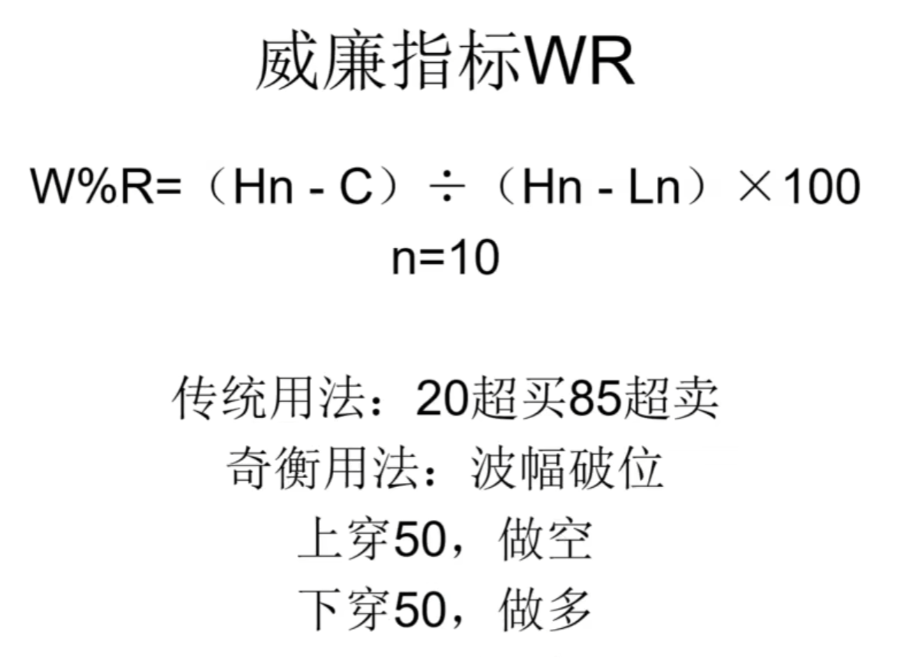
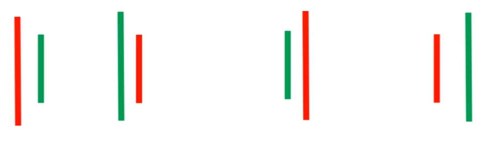
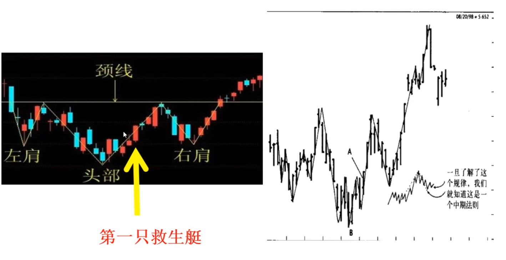
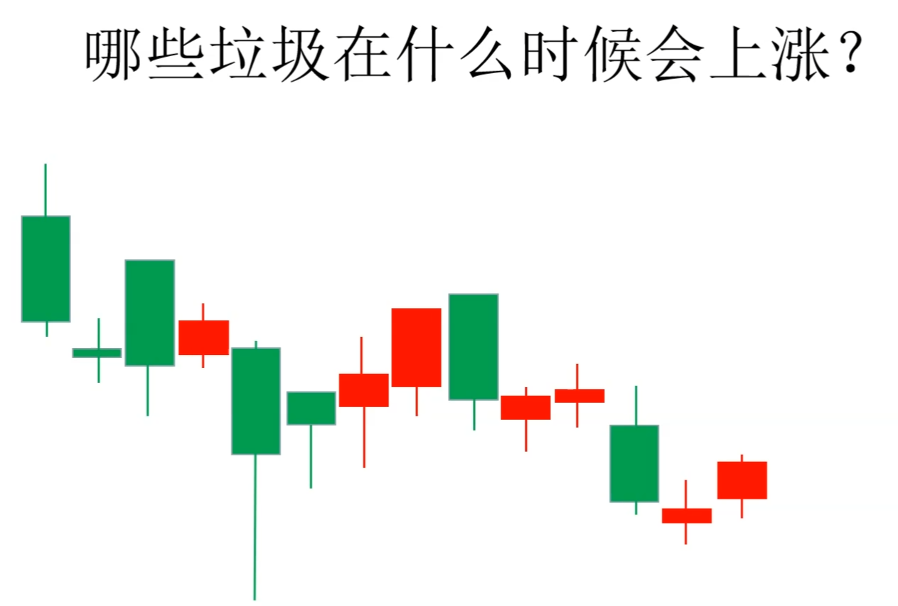
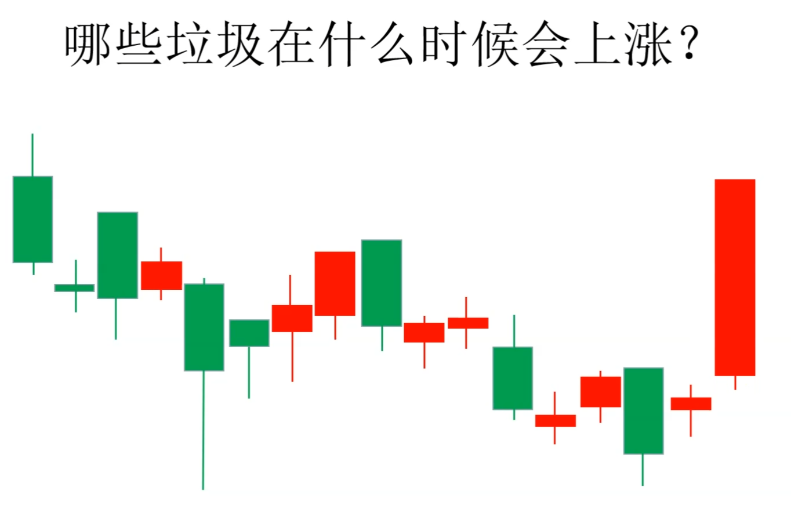
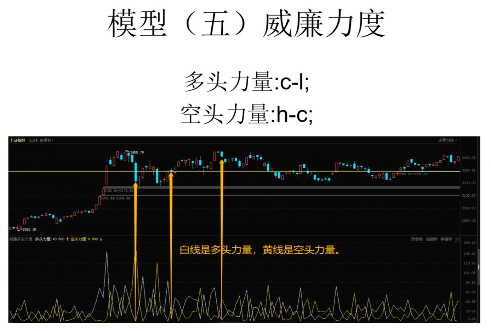
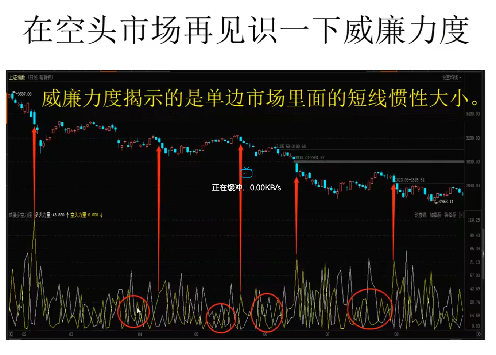
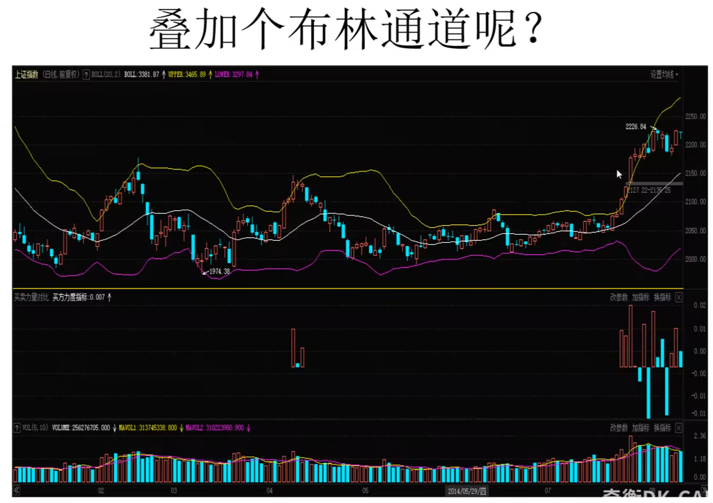
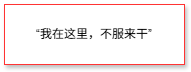
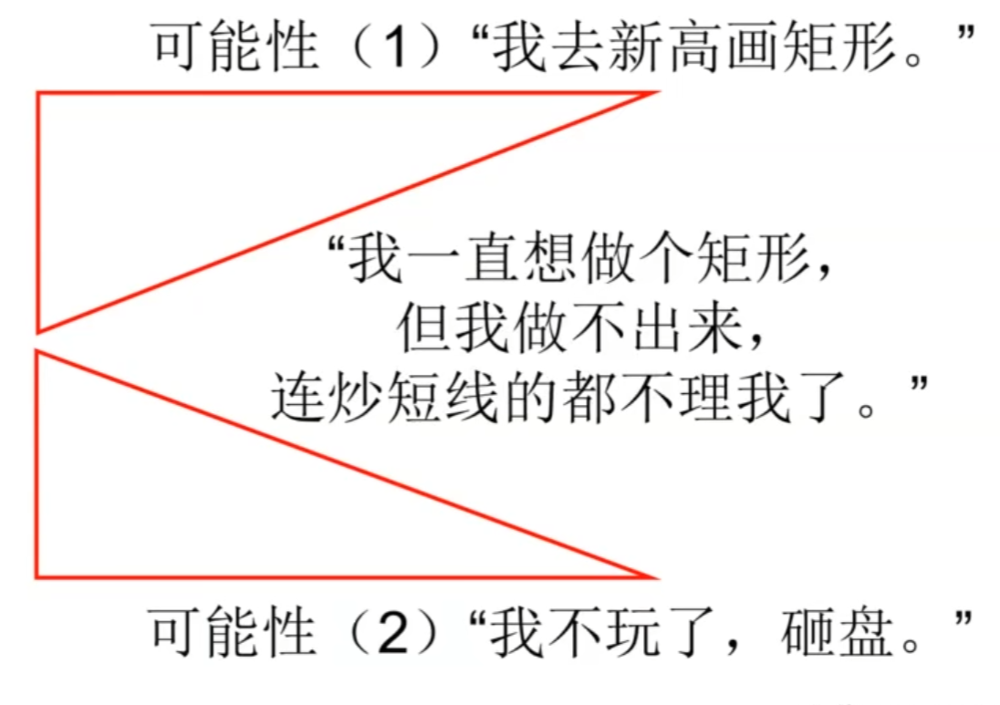

# 短线交易秘诀

## 第一课：威廉指标WR

外汇，期货适用技术分析，期货首选技术指标

顺日线趋势，升穿50空，止损放在前高，盈利后将止损提到成本线

不要用钱来表达多空观点，没有定价权不要猜价格。

股指使用威廉指标不太流畅，不适合威廉指标。

威廉指标适合在趋势持续时间比较长的地方使用

## 第二课：交易仓位管理 ulimited blade works

模型（二）：威廉信封

- 如何让空信封瞬间变得有价值
- 把5000美元放入桌面15个空信封的任意一个，随机打乱
- 宣布谁抽到那个信封，钱就有了价值
- 突然间，另外14个空信封也有了价值
- 这就是股市、期市价值创造的原理
- 5000美元，在15个信封中的任意一个
- 第一回合：抽到“那个信封”的概率是1/15
- 所以，每个信封的数学期望约为333美元
- 记住：统计学家淹死在水深均值1米的河里。
- 但是，每个人都相信自己能抽到“那个信封”
- 威廉信封模型最奇妙的在第二回合
- 每个空信封抽走后，剩下的空信封会升值
- 抽走5个空信封，剩下每个价值500美元
- 因为每个信封代表1/10的中奖机会
- 只剩下两个信封时，每个信封值2500美元
- 你支付的钱并不是买信封，而是买机会
- 买机会，就是投机
- 换而言之，你以为自己在买股票还骗自己说在买公司，其实你只想买个涨停
- 融合理解【威廉信封】，目的是熬到最后
- 艾略特认为一波行情可以抽五次信封
- 这是五浪结构的五次进场机会
- 维克多斯波朗迪认为可以抽三次信封
- 这是123法则结合2B结构，只在拐点抽
- 杰西利维摩尔认为可以只抽一次信封，用关键点识别阻力最小路线，只抽突破。

拉瑞威廉姆斯怎么抽信封

- 通过控制每笔交易的仓位，
- 让自己在任何行情结构下尽可能多抽信封
- 拉瑞威廉姆斯抽信封，第一次抽多少仓位
- 3%--大开大合的手法是散户亏损的捷径
- 杰西利维摩尔每次重仓抽，遇到连续回撤

威廉信封的意义

- 巴菲特：如果你要成功抄底，那么请确保有持续不断的现金不断抄底
- 定投，把成本分摊在年线上面，利润是价格乖离年线的钱

ulimited balde works

就是【我要有钱一直买到你涨为止】

## 第三课：阿卡姆疯人院

如何管理我们内心的疯狂

为什么把二级市场比作疯人院？

绝大多数人注定会输，但是他们都认为自己必定会赢

想要赢，必须清楚：

何时保持清醒，何时一起疯。

### 为什么绝大多数人注定会输？

- 不愿意花时间去了解二级市场的运作
- 再掘金的路上为卖铲子和卖水的人打工
- 一知半解，知易行难
- 明白长期利益最重要，但沉迷于短期刺激

交易必须以清晰明确的原则为基础。交易时必须分析自己的感受，以确信所做的决策有合理的依据，同时还要设计资金管理计划，以免蒙受一连串的损失导致出局。公众需要大师，新大师总会出现。作为一位聪明的交易者，你必须认识到，长期来看，没有哪位大师能让你发财，必须自己努力。

### 为什么要仓位管理？

1974年，我做出了一个价值判断：生牛合约的价格会一飞冲天。所以我开始建仓，在每磅43美分的时候，我建立了第一笔头寸。我“知道生牛合约的价值”在哪儿，这个价位远低于牛肉的价值。所以，当价格下跌到40美分的区域时，我买入了更多。毕竟43美分已经很便宜了，40美分的价格当然更好。

当价格接着下跌到38美分的时候，我捡了个大便宜，我可不傻，趁便宜又买了一些。但是却看到价格一路下跌到35美分，然后到30美分，最后跌到了28美分——也就是在这儿，各位，我被敲出局了。我的钱是有限的，这波行情让我在不到30天里付出了300万美元的代价。

就在两个月后，生牛合约的价格飙升到了每磅60美分。但这跟我没什么关系了——一笔十拿九稳的交易让我损失惨重，而且过了1/4个世纪，我被敲出局的消息至今还在圈内广为传播。尽管在这之后我有过许多成功的交易，后面也会提到。

### 赢家不按照个人喜恶行动

- 赢家只按照规则行事
- 按照个人喜恶行事，容易违反规则。
- 赢家之所以能在数次灾难中活下来，是因为赢家在发生灾难的时候，及时坐上第一只救生艇

## 第四课：技术分析之如何判断高低点

- 模型1 威廉指标--重心摆动
- 模型2 威廉信封--空心封越少越贵
- 模型3 威廉水手--非随机市场
- 模型4 威廉分形--顶底分形和包含

交易获利的两种模型

交易获利基本上有两种做法：用小的头寸捕捉到一次大的价格波动；或者用大的头寸捕捉一次小的价格波动。

### 如何用大头寸捕捉小波动？

从短期来看，市场会上下剧烈波动，在叫做“均价”的平衡点附近上下波动。

我的目标是判断何时从低位折返到均价，这就是超额的波动。

股价从A点运动到B点遵循一定的结构规律，但这种规律并不清晰。

### 模型（三）威廉水手

大部分时间，商品价格像是个喝醉了的水手，徘徊在街头，既不知道要去哪儿，也不知道去过哪儿。数学家会说过去的价格运动与未来的趋势没有关联。

关于这一点，他们可能错了：因为确实存在一些关联。尽管喝醉的水手摇摇摆摆、跌跌撞撞，好像走得并非随机的路线，但他的醉态有迹可循。他总是想去一些地方，而我们也总能找到这些地方。

顶底分形

- 底分形：三根连续的k线/美国线，中间一根的低点比左右两根的低点要低，这是短期低点，用来做多。
- 顶分形：三根连续的K线/美国线，中间一根的高点比左右两根的高点要高，这是短期高点，用来做空。

### 模型（四）威廉分形

- 三根K线判断高低点，相邻高低点再组合。
- 高点和低点之间叫做一个swing（摆动）
- 内包含或者外包含时，价格没有方向

技术分析的结构都是不稳定结构

## 第五课：如何买在起涨点

### 入市之前必须明白

- 所有股票都是垃圾，只是其中一些在特定的时候股价会上涨
- 股价上涨的唯一理由就是流通股供不应求
- 要买的不是好股票也不是低估的股票而是正在上涨的股票，不要浪费时间研究上涨的逻辑
- 正在上涨的股票会涨到无法继续上涨为止

不能破位，可能引起恐慌抛盘，此时形成了底部结构，一直洗就会洗出很多底分型，迪玛克认为相似的结构不会出现超过13次

## 第六课：什么是多空力度

威廉分型包含未来函数，不能单纯用分型抄底，底分型也能被称为阶段低点模型。

> 我们几乎每天都能观察到多空双方力量在市场中起作用。我在1965年写下的操作法则的是：任何时段，卖方的代表都是价格从日中高点向收盘价的波动，而买方的代表是收盘价减去最低价。我的观点是，收盘价和最低价之间的差距揭示了买方的力量，最高价和收盘价之间的距离揭示了卖方对价格的影响。

收盘价和最低价之间的差距揭示了买方的力量，最高价和收盘价之间的距离揭示了卖方对价格的影响。

需要先判断有没有行情和方向，形成这些方向后再用技术指标

主动长线建立在短线交易秘诀之上

## 第七课：威廉时钟及布林通道的真正用法

我仍然相信市场确实有周期，应该有三种周期，但不是时间周期。时间周期问题的根源在于能够从图表中明显地看到一种主导的周期。问题是，很快有另外一种周期成为主导，替代我们刚刚看到并作为投资依据的周期。

**周期是确定性的根源。**

短线交易赚的钱是别人亏的钱。

当你想交易获利时，是否曾停下来想过你所期望的利润来自何方呢？市场上有钱是因为公司盈利增长、利率降低或大豆收成好吗？不对，市场上有钱只是因为其他交易者把钱带到了市场。你想赚的钱是属于其他人的，他们并不想把钱给你。

交易意味着要去抢别人的，当然别人也想抢你的。这是一件高难度的事情。要赢特别困难，因为经纪公司和场内交易员还要从胜败双方身上揩油。

蒂姆·史莱特（Tim Slater）曾将交易比做一场中世纪的战争。一名男子拿着剑走到战场，想杀死对手，同时对手也想杀死他。胜方获得败方的武器、财产和妻子，把他的孩子当奴隶卖掉。现在我们是在交易所交易，而不是在野外打仗。当你从别人手里赚到钱时，与你杀死他没什么区别。他也可能会失去房子、财产和妻子，他的孩子也会遭殃。

### 交易者的错觉

- 因为行情的变化是随着时间推移而刷新的，
- 所以我们很容易有一个错觉：

**价格有时间周期**

最常听到的A股谬论：五穷六绝七翻身。

### 方法论

第一步：破除迷信，放弃时间周期

第二部：价格周期不是时间，是一种空间的收缩和扩张，其切换只与波幅有关，与时间无关，时间要影响价格周期，也要先影响波幅。

公开课只讲肉眼可见的张弛波幅。

布林通道不是关键点。

### 奇衡波幅不对称定理

定理：波动坍缩之后必然扩大，扩大之后未必坍缩。

当一个品种成交低迷，波幅会坍缩，交易所会改变交易规则，降低交易成本，吸引更多人参与。

推论：每次坍缩，都是大涨或大跌倒计时。

## 第八课：短线交易的利润来自哪里？

波动来自实实在在的盘口博弈，来自定价权和控股权的争夺

### 交易**大忌**

#### 大忌1：根据不可证伪的东西交易

大忌：不问苍生问鬼神，客观地了解产业链

做交易不应该有信仰，交易是概率，科学

后果：自欺欺人，殚精竭虑，走火入魔

自我修养：子不语怪力乱神

成功的算法背后的逻辑很简单和可以执行

#### 大忌2：根据现货供求来交易

供需平衡表在期货交易里面相当于九九乘法表，重要但是基础

用价格来判断供需平衡

相信自己

用现货理解期货会有很大偏差，供需平衡表

现货商习惯了高抛低吸的操作，逢高做空被逼空

何谓“神仙打架”？--为了定价权

站位站错方向被市场教育

价格极端扭曲会影响参与者的看法

何谓“神仙打架”？--为了控股权

### 注意

- 承认神仙打架的存在，不否定内在价值
- 迷信价值不可取，迷信技术不可取
- 基本面分析研究对手在想什么
- 技术面分析研究对手在做什么
- 阻力最小路线来自多逼空，空逼多带来的
- 波动持续扩大--为了定价权和控股权

短线交易秘诀：活力需要时间累积

短线交易的难点在于--持有时间太短，无利可图，持有时间太长，风险过高

### 交易者的自我修养

1. 短线震荡很难预测
2. 必须控制损失
3. 只有价格朝对我们有利的方向巨幅波动，我们才有利可图
4. 时间是我们的朋友，用来创造收益
5. 以周为单位组织战斗（2-5个交易日）

### 如何选择最好的短线进场点？

- 原则1:开盘买入并持有到收盘，除非中间止损出来
- 原则2:开盘30分钟内没有发生幅度超过近5日下探波幅均值的下跌，可买
- 原则3:开盘30分钟内没有发生幅度超过近5日上探波幅均值的上涨，可卖。
- 原则4:遇到双向大幅波动，撤退。

## 第九课：不能用于实战的知识，都是糟粕

科学：明确定义+命题可证伪

防止未来函数的陷阱

波动扩大才是风险收益比和收益大的

做波动扩大经常空仓，等待

## 第十课：动能、趋势如何开始和结束？

>趋势按照我所称为的“价格活动的爆炸点”运动。简单地说，如果价格在一个小时、一周或者一月（你可以选择识别趋势的时间范围）内有爆炸性上扬或者下挫，市场将会朝这个方向持续运动，直到相反的方向产生了同样或者更强的爆炸力量。这就是大家知道的波动扩张，是Doug Brie根据我1980年早期的著作提出的“波动突破”的概念。

做交易赚钱是做波动扩张。

### 价格从中点向上或向下的爆炸性突破构成了趋势。

- 什么是爆炸性突破？
- 选择哪个点作为突破的中点。

### 每日价格波动范围的计算

- 每日价格波动范围=最高价-收盘价
- 用T-1日的波幅来衡量T日的波幅
- 波幅衡量方法：开盘价+每日价格波动范围

每日盯开盘价，为什么波动范围是最高价-收盘价

### 问题来了，多大的波幅算突破？

- 拉瑞威廉姆斯的做法：
- 各个主要品种分别度量，得到一组波幅。
- 每个品种在一定时间内使用的波幅不同。

起爆点：开盘价+（昨日最高-昨日收盘）*N

### 为什么波幅是“昨日最高-昨日收盘”

买卖双方不均衡，卖方占据多头

可能只有少数人做多，其他人想着把货抛出

只要没有人卖，波幅就很小，只要当天

从最高点到收盘点完成抛压的释放

## 第十一课：那个伟大的交易员，他自杀了

### 短线操作的三个重要问题

我们的基本概念或工作原理是某些因素导致了市场的爆炸性波动，并且使得市场呈现某些趋势，这些趋势，就我们的目的而言，在大多数市场中，它们是持续1~5天的。我们的目标是尽可能早的在爆炸趋势开始的时候介入。

这就引发了问题：“是什么引发了市场的爆炸性波动？什么时候最有可能发生？是否存在某些因素，使得我们可以控制这些爆炸性波动发生的时间和点位？”

坦白地说，这些是我大半生一直在处理的问题。很久以前，我认识到如果不能确定一个问题，就根本没有办法找到应对之策。现在知道了问题所在，让我们来寻找一些解决的方法。需要补充告诉你的是，我还没有找到这个巨大谜团的所有答案。能带来触动的只有亏损，使你认识到自己不是那么聪明，需要更多的学习。我仍然有亏损，大量的，因此我仍然需要更多的学习，永远都需要。

**新闻？**

引起这些波动的最大“因素”可能是新闻，但是根据新闻来交易是有问题的。首先，新闻的变化就如同天气一样迅速和不可预测。新闻，或者国际大事和市场的改变，可能是随机的，所以，市场在未知的新闻事件间摆动。数学家关于喝醉酒的水手的推论是很形象的，因为新闻使得价格来回振荡。其次，我们可能是信息链上最后一个获得这些消息的人，我们得到的时候已经太晚了。再次，没有什么东西能让我们获知或者观察到未来可能发生的某些特殊的信息。最后，多年的交易经验告诉我，那些接近信息的人通常会在信息公布前建立好自己的仓位。注意：不是同一组人在使用这些信息；小组会随着信息来源不同而发生变化。银行家可能会获得关于债券市场的内部消息，而不是关于牛的，但是饲养员可能有关于牛的信息却没有关于债券的，能控制所有信息来源的先知先觉者是不存在的。

**活跃市场里，价格消化一切**

- 价格形态？
- 指标信号？
- 价格趋势？事后才能被确认
- 一个市场与另一个市场的关系？用香蕉作为坐标系交易苹果
- 大众共识？管住自己，不要冲动，女性交易员会更冷静。

在短线交易中，大量无知的散户是绝对的输家。

期货收益巨大，但是非常困难。

短线交易里面你赚的钱是别人亏的。

作为局外人看局内的情况，会觉得很不可思议。

**善待你身边那些亏钱的朋友，珍惜他们给你的宝贵信号**

交易员不能有立场，要成为成功的交易员，不能有自己的立场，没有多没有空。

寻找有立场的交易员，给他们算算账，看看他们的立场能否有实力坚持。

对于短线交易员来说，我偏好Jake的调查，因为在每天收盘后，Jake都会给50个交易员打电话，问一下他们对特定市场的看法，是看涨还是看跌。因为他们是短线交易员，从理论上来说，他们对市场的看法通常是错误的，但可以用他们的建议作为不买进或卖出的风向标。我不会完全使用他们的意见作为买卖参考，而是确保它们跟我的交易不冲突。如果大部分人都在卖出，我就不会跟随他们卖出。我不是在诋毁大家的看法，只是不想跟他们站在一边。

短线交易不能跟大众一样。

1960年到1983年间有一位真正伟大的交易员，是前专业篮球运动员Frankie Joe。Frankie非常聪明，对于自己的交易方法有深刻的认识。他是一位非常了不起的人物，办事果断，并且善于与人交谈。我们有了长达3年的友谊后，他向我透露了他的交易技巧，就是在股票市场上高价卖出，低价买入。这就是全部的内容，一点也不多，一点也不少。这是那个时段最重要的技巧，为Frankie积累了很多财富。

接下来，里根政府的减税和削减政府预算引发了牛市，这是可以预测但是没有多少人预见到的情况。可以预测牛市终究会到来，但没有人能够预测到的是，股市没有出现过去18年来下跌又被拉升的现象。甚至当时最重要的交易员Frankie Joe，也没有能够预测到。他一直在高位卖出，却没有机会低价买进；因为股市根本没有下跌。最终，他对于一直亏损却没能盈利感到非常沮丧（就像其他伟大的交易员一样，他渴望成功），最后他选择了自杀。

在这个行业中，行得通的理论不会持久有效，这就是我为什么那么羡慕芭蕾舞演员的原因，他们以脚尖着地，却能屹立不倒。

时代变了。

有效市场：市场波动使得所有有利可图的策略最终变得无利可图。

与时俱进：我对市场没有观点。

- 我是中立的。
- 只关心“进场-出场-再进场”
- 市场没有对错，只有输赢
- 盈利出金，浮盈归零
- 现金才是现金，浮盈终究是浮盈
- 长期持有现金，偶尔有头寸
- 所有股票都是垃圾，只是其中某些在特定时候会上涨而已

## 第十二课：用交易日效应赚钱

1912年，一位记者问Harriman在股票市场上成功的秘诀和技巧，他回答说：“股票市场赚钱的秘诀，就是及时止损。股票下跌超过0.75点时，一定要抛出。但是如果股票价格朝着盈利的方向波动，那就别去管它。向上调整止损点，这样价格有波动的空间，可以升得更高。”

移动止损，当价格向上移动的时候，调整止损位，保护利润。

### 市场是有效的，但并非随机

所有游戏的输家通常都会抱怨有人作弊，或是根本没人赢过，这样他们的失败就有了借口；然而多年来许多人都曾战胜过市场。我读过学院派关于慨叹价格无法预测的著作，比如保罗·库特纳的经典著作《股票价格的随机特征》中阐述的观点就是：历史价格波动与第二天或者一周后的价格走势无关。这是真的，保罗与许多没做过交易的人都这样认为，因为市场是有效的，所有被披露的信息大家都已知道，并且反映在当期价格中。所以，今天价格波动只能是由于市场上有了新的信息（消息）。

失败只能怪自己，市场有多容易亏钱，就有多容易赚钱。

市场每天开盘都有机会，看本事赚钱

市场有效有程度，完全有效市场下，任何风吹草动都会影响价格，成交非常活跃。

市场大部分时间处于非完全有效状态。

市场价格有记忆，当多空双方焦灼在一起时，价格会围绕某一个中枢上下波动。

### 价格波动不是投硬币

因为各品种在交易日与交易日之间的波动各不相同

交易平台：金字塔决策交易系统，mt4，tb，tradestation

不是非常专业的平台

自建平台比较麻烦，低频交易不依赖平台

### 交易日效应：沪深300股指期货周一的波幅比其他天的波幅大

叠加交易日，赌波幅扩大，计算起爆点后建仓，模型自己改进起爆点计算

一般人主观交易做etf，大盘蓝筹股，不要动商品期货，更不要动期权

周二开盘消化周一晚到周二盘中的消息，周一开盘消化周五晚到周一早上的消息，所以有交易日效应

不能把策略在期货交易里面回测的散户在期货很危险

交易就像开飞机一样是一个技术活，不是靠信仰。

波动比较大的日子，从开盘拿到收盘，一年来说行情主要来自于某一个月的几根大阳线 

如果市场是随机的，胜率应该是50%的胜率

投机和交易与赌场的赌徒差不多，盈利的期望不确定，要从赌客变为赌场，这样才有正的期望值。

当有胜率优势，增加交易次数，长期来看是赢的。

交易日效应做交易模型背后的逻辑

### 期指交割日

可能会出现十字星

## 第十三课：短线获利形态的共同特征（一）

共性：反直觉

对策：顺势逆流

所有最好的形态共有的一个因素：利用代表市场极端情绪的形态，可以在价格反方向运动中建立可靠的交易。

投资大众在图表里 “看到” 的负面价格变化，对短期市场波动而言，往往是支撑价格上涨的（看着糟，实际短期可能涨 ），反过来也一样。拿收盘下跌的外包日线举例，当天最高价超前日最高价、最低价低于前日最低价，收盘价还低于前日最低价，看着形势很差，有些书说这是很好的做空信号，认为价格会跌。但作者反驳，说写这些书的人没好好研究价格走势图，像美元指数图显示，这种情况实际是牛市形态，说明不能光信书本理论，得结合图表深入分析。简单说就是别被表面负面价格变化唬住，也别盲目信传统书本观点，得看实际走势结构。 

观察外包含反转：今天阴线最高点高于昨日k线最高点，最低点低于昨日k线最低点，收盘价低于昨日k线收盘价。

从包含出现开始观察分形排列，外包含破新低不要害怕，可能是反转，观察分形排列

## 第十四课：短线获利形态的共同特征（二）

群体的势力要比你强大得多。不管你有多聪明，都不要与群体争辩。你只有一个选择，那就是要么加入群体要么独立行动。

市场似乎总是在人们斩仓后立即反转，对此许多交易者很不理解。这是因为群体成员正在遭遇同样的担心，所以大家都会同时斩仓。一旦恐慌性抛盘结束，市场就只有向上了。此时乐观情绪重返市场，群体变得贪婪，又开始新一轮狂买。

在理性框架内参与群体的疯狂

要赚钱需要意识到什么时候会拉高并吸引过来买，意识到是因为庄家的拉高意图而买入，一旦恐慌性抛盘结束，股价就会涨上去了，跌下来有承接之后就会止跌，有承接之后就是在酝酿一个反转

不用形态预测未来，一轮上升或下跌的时候，出现阴包阳，阴线的最高点就是做多的起点，做空的在最高点出场，如果价格往下走，打破了最低点，减仓，跌穿了阴线的最低点做空，止损点在阴线的最高点

独立思考，理性的参加群体行动，认真观察自己，并注意操作时的精神状态的变化。操作时记下买入的理由和卖出的条件，包括资金管理规则。只要没有平仓，就不要改变自己的交易计划。作为一个交易者，如果能在操作前把自己绑在操作计划和资金管理上，那肯定能活下来。

在二级市场里面交易，遇到的大部分突破都是假突破

默认是假突破，真突破卖飞了或者亏了就止损

有两个攻击日。第一个非常明显。“攻击日买入结构” 是指某个交易日，收盘价低于前一交易日的最低价，对图表分析独具慧眼的乔・斯脱维尔（Joe Stowell）称之为 “突出收盘价”。另外，这一天的收盘价还可以低于前 3 - 8 个交易日的最低价。对于图表分析师、公众或者职业技术分析师来说，这一形态看上去像是下降的突破，因此会出现非常多的卖单。

他们偶尔会正确，然而通常情况下，如果市场立刻反转，他们就犯了致命的错误。

“攻击日卖出结构” 则截然相反（见图 7 - 7）。这次要寻找的是一个交易日，其收盘价高于前一交易日的最高价，并且最有可能突破向上，收于价格波动的最高点。这正是晃动的诱饵，促使大家来不及看一眼就跳起来。图 7 - 7 展示了这种情况。这里向大家介绍了买入、卖出结构。

之前曾经说过，偶尔这会是有效突破。然而，如果第二个交易日价格向攻击日相反方向移动，并且价格高于低收的攻击日的最高价，大家可以视之为强烈的买入信号。同理，攻击日价格上扬，高位收盘价高于前一日的最高价，如果第二天价格低于攻击日的最低价，这是提醒我们做空的信号。

现象是第二天价格突然反转，投资者（低收盘价卖出者，高收盘价买入者）转为亏损，他们预见的突破没有出现！他们吞掉了钓钩，然而对于我们来说，价格对反转的反应是一个很好的入场时机。这就是形态，是基本原理，是行之有效的。

不要研究真假突破。大部分是假突破，遇到真突破不要爆仓。

攻击日买入结构：

## 第十五课：短线获利形态的共同特征（三）

每一个支撑或压力区域的强度取决于三方面因素：区域长度、区域高度和区域内的成交量。可以将这些因素视为振荡区的长度、宽度和深度。

**支撑或压力区域的长度是区域持续的时间或它被触及的次数，长度越长，则其强度就越大。**支撑和压力就像美酒，年代越久味越浓。两周的振荡区间只能提供微弱的支撑或压力，两月的振荡区间使人们有时间逐渐习惯于此，因此可以成为中度的支撑或压力位，而两年的区间就会成为人们广为接受的价值标准，继而成为重要的支撑或压力位。

支撑和压力位不是绝对的位置

有一个长时间的横盘区间，一旦向上突破，那么往上走的规模会比较大，但是不是横有多长，突破就有多大。有可能往上也有可能往下。

有人把多次触及的位置理解为阻力位或者压力位。

做长线的话观察横盘的时间

不要做被动长线投资者

想做短线就需要知道短线的特性

做长线的空间是通过时间换的

短线一定要快，跑得快

这些形态具有瞬时性，不以形态预测未来

不要用短线形态做长线

### 缺口被封闭的时候做短线反转

该形态基于过度的情绪反应，随后出现价格过度反应的快速反转。这个过度反应造成前一日收盘价与后一日开盘价之间存在一个极大的缺口。如果这样的过度反应发生在开盘价低于前一日最低价的时候，那么就为我们提示了买入信号。如此罕见的现象表明，市场很可能反转。造成这种情况的原因是，市场中出现疯狂卖压，大家在开盘时恐慌性抛售，从而导致当天开盘价低于前一日的最低价。这种情况非常特殊，因为开盘价一般都落在前一日的价格区间。

我们的做法是，低开之后入场，价格上扬至前一日的最低价。如果市场可以汇聚力量达到这一价位，抛售压力很有可能得到缓解，市场大幅上扬随后即至。

你或许在思考，卖出时机正好相反。你会寻找开盘价高于前一日的最高价的交易日。大家的情绪或筹划在开盘时汇聚了大量的买单，因而造成一个跳空高开，形成巨大缺口，促动价格涨过前一日的最高价。我们在价格回落到前一日的最高价时入场，表明缺口可以被封闭，这是强烈的卖出信号，预示价格可能会下跌。

本节的题目 “哎呀” 正是反映了公众因为消息、图线等信息而在开盘时纷纷做空导致价格下跌。这些人暂时看似决策明智，然而当价格回涨至前一日最低价，经纪人告诉他们价格向反方向运行时，通常大家会说 “哎呀，我们可能（又）犯错了，价格反弹力度很大。你还要继续空吗？”

拉瑞威廉姆斯做震荡，把所有的突破都当作假突破，因此做的时候不能上重仓

具有正期望的一致性交易能带来利润--奇衡dk-capital

正路是长线和短线搭配

主观交易最终总结为一个固定的模式去做，不要用小聪明

## 第十六课：没有买卖就没有伤害

市场横盘整理的时间远长于沿趋势运行的时间。大多数对原有交易区域的突破都是假突破。它们在价格返回原有区域之前吸引趋势跟随者。假突破是业余投资者的祸根，但专业玩家却很高兴。

专业玩家大多数时候都希望价格波动不要走得太远。他们一直等待，直到向上突破停止创出新高、或向下突破停止创出新低。然后他们就会涌进市场，对突破进行反向操作，将保护性止损单设在最新高点或低点处。这种止损单设得很窄，他们的风险很低，而一旦价格重返原有区域，则获利空间很大。收益 / 风险比如此之高，以至于即便只做对了一半，专业玩家也能从中获利。

**奇衡不认同**

重仓做主升浪更有利可图

做短线的特征：赔率和胜率之间选择胜率

做假突破如果遇到真正的突破，会损失很多钱的同时踏空

短线交易的书鼓励新低和新高做反弹

奇衡主张做突破，减少持仓时间和次数

### 迫切性

到底先有鸡还是先有蛋，先有买家还是先有卖家？我想每一个投机者尝到甜头之前都应该先参透这一富有禅意的问题。表面上看，如果卖家必须将股票或合约卖给买家，价格就永远不应该变化太大。它们难道不应该彼此平衡吗？

在完美的世界中，情况是这样的，然而我们生活在一个不完美的世界中，而且在玩儿一个更加不完美的游戏。现实中，正如你在日报上看到的或是经纪商转述的，价格确实在变动，有时候变动还很疯狂。价格变动的原因并不是由于买卖的股票或合约的数量，归根结底，它们是相互匹配并会最终成交的。价格波动的原因是买卖中的一方忽视了另一方的存在。

换言之，这个等式中的一方企图通过买高或卖低而从中获益。造成价格变动的不平衡因素不是交易量而是紧迫性…… 想要或急着想要的一方会把价格推高或压低。

股票突然拉升的原因是机构建仓，大笔买入，机构的冲击成本是很大的，机构建仓需要时间。

奇衡不赞成投资者在大横盘突破时做假突破

书中“最大震荡值”概念应用约束条件太多

你买的品种主升浪的时候你需要在场

大区间突破不要反向做，会冒损失本金的风险

## 第十七课

1. 杠杠只能做局部右侧，在左侧杠杠做多会亏很多钱
2. 算风险收益比

## 第十八课：在学会资金管理之前你什么都不是
 
在学会使用资金管理方法之前，你只不过是一位微不足道的投机者，在这儿赚点钱，在那儿亏点钱，永远都不会赚大钱。你永远都抓不住商品交易的魔戒，只能在交易中游走，捡到一点小钱，抓不住大钱。

大多数交易员都有信心，拿着一大笔钱去冒险，并且有能够预知未来的足够的信心。这产生了两个问题。

第一，我们认为自己的系统或者方法能够将盈利的交易和亏损的交易区分开来，第二，更糟糕的是，我们认为自己足够聪明能够做到这一点。因此，在各种交易中积累了不等数量的合约或者股票。

就像我们必须持续服从作战计划才能获胜一样，必须维持足够的现金，作为每笔交易的后盾。一旦你认为自己能够“确切”地捕捉赚大钱的机会，然后交易更多的合约，麻烦就会找上门来。

偶尔，**你可能会撞对，赚一大笔钱，但是最终你会由于持仓过大而亏损**。亏损本身已经够糟了，但是由于你没有好的资金管理方法，你将会情绪化，可能持有这个头寸太长时间，梦想会再有一次大的赚钱机会。这样的情况下，事情不会好转，反会更加糟糕！

口中的概率是信心的大小，主要影响因子是对过去积累的经验对市场的不完整认知加上新增加的信息

### 资金管理的精髓

- 拉瑞威廉姆斯：盈利的时候可以加仓，亏损的时候可以减仓（利润回吐的时候就可以减仓了），投资不是反人性的
- 奇衡DK：以结果倒推来确保--市场上涨的时候你有股可以卖，市场下跌的时候你有钱可以买。股市下跌时没有现金，上涨时候没有股票，投资的道理懂再多也没有用。

### 凯利公式的问题在哪里？

凯利公式不适用于二级市场的投资和杠杆交易。

1. 凯利公式原本用于“21点”，输赢有上下限，而不适用于期货等杠杆类交易。
2. 凯利公式的本质是对一个胜率稳定的模型在亏钱的时候持续加码逆向投资，博取大奇迹日。

务必阻止最大回撤发生在你资金越做越大的时候

## 第十九课：为什么你会错失交易良机

首先，如果你设置止损，就不会被重创，永远不会。当然，你的交易是亏损的，但是绝不会发生被封闭、追杀的情形。其次，如果在任何一个时间，你只是动用资金的 30% 进行交易，那你永远也不会爆仓，再强调一次，从来不会，也永远不会。设置止损，并只动用固定比例的资金进行交易是保持平稳心态的最迅速的方式。

要这么做，你必须充分了解，你是在与一个巨大的安全的网络进行交易。你将存活下来，因为你已经控制了这个看起来不可控制的游戏。

大回撤会让你几年的收益打水漂

保守一点，不要用太多杠杆，盈利要出金

当且仅当一开始就设定最大损失，才会安心执行交易计划

奇衡的做法：股票组合单个行业不会超过20%

放弃潜在利润换取交易系统的长治久安，博取更大的潜在利润会承受更大的潜在亏损

放弃了潜在利润会错失交易良机

学习知识要实用，一些知识需要实操才能理解

抄到底跟赚钱是两回事

持有指数就能赚时间的钱，货币量会不断新增，通货膨胀会推高权重股

### 跑步、交易和亏损

盈利是易于处理的，但是当所有交易进行的不是很理想时又该如何呢？

对于亏损我略有了解，我想比大多数人了解的要多，因为作为一个交易员，我有过辉煌的盈利和利润，很自然地，也受过打击。实际上，上个月我家就被不愉快的气氛笼罩着。找到一笔成功的交易比发现迈克・泰森的个性要难得多。

我的经历比你还要糟糕…… 我应该是一个专家，不应该发生这样的事情，加上背后有几千双眼睛看着（一直是这样），看我如何出丑。天啊，这就足以让我想停止出版评论了。

如何处理这些命中注定的失败所造成的污点？

关于这个问题，我的马拉松比赛经验给了我最大的启示。在我参加过的每场
马拉松比赛中，总计 17 场，总有一个点，我比预期会跑得好，跑得快。出于同样的原因，每场马拉松比赛中我总是遇到低潮，看起来不能回头，不能反弹。我不是在开玩笑。有次比赛跑到 23 英里时，我在路上躺了大约 5 分钟，看着我先前超过的选手从我身边跑过。

从赛跑中，我认识到摆脱麻烦的唯一方法是…… 放慢脚步…… 走一会儿……甚至可以躺在路上。简而言之，就是停下脚步，镇定下来，才能够重新启程并继
续原来的比赛。伙计们，猜猜会怎么样？对于失败的污点也是同样的。当失败袭来时，它一定会袭击你，后退一点，慢下来，甚至停止交易，但是要**留在场内**。

留在场内是最重要的

### 为什么大多数交易员错失很多良机

多年来，我一直在思考为什么在交易中不能更加成功，现在我可能找到答案
了……

答案是：市场能波动 0.1 美元，而大多数交易员不能。

这就是很多人在这个看似容易的游戏中失败的原因。

故事起源于你发现了一个做多的信号。当你买入后，像普通人一样，就是认
为市场会，应该会，也必须会向上。管它有没有危险，全速前进。

但是前进的路上可笑的事情发生了，市场一如既往地变幻无常，向反方向前
进了。在这个过程中，你的技术分析智囊发出了出场警告或者卖出的信号。瞧瞧，技术分析 “起作用了”。

问题是，你头脑中贪婪的反应不是这样的。它仍然认为买入信号是正确的，
要你继续持仓，过去可能出现过这种情况并成了现实。同时，现实正在告诉你过去是怎样的。但那是过去的事情了。你想象或积极思考课堂上或学校老师教你的信条 “坚持下去”，使得错误更严重。你一意孤行，直到你的自我想象破灭。

我们如此渴望正确，以至于一旦我们建立一个观点（市场将恢复），只有地狱或者高潮（追加保证金通知）才能使我们面对现实。

让我进一步阐明这个观点。望风的告诉窃贼（他们想要盗窃的心理无异于交
易员想要交易的心理），他有足够的时间去抢银行金库，于是窃贼开始抢，很高兴地把做梦都想得到的钱装起来。但是，这时候望风的吹哨子说 “警察来了”，窃贼会迅速逃走，他改变了自己的计划。这就是交易员和银行窃贼的不同…… 交易员会留在银行，并期望 “警察来了” 的警告是错误的！

你应该跟随的是最后一个信号，而不是之前你希望它有效的那个信号。幻想
在这个行业中没有用处，顺势交易才是现实的。学着跟随现实，而**不是追随希望去进行交易**，你就会突破并成为一个成功的交易员。加油！

**预想每一笔交易都是风险**

交易是顺人性，进去就有浮盈证明你是对的，对的就要拿长

**你应该跟随的是最新的信号，而不是你想象中的那个信号**

## 第二十课：逻辑学的基础是“你不能用A预测A”

**我有个奇怪的感觉：我目前进行的交易将是亏损的--非常大的亏损！**

只要没有浮盈或平仓，当下进行的交易都是亏损的

交易和运动很相似，最重要的运动能力是后来居上的天赋。

### 二级市场的赢家长什么样？

交易执行层面需要一根筋

现在来说说赢家

从哪儿开始呢？我很吃惊地发现我问这些赢家的问题和他们问我们的问题居然一样多，而输家很少提问。很少有赢家会交易期权。他们都会采用某种形势的资金管理而且都是技术派的交易者。任何人，无论男女，他们脑子里似乎都会记得某次失败的交易，惨痛到让他们发誓再也不要重蹈覆辙。所以他们会设止损，也会谈论因为未设止损而被三振出局的经验。因此他们很少会在心中喃喃自语地谈自己的交易。

一个最大的差异是，赢家会将精力集中到极少的几个他感兴趣的市场。有位赢家从 1956 年起，就一直只交易黄豆，没买卖过任何其他的产品。而输家就会经常转换市场，转换他们追随的专家，转换投资通讯，频繁到就像我走路会滑倒一样。赢家会做（或买）很多市场调查，而输家则更倾向于求助于某个人来拯救他们或帮他们挣钱。

所有的赢家完全相信他们会盈利，而拒绝让坏的事情发生在他们身上。他们身上有着一层保护光环，以至于不会让他们在市场里做傻事。他们惊异于有那么多人和他们的做法不一样，他们意识到有很多压力，但相信任何一位略有智慧的人都会采取和他们一样的做法。

在市场里面犯了错，就一定会受到惩罚。

## 第二十一课：传统图形分析

拉瑞威廉姆斯的主张：在混沌中建立有胜算的秩序。

忽视基本面是打牌不算牌，忽视技术面是打牌不看牌

--奇衡DK-CAPITAL

**《以交易为生》第三章**

### 图表师的入门是手绘K线图

图形分析师研究市场行为，试图识别出反复出现的价格形态。他们的目标是在价格形态再次出现时交易获利。大多数图形分析师看标有最高价、最低价、收盘价和成交量的柱形图，有些人也看开盘价和持仓量。点数图分析师只跟踪价格变化，并不关心时间、成交量和持仓量。

传统的绘图只需一支铅笔和一张纸。那些视觉导向的人喜欢用这种方法。他们通过手工画图往往能对价格走势有感觉。计算机加快了画图的速度，但却丢掉了画图时的某些感觉。

绘图的最大问题在于人的主观意愿性思维。交易者对形态的判断往往取决于他们是想买还是想卖。

图上的信息看到和看见是不一样的

### 图形：揉进了希望、恐惧和想象

在 20 世纪初，瑞士精神病专家赫尔曼・罗夏（Herman Rorschach）设计出一种测试方法来探究人的思维。他在 10 张纸上各滴一滴墨水，然后把每张纸都对折一次，形成对称的墨迹。大多数看到这些纸的人把他们所看到的东西描述成：解剖图的一部分、动物、建筑等等。但实际上，它们不过是墨迹而已！每个人看到的都是他脑子里的主观景象。大多数交易者看待价格图形就好比是一个巨大的罗夏测试。他们把自己的希望、恐惧和想象也揉进了图形之中。

**你所见的，皆故意被你所见**

打牌打得不是牌，打得是对手的心理战。

看图不要仅仅看图，要用图来看穿对手的心理。

图表基础：最低点多头定，最高点空头定

下跌会跌到多头表态。

当你记住所有图形之后，对手要预测你的行为，变得简单多了。

你忘记了要在混沌中建立有胜算的秩序，而不是教科书上说的秩序。

不断手绘k线图，类似的结构重复出现，脑子中就会记住发生概率很高的结构，这个比拿着书所学的图形所不能比拟的。

## 第二十二课：图形的交易法则

图形是人家出招，故意让你看到。交易法则是你如何接招。

当你记住所有图形之后，对手要预测你的行为，变得简单多了。

你忘记了要在混沌中建立有胜算的秩序，而不是教科书上的秩序

你所见的，皆故意被你所见。

花那么多钱画K线出来要你见啥？

不要违反证券法，操纵股票市场

### 基本图形与盘面语言：矩形

要在存在90%的杂信号的情况下找出10%的真信号

矩形表明成本区，矩形

先判断矩形所处的位置，高低位是上一轮牛熊的高低点

高位：

- “我很有钱。我要持有到《xw联播》大结局”

- “我要获利了结，超短线的快来送死”

市场先生会派筹码给做短线、波段的人，接着传递给菜鸟，向下突破的时候接到最后一棒。

低位：

- “我建好仓了，有没有人要锁筹码（寻找长线投资者，震荡洗盘的时候不会动，尤其是次新股，询问的时间很漫长，洗盘就是看哪些筹码是不动的，不要左侧加杠杆）”

- “市场里只有我，炒短线的快来接盘（老庄资金不够，拉不起来股价，拉的时候就有抛盘，成交量不用看，缩量是真的，放量不一定是真的，市场结构可以短期控制，但没有办法影响长期走势，偏偏炒短线的人需要利用短期走势，旱地拔葱后出手）”

成交量放大表明波动要变大了，是做短线的时候了。

**表示奇衡认可**

*表示奇衡不认可*

当价格走势呈矩形形态时，场内交易员经常可以通过**短线波段**操作获利，但是**大资金只能沿价格突破方向操作**。

（1）在**矩形内**操作时，于**矩形的下轨买入、上轨卖出**。在矩形内可以用振荡指标（oscillators）来判断价格何时将会反转。当随机指标（stochastic）、RSI 指标和**威廉指标**（Williams，见第 4 章 “计算机化技术分析”）触及其参考线开始转向时，表明价格将在**矩形内反转**。
如果*在矩形的下轨买入，就将保护性止损位设在矩形下轨之下一档*；如果在矩形的*上轨卖空，就将保护性止损位设在矩形上轨之上一档*。一旦看到价格反转的信号，就要迅速获利了结。**在矩形内操作时，持仓超过止损位很危险。（持仓不能超过止损位，超过了就要砍仓，砍错了也要砍）**

（2）*从更长的时间周期来分析*市场走势更容易发现矩形的上轨或下轨是否会被突破。如果你想抓住日线图上的突破，就看周线趋势，因为沿周线趋势方向突破的可能性更大（见第 9 章的 “三重滤网交易系统” 一节）。

（3）一旦在突破上轨时买入或突破下轨时放空，就把保护性止损位设在矩形*内侧一点儿*。随后价格可能会缩量回抽矩形被突破的一侧，但*有效突破之后价格不应该重新返回到矩形范围之内。*

不能通过更大的时间判断趋势，小时间周期的趋势反转可能导致大时间周期的趋势。

交易日线趋势就要用日线时间周期来判断趋势，上涨趋势：低点不断调高，高点不断创新高

保护性止损位需要设置在矩形外部，矩形内部价格是随机漫步。

奇衡不接受有效突破这类说辞，突破表示运行到矩阵外，只要突破，奇衡就会进场

先了解产业，政策，基本面，市场资金流向，市场偏好，找到方向，再在这个方向里面研究交易对手在做什么

有效突破不要等回踩

在矩形靠下沿建的仓，记账作为底仓；上沿，交易仓。

**突破后，加仓；出现上涨过程的拐点，卖交易仓；回落，设保护加仓。**

突破后加仓的止损位设置为大矩形最高的收盘价，并且是收盘跌破之后才止损，代价是扛到收盘，重新回到矩形里面，以矩形里面前20%的大阴线的平均值来计算抗一天突破加仓的风险。矩形规模越大，矩形里面对手囤积的资金规模越大，意味着没有足够的幅度，他也出不来，拉上去之后杀回来，Mr.market出不来

底仓可以接受利润回吐，交易仓需要赚到应该赚的。

底仓做趋势，交易仓做波段。

回踩之后买入交易仓，止损点放在矩形下沿，

止损位放在不可能去到的地方

底仓和交易仓要区分

上涨趋势没有反转的时候，出现了一个新的矩形，要面对同一种 Mr.market 要面对同一群人的洗盘手法。

### 图形是人家出招，故意让你看到，交易法则是你如何接招。

三角形可以根据其角度分成三大类。*对称三角形*的上下边角度相等。如果上边与水平方向成30°，那么下边与水平方向也成30°，对称三角形表明多空双方势均力敌，因此成为趋势持续形态的可能性更大。

*上升三角形*的上边相对平缓，下边向上倾斜。其平缓的上边表明多方每次都有足够的力量将价格拉回到同一水平，而空方未能将价格打压到同一水平。上升三角形后价格出现向上突破的可能性更大。

*下降三角形*的下边相对平缓，上边向下倾斜。其平缓的下边表明空方每次都能将价格打压到同一水平，而多方却未能将价格抬升到同一水平。下降三角形后价格出现向下突破的可能性更大。

**三角形持续时间越长，成交量越小**。如果价格上涨到三角形的上边时成交量突然放大，则上边很有可能被突破。如果价格运行到三角形的下边时成交量大，则下边很有可能被突破。*有效突破往往伴随着成交量的突然放大，至少比之前的5日均量放大50%以上*。

*有效突破出现在三角形的前2/3部分*。如果*突破*出现在三角形的后1/3处，则*最好不要操作*。如果价格一路跟随到三角形的顶点，则后市走势可能还会比较平淡。三角形就好比是两位疲惫的拳击手之间的较量，他们互为“依靠”。突破越早说明其中一位拳击手的势力越强。如果直到三角形的顶点价格依然没有突破，则表明双方都已耗尽精力，可能不会有趋势性变化。

**最好不要在三角形内操作**，除非是个大三角形。随着三角形形态持续时间延长，其波动幅度逐渐缩小。潜在的盈利空间也逐渐缩小，而成交价差和佣金仍在一如既往地吞噬利润。

*（1）如果在三角形内操作，可以利用随机指标（见第4章的“随机指标”一节）和透视指标（Elder - ray，见第8章的“透视指标”一节）等振荡指标。它们能帮你抓住细微的波动。*

（2）在判断日线图上的三角形是否会向上突破或向下突破时，可以看看周线图（见第9章的“三重滤网交易系统”一节）。*如果周线趋势向上，那么日线图上的三角形很有可能会向上突破，反之亦然。*

（3）当你想在向上突破时买入时，把买单设在三角形上边一档即可。当三角形变窄时，要不断降低买入价位。如果想在向下突破时卖空，可以把卖空单设在三角形下边之下一档。当三角形变窄时，要不断提高卖空价位。一旦建仓，就要把保护性止损位设在三角形内侧。*价格有效突破后可能会回抽三角形的上下边，但不会重返三角形内很深。*

（4）当价格突破三角形后又回探三角形上下边时，要注意成交量的变化。带量回抽可能意味着突破失败，而缩量回抽则是一个很好的加仓机会。

*（5）当价格接近三角形下边的后1/3时，要撤销买卖单。出现在三角形下边的后1/3部分的突破很不可靠。*

### 这些交易知识，不懂毁一生

（1）所有形态都是某种矩形或者未完成的矩形

（2）突破哪边就去哪边，别考虑成交量等杂念。

（3）不要在各种矩形内部操作，盘整应该休息。（本金小可以高抛低吸，但是需要严格止损，不严格止损是会亏大钱，如果严格止损，最终是不赚钱的）

## 第二十三课：计算机化技术分析

不懂编程的图表师，不是一名合格的交易员

编程要学好

当年学英语就能做外贸赚外汇了。

懂编程可以让计算机做重复的事情。

### 发明计算机的初衷是什么？

A、打游戏

B、科学家没事干想做手工，但蟑螂屋用完了

C、破译敌军密码、计算原子弹配方

要发家致富不要想投机倒把，要想原创

盈利的策略：

盈亏比大于1，胜率30%-50%，年均交易次数小于每天一次

### 总结

不能写成算法让计算机自动执行的盘感都是自欺欺人。

关键的指标定下来就别调参数

只要调参数，问题就大了

## 第二十四课：量价关系

无法通过成交量来判断是散户入场还是大资金入场

成交量反映市场参与者的资金参与程度、情感投入程度和痛苦程度。

卖方和买方都渴望正确。

成交量放得越大，市场上痛苦的人就越多。

多空不是对半的，成交金额是对半的。

### 结语

量价关系里面有未来函数，放量不是买入的条件，而是决定了何时参与，不是以成交量作为买卖的判断依据

放量和主要指数运行在年线上方表明资金流向这个市场，不代表要开始做多，而是开始关注

## 第二十四课：三重滤网系统

对结界的宝具--乖离剑（EA）

### 市场波动是一场群体幻觉，认为自己可以战胜市场的人泥足深陷

量化是把所有的东西量化成数值产生客观的东西

可以问，但是解决问题需要靠自己

可以自己做交易模型，但是需要每一行都自己写。

主要作用不是发现行情，而是将每次操作都进行三次测试或过滤。可以减少不必要的操作。

滤波器是用来减少犯错的机会。

结合趋势跟随和反趋势技术。

第一重滤网：市场潮流

- 来自道氏理论：潮流
- 逻辑：利用趋势指标观察大周期
- 朴素做法：日线交易者观察周线MACD柱形
- 作用：买入、卖出和观望，排除一个
- 红柱收窄，排除“买入”
- 绿柱收窄，排除“卖出”

第二重滤网：市场波浪

- 来自道氏理论：波浪
- 逻辑：利用震荡指标观察交易周期
- 缺点：指标钝化
- 朴素做法：日线交易者观察KDJ超买卖
- 作用：买入、卖出和观望，选一个
- 周线MACD柱上升，KDJ小于30，**拟买入**
- 周线MACD柱下降，KDJ大于70，**拟卖出**

第三重滤网：盘中突破

- 来自道氏理论：涟漪
- 逻辑：在前两层滤网结果下，突破追入
- 炒期货追求入场就浮盈，浮盈扩大就做对了
- 前两重滤网拟多，突破昨日高点上一档，买入
- 前两重滤网拟空，突破昨日低点下一档，卖出
- 止损：多单以当天或昨天低点下一档
- 止损：空单以当天或昨天高点上一档

过滤了风险，同时也过滤了机会

三重滤网做几日的短线

总结：

- 三重滤网可以化解震荡指标的钝化
- 市场波动只不过是一场群体幻觉