# 伟大的博弈

“格雷厄姆-多德”学派最重要的概念是市场先生、内在价值和安全边际。

## 第一课

### （一）2022年为什么要分享《伟大的博弈》？

1. 非虚构
2. 阳光之下没有新鲜事，里面的主角正飘洋过海来博弈；
3. 21世纪的伟大博弈，我们是主角，关于对手的很多事却一无所知；
4. 年轻人在游戏里热血，在现实中躺平，韭而韭知，十有八韭；

中国资本市场上每天演绎的博弈和悲喜剧，在华尔街的早期，甚至今天的美国资本市场上都能找得到他们的影子。我越来越深切地感受到，应该将世界上最发达的资本市场——华尔街的历史全貌介绍给中国读者。

译者：祁斌

关键词：华尔街、监管；非虚构；阳光之下无新鲜事。

“交易所是豺狼，因为资本市场充满了欺诈，内幕交易和不确定性”

“假如依靠单个资本积累到能够修建铁路的程度（而不是依靠交易所），估计直到今天世界上还没有铁路。通过股份公司集中资金，转瞬间就把这件事完成了。” 

--马克思

### 《证券分析》里的“市场先生”

- 设想你在与一个叫“市场先生”的人做对手，每天他一定会开个出货价或收货价。“市场先生”的情绪很不稳定：有时他好高骛远、贪多务得而报出很高的价格，有时他却胆战心惊、草木皆兵而报出很低的价格。

- “市场先生”对我们有用的是他口袋中的报价，而不是他的智慧，如果“市场先生”看起来不太正常你就可以忽视他或者利用他这个弱点。但是，如果你完全被他控制后果将不堪设想。

本杰明格雷厄姆《证券分析》

**市场本身是一个通过持续波动让你无利可图的机制**

不懂得及时收手就会无利可图。

### 交易所=集中资本=开外挂

1. 美国建国之初，领土广袤蛮荒，步行和马车无法高效率交通。

19世纪上半叶开始，运河和铁路兴建，形成了全国性经济体。

2. 19世纪末，美国钢铁、化工、橡胶、石油、汽车等产业，依托华尔街融资和并购一举完成重工业化，形成世界级巨头。

3. 1941年，日本偷袭珍珠港，美国有七艘航母。1942年，美国有50艘。

### 华尔街跌宕起伏的历史表明

- 金融市场必须与实体经济相互结合。
- 通俗地说：开外挂虽然厉害，但是资本家们出来混，迟早都要还的
- 1929大萧条，2000年互联网泡沫，2008年次贷危机，都是金融市场脱离实体经济的结果。
- 泡沫：没有足够抵押物、担保物的信用扩张，炒粮的比种粮的人多。

### （三）如何理解人性？--死性不改

“世界上不会有任何其他地方的历史会像华尔街历史一样，如此频繁和千篇一律地不断重复自己。当你看着现实生活中上演的资本市场起起落落时，最让你震惊的是，无论是市场投机还是投机者本身，千百年来都**几乎没有任何变化**”

自由市场的博弈结果本来是所有参与者都是赢家

【解说】十个人，一片荒地。其中一个人提出荒地开发规划和产出分配方案，得到一致认同后开干。最后，荒地变良田，十个人都变富有。

【解说】但是，真正实施起来，十个人可能各有各打算，无法达成一致；可能开荒过程中有人重新发起利益谈判，诉求得不到妈祖就开始消极怠工甚至搞破坏。

市场是由谋求自身利益的人组成的，就像一个微信群，持续没人发红包就自然而然变成死群。人尽其力，各司其职，须监督。

从长期来看，一个完全自由的市场必定崩溃。

资本主义最大的问题是资本家本身，他们太贪婪了。总是牺牲市场整体利益来服务于他们自己的利益。任何一个市场都需要警察和裁判。--胡佛

同行是冤家哎，他们甚少相聚，即使是为了娱乐或消遣。但如果他们聚首，交谈的结果往往也是合谋损害公众利益，或者设法哄抬价格。--亚当斯密《国富论》

### （四）历史上英美金融的区别是什么？

英国称霸所设计的金融模式是【让全世界欠我的，永世还债】

这套模式的BUG是越来越多国家表示“不还了”，于是英国的霸权地位被削弱。

美国称霸所设计的金融模式是【一个SWING收割一个国家，利息贴现到价差里】

这套模式被总结为“货币不可能三角”，到今天依然无解。

### 为什么要有剧烈的市场动荡？

历史上相当长的时间里，英国比美国富得多。

美国人修铁路、建工厂，英国人是股东和债主，躺赚。

但是，当市场崩溃的时候，英国人低价抛售资产给美国人。

最后，美国人既借到钱修铁路、建工厂，又拿回所有权。

一句话，一个SWING白嫖英国。

## 第二课：纽约最早的守护神是圣诞老人？

圣诞老人在荷兰人心中拥有无穷无尽的财富。

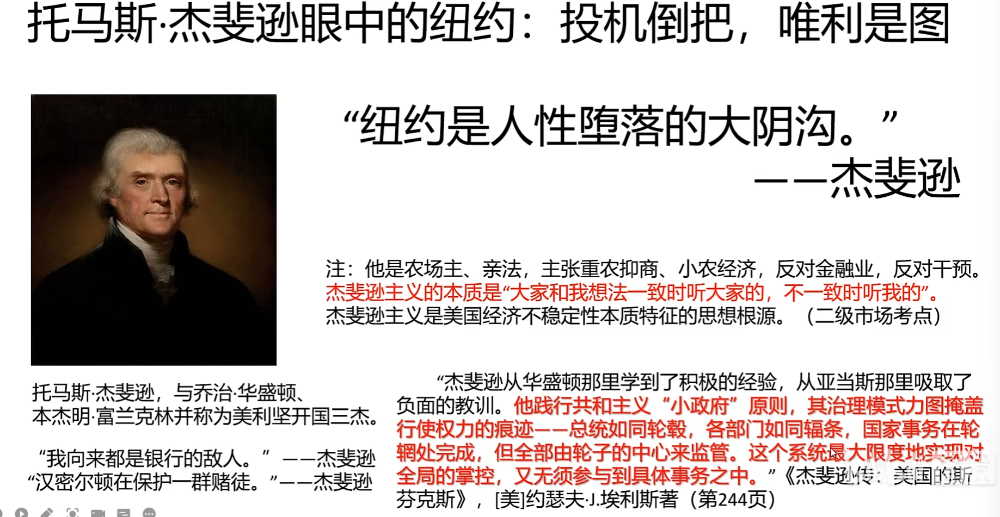

### 郁金香为什么被炒作？

- 郁金香的特征：对荷兰上流社会来说，能够体现**身份**的最好标志，就是**豪宅、花园和鲜花**。母球茎只能生长几年，种子长成成株大约要7年时间，因此**数量有限，被当成奢侈品用于炫耀**。（二级市场考点）

- 历史细节：最早把郁金香奢侈品化的不是荷兰，而是17世纪初的**法国**。因此，投机商开始囤积郁金香**球茎**，并且不断制造各种稀有品种的概念。荷兰人认为有利可图，跟风炒作。因为供不应求，荷兰人在阿姆斯特丹交易所开始交易几年后将要成熟的**球茎**。

### 郁金香泡沫是如何破灭的？

**1637年2月4日，一位郁金香合同投资者抛售了手中所有的合同。**

因为**合同快到期了**，他不想全额支付价钱买下合同上记载的所有郁金香球茎，所以他在拍卖会上清仓套现离场。奇怪的是，这次拍卖会**首次出现买家拒绝出席**。虽然真实原因是当时疫情流行，但是投机商的理解是郁金香价格见顶，没有人愿意接盘。（二级市场考点）

一周后，郁金香价格平均比一周前低90%，数周后低99%，泡沫就此破灭。投机商猛然觉悟，自己花毕生积蓄买了个“球”。

### 郁金香泡沫破灭使荷兰一蹶不振？

- 前述郁金香泡沫的故事大多来自1841年的《非同寻常的大众幻想与群众性癫狂》，作者是苏格兰历史学家查尔斯麦凯。
- 实际上，郁金香泡沫的爆发和破灭，影响范围主要集中在合同交易者群体，并未对全社会产生广泛的负面影响。**荷兰后来还与英国打了历时百年的四次英荷战争，最后才被英法联手绞杀的。荷兰还输在【可可粉在荷兰的商船上只是可可粉，但在英国商船上是巧克力】**。
- 真正值得注意的是【**泡沫后期，有人用合同交易制造了虚假需求**】（二级市场考点）。

**为什么荷兰人在新阿姆斯特丹一心搞钱**

因为当时的荷兰人崇尚重商主义

天下操纵自荷兰，发扬于英美

### 为什么需要中央银行

北美最早的一般等价物--串珠

**北美最早的操纵案是一个荷兰人干的**

1. 当时北美最值钱的商品是毛皮，毛皮供应商是印第安人部落。
2. 荷兰人眼中，金银是货币，但印第安人拒收
3. 印第安人认为“真正的钱”是贝壳串珠
4. 贝壳串珠与荷兰比的汇率是【6颗白珠=1个斯图弗=0.05个荷兰盾】

>一旦某种商品被确定为一般等价物，人们会想尽办法增加这种商品的产量，使之陷入供过于求的境地，除非做不到。
>一般等价物有两个作用：支付或者抵债

问题来了，市场出现了一群抓蚌取珠编串串的人，**短期内贝壳串珠供应量越来越大**。1650年6颗白珠换1个斯图弗，1659年16颗白珠才能换1个斯图弗。这意味着市场在**十年内多出了至少三倍的白珠**。印第安人对毛皮提价。**北美洲本地的荷兰商人用白珠收毛皮的成本大幅提升，转手卖出去的回报没提升，导致巨亏**。

荷兰人在北美的实践比英格兰银行成立早了30年

- 荷兰人菲利普斯
- 第一步:买进贝壳串珠
- 第二步:把贝壳串珠埋起来,减少流通量
- 第三步:几周之内,他就控制了串珠市场,成功抬高串珠的价格
- 结果:到1666年,3颗白串珠就相当于1个斯图弗,毛皮价格大跌
- 这一招叫Corner(逼仓),四大基本操纵手法之一(二级市场考点)

### Corner:逼仓、囤积居奇、货源归边

- 定义：通过秘密囤积某种商品，达到买断特定时间段内全部流通量的垄断程度，然后逼迫任何需要在该特定时段内购买的买家爱接受囤积居奇报出的价钱。
- 特征：市场上没货了，急着买的只能接受高得离谱的价钱。
- 参考材料：《窃听风云2》

### 四大基本操纵手段（二级市场必考点）

1. 卖空short-selling：制造超出自身持有量的卖盘，打压市场
2. 空袭bear raid：合谋集中卖空制造恐慌，清洗对手
3. 对敲syndicate：合谋制造虚假成交来产生误导性市场价格
4. 逼仓corner：买断特定时间段内全部流通量的垄断程度，逼迫对手按特定价格成交

**阳光之下没有新鲜事**，指的是这些手段推陈出新却万变不离其宗。

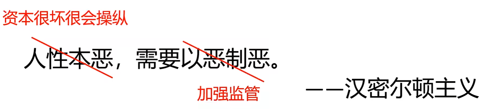

### 建立在人性本恶基础上的汉密尔顿主义

> 亚历山大·汉密尔顿 美国开国元勋（美国国父）之一，美国制宪会议代表及《美国宪法》起草人和签署人之一，美国第一任财政部长，美国政党制度创建者。

“17世纪90年代开始，英国创建了英格兰银行、税后体系和国债市场。18世纪，英国国债市场迅猛发展。国债市场之急速扩张，不仅没有削弱英国，反而创造出数之不尽的巨大利益。国债帮助英国缔造了皇家海军，支持英国赢得全球战争，协助英国维持全球商业帝国。与此同时，国债市场极大地促进了本国经济发展。个人和企业以国债抵押融资，银行以国债为储备扩张信用，外国投资者将英国国债视为最佳投资产品。为了美国的繁荣富强，为了从根本上摆脱美国对英国和欧洲资金和资本市场的依赖，美国必须迅速建立自己的国债市场和金融体系。” ——汉米尔顿

注：亲英，主张废除奴隶制、发展工业化，支持金融业，积极干预。

**汉密尔顿主义的本质是“我不要你觉得，我要我觉得”。**  

汉密尔顿主义是美国精英主义的思想根源。（二级市场考点）

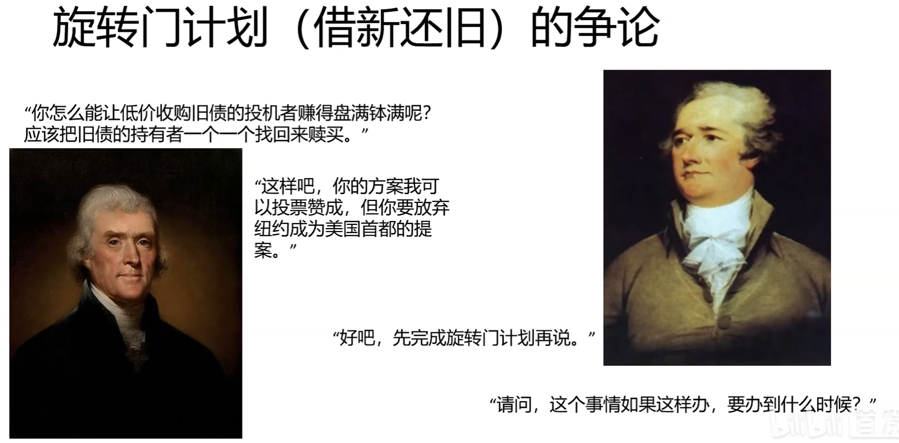

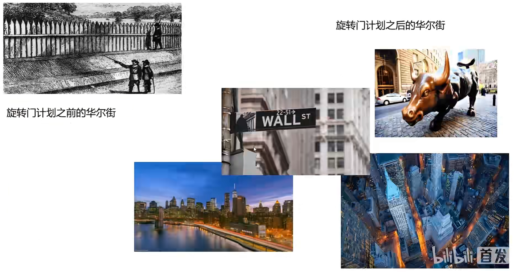

旋转门计划之后，华尔街的影响力变化巨大。

## 第三课：1792年的旋转门计划杀人事件

履历和经历不能说明一个人的话是否可信。

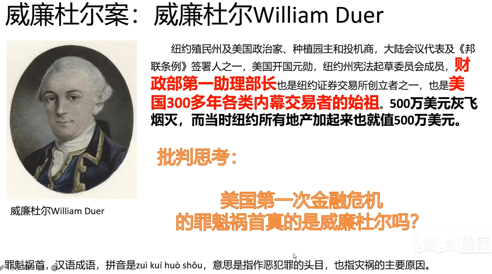

**《1792年的旋转门计划杀人事件》**

**第一幕 旋转门计划：从提交到落地的时间差**

汉密尔顿向国会提交了《公共信用报告》。根据这份报告，国会将授权财政部**发行新币回笼所有旧币，同时发行新债清偿所有旧债，旧币旧债将陆续退出市场，新币新债将垄断市场，联邦政府的信用将取代各州政府的信用，一举实现统一货币、统一财政的目标**。这个方案被后人称之为旋转门。

为什么不一步到位发新货币来回购战时所有债券和借条，而要同时回收旧币和旧债呢？

因为大部分待回收的旧币和旧债在“旋转门计划”公布后就被手握充足黄金的投机集团快速控制，他们以此和美国政府对峙。

投机集团背后的两个嫌疑人。

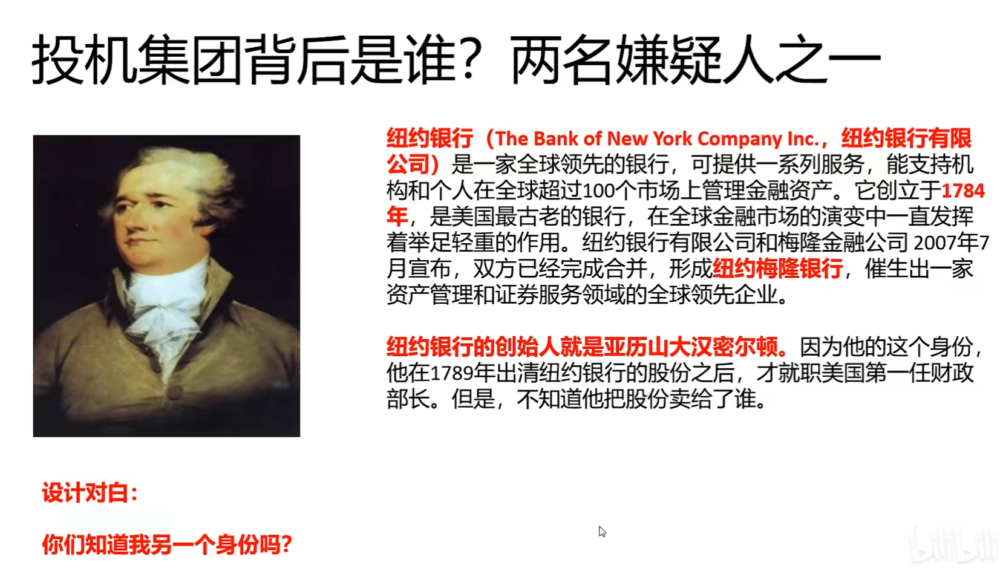

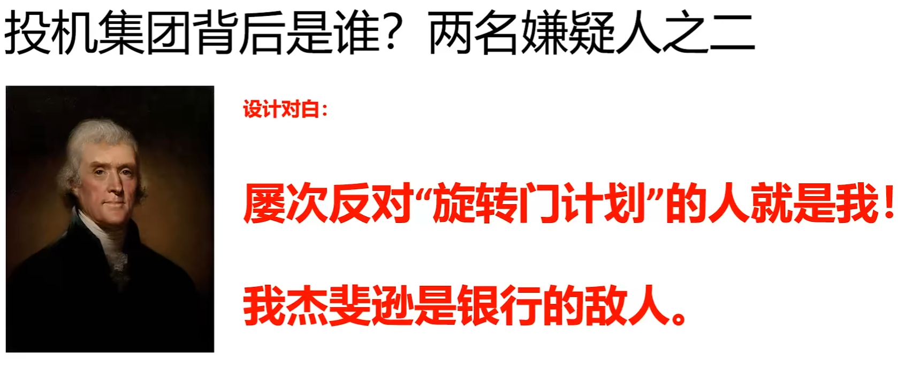

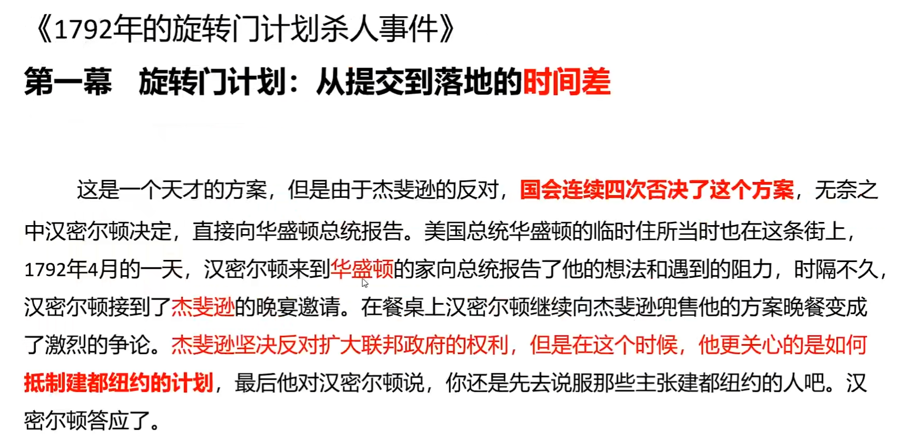

国会连续四次否决方案，就是给投机集团充足的时间收集筹码。波动是从《征求意见稿》开始的。

如果首都建在一个地方，炒地皮的人就会囤积地皮并大幅升值。

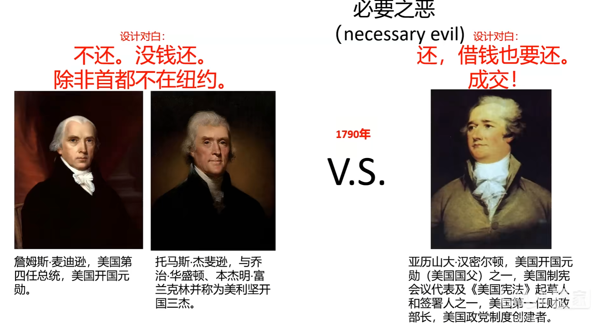

几天之后国会批准了旋转门计划。时隔不久，**美国的临时首都迁往费城**。 汉密尔顿的旋转门计划构建了美国的信用货币和国债体制，这是现代美国金融体系的两大支柱。**旋转门计划实施后的第一年美国就还清了大部分欠款，到1793年美国的国债在欧洲债券市场上已经成为信用等级最高的债券，从此债券市场让资金源源不断流向美国**。当国债不仅仅是债务，而且是一种可自由流通的商品，他就能通过债券市场将国家信用直接转化为社会财富，从而成为经济增长的源动力之一。

金融危机会产生很大的伤害，但是可以止住。

**第二幕 旋转门计划带来大量的债券，而市场开始出现各种“神”**

**大量债券充斥**当时的纽约市场，交易火爆，空前繁荣。此时，  
汉密尔顿的第一副手威廉杜尔与体制外的商人勾结，通过美国财政部的内幕消息获利，并且到处宣传自己的信息优势，打造战无不胜的人设。汉密尔顿致信威廉杜尔表达了他的担忧，希望他收手，但他没有回信。为威廉杜尔提供资本的是**亨利诺克斯，时任美国战争部长**。

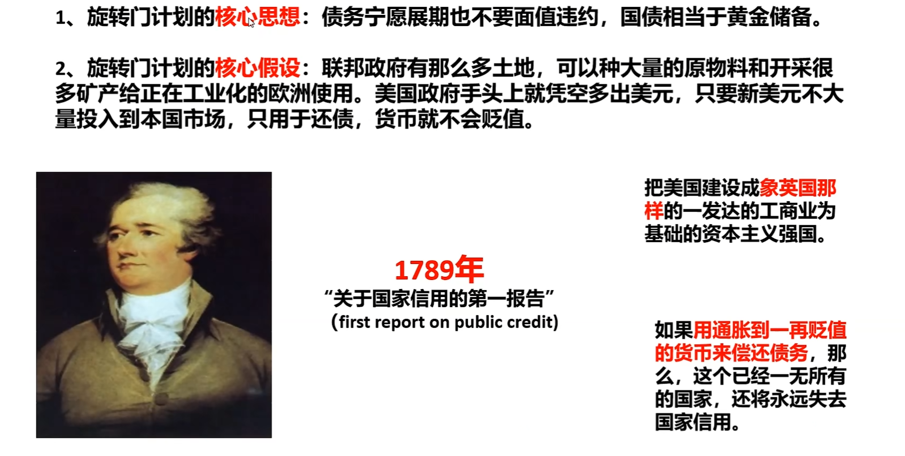

**第三幕 一个市场传闻和威廉杜尔的诡计**

威廉杜尔坐庄纽约银行，因为当时市场传闻，**合众国银行**打算收购纽约银行。但是，威廉杜尔对外宣称自己在买进纽约银行，但是实际上，他又和**利文斯顿家族**一起，暗中做空纽约银行。这是一种**对冲**——既下注纽约银行被收购，又下注这个事情不会发生。

注意一个细节：**威廉杜尔用别人的钱做多纽约银行，却用自己的钱做空纽约银行**。结果，传闻迟迟未兑现，而市场上多家银行蹭热点上市融资，认购火爆。

资源贸易带来通胀，用债券吸收通胀，银行上市募资，用于收购债券。

2008年次贷危机前夕，华尔街投行发行CDO，高管却在私下做空CDO。

**一个不可忽视的疑点**

- 威廉杜尔被塑造成用不出错的股神
- 但是他的操作很快被大众所知和模仿
- 人人都知道的内幕消息等于公开消息，而市场能快速消化公开信息，导致人人无利可图。
- **保持独立思考，不要轻易听信小道消息。**

**第四幕 威廉杜尔的火上加油，利文斯顿家族却猛泼冷水**

更令大众狂热的是，威廉杜尔竟然到处向银行和名门望族借款买进银行股的远期合约，让人人都看到他似乎在等着股价上涨发财。

汉密尔顿十分震惊，在1792年3月2日写道：“**这时候，应该有一条界线来区分好人和恶棍，来区分受人尊敬的股票投资者和纯粹的毫无原则的赌徒。**”从美国财政部的立场拉开了打击投机的序幕。

有人做多，就有人做空。与威廉杜尔做对手盘的，是利文斯顿家族，他们把银行股远期合约卖给威廉杜尔，并希望银行股价下跌。同时，他们从各家银行提取黄金和白银，导致各家银行被迫加快收回贷款去应对贵金属的提取。一时间，银行系统开始紧缩流动性，1792年的市场利率曾飙升到日息1%。

威廉杜尔被财政部审计查出其负责的财政部账户上亏空了一大笔钱。《伟大的博弈》记载：汉密尔顿曾给过威廉杜尔时间去收拾烂摊子，但审计查出来后，只能起诉他。威廉杜尔为了填补窟窿，不顾一切地周围借钱，但是谁也不愿意借一分钱给他。

**威廉杜尔穷途末路与市场恐慌**

一时间威廉杜尔入狱，并在狱中了结余生。为他担保的富人以及他的商业伙伴，一夜之间宣布破产。杰斐逊给朋友的信写道：

“最终，我们的股票泡沫破碎了。杜尔的破产传染给了纽约其他人，他们像多米诺骨牌那样一个个倒下了。股市恐慌所带来的损失跟自然灾害摧毁了纽约所带来的损失差不多。”

**第五幕 尾声：汉密尔顿救市，纽约的太阳依旧从东边升起**

汉密尔顿下令美国财政部在二级市场购买数十万美元的**联邦证券**以支持市场，并要求银行**不要收回贷款**，允许商人用**期限为45天的短期票据**来支付海关进口关税。他说出了影响全球市场230年之久（甚至更久）的经典对白：“**只要这些金融机构保持健全，就不会发生真正的公共性灾难。**”结果，市场的恐慌并未对美国经济整体产生长期的负面影响。

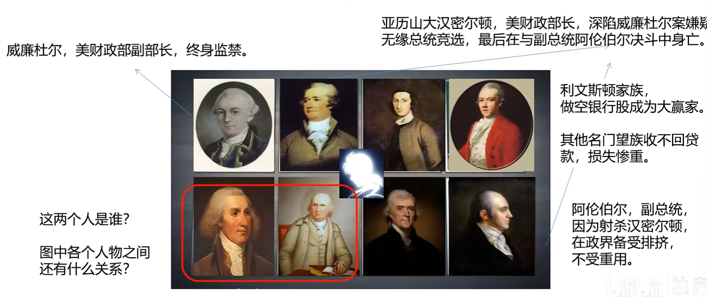

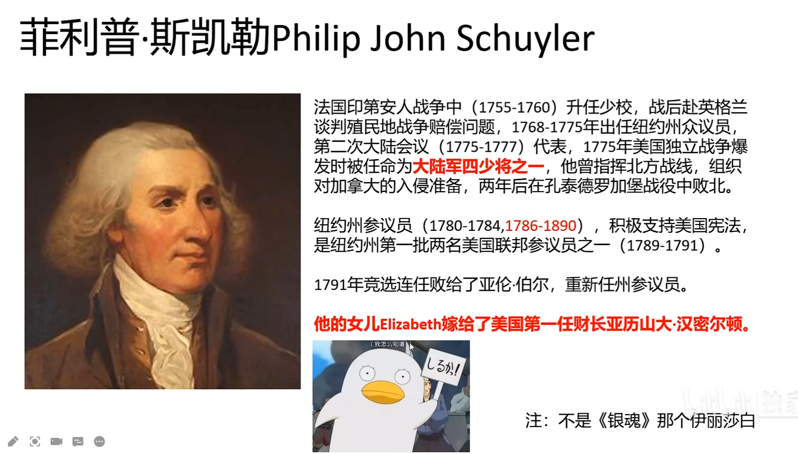

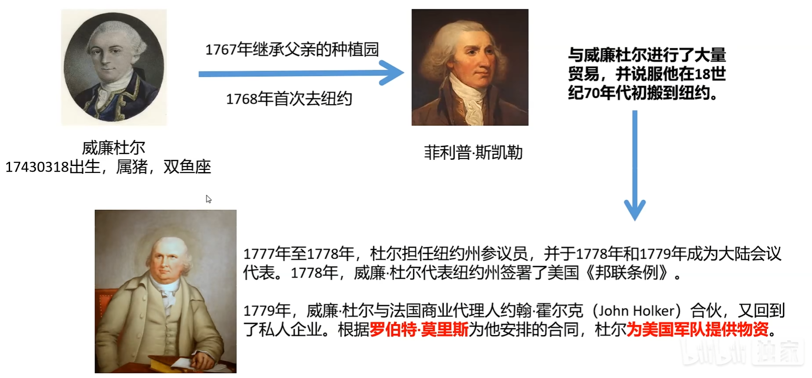

**罗伯特·莫里斯 Robert Morris**

- 美国银行家，费城商业王子；美国独立战争时期（1775–1783）最富有的人。  
- 《独立宣言》的签署者之一；在美国独立战争最艰难的时期，他用自己的信誉担保向法国银行贷的款和自己的能力维持住了军队。  
- 1781年在费城建立**北美银行（临时中央银行）**并任财务总监。  
- 在美国独立战争最艰难的1781～1782年间，莫里斯所担任的“财政总监”一职，实际上是政府财政部门的首长。1783年他提出征收关税，被强烈反对。  
- 莫里斯在**1784年**辞职之前，已针对如何健全美国财政，规划出**具体可行的方案**。  
- 华盛顿希望莫里斯担任财政部长，但莫里斯拒绝了，因为他急于弥补独立战争中耗尽了的财富。莫里斯离职时推荐了他一直欣赏的亚历山大·汉密尔顿作为他的替代人选。

“准时是最重要的交易本钱”

“绝对要克制不愿错失任何好事的强烈愿望”

18世纪90年代中期，他负载累累，一贫如洗

**大陆币：独立战争期间美国大陆会议发行的纸币**

1775年，美国大陆会议发行2.4亿美元大陆币抗英。  
1778年，大陆币价值已经不及其面值的五分之一。  
**1780年，大陆币成为美国人眼中的一堆卫生纸。**  
1781年年初，华盛顿的军人发生哗变，抗议大陆币贬值和待遇不周等问题——史称宾州兵变（Pennsylvania line mutiny）。  
1781年5月，大陆会议批准**罗伯特·莫里斯**筹建**北美银行**（bank of North America）。**北美首富威廉·宾汉**认购了10%股份，英国的敌人法国和荷兰认购**63%**。  
1783年因为无法征收关税，美国财政收入匮乏。  
1787年，大陆会议因财政问题终于批准了关税法案。

**Continental currency**  
设计对白：Hi~ 我就是“不值一个大陆币”里面的“大陆币”。

注释：“不值一个大陆币”源自当时人们对大陆币极度贬值的讽刺说法。

1780年，在宪法的行政权正在得到巩固时，亚历山大·汉密尔顿建议莫里斯担任美国财政总监一职。同时，他开始为设立一家国家银行做提案。莫里斯就战争拨款问题与汉密尔顿进行过通信后，他立即根据汉密尔顿的建议起草了一份立法提案，并提交给国会。莫里斯说服国会特许成立北美银行，这是美国第一家私人商业银行。

1781年2月，在大陆币停止发行。1782年1月7日，北美银行在费城开业。在成立之初，北美银行最初的特许状规定发行1000股股票，每股定价400美元。

当时的开国元勋们也纷纷“打新股”：  
- 本杰明·富兰克林买了一股，股份比例约为0.1%  
- 独立战争时期美国首富、参议院临时议长威廉·宾汉购买9.5%的股份  
- 费城商业王子罗伯特·莫里斯购买**63.3%**的原始股份。

1783年，允许美国人用北美银行发行的货币纳税，这时的北美银行正在渐渐扮演中央银行的职能。北美银行采用了**英格兰银行模式**，它以铸币为基础发行银行券，实现货币与信贷的扩张。

**既然有北美银行，为什么还要旋转门计划？**

- 英格兰银行模式：英国政府对地主阶层征税，并以税收担保，想英格兰银行发行国债、获得银行券去刺激经济，而英格兰银行则以铸币为担保发行银行券。该模式成功的前提是银行券与铸币保持固定兑换率，即：英格兰银行要有足额兑付的黄金储备
- 北美银行：黄金储备不足。
- 美国政府：税源不足。

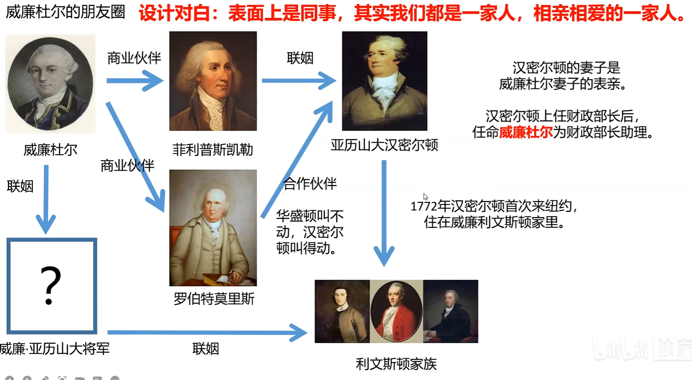

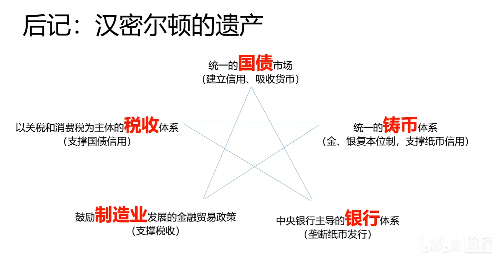

## 第四课：基建大潮与股票大作手利特尔

“consolidate”有“债务整理”的意思，因此，股票最初名为“consolidated stock”而不是“share/stock”，是因为其**起源于债务整理的需求**。当巨额投资产生的债务到期无法偿还时，债务人会把它的净资产所有权拿去交易所拍卖一部分，换取资金偿还债务、维持信用并且继续融资投入他们的项目。**二级市场上购买并持有股票的人，代偿了部分债务，期待项目完工、赚钱清偿剩余债务后持续分红**。但是，如果股价上涨后包含甚至超过了其预期未来数年甚至数十年才能拿到的分红，持股者就会把股票和浮盈落袋为安。

伊利运河建成引发基建大潮--基建大潮引发证券发行热潮--股票作手利特尔--安德鲁杰克逊制造的萧条

### 一、200年前克林顿和200年后埃尔多安

“为了降低通胀，继续降低利率” --埃尔多安

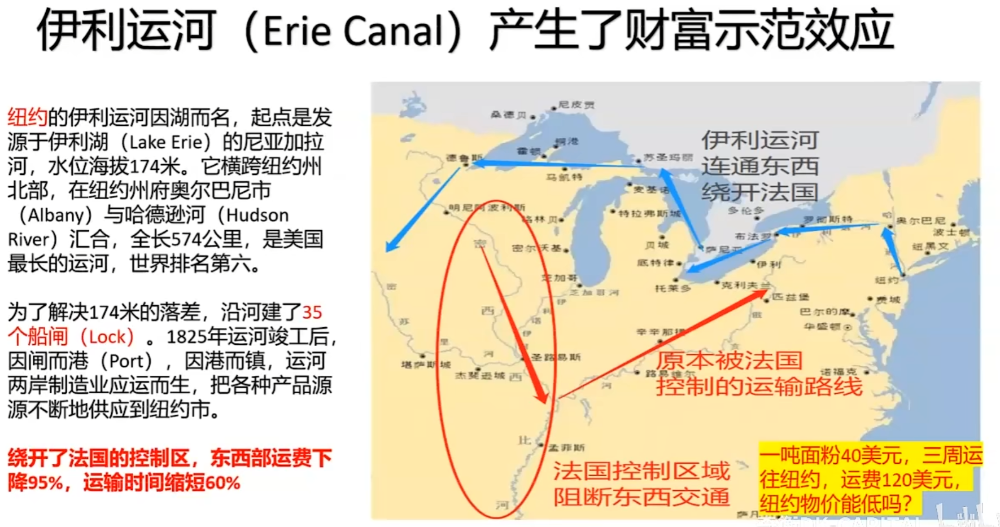

物价贵不一定是货币印多了

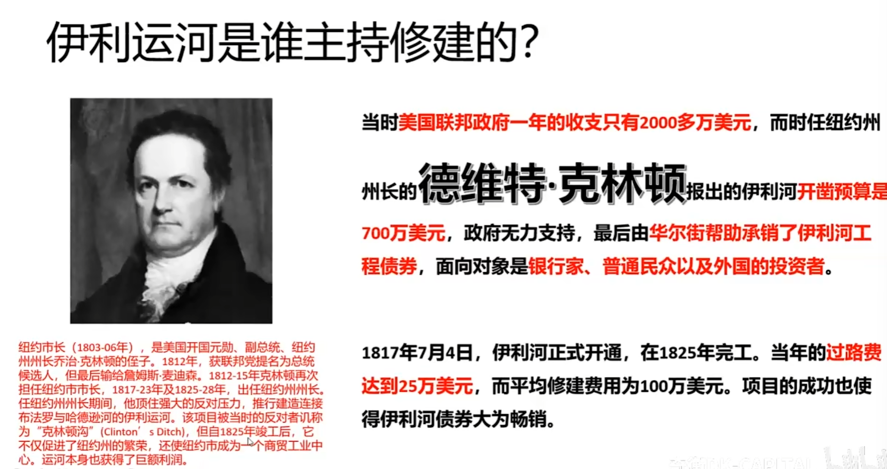

华尔街做美国政府不支持的事

运河证券是国内的城投债

### 二、如果你活在19世纪初的美国，你在美国股市最大对手就是雅各布利特尔
 
宽松的周期里做守财奴是很多人一贫如洗的原因，在紧缩周期里面头脑发热，亏得比通胀快

当今世界最大的风险是不懂得冒险和不敢冒险，先求知后投资

雅各布·利特尔是个独立的证券**经纪**人（代理）  

他没有任何背景，也没有长期合伙人（保护金主隐私）

他有着超出旁人的市场判断力，  

尤其是在市场动荡、前景不明时，  

能**准确预判**市场走向，并运作**自有**资金（世界上没有能准确预判未来的市场，背后金主信息强大，资金雄厚）

低买高卖。他通过市场短期波动来投机获利。  

图中的文字内容如下：

---

**莫里斯运河的空头是什么想的？**

第一步：借来股票，承诺未来某个时间以特定价格还回来。  
第二步：一转身就在市场上卖出，拿到现金。假设前提是要归还股票的时候能轻易在市场上买到，而且买的价格比之前卖的价格要低得多。  
第三步：扣除借股票的费用之后，剩下的是利润。

**问题是【如果到时候股价大涨了，那么空头被迫高价买回来，巨亏。】**

**华尔街谚语：如果你把不属于你的股票卖掉但是买不回来，就等着坐牢吧**

空头错在在热门的行业找总股本稳定的股票做空

**利特尔逼仓莫里斯运河**

第一步：组织一个投机者团伙，暗中买进莫里斯运河的股票。  
请问：在今天，他这样做是否违法？

**操纵市场行为**，是指个人或机构背离市场自由竞争和供求关系原则，人为地操纵证券价格、引诱他人参与证券交易，以此来为自己牟取私利的一种行为。

第二步：垄断了莫里斯运河的所有流通股。

第三步：一个月之内把股价从10美元拉升到185美元，逼迫做空者认赔买进（用于到期偿还）

- 集合基金是股票“埃里”的庄家。战术是大肆囤积筹码，逼空利特尔。  
- 股价越涨越高，利特尔拼命抛，集合基金拼命吸，结果所有的空头投机客都作了回补，只剩利特尔一人在坚持着。  
- 那一天，集合基金囤积了**所有的**埃里股票，人们等着看利特尔的好戏。  
- 利特尔出来后，一脸严肃地走向多头集团主要成员的交易室。当多头头目笑逐颜开地欢迎利特尔时，后者却拿出了股票。原来利特尔知道“埃里”还有可转换债券，他从伦敦大量购进，成功地交割，并在耗尽多头资金后，转股抛出。而集合基金竟然不知道还有可转换债券，**结果再也无力接下源源不断的新增抛盘**。

**空头通常错在在热门的行业找总股本稳定的股票做空。**

空头的错误，就是多头的正确

### 三、安德鲁·杰克逊的一放一缩

杰斐逊主义者：出现混乱的时候不救市，喜欢动荡的市场

**发动行情的三步：**

**第一步：** 宣布使用财政盈余偿还所有美国国债，减少国债供应量和流通量，逼迫市场资金流向运河证券投机。

**第二步：** 提高关税，减少公共设施投资，到了1834年美国真的还清了国债，华尔街的钱无处可去

**第三步：** 关闭合众国（第二）银行，让联邦存款流向地方银行，使各地银行有抵押物发行自己的银行券，刺激地方基础设施投资，同时炒热地皮。

**消灭行情的三步：**

后记：杰克逊的“六式七伤拳”

- 让英国资本在美国运河证券投机热潮中损失惨重
- 大批银行倒闭，费城金融市场全面瘫痪
- 宾夕法尼亚州债务违约，费城银行业遭受二次打击
- 纽约银行业对宾州债务占比低，金融业总量抛离费城
- 利特尔三次破产三次重生，20年后在1857年危机中一蹶不振

**后记：关于投机**

- 投机活动大大增加了市场的流动性，提高了交易量，恰恰有助于确保市场形成最公正的价格。但是“投机者”一向是华尔街一切不幸的“替罪羊”，他们总是会被指责为每一次市场狂热以及必然随之而来的熊市的罪魁祸首。

## 第五课：“铁路+电报”，第一波互联网泡沫

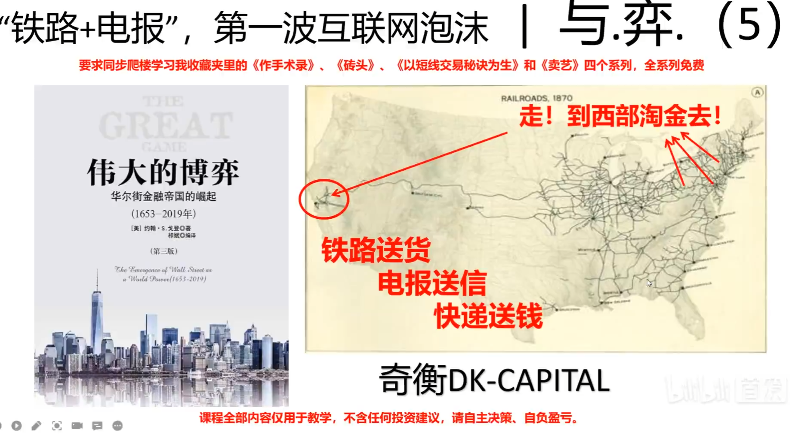

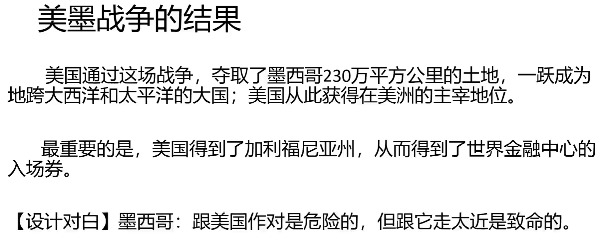

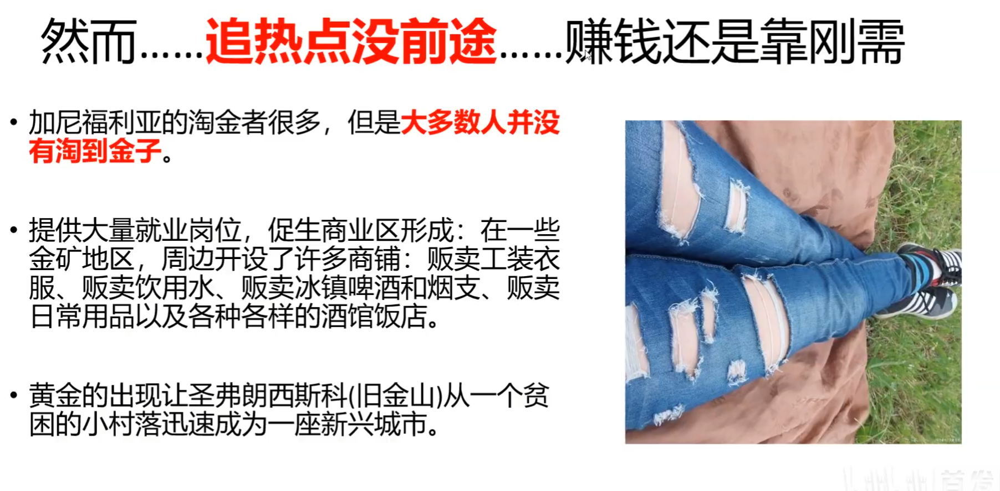

**金本位虽好，但它有个致命的BUG**

- 在金本位制下的经济**几乎**不可能发生通胀。假如一个国家发行了太多纸币的话，纸币就会相应贬值，随着人们拿纸币兑换黄金，黄金就会随之从国家的国库里流出。黄金数量减少，货币供应就会减少。因此，由于黄金的稀缺，金本位天然地限制了货币供应。

- 英国如意算盘：拥有全世界最多黄金储备的英国，可以通过控制黄金的流通来控制他国的货币供应，从而剪他国羊毛。**英国认为，没有人拥有的黄金比它多。**

- 金本位的BUG：新的金矿被发现和开采，会摊薄英国存量黄金储备在全球范围内的财富。**谁掌握了新发现的大金矿，谁就掌握了金本位下的印钞权。** 英国霸权的陨落，实际上是从美国得到加利福尼亚州开始的。1847年美国黄金产量4.3万盎司，1848年加利福尼亚州金矿发现的当年，美国黄金产量达到48.4万盎司，1849年达到193.5万盎司，1853年314.4万盎司。由于黄金在金本位下是财富，所以淘金直接就是印钞。

开发金矿带来经济繁荣的原因是淘金就是印钞

**大量黄金注入美国实体经济，会发生什么？**

银行通货储备暴增，促使信贷暴增。

大批移民和淘金者向西开进，希望发家致富。

19世纪40年代不愿进场的外国资金开始进场。

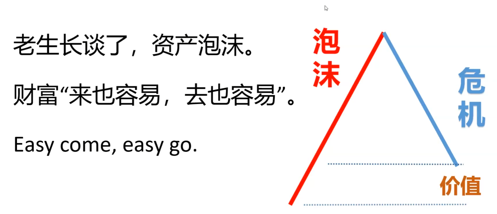

讨价还价剩下的渣是价值

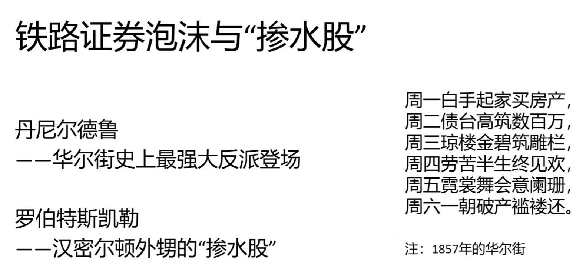

二级市场无利可图，除非存在交易规则漏洞

- **控股股东有权决定总股本**：当时的那种可转债能够随时在债券和股票之间变换，进可炒作，退可生息。手握大量可转债的丹尼尔·德鲁，等于拥有无数股票的发行权。他不断在市面上发行新股打压股价、收割多头。

- 他知道股价涨跌的根本在于总股本。范德比尔对丹尼尔·德鲁的手法一无所知。

- 他事先收买了一位法官，颁布了一条法令禁止伊利铁路公司再发行新股。

- 然后，他以平均每股80美元的价格买入20万股伊利铁路。

- 市场上的伊利铁路股票总计才有25万股，但是，当他不断买入的时候他才发现，抛压不断，远不止25万股。

**扩大总股本，持股难回本**

后续双方达成交易，成本转嫁给了消费者

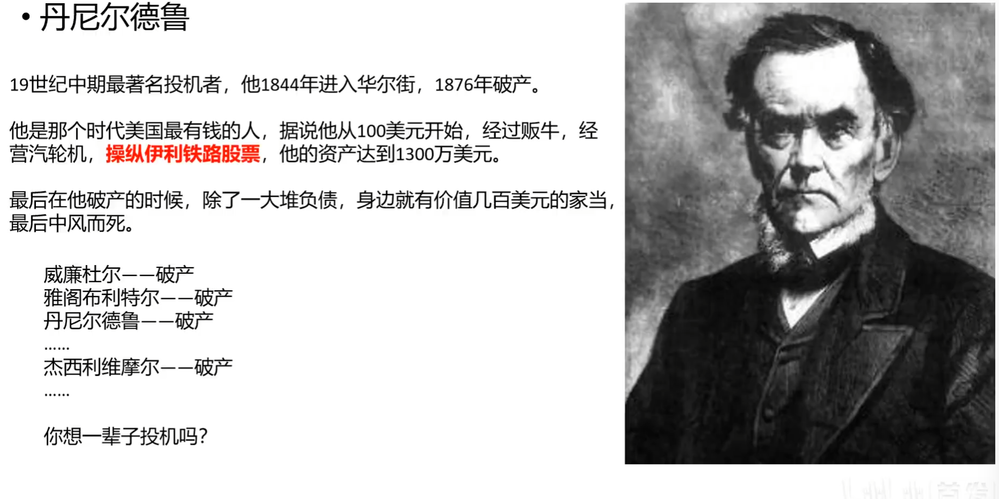

不能一辈子投机，终局是破产

**掺水股最恶劣可以到什么程度？**

- 罗伯特斯凯勒：汉密尔顿的外甥，菲利普斯凯勒将军的孙子，哈莱姆铁路和纽黑文铁路的总裁。

- **秘密印刷了2万股纽黑文铁路股票**，并且在市场脱手，卷款200万美元潜逃加拿大。

- 从今天的角度来看，表面上这叫“定向增发”，但他没有公告，募资也没有进入公司账上。综合来看，这叫诈骗。

图中的文字内容如下：

**周期性繁荣的尾声是怎样的？**

“数以百万计的美元，不管是**赚来的还是借来的**，都花在**豪华**的住宅和**高档**的家具上；为了愚蠢的攀比，追逐时尚的暴发户把成千上万的钱花在**丝绸、蕾丝、钻石和所有昂贵却没有任何实际意义的东西上**——而这些还只是当中太多罪恶重微不足道的一部分。”

——《纽约先驱报》1857年6月27日

**周期性繁荣的尾声是怎样的？**

加利福尼亚州的黄金产量趋于平缓。——货币环境转向

大大刺激美国出口的克里米亚战争和欧洲谷物的歉收已经结束。  
——外需萎缩

码头上停满了船，大部分没有活儿干，有活儿干的报酬也低得可怜。  
6000架棉纺机只能闲置在那里。——产能过剩

**繁荣尾声不代表繁荣结束，真正的风险是……**

- 夏季和早秋，资金往往会流出纽约的银行，因为西部农场主为了支付收割的费用和偿还贷款，会从当地的银行提走存款，迫使这些银行把存在纽约银行体系内的资金调回。——金融中心资金紧张

- 市场上存在大量摇摇欲坠、基于抛出的股票，但找不到一个买家，看不到任何需求。热门板块（当时的铁路股）普跌。——盘口稀薄，领头羊开始下跌

- 出现储户在银行外面排成长队。——挤兑

- 华尔街经纪商和投机商中比较脆弱的人开始破产了。雅阁布利特尔第四次破产，但再也借不到钱东山再起。——二级市场成交萎缩

- “中美洲号”蒸汽船载着160万美元的加利福尼亚黄金沉没，直接导致华尔街嗷嗷待哺的银行和投行们资金链雪上加霜。银行以放假为名，停止兑付黄金。——宽松预期落空

- 伦敦和巴黎知道了纽约的困境，停止为纽约提供流动性。欧洲市场利率飙升。欧洲投资者立刻抽逃资金。——外资抽逃，离岸市场资金紧张

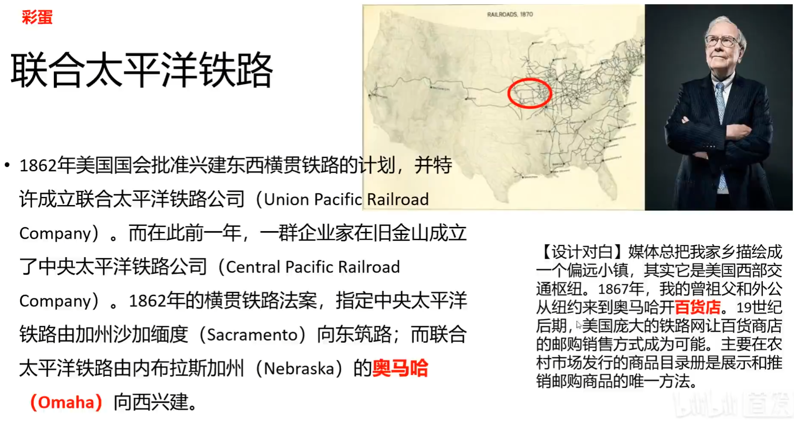

巴菲特的曾祖父在奥马哈开电商平台，利用铁路来做邮购

## 第六课：那个“可能已拥有高达”的男人，范德比尔特

持久战争的最终胜利几乎总是属于那些能够将国家的财富有效转化为军事实力的一方。

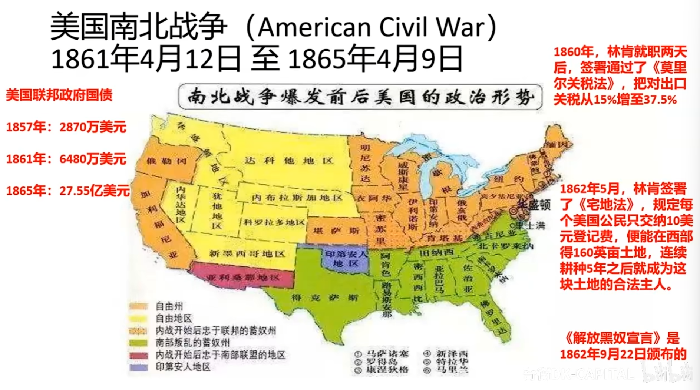

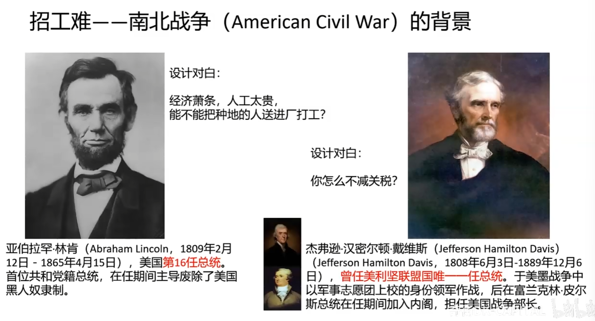

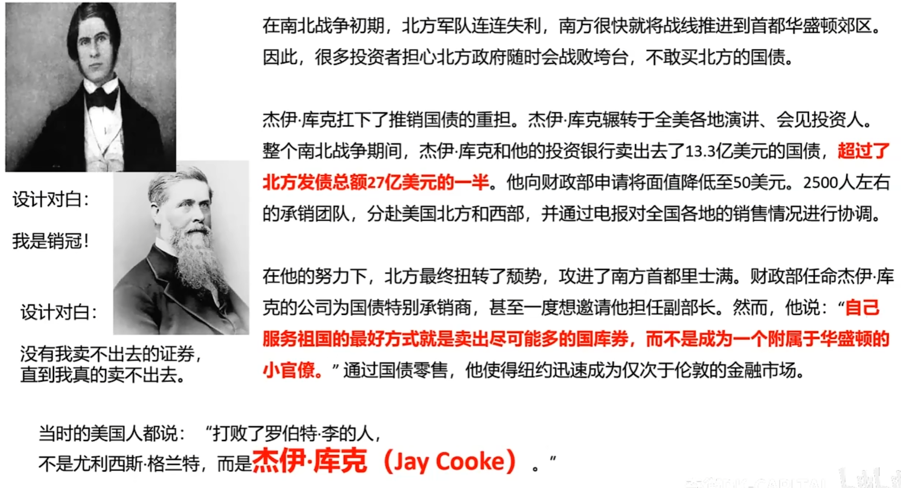

**南北战争期间的黄金投机**

- 大规模战争的融资手段：加税、印钞和发债。  
- 由于人们倾向于把低成色货币花掉而储藏高成色货币（格雷欣法则）  
- 南北战争期间出现了黄金投机：

- 每当北方军队取胜的时候，黄金价格下跌，北方国债涨价。  
- 每当南方军队取胜的时候，黄金价格上涨，南方棉花债涨价。

- 投机商在军队安插线眼，力求比公众更早知道战果，提早建仓。

尽管股票市场在战争爆发时狂跌——股票市场几乎总是这样。但投资者随后开始意识到战争将旷日持久，不仅可交易证券的数量将大大增加，而且政府大量的支出将流向诸如铁路、钢铁厂、纺织厂和军工厂等公司，而这些公司产生的利润将流向华尔街，与此同时，这些公司也将从华尔街获得最急需的资本。华尔街历史上最繁荣的牛市即将开始。

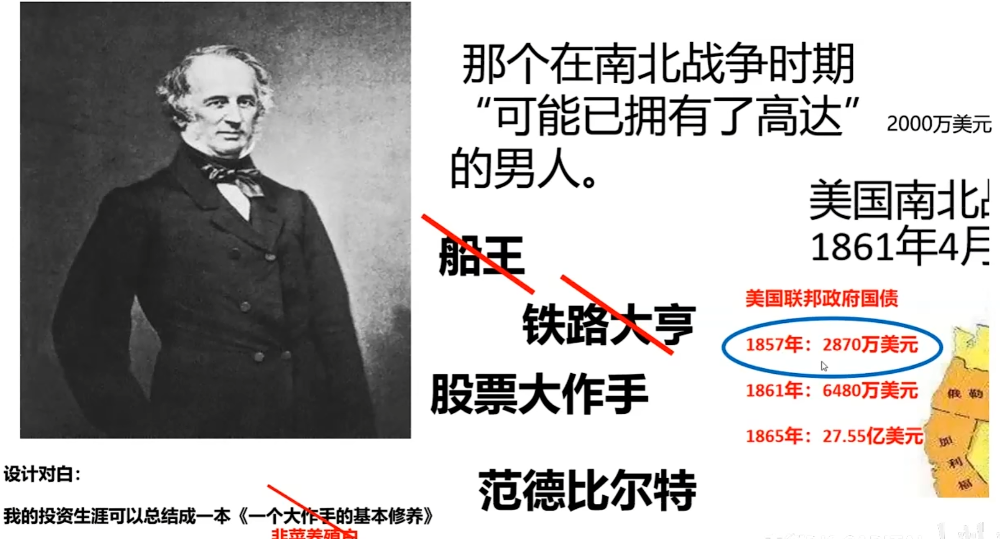

### **《一个大作手的基本修养》**

拥抱新事物，敢于换赛道，有钱

- 1833年，未来的铁路大亨范德比尔特遭遇了美国历史上第一起重大事故，由于前一节车厢的车轴断裂。他是整个车厢的唯一幸存者。
- 1854年，他开始密切关注铁路行业。带着午餐，从铁路线的一端坐到另一端。询问售票员每天运多少加仑牛奶，有多少机车，性能是否良好，农民会不会破坏铁路……
- 年近70岁的范德比尔特，当时已经成为美国首富。  
- 他毅然放弃自己的蒸汽船运输业，大力投资铁路产业。  
- 一直从事实业的他，从未修建过一条铁路。  
- 他涉足铁路产业，是通过股票二级市场收购股权来入主铁路公司。

### **本课压轴：哈莱姆铁路争夺战**

多空双方对哈莱姆铁路的观点——空方观点  

- 大家普遍认为哈莱姆铁路既不重要，也没前途。  
- 它建成于1852年，所经过的大部分地区是日趋衰落的乡村。  
- 南北战争前，客运收入仅一年超过50万美元，货运收入也是。  
- “在所有交易的铁路股票中，哈莱姆股票的内在价值最低。”

营收层面的内在价值

多空双方对哈莱姆铁路的观点——多方观点  

- 范德比尔特注意到了大众忽视的内在价值：**纽约-哈莱姆铁路**和在它西边几英里的竞争者**哈德逊铁路**，是仅有的两条能够直接通往曼哈顿岛的铁路，它们的铁轨直通纽约市的心脏。从纽约东面如纽约州或纽黑文过来的火车，**必须**向哈莱姆铁路付费后才能进入纽约市。哈莱姆铁路还有**可能**获得纽约市内有轨电车的经营权。

必须：价值中枢

可能：总市值波动的大小和时间

资产稀缺的内在价值

可能导致哈莱姆铁路波动的因素是经营权落地

尽管华尔街很多人士认为哈莱姆铁路毫无价值，但范德比尔特平静地把那些沾沾自喜、被冲昏头脑的空头所卖出的股票大口吞入自己的金融大胃中。

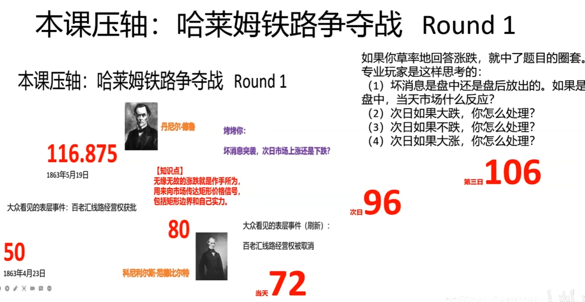

内在价值是由买下资产控制权的产业资本决定的

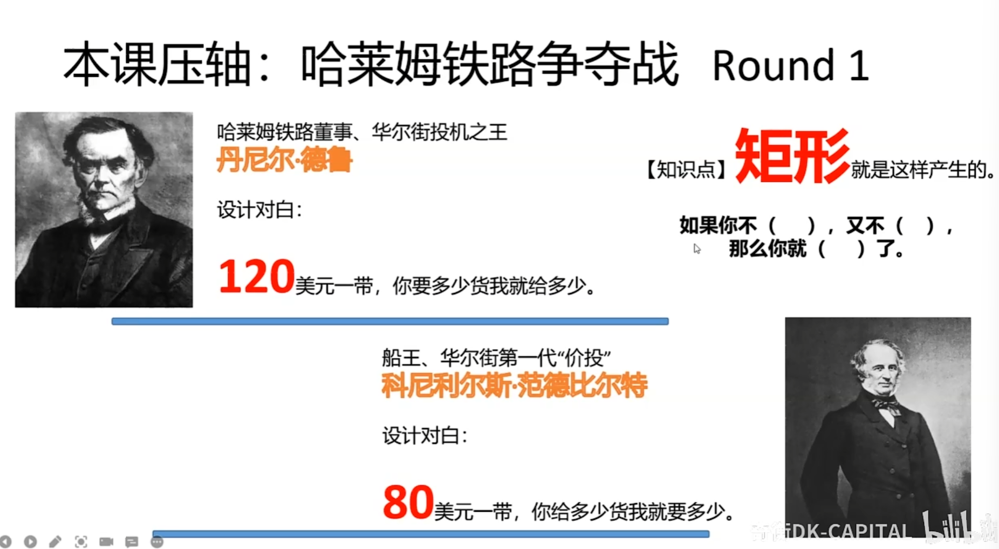

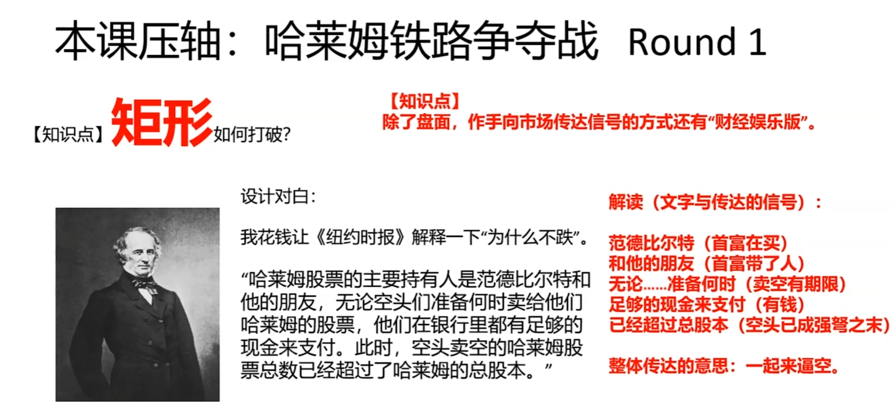

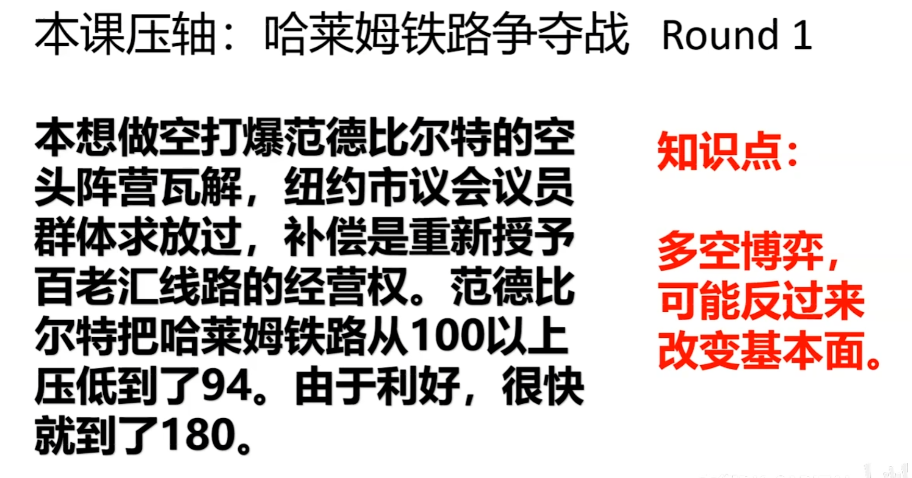

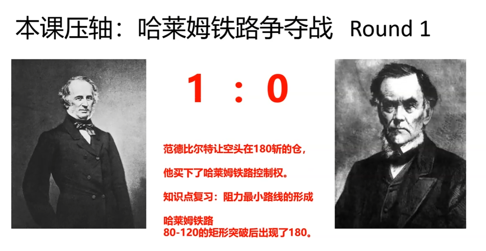

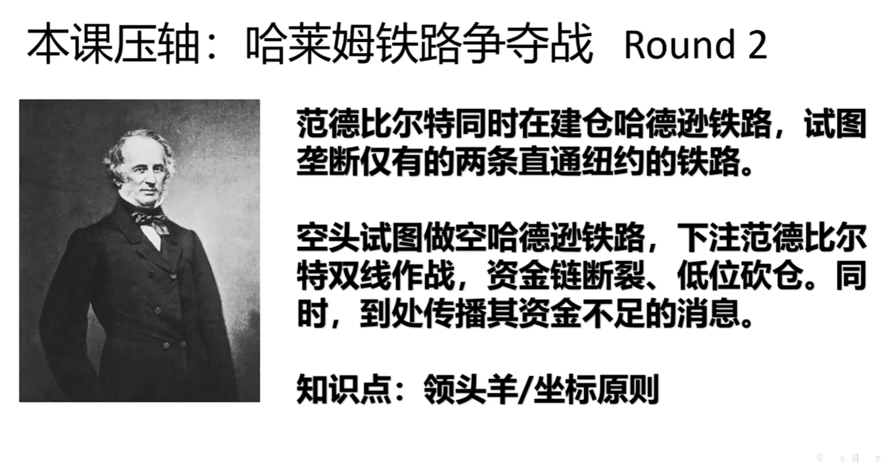

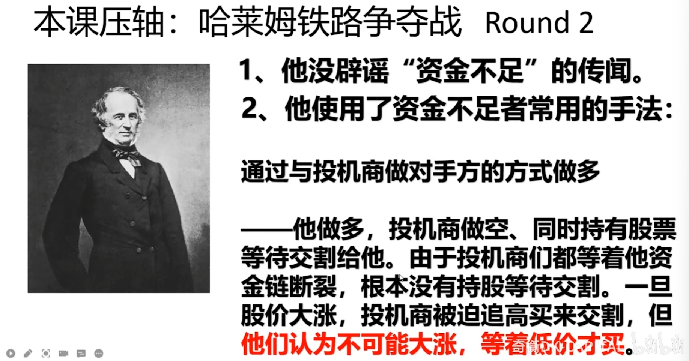

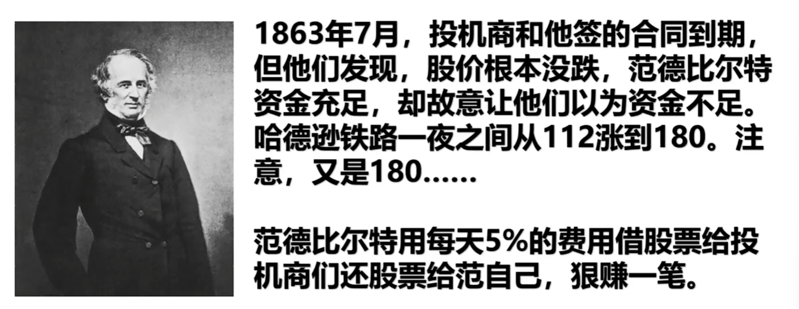

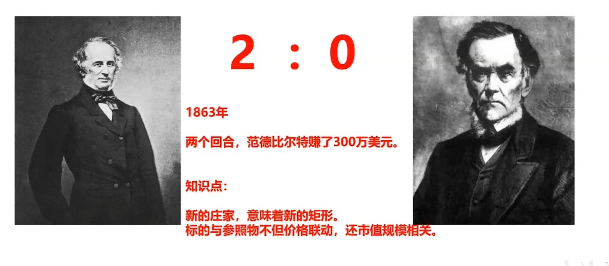

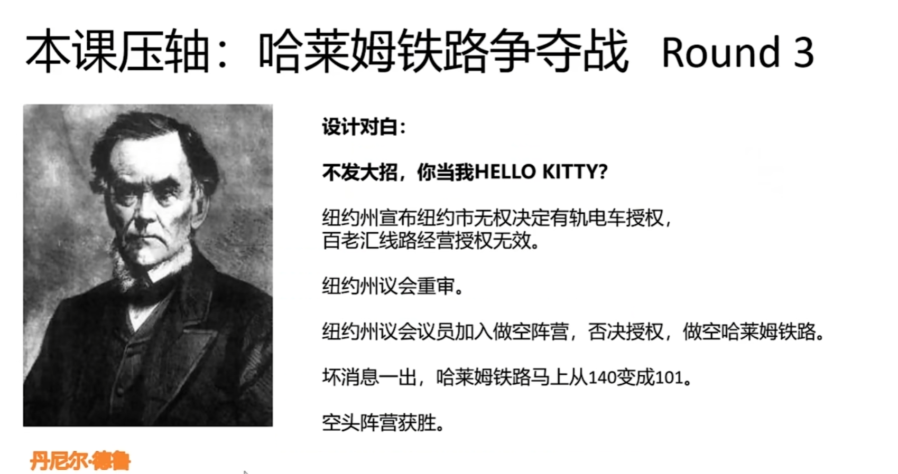

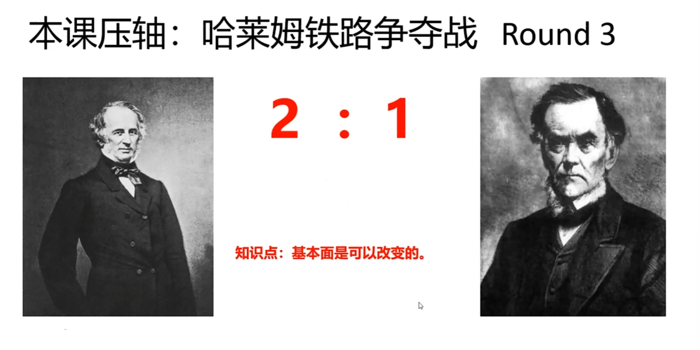

获胜的空头没有选择平仓，而是期望打至50（完了）

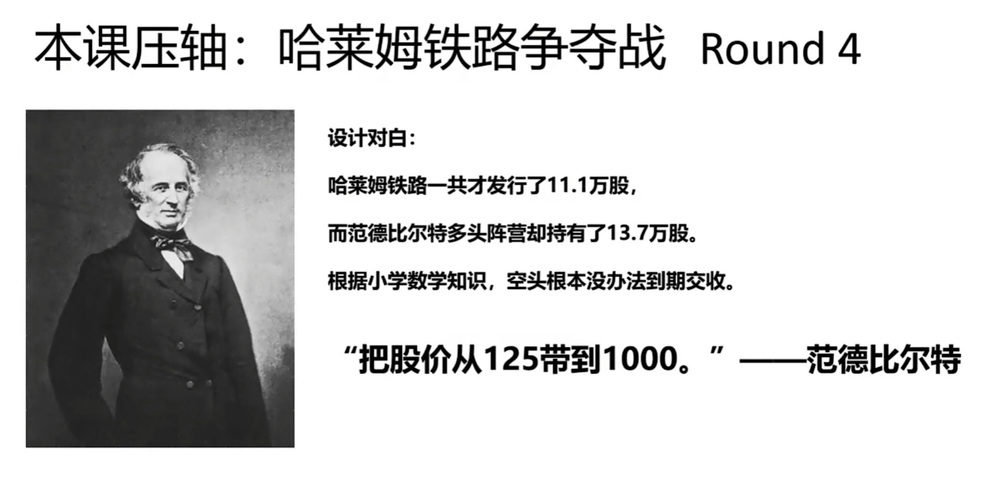

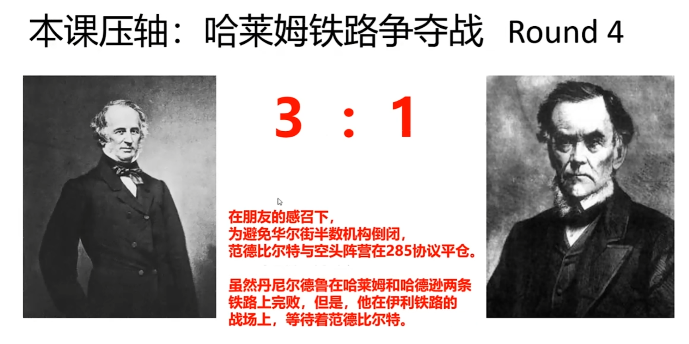

## 第七课：“范德比尔特，我赌你的枪里没有子弹”

### 伊利铁路

- 当时，有三条核心铁路支撑着北美的运输网络，伊利铁路就是其中之一。那时伊利铁路**股权结构混乱，路线设计混乱，公司内部管理混乱，而且债台高筑**。在市场上，伊利铁路毫无诚信可言。从诞生之初，这条铁路就是为投机而生的。

【知识点】垃圾股的四大基本特征  
**股权结构混乱，产品定位混乱，内部管理混乱，债台高筑。**

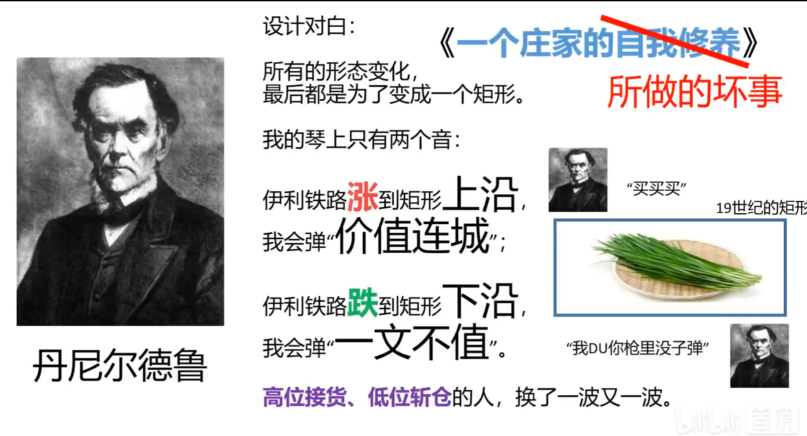

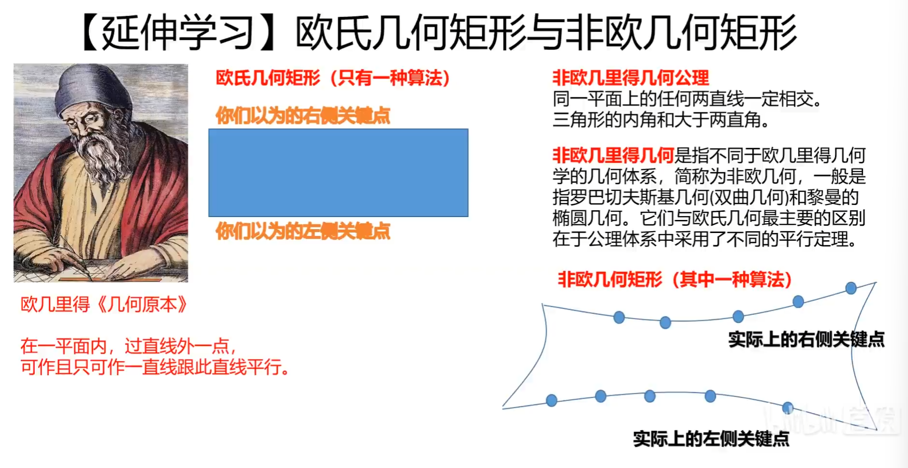

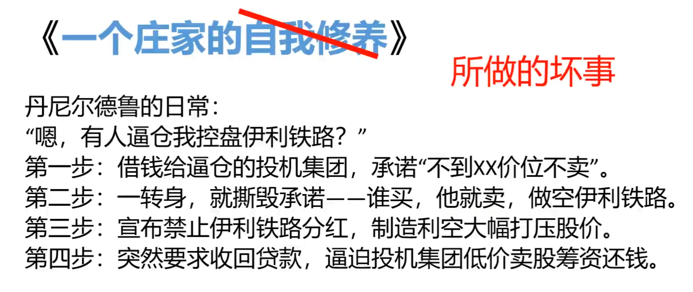

投机集团的总指挥（丹尼尔德鲁）把钱借给其中一位成员，让他有财力买下集团所有其他成员的出货，这样就神不知鬼不觉地把他套了进去，然后，总指挥在集团内分配利润。他也会很平静地把原本属于这个牺牲者的钱的一部分作为利润分成返还给他。

远离市场的小道消息

卡特尔（Cartel）：价格同盟

当时的范德比尔特，正在思考如何在铁路行业一统江湖：

1. 铁路是一个以量取胜行业：无论空载满载都要准时到达，铁路公司如果持续无法及时把运力卖出去，迟早倒闭
2. 以量取胜行业的特征：薄利多销，价格战不可避免
3. 避免价格战的唯一办法：卡特尔价格同盟

当时连通美国中西部与纽约的铁路只有三条：纽约中央铁路（范德比尔特）、宾夕法尼亚铁路（托马斯斯科特）和伊利铁路（丹尼尔德鲁）。三个人里面，丹尼尔德鲁最反复无常。

### 伊利铁路股权争夺战的导火线

- 范德比尔特主张：三条铁路形成卡特尔，控制美国运价
- 丹尼尔德鲁主张：自主定价，专心坐庄

**丹尼尔·德鲁的布局——他控制了伊利铁路的增发权**  
1866年他贷给伊利公司348万美元，是以2.8万股未公开发行的股票和300万美元的债券作为抵押的，这部分债券可以转换成3万股股票，并且能从股票又转换成债券。

**范德比尔特的布局——他收买了法官**  
禁止任何伊利公司的债券转换成股票，明令禁止丹尼尔·德鲁处置手中的伊利铁路股票。

**可他不知道，丹尼尔·德鲁先下手为强，已悄悄把总股本增加了20%。然后，收买更大的法官，罢免了范德比尔特收买的法官，废除了禁令。**

**第一回合：丹尼尔·德鲁用DIY的、新鲜的伊利铁路股票，收走了范德比尔特700万美元。**

范德比尔特让合作的法官签署拘捕令，警察扑向丹尼尔·德鲁所在地。  
但是，因为走漏风声，丹尼尔·德鲁已逃跑——背着大包钞票狂奔。

范德比尔特暂时控制了伊利铁路。

**伊利铁路控制权争夺战**

丹尼尔·德鲁逃到了新泽西，**第二回合**开始，与盘面无关。

为了防止范德比尔特控制纽约法院，直接架空董事会。  
丹尼尔·德鲁让新泽西州获得了伊利铁路的特许经营权。

新泽西州接收了伊利铁路经营权，控制权保留在董事会。  
州官们开始同时向丹尼尔·德鲁和范德比尔特拿好处。

同时，制造舆论：反对范德比尔特控制伊利铁路和纽约中央铁路。  
公众开始反对范德比尔特。

由于不想陷入乱斗，范德比尔特提出——协议平仓。

**双方达成了平仓协议**

- 范德比尔特不再追究伊利铁路董事们的法律责任；  
- 丹尼尔·德鲁辞去董事和财务主管的职务；  
- 范德比尔特在伊利董事会的利益得到补偿（买入价平仓）；  
- 伊利铁路股权被稀释40%……范德比尔特出货给了散户……
- 这次神仙打架，奠定了美国《证券法》的立法基础

**如果一家公司的总股本可以随时倍增或减半，那么谁能知道这些股票的真正价值呢？**

除非2/3以上的股东同意，否则董事会无权发行新股  

现有股东对发行的新股具有优先认购权，新股必须公开发行，并且在通知后进行；  

所有上市公司必须在信誉良好的金融机构保存其所有流通股总量记录，并随时接受任何股东或者以该公司股票为抵押品贷款相关方检查；  

上述要求同样适用于发放股息或以其他目的发行的所有股票；  

任何违法上述条款的行为都构成犯罪，将受到惩罚或处以罚款。

由于拒绝遵守上述原则，伊利铁路后来被交易所**摘牌**。

## 第八课：在忍冬盘绕之处，1869年黄金操纵案

### 古尔德视角

1864年，范德比尔特对决丹尼尔·德鲁，大获全胜。  

1865年，美国南北战争结束……不久，林肯遇刺……  

1866年，世界棉花市场崩盘……  

1867年，范德比尔特再次对决丹尼尔·德鲁……  

1868年，丹尼尔·德鲁被古尔德偷袭，从此陨落……  

1869年，格兰特当选美国第18任总统。

1861年，为了筹措军费，美国国会授权财政部发行**无息的“即期票据”**，其背面为绿色，“绿钞”因而得名。

人们都会**刻意地使用绿钞，金币则收藏起来**作为资金储备。市场上流通的黄金便供应不足，绿钞面临**贬值**，最高的时候，绿钞对金币对比率达到了300:100，用面值300的绿钞只能换到面值100的金币。

**由于绿钞存量金额过大，美国没有立刻恢复金本位，但是为了保证市值的稳定，美国联邦政府会不定期地在黄金市场卖出黄金，使绿钞与金币的比率基本稳定在130:100的水平。**

弹性金本位无法维持

我找到了格兰特总统的妹夫——埃布尔·拉什伯恩·科尔宾，一个在历史上连一张肖像都找不到的可怜家伙，尽管他是个金融家。

但此刻，这个家伙无比重要，因为只要美国政府一出手，我的计划就会落空。我需要他说服格兰特总统站在我这边。于是，我送给他150万美元的黄金合约，黄金每涨1美元，他就躺赚1.5万美元。终于，我见到了格兰特总统。

**视角**

格兰特总统这个老狐狸，饭都吃了好几回了，依然闪烁其词。

最后，他始终没有给出明确答复，但同意让我们的人担任财政部驻纽约的部长助理职位，负责掌管金库。这个人叫丹尼尔·巴特菲尔德，他家是美国运通的创始人之一。他一上任，我就如约给了他一笔钱。

我认为计划已经万无一失了。  
于是，整个夏季，我都在购入黄金。

一直到夏末秋初，秋收的农作物开始向国外出口，贸易商依然像往常一样在做空黄金，不，套期保值，等着美国政府打压黄金帮助他们谋利。

黄金价格从140美元下跌到了131附近。  
尽管如此，我依然在购入黄金，编织空头陷阱。  
他们不知道，他们的靠山为了这一点点利益，已经出卖了他们。

我让《纽约时报》刊登了科尔宾的文章，暗示美国政府将要允许黄金价格自由上涨。后来，科尔宾再一次游说格兰特不干预黄金价格，终于得到了格兰特的肯定：**格兰特要求，财政部出售黄金之前，需要经他同意**。此时，我已经控制了纽约市场上黄金供应四倍以上的黄金合约，空头根本拿不出足够黄金履约。

图中的文字内容如下：

我已经控制了所有流通盘，也把最大的空头变成我的同盟。  
但这时候，价格会自主上涨吗？不会的。  
**庄家在不断买入的时候，价格往往是在持续下跌的，  
因为只有下跌才能诱使更多人卖出，庄家才能拿到足够的货。**

我和格兰特都无力让黄金上涨，所以我们需要一位斗牛士。  
我的合作伙伴詹姆斯·菲斯科是最佳人选，但他有一个疑惑。

他说他收到消息，被逼空的贸易商正在向财政部长  
乔治·休厄尔·鲍特韦尔施压，要求他抛售财政部的黄金，  
压低黄金价格。也就是说，**空头集团还在不断加仓。  
他担心我坐庄失败拖他下水**，需要更加有力的证据，才加入。

于是，我写信给科尔宾，让他向总统再次强调不干预黄金市场。  
我的信使回复说“信已送达，一切正常”。

菲斯科加入了做多，成为了斗牛士，因为我让他相信，格兰特总统也加入其中。  
黄金涨势马上启动了。

图中的文字内容如下：

在菲斯科的天才表演影响下，贸易商纷纷平仓，更多投机客加入做多。三天之内黄金从137涨到了141。

突然，科尔宾告诉我，那封信寄错了——格兰特总统已经知道自己被利用了，表示很生气，要求立刻停止投机行为。

科尔宾吓怕了，所以我给了他10万美元压压惊，要他保守秘密。

虽然菲斯科还在奋力买入，但是我知道这个事已经没有胜算了。  
不过，我没有告诉他，而是趁着空头恐慌平仓买入时，掩护自己悄悄卖出。**我出货的这天，黄金成交量是平时的三倍。**

**庄家在出货，并不意味着价格下跌，相反，价格还在惯性上涨。**  
一方面，不知道内情的菲斯科还在奋力买入，  
另一方面，黄金价格到了150，吸引力更多坐不住的买家和卖家匆忙入场。  
**整个美国都在喊：“黄金，黄金，黄金！”**

图中的文字内容如下：

虽然，我在奋力出货，但是，菲斯科还在奋力买进。  
**一时间，黄金价格看上去似乎只会上涨、不会下跌。**

有一个信号，让我确信，必须清仓——掌管金库的巴特菲尔德竟然开始卖出黄金了。他在金价达到158的时候，曾经报告格兰特总统；当金价到了160时，他再次报告了格兰特总统。这一次，他开始卖出了。

这意味着，格兰特总统即将有所行动。**巴特菲尔德不知道，我花那么多钱把他放在守金库的位置上，真正目的是通过观察他的买卖行为，从而判断格兰特总统的行为。**

神奇的是，在巴特菲尔德获得授权卖出400万美元黄金的前一刻，市场上出现了一笔500万美元的大卖单，几分钟的时间就把黄金价格从160砸到了140——我根本来不及卖完。

### 格兰特视角

1822年4月27日，我出生在美国俄亥俄州。祖先是英国人，后全家迁移到俄亥俄州从事制革业。父亲是一位制革匠，母亲是位农场主的女儿。我没有想到，我后来还会和一个同样出身于制革业的人，在黄金市场上打一架。

1846年我参加了美墨战争，1848年战争结束，我和朱莉娅结了婚。  
没有战争，我毫无用武之地，于是，1854年我辞去军职，回圣路易斯养家。

在那段时间，我尝到了贫穷的滋味——尽管岳父给了我80英亩的土地，但是，微薄的农场收入与沉重的家庭负担，使我不得不进城打工。

1858年，我去城里搞房地产，结果没赚到钱。1860年，我去了父兄的皮鞋厂当雇员。那是我最不得志的时期。

当时，我听说了皮革行业里有个叫杰伊·古尔德的人。每个和他合伙的人，都没有好下场——最初，他与人合伙建皮革厂，结果他瞒着合作伙伴，另外建了一个新的皮革厂竞争，最后吞并伙伴的产业。后来，他与美国主要的皮革商人之一查尔斯·莫蒂默·勒普合作，一开始一切顺利，结果遇到1857年金融危机，对，就是引发南北战争的那次危机，他趁机收购了合作伙伴的产业。

那是我第一次知道金融市场。

南北战争打响，对大多数人来说是灾难，  
对我来说，却是时来运转。

我太太的家族资助我重返军队，我不理解：  
他们是农场主，北方军队主张废除奴隶制。  
为什么要把我送往北方军队？

他们说，这就叫对冲。

因为我财力雄厚，所以征兵效率奇高。  
有人给个连长我当，我拒绝了。  
因为我知道，我起码是个营长。

最后，我一路开挂，从营长升到了总司令。

**最后，我在决战中打败了宿敌——李萝卜。**

为了结束战争，我决定用“钞能力”尽快解散他投降过来的军队。我下令向李提供了2.8万份口粮以供解散军队，李连说“太多了，太多了”，因为他此时手下只有9000饥寒交迫的士兵，这也标志着历时将近5年的残酷厮杀终于停止了。

只要宣誓永不拿起武器反对合众国后可以获释回家，而且允许联盟军保留战马，因为当时正值春耕，南方需要马匹耕耘荒芜已久的土地。  
**我的宽宏大量，赢得了南北方人民的普遍赞扬。**

**这也为之后南北双方的财团支持我入主白宫打下了基础。**

图中的文字内容如下：

**1869年，我入主了白宫。为了满足外资对南北战争期间投资美国的本金安全需求，国会在这一年通过了《公共信用法案》，规定美国政府的全部债务都可以用黄金偿还。**

**厚礼谢的，美国国库那捉襟见肘的黄金，既要用来还债，又要用来打压金价，很快就会被大众发现了，到时候美元一文不值。**

**因为市场上有股无影无形的多头力量，财政部的黄金卖多少，他们就收多少。这样下去，国库的黄金迟早都没了。在这之前，我要把做多的人找出来，一网打尽。**

**就在我入主白宫之际，我那多年嫁不出的妹妹突然迎来了一个求婚者——科尔宾，一个金融学家。这是个明白人，他 knows：**

**无法左右政策方向的经济学理论，只不过是陈词滥调的空想。**

我知道，华尔街的投机集团一定会想方设法接近我，因为：

**无论谁坐庄，只要我不点头，谁也不敢拉升。**  
因为我控制着全美国超过一半的黄金。**他们以为，只要收买我，就能去收割其他空头。**

我有一个“好品质”，就是只收钱，但不办事。  
那天，我见到了古尔德。  
他通过我的妹夫科尔宾，给了我不少好处。  
但是，吃了好几回的饭，我都没有点头。

等到他们下了血本，我终于同意让他们推荐的巴特菲尔德来掌管纽约金库。  
他们以为一万美元就能收买他，没想到，他和我有一样的“好品质”。  
他只听令于我。

**古尔德用了整整一个夏季的时间来囤积黄金合约。我没有告诉财政部长，那些做空黄金的贸易商自然也不知道：**

**为了把敌人引入包围圈一网打尽，一点诱饵的牺牲是必须的。**

**在一个单边趋势里浮盈不断扩大是祝福，**  
**但是，在一个价格区间里浮盈扩大却是诅咒。**

**那些习惯了搭财政部打压金价便车的贸易商，**  
**是时候上上课了。**

**古尔德囤积了大量黄金合约，却无法让黄金价格涨起来。**

这天，我截获了他给我妹夫的一封书信。  
信里希望我妹夫让我做进一步的表态。  
这是拉升之前的迹象。

我的手下问，要不要收网。我说，没到时候。  
回复古尔德——**信已送达，一切正常。**

**我要把古尔德的同伙也一网打尽。**

**过几天，我考虑了一下，决定让太太给妹夫写封信，警告妹夫——我已经知道他们的事。**

**毕竟，我只想教训一下古尔德和他的同伙。**

**我要毁掉和财政部对着干的那群人，**  
**但我不想毁掉整条华尔街。**

**就像我愿意接受李萝卜的投降一样，**  
**人情留一线，日后好相见。**

**那天巴特菲尔德给我发电报，说金价158。**  
他以为我会授权他出售财政部的黄金。  
结果，我叫他再等一等。

**我知道，财政部的对手已经全部集结到交易所。**  
他们幻想着黄金只涨不跌，他们以为我和古尔德合作，代表了黄金储备不足。很好。  
**要你们灭亡，先让你们疯狂。**

这时，巴特菲尔德报告说金价到了160。  
而我的人也报告，空单已经全部成交了。  
于是，我下令，出售国库400万美元的黄金。

**八年后，我卸任美国总统。外界看来我一无所有。但是，他们永远不知道我环游世界、访遍各国皇室的花费是从哪里来的。**

这天，我看新闻，菲斯科在国会听证会被问，操纵市场的盈利去哪里了。

呵呵，如果听证会上的是我，我只能回答：

**在忍冬盘绕之处，化为乌有了。**

## 第九课：JP摩根的崛起

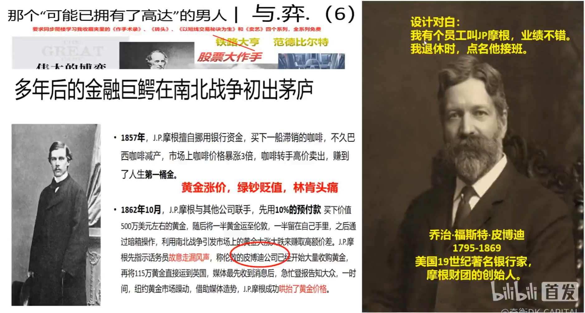
 

**乔治·皮博迪（George Foster Peabody），1795-1869**，出生在马萨诸塞州，早年的贫困影响了他的一生：聚集钱财，拼命地工作，孤芳自赏，对轻蔑极度敏感，与这个世界格格不入；爱国；多半生小气、吝啬，晚年却不停地慷慨捐助。美国19世纪著名银行家，摩根财团的创始人。

**1835年**，那时全球都在经历“新经济泡沫”——人们依靠贷款，疯狂地修建铁路、运河、公路，就像现在的网络一样。

美国商人乔治·皮博迪来到伦敦，为马里兰州寻求英国的银团贷款。他威胁：“**只有继续为美国提供新的贷款，才能保证以前的贷款能够得到偿还。**”于是，他为马里兰州拿到了800万美元的贷款。为减少英国人对美国人“见钱眼开”的偏见，毅然放弃马里兰州应付给他的6万美元的佣金。

**1838年**，皮博迪在伦敦开了一家商号。他很快进入由卓越的银行家组成的商人圈子，这些人既做织物生意，也为做此生意的人提供融资。他创立了金融批发业务而不是普通银行储蓄、转帐的“平庸业务”。皮博迪只为各国的政府、大公司和有钱的人服务，为世界贸易提供资金，发行债券和股票。

**1857年**，皮博迪就开始资助巴尔迪摩的一所“皮博迪学院”；1862年，他开始把15万英镑转给一家信托基金，用于建造伦敦的贫民住宅工程，还立契转让了他在另一家公司的5000股大宗股票，维持这个住宅区的运转。为此，他获得了“伦敦荣誉市民”的称号。他生命的最后阶段，向耶鲁大学捐赠了一个历史博物馆；向哈佛大学捐赠一座考古学和人类文化学博物馆；为南部被解放的黑人设立一项教育基金会。雨果写道：“**这个世界上，有充满恨的人和充满爱的人，皮博迪属于后者，正是在这种人的脸上，我们看到了上帝的笑容。**”

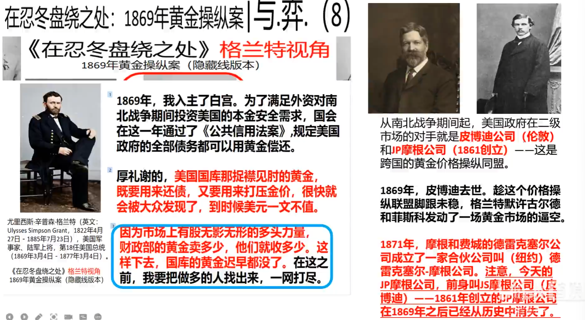

### 1873年绞杀杰伊库克

**杰伊库克的资本来自德国，南北战争期间为林肯募资。**

**1870年，北太平洋铁路超预算，导致杰伊库克的银行陷入危机。因为包销，所以一旦北太平洋铁路资金链断裂，杰伊库克手中的债券就变成废纸。**

**1873年初，杰伊库克与JP摩根共同承销3亿美元的政府债券，这笔钱1873年末才交付。杰伊库克计划快速发售，获得这笔资金，先给自己的库克银行周转，年底再交给政府。**

但是，德雷克塞尔-摩根公司的销售进展十分缓慢。一直拖到1873年9月，库克银行破产，引发股市崩盘，直到美国政府救市，恐慌才在9月底平息。

**1873年-1878年，铁路股惨遭腰斩。**  
英国和欧洲大陆投资者损失惨重，退出美国市场，但是……

**1877年范德比尔特去世前把高达1.05亿美元的巨额财产（迄今最大一笔私人财富）留给了大儿子——小范德比尔特。**

小范德比尔特持有纽约中央铁路超过87%的股份，但他希望分散（变现）自己的资产（为什么？）。于是，他找JP摩根帮他在二级市场出货。

JP摩根把这些股份卖给了英国人，而自己获得了英国股东的代理权。

**格兰特的结局**

詹姆斯·D·菲什  
国民航海银行的老板  
沃德骗局主谋

费迪南·沃德  
人称“**华尔街年轻的拿破仑**”  
格兰特-沃德公司的老板  
沃德骗局主谋

尤里西斯·辛普森·格兰特及其家族  
美国第18任总统  
沃德骗局受害者——破产

**你知道写历史的春秋笔法吗？**  
**谁是“华尔街的拿破仑”？（J.P.摩根）**

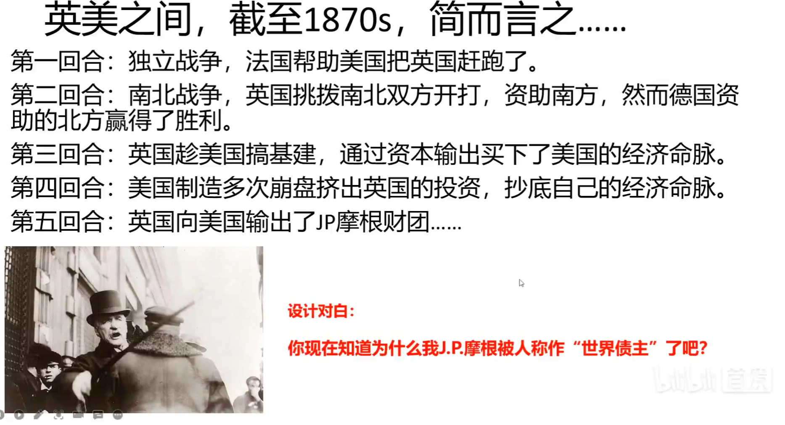

## 第十集：JP摩根：美国财政部找我借钱怎么办

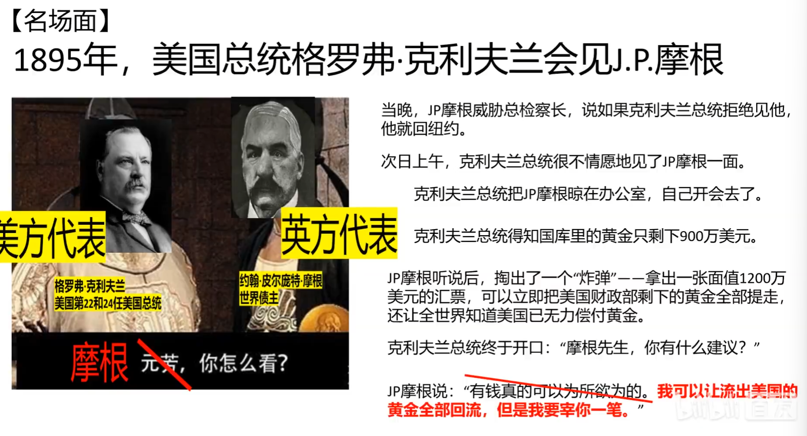

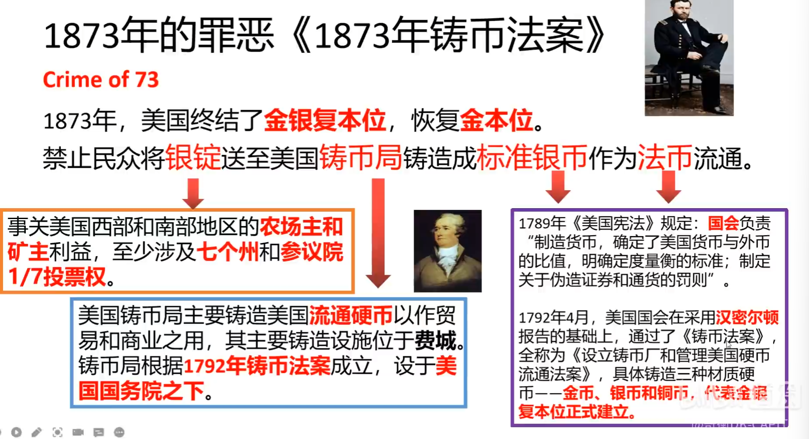

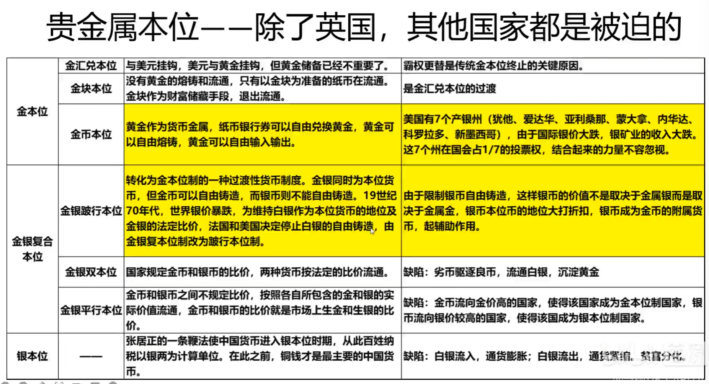

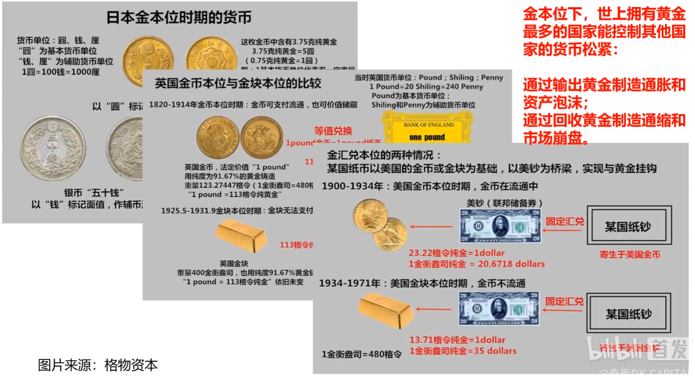

90%金本位=通货紧缩

**“自由银币运动”是什么回事？**

1873年，美国颁布《1873年铸币法案》，废除银币。

1879年，美国完成金本位的回归。

**1879年至1890年期间，通货紧缩。**

**美国小麦价格下跌27%，美国农场主损失惨重。**

白银需求锐减，美国白银矿主损失惨重。

**又想实施通货膨胀，又想保持币值稳定——终有一边是错的**

- 1878年，颁布《布兰德-艾莉森法案》，规定**1黄金等于16白银**。（固定汇率）  
- 1879年，财政部按法定要求必须持有**1亿美元**黄金储备，用于支撑金本位。（资本自由流动）  
- 1890年，颁布《谢尔曼白银法案》取代《布兰德-艾莉森法案》，要求财政部**每个月购买不少于450万盎司的白银**，这一数量大致等于全美白银产量，相当于财政部以白银为抵押物印钞票。  
（独立自主的货币政策）

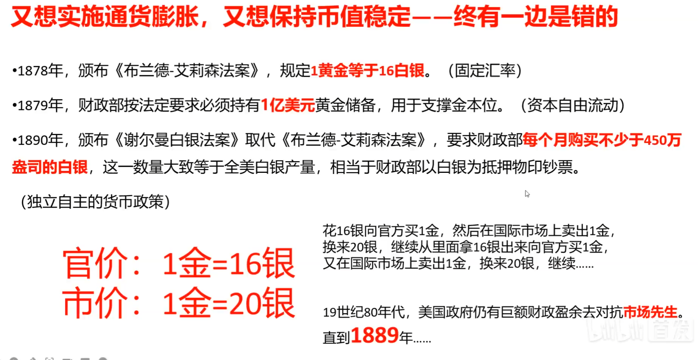

- 1884–1889年，华尔街的证券价格上扬了50%。与此同时，资本也流向了智利新发现的硝酸钾矿区以及南非的黄金和钻石矿区。

- 1889年，因为担忧市场会趋于投机的癫狂状态，**英格兰银行和德意志国家银行迅速提高了各自的基准利率**。这一举措的影响立即显现出来，市场的狂热状态开始降温。这意味着证券价格下跌，为那些在泡沫巅峰受到诱惑而买入证券的投资人敲响了丧钟。

- **1889年，英格兰银行的黄金储备仅有900万英镑**，在危机最高峰时也不到1100万英镑。而仅巴林兄弟家族就要求英格兰银行立即提供400万英镑的融资，唯有如此，方可避免破产。英格兰银行预计西班牙银行和俄国银行将会撤回储备在英格兰银行的黄金。

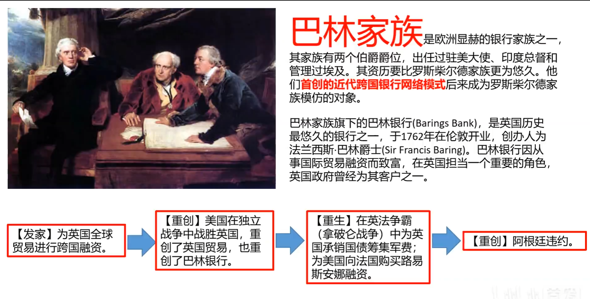

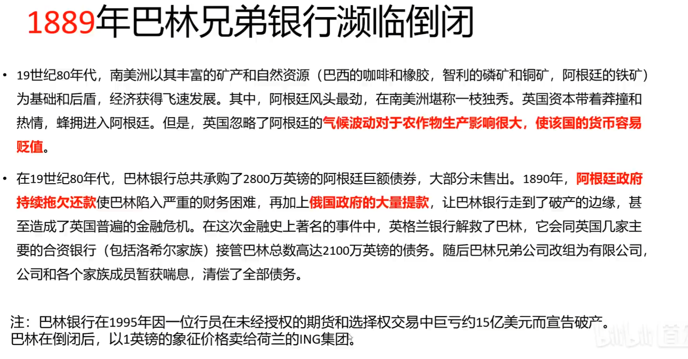

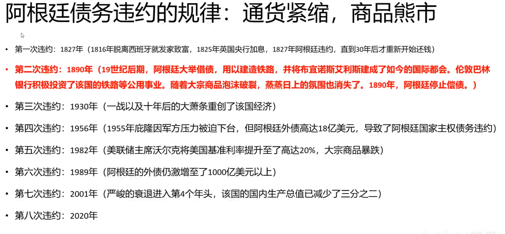

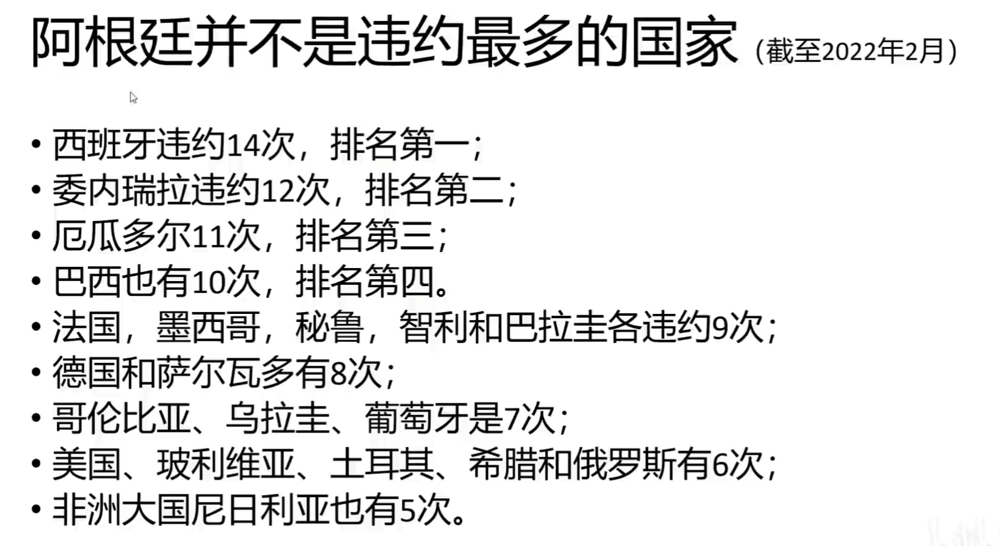

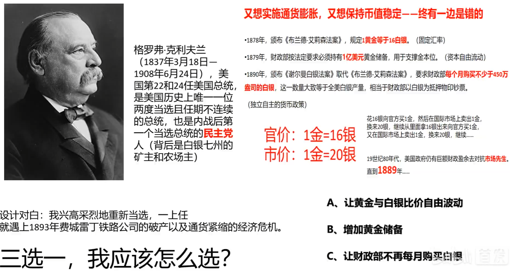

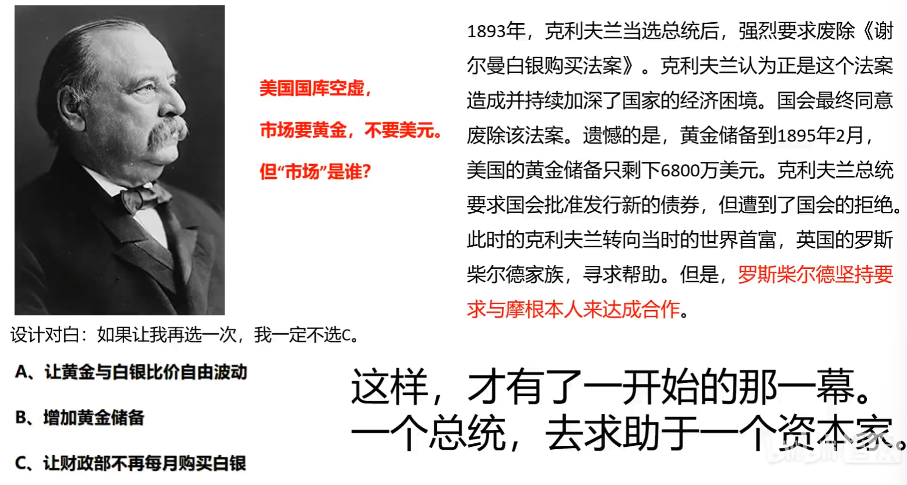

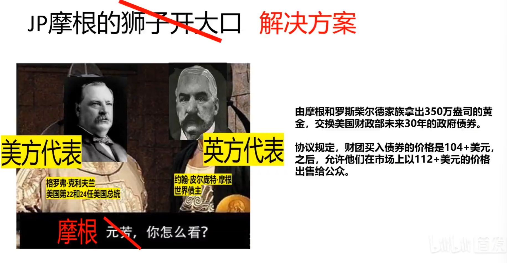

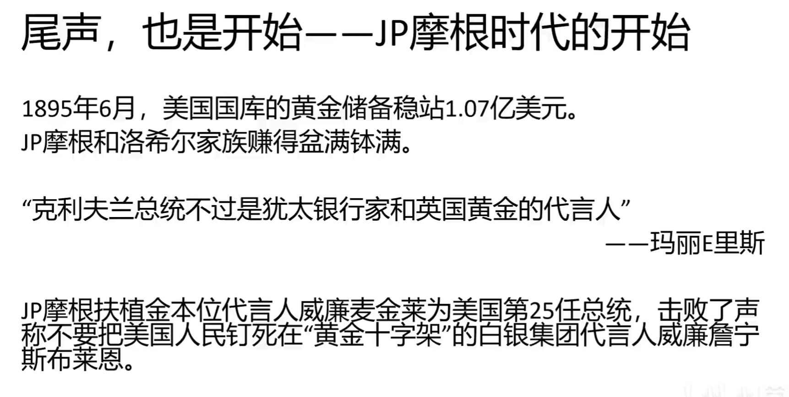

## 第十二集：杰西利维摩尔的崛起

### 1906年怎么了？什么情况形势严峻？

20世纪初达到高度繁荣，随着进出口额在1896年到1907年翻了一番，由进口带来的关税增长，使美国政府收入当时也翻番。道琼斯指数上涨了150%，而卡内基钢铁公司的利润从经济衰退最低谷时的区区每年300万美元，跃升到1901年卡内基将公司卖给摩根时的4000多万美元。

但是所有的繁荣都孕育着自我毁灭的种子。在金本位制度下，最终决定货币供应量的黄金供应量增长终会赶不上全球经济对资本需求的增长......那些卷入战争的政府需要进入世界资本市场为战争筹措资金，这有个市场平添了额外的负担。利率（资本的价格）持续上升

如果这个国家的货币状况不能有根本的改变......那么你们**很快**就会在这个国家看到一场恐慌--与之相比，此前所有的恐慌看上去都是小儿科。

> 很快是最坑爹的

杰西利维摩尔：我认为一切都在劫难逃，不能幸免。在这种情况下，唯一正确的行为就是做空股票。

股市开始下跌，之后反弹，盘整后开始稳步上涨，我不仅没有赚到钱，反而越亏越多。

*没做对就是没看对*

我又犯了错，可错在哪儿呢？**在熊市看跌，这不是明智之举吗？**看跌就要做空股票，这也没错啊。**错就错在我太早做空了，这让我付出了巨额代价。我的立场正确，操作却不对。**不管怎样，崩盘不可避免，且日益逼近，所以我耐心等待，**等到股价反弹力度变小甚至不再反弹，我用仅剩的一点儿保证金全部做空了。这次我做对了，但这种正确只持续了一天**，因为第二天股价又开始反弹，我又被狠狠地咬了一口。我只好研读行情收录器，平仓继续等待。

**市场似乎一直在和我作对**，逼着我退回空壳证券公司时那套古老而初级的交易方法。这是我第一次制订目光绝对远大的计划，不再只关注个股走势，而是放眼整个市场。我坚信只要坚持下去，就一定能赢。当然，那时我还没有确立自己的交易系统，不然我就能像上一篇说的那样，在下跌的股市里一点点做空，也就不至于损失那么多保证金了。我也许错了，但还没有错得太离谱。其实，我已经观察到了某些事实，只是还没学会如何把它们综合起来。不完整的观察，不仅没能有好作用，反而拖了后腿。

从失败中学到的经验总能让我受益匪浅，这次也不例外，最终我发现，现在确实是熊市，坚持看跌的立场是完全正确的，但行情还是应当研究的，因为只有这样才能找准最佳的操作时机。只要在正确的时间开始操作，就不会有什么大问题，也就能稳坐钓鱼台了。

今天的我当然对自己的观察很有信心，也不会让主观期望或者个人偏好影响我的观察结果，也掌握了多种方法证实自己的观察是否准确，检验自己的观点是否正确。但1906年股价的**持续反弹几乎把我的保证金全耗光了**。

当时我已年近27岁，做股票已经12年了。那是我第一次因为预测到大危机的逼近而进行的交易，我的操作非常有远见。从我预测出股灾即将到来到最终在崩盘中套现，这个过程比我预计的要漫长得多，以至于我开始怀疑自己是否已经看透了一切。市场给了我们很多警示，其中包括飞涨的短期利率，可还是有很多金融家告诉媒体自己很看好后市，而股市的持续反弹也有一定的迷惑性。我开始思考究竟从一开始就看跌后市根本是个错误，还是我只是错在过早操作。

我确定自己错在做得太早了，但我当时实在无法抑制操作的冲动。后来股市又开始下跌，机会来了。**我尽全力做空，可没料到股价再次反弹，而且反弹到很高的价位。我输光了，破产了。**

爱是一道光，输到你发慌！

要确定时机成熟才能行动

**1906年的利维摩尔想明白了，2022年的你想明白了吗？**

转眼间我就重拾了声誉和信用。不管是不是偶然操作正确，在证券公司操作得当就是如此美妙。反正这次由于我准确地分析了影响大盘走势的背景因素，操作十分准确，依靠的根本不是预感或看盘能力。我不是乱猜的，而是预见了必然会发生的事。眼前不断闪过的是持续下跌的股价，毫无疑问应该做空，我有什么理由不呢？

大盘此时非常疲软，但不久就出现了反弹，许多人跑来告诫我说，大盘已经跌到头了，还有的说**那些大户知道做空的人特别多，决定轧空大赚一笔等等**，现在这么做很容易就能得手，大户们不会手软的，一定会让空头们吐出几百万。对于好心提醒我的人，我一般只会感谢，从不与他们争论，因为一旦争论，他们就会觉得我太缺乏感恩心。

我在股价300美元时买进的安纳康达，他们以299 3/4美元抛出了500股——当然是整股，以299 5/8美元抛出了1000股，接着以299 1/2美元抛出了100股，以299 3/8美元抛出200股，以299 1/4美元又抛出200股，其余是以298 3/4美元抛出的。哈丁公司最聪明能干的证券商花了15分钟才帮我脱手最后100股，他们不想把股价砸死。

和海因兹做对的是经纪行

## 第十三集：决战伯利恒钢铁

背景知识：伯利恒钢铁的兴衰

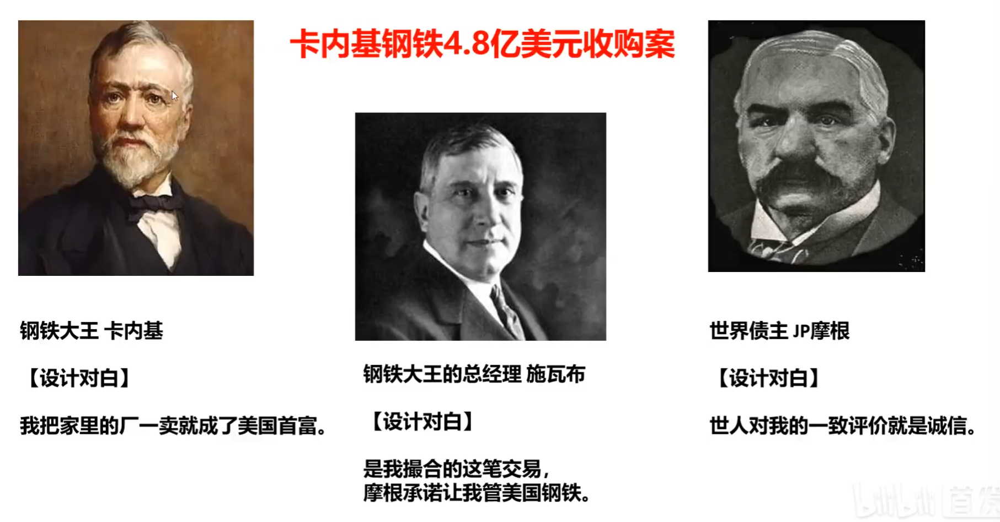

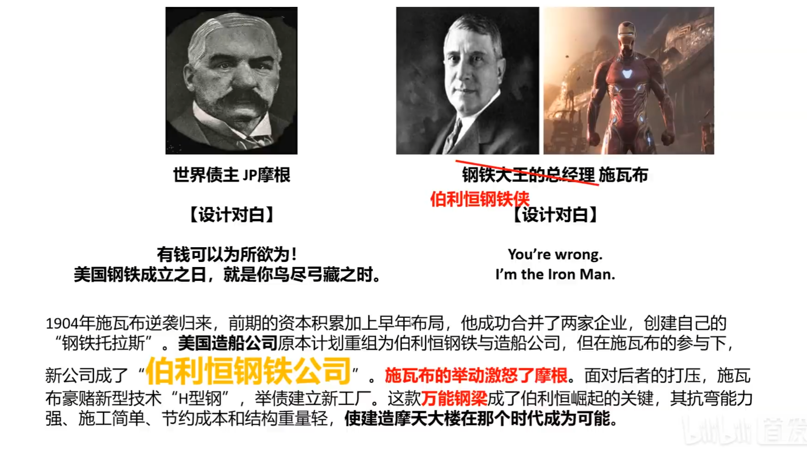

### 查尔斯·施瓦布（Charles M. Schwab）  

(1862–1939)，人称“死亡交易商”，美国早期工业企业家，曾任卡内基公司与美国钢铁公司总经理，后来又创办伯利恒钢铁公司，成为美国庞大的钢铁生产商之一。

1. **从工人到厂长**：在宾夕法尼亚州布拉多克由安德鲁·卡内基经营的埃德加·汤姆森钢铁厂当工人时，善于与人相处，工作关系融洽，这种特殊才能使他迅速跃居卡内基企业王国的最高领导地位，19岁是该厂助理，1887年负责管理该厂。

2. **总经理除了懂业务，还要会处理劳资纠纷**：1892年霍姆斯特德工厂发生流血罢工，卡内基委派他前去平息劳工纠纷，恢复正常生产，在他的努力下，劳资关系大为改善。同时通过技术革新提高了生产效率。1887年施瓦布年仅25岁时，就成为卡内基钢铁公司总经理。

3. **伯利恒钢铁侠**：1900年12月施瓦布响应金融家约翰·皮尔庞特·摩根的建议，将几家相互竞争的公司组成大型钢铁联合企业，并为此积极奔忙，1901年美国钢铁公司成立时，他出任第一任总经理。1903年因与J·P·摩根不和辞去该职。1904年他合并两个企业组成伯利恒钢铁公司，最终该公司发展成为当年自己于摩根联合创立的钢铁巨人——美国钢铁公司的劲敌。

4. **结局**：伯利恒公司在第一次世界大战期间以供应协约国战略物资而迅速获得暴利，1927–1929年成为美国钢铁联合会主席，晚年享有巨大的财富（2亿美元）和威望，30年代的大萧条，生活上的挥霍浪费，加上一些轻率的投资，使他遭受损失，1939年去世时已濒于破产。

### 伯利恒钢铁（Bethlehem Steel Corp）

- 1904–1914年，做建筑钢材，毫不起眼。  
- 1914年一战爆发后，做军工。
- 一战爆发前，美国陷入经济萧条，股市整体低迷，但伯利恒公司依靠新技术的发展，在1912–1914的两年中，**净利润上升了400%**，而股价却受市场影响，**始终维持在40–50美元**。战争开始后，伯利恒钢铁公司因本身带有的军火属性，大发战争财。光从英国身上，就获得了1.35亿美元的订单，并**垄断了向盟军提供弹药的生意**。
- 纽约80%的高楼都使用的是伯利恒钢铁。
- 二战期间，伯利恒的15个造船厂共生产1121艘船，远超世界其他造船厂，其建造数量是美国两洋舰队的五分之一。光造船厂就雇用了18万名员工，而整个公司有30万人。

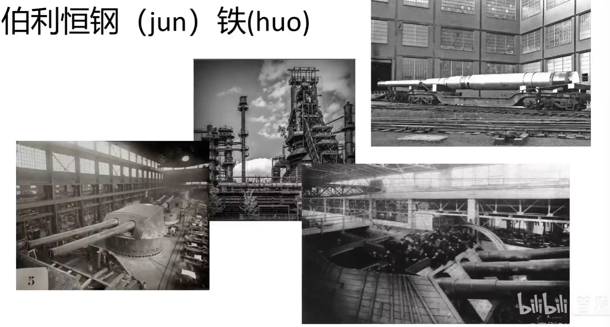

后面的伯利恒钢铁不注重产品创新，渐渐落后于日本

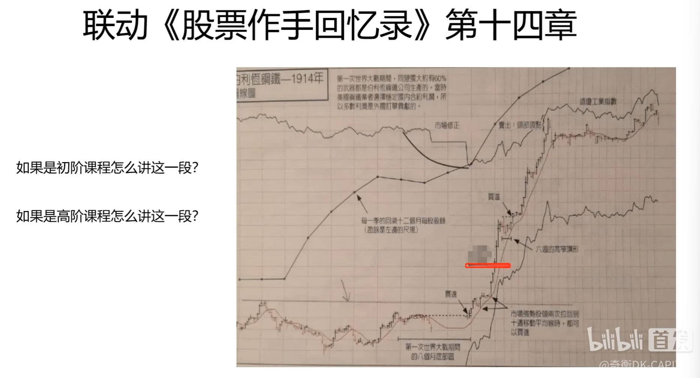

对于杰西利维摩尔来说这是一笔很普通的交易，他使用了杠杆

阻力最小路线只在牛市有效，在熊市会亏

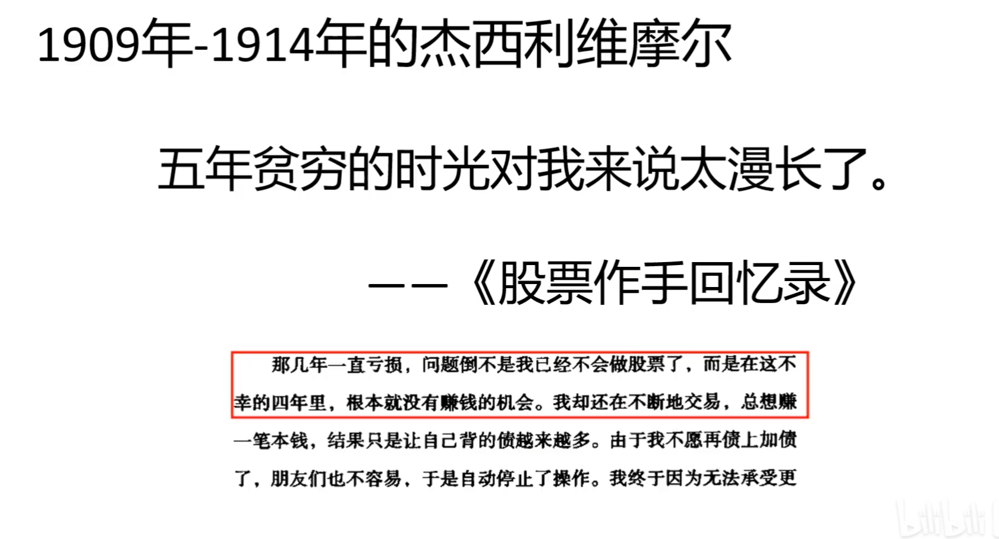

贫穷的时光太漫长了，科技是第一生产力，科技是策略

每一个作手的成功都是时势成就的

任何一个个人跟市场的潮流对抗，都是螳臂当车

大起大落不是我们追求的

### 为什么一战为杰西利维摩尔带来翻身的机会？

1914年8月，人们普遍认为全球经济尤其是美国经济将迅速崩溃……9月欧洲西线的机动战已经停止，漫漫无期的壕沟相持阶段开始了。但是，原先人们普遍预计的美国黄金外流也在此时中止了。到年底，**处于避险需求，黄金又开始流入美国**。从那以后，这些黄金中的大部分就一直留在了美联储地下26米的金库里，它位于华尔街三个街区以北的自由大路上。与此同时，美国证券对于欧洲银行和其他金融机构来说也变得越来越有吸引力。

--《伟大的博弈》P355

避险原因会让黄金和资金流向非本土战争的国家，战争开始的时候需要对资金的流向有了解

结果是欧洲的钱流向美国，有可能是英法德都在向美国采购物资

### 伯利恒钢铁史无前例的大订单

**伯利恒钢铁史无前例的大订单**

- 一战前，最大一笔合同是1000万美元的阿根廷海军舰船和装甲板。

- 1914年11月，施瓦布被请到伦敦，他签下了1.35亿美元的订单，包括**机枪、炮弹和潜水艇**等武器。

- 一战的订单推动美国股市的工业股业绩和估值双双爆发，伯利恒钢铁在协约国的订单推动下，从每股46.125美元一年时间涨到了459.5美元。**1915年，施瓦布的持股市值达到5400万美元。此时，德国突然联系他，开价1亿美元收购他的股票。**

伯利恒钢铁的产能会影响一战的走势，如果英法拉上美国的伯利恒钢铁，军工生产力就会压倒德国，战争首先看融资能力，接着是工业生产和后勤，最后才是战术差异

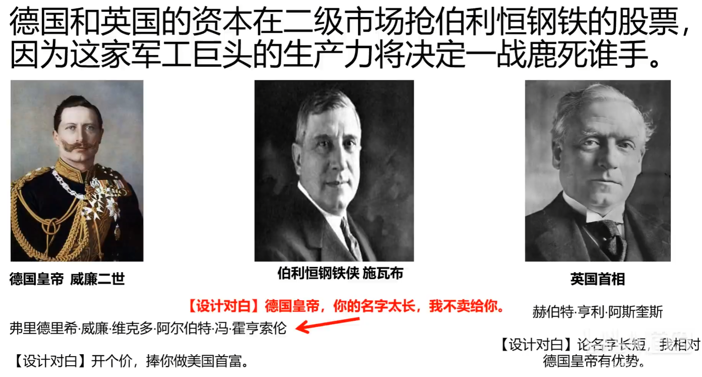

背后有不计成本收筹码的人导致市值变化之大

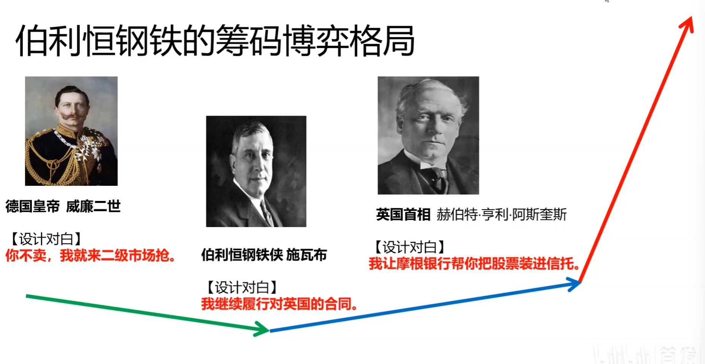

要知道行情后面的背景，不要只看价格突破

杰西利维摩尔参与了买入并锁定筹码，后续在大崩盘做空赚了一个亿

后发制人，谋定而后动，左侧忍住，右侧放开。

**1915年，联动《股票作手回忆录》第十四章**

在1915年初的关键时期，我最看好的股票是伯利恒钢铁（Bethlehem Steel），这只股票会涨，全世界都知道为什么——**战争来了嘛，造炮弹需要钢铁，所以钢铁肯定会涨**。我十分确定它会上涨，但是为了确保能旗开得胜——我必须做到旗开得胜——我决定等它的价格突破标准后再出手。

我之前说过，凭我的经验，一只股票首次突破100点、200点或300点后，几乎总会继续上涨30–50个点，而且突破300点后的速度，会比突破100或200点时更快。我成功获利的首批股票之一就是安纳康达，我是在它突破200点时买进的，次日于260点抛出。我在股价突破标准后买进的操作习惯，可以追溯到我早年在空壳证券公司交易的日子，这是一个古老的交易原则。

你可以想象我当时是多么渴望恢复以前的交易规模。我急得想不顾一切马上开始交易，**但我克制住了自己的冲动**。正如我所料，伯利恒股票不断走高，越涨越高，但我还是控制住自己立刻跑去威廉森与布朗公司买进500股的冲动，我只想尽一切可能力求首次操作稳妥。

追求确定性，是体现专业性的分水岭，取舍原则

**那只股票每涨一个点就意味着我又少赚了500块。它涨的第一个10点意味着我本可以加码了，手里就不再只持有500股了，而是1000股。这样，每涨1个点我就可以赚1000块了。但我没有听从内心喧闹的希望和信心，而是关注来自经验和常识的忠告，依然按兵不动。只要我有充裕的本钱，就可以冒险搏一搏，但是，没有资金，冒险，即使是冒小小的风 险，都是我无法承受的奢侈。六周耐心的等待，最终理智战胜了贪婪和希望。**

**伯利恒涨到90点时，想到我如此看好它却没有买进，这让我少赚了许多本该赚到的钱，我着实开始动摇、焦虑。**

**当它涨到98点时，我对自己说：“伯利恒会突破100点的，而一旦它突破100点，就会无止境地上涨！”** 行情已经清清楚楚地把这一点昭告天下。告诉你吧，当股票行情收录器上打出98点时，我心中的行情收录器上已经是100点了。我知道这不是我的想象而是我读盘能力本能的断言。于是我对自已说：“我不能等到它突破100点再买进了，我不能等了，我现在就得出手，现在就等于已经突破标准了。”

我跑到威廉森与布朗公司，下单买进500股伯利恒钢铁的股票，此时股价是98点。我以98点到99点之间的股价买进了500股。之后，它的价格一路飙升，我想那天下午它是以114或115点收盘的。我用账面利润又买进了500股。

**第二天，伯利恒钢铁的股票涨到了145点**，我有本钱了。这是我应得的。等待最佳时机的那六个星期是我度过的**最费力最耗神的六周**，但我得到了回报，我现在拥有足够的本金可以进行规模交易了。光凭500股的交易我是永远都难有作为的。

不管你做什么，走对第一步是至关重要的。伯利恒交易之后，我的操作非常顺利，真的很棒，以至于你难以相信是同一个人在交易。**其实我也变了，不再烦躁不安、漏洞百出，而是变得轻松自在、正确无误**。没有债主的骚扰，也没有资金不足来干扰我的思考或干扰我倾听经验的指导，所以我一路赚钱。

## 第十四集：汽车热潮与杰西利维摩尔有什么关联

**go big or go home**

缺少运营的人操作

市场下跌的时候不要拿全部身家接盘，不要只身对抗下跌

13.5元六年到230

**摩根财团背后是伦敦，杜邦公司背后是巴黎**

### 破产的三个好方法

1. 盲目创业
2. 盲目并购
3. 跌破左侧杠杆抄底

### 为什么1920年4月美国的汽车板块会崩盘呢？

因为出现了神仙打架

杰西利维摩尔是施瓦布利益集团的，施瓦布得罪了摩根，后面施瓦布利益集团日薄西山，杰西利维摩尔在摩根的打压下再无翻身之力

## 第十五集：大萧条1929、胡佛祭出的七伤拳

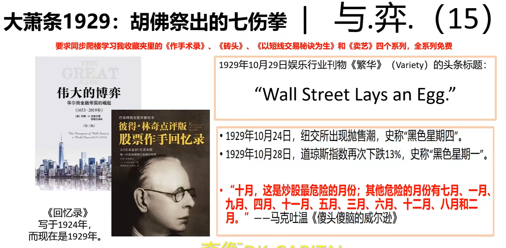

### 大萧条，1929年至1933年之间发源于美国的经济大危机

- 是指1929年至1933年之间发源于美国，并后来波及整个资本主义世界，其中包括美国、大英帝国、法兰西第三共和国、德国和日本帝国等资本主义国家的经济危机。社会主义国家苏联未受到影响，相反还完成了五年计划。  
- 是现代社会持续时间最长的经济萧条，不仅导致了长期的大规模失业，也改变了社会关系，摧毁了多国的执政政府和正常的国际贸易，最终导致了第二次世界大战的爆发。  
- “梅隆拉响汽笛，胡佛敲起钟。华尔街发出信号，美国往地狱里冲！”（Mellon pulled the whistle, Hoover rang the bell, Wall Street gave the signal and the country went to hell）

**大萧条期间，苏联积极引进外资，完成了五年计划**  
**注：并非所有国家都陷入经济危机**

- 1931年，美国出口的机器设备中，有50%卖给苏联。苏联的三大钢铁厂都是美国援建的，最大的第聂伯河水电站是引进美国技术设备、雇用美国技术专家于1933年建成的，著名的高尔基汽车厂是由美国福特公司援建的。1928-1931年，苏联人分别购买了西方67.1%的切割机床，52.6%的涡轮机，69%的拖拉机。从二十年代初起，美国有20家以上公司向苏联提供设计、设备、专利或派工程师，帮助苏联制造飞机发动机、轰炸机、战斗机和商业运输机。**斯大林为此盛赞：“在苏联大约有2/3的大型工业企业是由美国帮助建设或提供援助的。”**
- 经济危机同时也让德国和意大利走向了纳粹化，美国和苏联都感受到来自纳粹的威胁。基于对现实的考量，1933年11月，美国与苏联建立了全面的外交关系。

大萧条表面上是世界性经济危机，实际上是英美争霸的其中一次博弈。

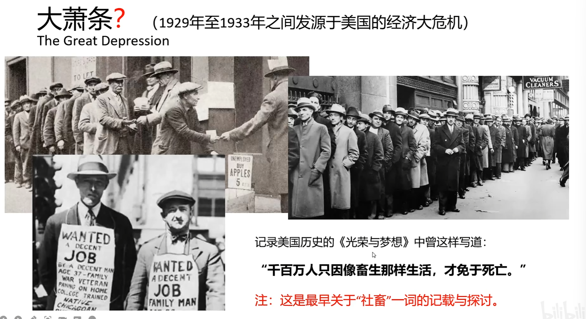

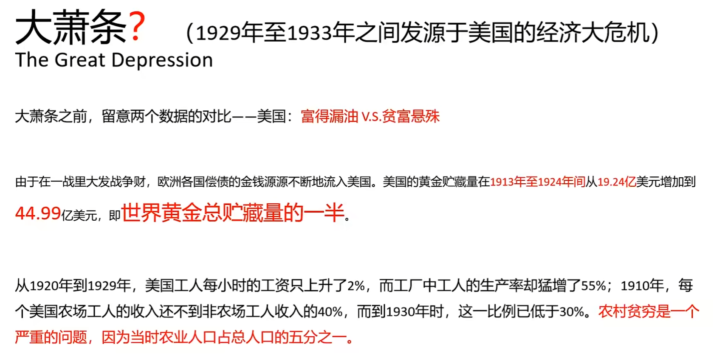

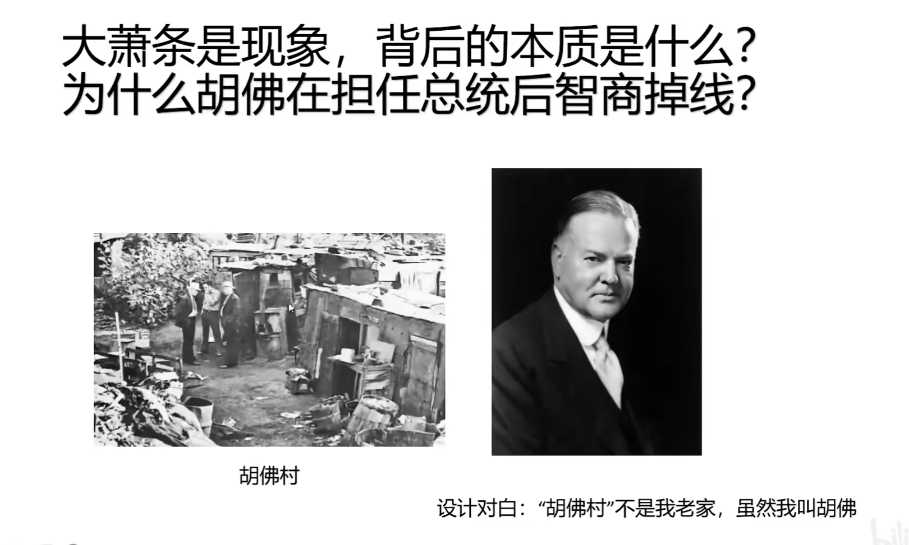

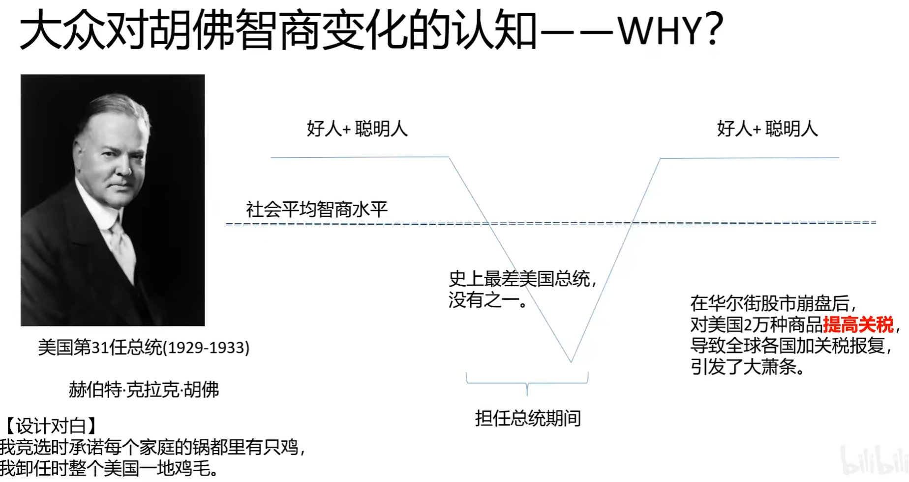

胡佛是卸任总统里面最有成就的

1895年，21岁，从斯坦福大学毕业；

1898年，24岁，被派往中国开平煤矿工作，于1900年利用巧取豪夺的手段窃取了开平煤矿，34岁的时候已经是享誉全球的富豪、矿业大亨。

1914年一战爆发，跨入政坛，主持美国救济委员会帮助被困在欧洲、身无分文的12万美国人回国；一战后胡佛被协约国首脑任命为救济与复兴署署长，**主管解决欧洲战后粮食短缺问题**；胡佛还私人募集了2.5亿美元，对欧洲一些国家的儿童及难民进行救济。

1919年到1921年间，忙于慈善活动、写时政评论文章、进行公开演讲、主持大型会议等工作中。

1921年3月4日，**被任命为美国商务部长，一当就是7年之久，总统换了他的职务都没变动过**。担任商务部长期间正好是美国经济腾飞的黄金时期，一战中欧洲遭到重创，利用这个空窗期，美国商品和资本在世界范围内攻城略地，经济保持了连续的高增长。**这一时期美国国民生产总值和工业生产总值超过英、法、德三国总和，美国黄金储备占世界一半还多**，汽车成为美国家庭标配，电冰箱、洗衣机、吸尘器、电话等各种电器走进人们生活，而这些进一步加重了身为商务部长的胡佛的声望。

1927年8月，柯立芝总统宣布不谋求连任，1928年6月召开的共和党大会上，胡佛以绝对优势成为共和党的总统候选人；在1928年大选过程中，胡佛仅仅进行了7次演讲，没有其他宣传活动，就轻松击败民主党的总统候选人，以444张对87张选举人票入主白宫。

**胡佛在担任美国总统之前是做什么的呢？**

一战战后，主战场欧洲一片狼藉，作为战败国的德国和奥地利发生饥荒。

美国对欧洲实施【援助】，负责人就是胡佛。他先来到德国，开设了35000个派粮中心。到达奥地利时，奥地利几乎已经到了绝境。当时胡佛估计需要1亿美元，奥地利才能撑到下年的收获季，可是奥地利没钱。

美国有法律规定，不能给敌对国贷款，哪怕战后两家已经不是敌人。那胡佛怎么做的呢？**他让美国给英国、法国和意大利贷款4500万美元，然后让这三国把钱借给奥地利**，这就顺利绕开了美国法律的限制。

**胡佛利用美国在奥地利救济的主导地位，让奥地利利用这笔钱购买美国的粮食。既解决了奥地利的饥荒问题，又帮助美国把积存的农产品卖出去了，既收获名声，又获得收益。等英法意给奥地利的贷款到期时，奥地利却没钱还，美国那边却把英法德追得紧。**

**适合美国的一个成语——身脏挣亿**

**1929年3月4日，宣誓就任总统，作为工业效率的代表而当选，他认为自己具有引导国家走向特殊繁荣的条件。由于美国正处于空前的“柯立芝繁荣”，加上共和党人占据着国会的多数，胡佛是在歌舞升平的环境中入住白宫的。**

**1930年，为兑现竞选时的承诺，提高农产品的进口关税以帮助受困农民，一意孤行，签署了《斯姆特·霍利法案》，将20000多种的进口商品关税提升到历史最高水平。**  
法案通过之后，许多国家对美国采取报复性关税措施，使美国的进口额和出口额都骤降50%以上，引发全球经济大萧条。

1945年罗斯福去世后，再度活跃于政界。主要以元老身份参与制定共和党的各项政策，成为共和党保守派的首领，以“孤立主义者”著称。

1964年10月20日，刚刚度过90寿辰不久的胡佛在美国纽约去世。

以当代美国经济学派默里·N·罗斯巴德（其代表作是《美国大萧条》）为首的新的经济学派认为，**胡佛政府对于经济危机的政策并非“自由放任”，而是强制干涉给私营经济造成了沉重的负担。** 胡佛对经济的干预包括抬高工资率和物价、扩张信贷、扶持濒临破产的企业和增加政府开支（如对失业人口进行经济补贴，为公共工程融资等）。正是政府的过多干涉和对私营产值的掠夺，才导致经济危机形势愈益严重。他的新政是罗斯福新政的前导。

胡佛签署《斯姆特霍利法案》是因为美国在和英国争夺世界金融中心

### **精要复盘美国1929-1933**

- 1929年10月24日，纽交所出现抛售潮，史称“黑色星期四”。
- 1929年10月28日，道琼斯指数再次下跌13%，史称“黑色星期一”。

- “十月，这是炒股最危险的月份；其他危险的月份有七月、一月、九月、四月、十一月、五月、三月、六月、十二月、八月和二月。” ——马克吐温《傻头傻脑的威尔逊》

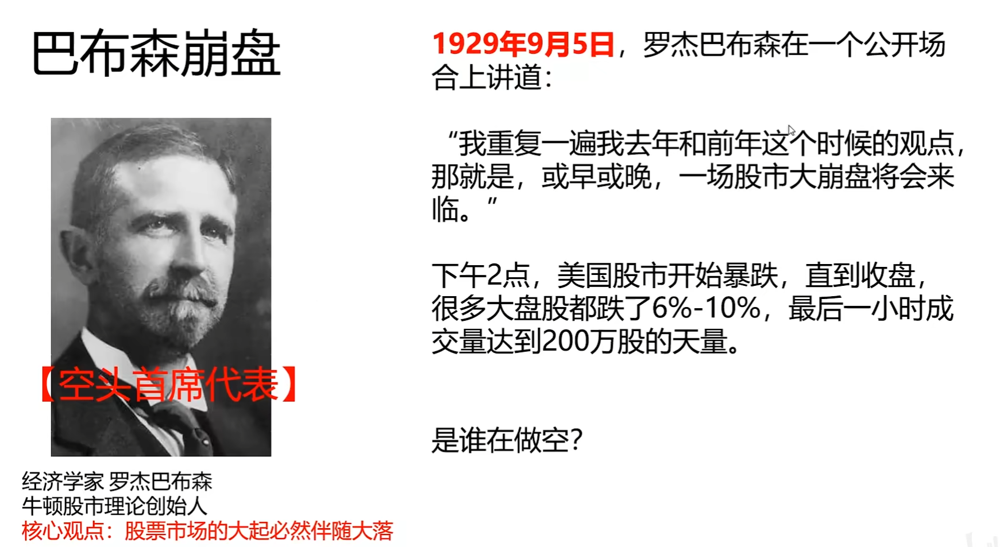

- 1929年9月5日，杰西·利维摩尔听说了罗杰·巴布森（Roger Babson）的名字——这是一位在过去的两年里坚持预测市场将出现一次大崩盘的经济学家，他还将在这一天中午的全美商业会议（National Business Conference）上发表讲话。

- 在进一步发现报纸上铺天盖地全是有关这场演讲的报道之后，杰西·利维摩尔认为，**巴布森很有可能继续他的“消极”演说，并且引发市场的小小恐慌，这也就意味着，在演讲结束前，应该做空。**

- 于是，从早晨十点美股开盘到巴布森开始讲话的那一个半小时里，杰西·利维摩尔和他手下的交易员们卖空了价值近1500万美元的股票。

- 午后，随着巴布森的一句“市场迟早会迎来一场崩盘，主要股票都不能幸免，道指将暴跌60到80个点”传遍美国，华尔街开始抛售股票。早早做好准备的杰西·利维摩尔也**顺势将自己的空头头寸推到了2000万美元左右。**

**做空的人还有谁？**

**罗兰斯特宾斯**  
1929年8月卖掉了纽交所的席位，去百老汇做制片人  
身份：美国最大的两家证券公司之一——德科普特-道莫斯公司的合伙人

**阿尔伯特·威金**  
1929年7月卖空了自己公司的股票  
身份：大通国民银行的总裁

**小摩根在欧洲**  
身份：摩根财团的当家

**老约瑟夫·帕特里克·肯尼迪**  
身份：银行家，后来的首任证监会主席

**伯纳德·巴鲁克**

- 1929年9月5日股市收盘后，坚定看多的欧文·费雪（Irving Fisher）却在接受采访时，直接否决了暴跌的可能性。

- 考虑到费雪的鼎鼎大名，杰西·利维摩尔给交易员们指令：第二天市场一开盘，所有空头头寸都必须平仓。

- 到了9月6日这天中午，美股已经收复了前一天的所有失地。等到杰西·利维摩尔团队在收盘时卖出多头头寸时，他所平掉的空仓和开盘半小时内买入的500万美元股票已经为他带来了超过180万美元的利润。

**欧文·费雪（Irving Fisher）是谁？**

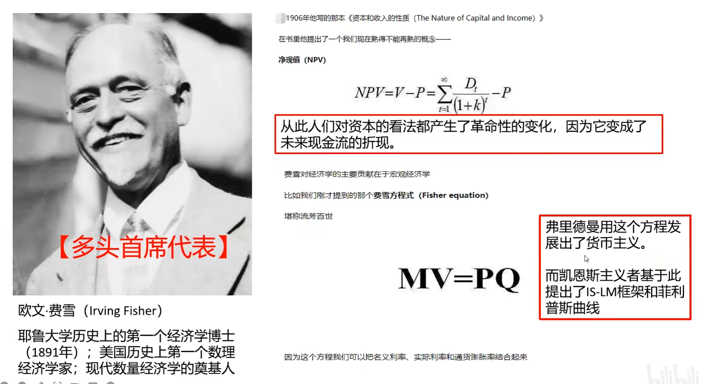

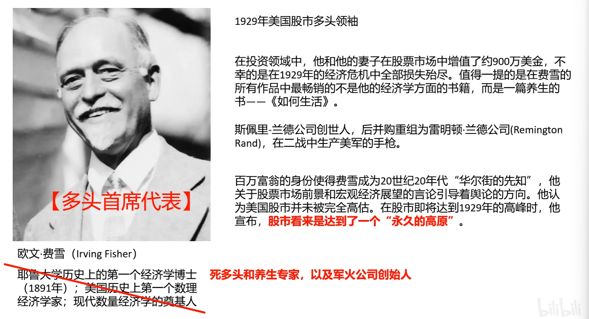

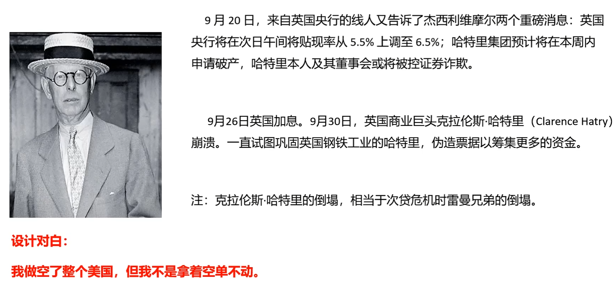

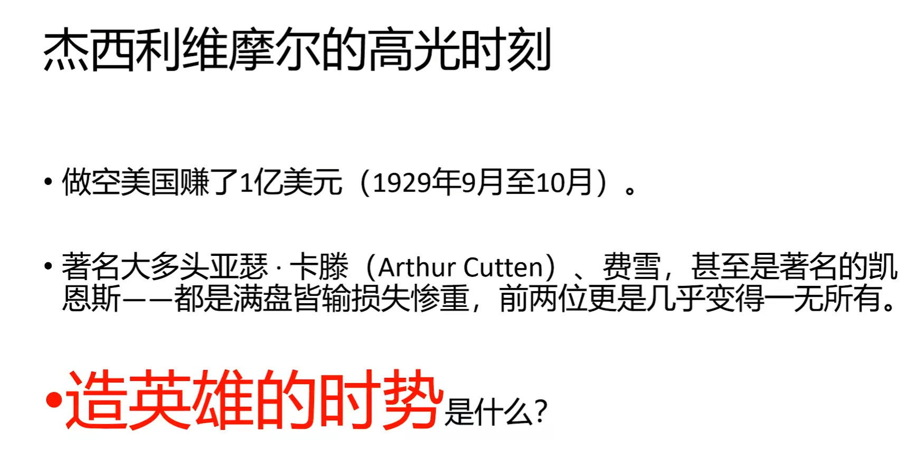

### 搞基本面分析而忽略货币流动的人最终一文不名

**最重要的一页**

- 华尔街在1929年市场崩溃之前的10年里，共发行海外债券达70亿美元，这是一个很大的数目，相当于国内生产总值的10%。美国成为世界债主，黄金从英国和南非流向美国。

- 为应对**黄金的流失**，英格兰银行将利率提高到8年来的最高水平。时任英国财政大臣菲利普·斯诺登（Philip Snowden）说，此举以防止资本流向“3000英里之外的投机狂欢”。

- 20世纪20年代，黄金的流入决定了宽松的货币政策，美联储多数成员认为，必须采取措施**遏制**  **与宽松货币相关的投机活动**。

- 美联储实施的紧缩货币政策，将减少仅由金本位所决定的经常账户赤字规模，从而**阻止黄金流向**美国的贸易伙伴。美联储通过冲销黄金流入、降低货币和经济增长，抑制了原本会因国际收支平衡而离开美国的黄金数量。

**注**：  
此段内容分析了1920年代末期美国经济繁荣背景下，国际资本流动、黄金储备变化以及各国货币政策之间的互动关系。重点指出：  
- 美国大量发行海外债券吸引资金流入，导致黄金净流入；  
- 英国为遏制资本外流而加息；  
- 美联储则试图通过紧缩政策控制因黄金流入引发的过度投机，但其政策在一定程度上也加剧了后续经济危机的风险。

### 汇兑金本位：美国用自己的黄金给英镑做担保

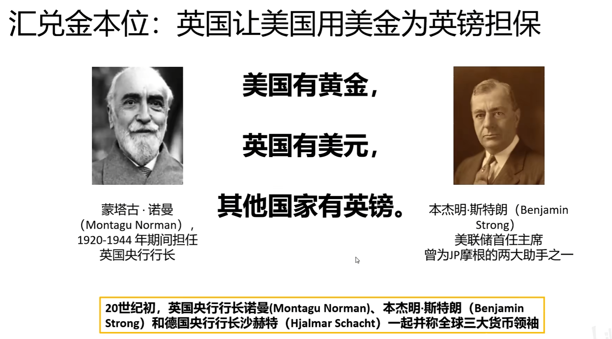

美国用自己的黄金给英镑做担保，美联储主席是英国央行行长的小弟。

1929年3月胡佛就职美国总统，开始汇兑金本位退出历史的倒计时。

大萧条是通过高关税把全球贸易冻结，断了欧洲的财路，这样欧洲还债就只能用压仓底的黄金来还。

大萧条同时是一个争夺华尔街定价权的故事

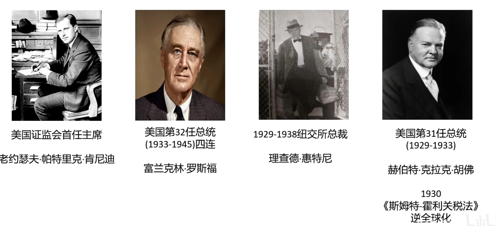

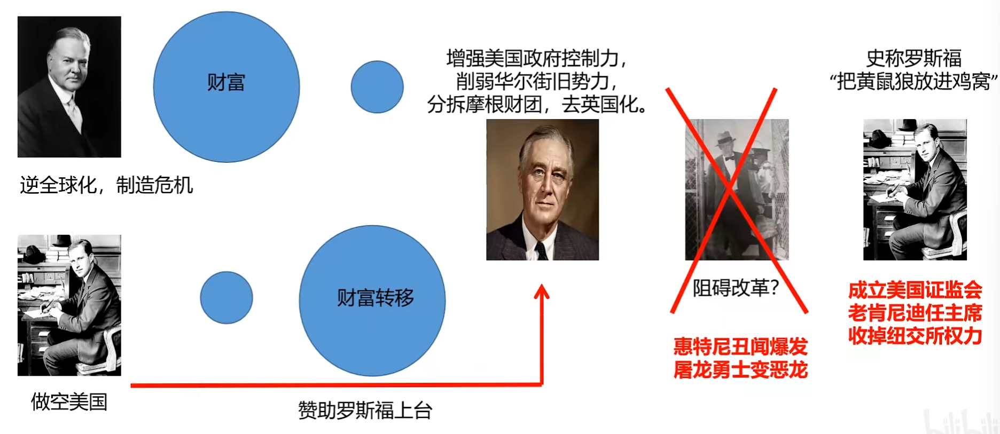

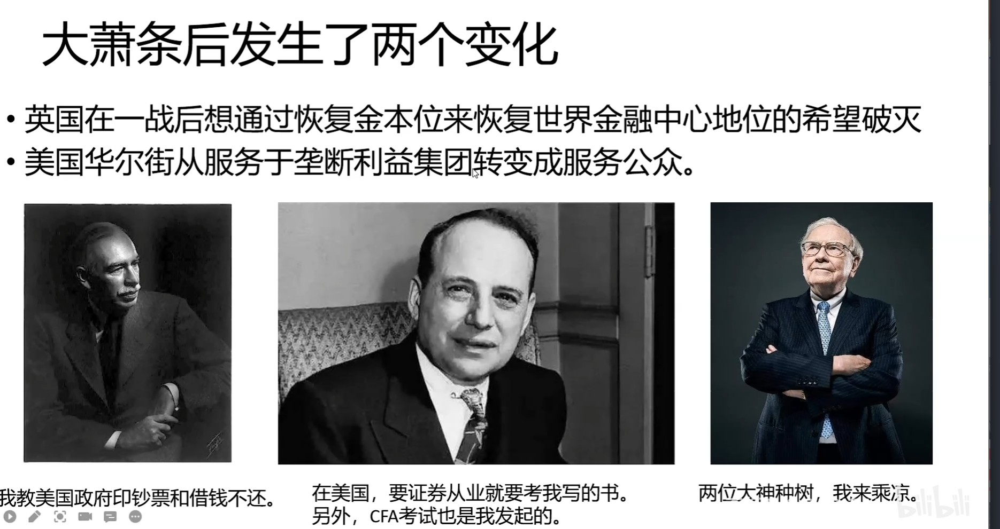

## 第十六集：沃伦巴撕葱是怎样炼成的？

以讹传讹：

“市场短期来看是投票机，但长期来看是称重机”

市场不是针对每一只证券都能根据其质量去精确、客观计量其价值的称重机

市场是一部投票机，无数市场个体的决策一部分取决于理性，一部分取决于情绪。

这意味着，有些证券，只要市场不认可，持有一万年也不会价值回归

《证券分析》直接反对长期投资，这就是没看过与看过这本书的区别。

巴菲特家族是当地电商巨头

美国不断卖工业制品给德国和日本，默许他们开启二战

巴菲特卖报纸是体验生活

**1941年，日本空袭珍珠港，美国卷入二战。**

**1942年11月当选国会众议员。霍华德·巴菲特属于共和党保守派，主张美国不应该参与战争、保护资本家利益。当年沃伦·巴菲特12岁时，就天天跟着老爹挨家挨户拜访，帮助老爹竞选成功，当上内布拉斯加州的国会众议员。1943年1月，新当选议员霍华德·巴菲特一家搬到首都华盛顿就职。这一年，大萧条结束。**

**1945年，罗斯福在任期期间去世，副总统杜鲁门继任。随后，二战结束。**

**1948年，托马斯·杜威与杜鲁门竞选美国总统，同为共和党的霍华德·巴菲特也忙于第四次国会议员竞选。结果，共和党满盘皆输。**

**霍华德·巴菲特失势，沃伦·巴菲特进入国会工作的希望随之破灭。沃伦·巴菲特便想到他的老师本杰明·格雷厄姆的“格雷厄姆-纽曼”公司（类似今天的对冲私募）工作，甚至提出不要任何薪酬。但是，本杰明·格雷厄姆拒绝了他，因为巴菲特不是犹太人。最后，沃伦·巴菲特只好回家结婚。结婚对象是霍华德·巴菲特的竞选赞助商威廉·汤普森的女儿苏珊·汤普森。**

**沃伦·巴菲特与苏珊·汤普森于1952年结婚，本杰明·格雷厄姆于1954年同意巴菲特到他的公司工作。1956年，本杰明·格雷厄姆决定退休，希望巴菲特成为“格雷厄姆-纽曼”公司的合伙人，但巴菲特拒绝了，自己创立了巴菲特合伙公司（类似今天的私募），继承了本杰明·格雷厄姆的老客户，并开始连载投资文学巨著《致股东的信》。**

**华尔街教父：本杰明·格雷厄姆**

1914年格雷厄姆从哥伦比亚大学毕业，同年夏天，来到纽伯格·亨德森·劳伯公司。

在不到三个月的时间里，他就被升职为研究报告撰写人。由于他**充足的文学修养和严谨的科学思维，以及渊博的知识**，很快他就形成了自己简洁而富有逻辑性的文风，在华尔街证券分析舞台独步一时。

当时，人们习惯以道氏理论和道·琼斯指数来分析股市行情，而**对单一股票、证券的分析尚停留在较为原始、粗糙的阶段，而且普通投资者在投资时通常倾向于债券投资方式，而对于股票投资，投资者普遍认为过于投机，风险太大，令人难以把握**。

格雷厄姆透过那些上市股票、债券公司的财务报表，以及对那些公司资产的调查研究发现，上市公司为了隐瞒利润或在债权清理时逃脱责任，**常常千方百计地隐瞒公司资产，公司财务报表所披露的是低估后的资产**，而这一做法造成的直接后果就是反映到股市上的股票价格往往大大低于其实际价值。操纵者可以通过发布消息来控制股价的涨跌，股市完全在一种几乎无序而混乱的状态下运行。

**1920年，格雷厄姆成为纽伯格·亨德森·劳伯公司的合伙人。**

格雷厄姆将期权买卖交易运用到规避投资风险上，为自己的投资组合设计了一整套对冲方案，如当一证券看涨时，仅花少许金额买下它的待买期权，待日后升值时再以约定价格低价买进；当某一证券看跌时，花少许金额买进其待卖期权，以便将来下跌后再以约定价格高价卖出。

**1923年，格雷厄姆离开了纽伯格·亨德森·劳伯公司，成立了格兰赫私人基金，资金规模为50万美元。第一战就是【通过买杜邦，间接买通用汽车】。**

1920年美国军火巨头杜邦公司趁通用汽车陷于财务困境，兼并之。  
1923年由于一战结束，杜邦公司失去了军火暴利来源，股价大跌；  
而通用汽车公司因汽车市场需求的大增而利润直线上升，股价大涨。

**他认为由于杜邦公司持有通用38%以上的股份，而且这一份额还在不断增加，所以市场现阶段两种股票之间的价格差距就是一种错误。格雷厄姆不仅大笔买进杜邦公司股票，而且更大笔地卖出通用汽车公司的股票。**

**两个星期后，市场迅速对这两家公司股价之间的差距作出了纠正。格雷厄姆迅速获利了结，大赚一笔。**

市场为什么会价值回归？因为市场不够钱，所以只能板块轮动。价值回归是板块轮动概念。

而市场有足够的钱时，没有打折的股票。（巴菲特时代）

而市场彻底没钱的时候，打多少折都不会价值回归（杰西利维摩尔自杀时）

1934年，本杰明格雷厄姆写下《证券分析》，总结了上述三句话的第一句。总结为一个原则就是息价原则。

凭借《证券分析》的广泛影响力，格雷厄姆成为世界上运用数量分析法来选股的第一人。他提出了普通股投资的数量分析方法，解决了投资者的迫切问题，使投资者可以正确判断一支股票的价值，以便决定对一只股票的投资取舍。

**一种投资方法之所以有理，是因为它逻辑严谨；而这种投资方法之所以有用，是因为市场上使用这种方法的人掌握定价权**

温故知新，在大萧条期间挑选铁路债，意味着比平时要追求更高的保障倍数（安全边际）

格雷厄姆写书的时候，铁路行业是新兴产业，是新基建。

## 第十七课：从巴菲特首战美国运“钞”讲起

内在价值就像幽灵，人人都在谈论它，但谁都没有真正见过他。而能力圈，就是懂行者给不懂行者下的圈套。

**做的事情和家国原则违背，不会有好结果**

**色拉油骗局**

单一热点很危险，热点一过就得砸手里

- 1950年代，美国农产品严重过剩。农业部提出“粮食换取和平”的计划，补助粮食出口商，用低价把一些生产过剩的粮食出口给粮食生产不足的国家，除了可以帮助这些物质匮乏的国家负担得起这些粮食之外，还可以扩大国际贸易，充分利用美国国内所过剩的农产品。

- 提诺为什么会选色拉油呢？除了因为大豆过剩之外，色拉油用途广泛，可以用来油炸食物，也可以再加工做成燃料，或者是做成印刷的油墨，也可以当作种塑胶的原物料之一。（多用途）

- 当时色拉油价格的涨跌非常不透明的，里面往往还掺杂着一些政治因素，全世界也只有少数几个国家，可以在色拉油市场上呼风唤雨。通常，色拉油的价格常与**原油**价格高度正相关。

**色拉油骗局：第一步是烧钱开路。**

- 提诺的野心：搞更多的钱，从农民手中收购更多的色拉油，让竞争对手无油可收，垄断整个市场，获取“粮食换取和平”计划的补贴。

- 提诺的计划：竞争对手主要的优势是加工厂离大豆生产地很近，压低成本。但提诺完全没有打算从这方面跟他们竞争，他的加工厂离大豆产地非常远，而且他收购大豆原料的价格，远比其他厂商要高，但卖出去的色拉油价格又远低于其他厂商。

- 提诺的“互联网思维”：他最终的目的就是要**垄断整个市场**，所以他需要一个源源不绝的资金来源，让他可以反其道而行，**高买低卖**，那只要撑过去了，**其他竞争对手都熬不住，他就是最终赢家**。

每个投机者都要清醒地认识到这一点：

你之所以能高抛低吸且有利可图，不是因为你发现了交易圣杯，而是因为有个庄家正在高吸低抛打击其他庄家。 

**色拉油骗局：第二步是囤货归边。**

- 垄断市场：收走农民手中所有的货，交货之外的就囤积居奇，哄抬价格。

- 筹措资本周转：从华尔街各家银行开始下手，或者跟一些有钱的大老板商谈，得到了不少人的资助。

【注：利息是钱的租金，而钱的背后是货的兑付担保。】

**色拉油骗局：第三步是仓单质押。**

1. 把一部分的商品，先运送到A银行的仓库里面做存放，接着A银行就会核对这些商品的数量，然后开一张收据——证明有收到这个货。

2. 凭借这个收据去跟B银行借款，如此一来，B银行也会因为这个交易商有A银行的担保而愿意放款。

3. 漏洞和缺点：一些特殊商品是没办法放在银行仓库里面的。像是提诺用色拉油去借款，不可能说能把几千吨的油运到银行去，而且色拉油的存放也是需要特殊方式的，银行也不可能特别去打造好几个油槽。于是，银行采用了就地仓库质借的融资方式，好满足像提诺这类型客户的特殊需求。

**给自己挖坑的需求**

**色拉油骗局：第四步是一个愿打一个愿挨。**

- 美国运通公司新成立就地仓库质借部门，答应了提诺这个仓储业务的申请。如期进行了色拉油总量的检查，也开立好储油槽的一些收据，提诺就可以名正言顺地拿着这张收据去各家银行贷款了。

- 提诺的这些储油槽都设立在纽泽西，而这些油槽的管理人员都是提诺的心腹，尽管这些员工现在名义上都已经是美国运通仓储公司的人了，但其实他们还是对提诺忠心耿耿。**在储油槽里面灌入海水，等稽查员来验收的时候，打开油槽盖看到的都还是浮在上面的沙拉油。除此之外，这些油槽都是利用复杂连通管相连在一起的，所以验收的时候，就让这些油从这个油槽留到另一个油槽里面，那流通过去之后，又浮在水面上了，就可以轻松过关了。**

- 曾经有几次抽查也发现，有部分的油槽里面是含有水份的，但是稽查员却把样本，送到提诺自家的联合植物油提炼公司去做检验，而不是第三方的检验公司。

**色拉油骗局：第五步是纸包不住火。**

- 账面上所购买的色拉油，居然已经超过美国每年所生产的色拉油总量，就是这么夸张的异常数据，但**美国运通居然还是放水给过，只因为提诺现在是他们的客户。**

- 因为美国运通不断的提供色拉油的库存证明，又帮提诺背书说货没问题，再加上提诺高超的交易手法，总共吸引了51家公司借钱给他。提诺投入期货市场，把色拉油的期货价格拉高，接着在最高点脱手他手上的色拉油，借此在这个市场上大赚一笔。

- 色拉油应该要有1.5亿美元的价值，结果发现，油槽底部居然全都是海水，估算下来真正的油品只值600万美元。那这个消息一传出来之后，整个色拉油期货市场就开始大跌。

- 1963年11月22日下午1点41分，美国总统约翰·肯尼迪遇刺。纽约证交所的股票开始出现恐慌性的抛售。

**为什么这个事情那么出名？**

- 巴菲特认为美国运通是一次困境反转投资机会，1963-1964大举建仓：

  - 1) 美国运通客户共向公司存入了8.37亿美元的旅行支票、信用证和现金，这笔资金可以用于市场投资并获得巨大收益；

  - 2) 美国运通的实物资金不多，属于轻资产商业模式，以较少的额外资金投入即可获得较大营业利润；

  - 3) 美国运通CEO霍华德·克拉克具有极正直的品质和卓越的经营能力。

- 至2021年底，巴菲特累计持有美国运通19.92%的股份，持仓市值达248亿美元。

只调研奥马哈和操作手法单票40%有问题

**As to an investment operation, the price is frequently essential and diversification is necessary, so is proper arbitrage and hedge.**

对于操盘，一看市价，二要分散，三要适当地套利和对冲。

## 第十八课：从布雷顿森林走向黑暗森林

为什么1969年巴菲特萌生退意？

**布雷顿森林体系：黄金-美元-各国货币**

- 布雷顿森林货币体系（Bretton Woods system）是指二战后以美元为中心的国际货币体系。

- 1944年7月，西方主要国家的代表在联合国国际货币金融会议上确立了该体系，因为此次会议是在美国新罕布什尔州布雷顿森林举行的，所以称之为“布雷顿森林体系”。关贸总协定作为1944年布雷顿森林会议的补充，连同布雷顿森林会议通过的各项协定，统称为“布雷顿森林体系”，即以外汇自由化、资本自由化和贸易自由化为主要内容的多边经济制度，构成资本主义集团的核心内容。

- 布雷顿森林体系的建立，促进了战后资本主义世界经济的恢复和发展。因美元危机与美国经济危机的频繁爆发，以及制度本身不可解脱的矛盾性，该体系于1971年8月15日被尼克松政府宣告结束。

**黑暗森林**

- **一旦某个宇宙文明被发现，就必然遭到其他宇宙文明的打击。**

- 1950年的一天，诺贝尔奖获得者、物理学家费米在和别人讨论飞碟及外星人的问题时，突然冒出一句：“**他们都在哪儿呢**”这句看似简单的问话，就是著名的“**费米悖论**”。

- **基本公理**：生存是文明的第一需要；文明不断增长和扩张，但宇宙中的物质总量保持不变。

- **猜疑链**：双方无法判断对方是否为善意文明。

- **技术爆炸**：文明进步的速度和加速度不见得是一致的，弱小的文明很可能在短时间内超越强大的文明。

>这段文字描述的是刘慈欣科幻小说《三体》中提出的“黑暗森林”理论，该理论基于费米悖论，解释了宇宙中高级文明之间为何难以和平共处，核心思想是：宇宙如同一片黑暗森林，每个文明都是带枪的猎人，像幽灵般潜行于林间，轻轻拨开挡路的树枝，竭力不让脚步发出一点儿声音，连呼吸都小心翼翼……他必须小心，因为林中到处都有与他一样潜行的猎人，如果他发现了别的生命，能做的只有一件事：开枪消灭之。在这片森林中，他人就是地狱，就是永恒的威胁，任何暴露自己存在的生命都将很快被消灭。

**20世纪60年代中后期到70年代初，美国滞胀。**

约翰罗：印钞票可以促进市场贸易；  
亚当斯密：市场贸易越活跃，经济越增长；  
凯恩斯：经济增长不需要依赖市场，直接印钞票让政府买买买。  
然后呢……

越南战争  
第一次石油危机  
“华尔街即将灭亡”

**弗雷德·卡尔：用错误的方法赚了大钱**

- 1967年，道琼斯指数上涨15%。而弗雷德·卡尔的基金净值上涨了117%，秒杀巴菲特任何一年的业绩。

- 弗雷德·卡尔的方法就是买买买——买进美国的小型公司股票。媒体把他吹捧上了天。他在豪华的浴房也安装了电话，开着一辆捷豹到处吹牛逼。他的投资策略就是：“我们不会爱上任何东西，每天早上起来，每样东西都可以出售，包括组合里的股票。”

- **1969年的熊市中，不可一世的弗雷德·卡尔销声匿迹了。**

**杰拉尔德·蔡**  
蔡至勇

- 1929年出生于中国上海，父亲是福特汽车在上海地区的经理，母亲是解放前上海证券交易所的一位女交易员。

- 1952年进入富达基金担任研究员；

- 1957–1958年，道琼斯指数450点，蔡至勇建立富达的首支进取型基金：  
  **将资金集中在少数几只明星股票上，短期内快速获利；**

- **1966年，道琼斯指数1000点，从富达辞职创建大都会基金；**

- **1969年，道琼斯指数1000点，出售大都会基金，成为职业经理人；**

- 1972年，道琼斯指数1000点，从大都会基金辞职。

- 随后美国股市十年横盘，1974年曾腰斩……

**证券公司从合伙人到公众持股**

- 传统理论：券商破产，合伙人以个人全部资产负连带责任；  
- 20世纪40年代后期，证券公司允许采取公司制，但均为私人持股；  
- 1970年允许证券公司向公众出售股份，上市成为可能。  
- 1971年美林公司成为第一家纽交所上市的券商。  
- ……  
- 2008年，拥有94年历史的美林公司以大约440亿美元的价格被美国银行收购。

**1968年**，共和党人理查德·尼克松入主白宫，继续约翰逊任内的紧缩银根政策，以抑制越南战争以及社会大福利方案（史称“大炮加黄油”）；

**1969年**，美国联邦基准利率从1967年的4%提升到6%，自“大萧条”以来最高，而道琼斯指数创十年最大跌幅；

**1970年**，“尼克松熊市”导致有望成为“美林第二”的麦克唐耐公司倒闭；美国国会参照联邦存款保险公司模式，建立了证券投资者保护公司，以降低大型经纪公司倒闭从而引发恐慌的可能性；

**1971年**，美林证券上市，而这一年美国退出金本位，美元与黄金脱钩，世界价格体系的动荡由此开始；

**1973年**，“水门事件”叠加石油危机，美国通胀失控；**1974年美股腰斩，巴菲特损失一半身家**；

**1975年**，纽交所最终在1975年放弃了长达183年的固定佣金制，其垄断地位也被柜台交易市场（纳斯达克）逐渐打破。美国国会通过了《证券法修正案》，强制建立全国性的市场体系，该体系将美国的各个证券交易所和第三市场连接起来。

**纳斯达克**

- 1971年2月5日正式投入运营；  
- 800多家交易商成为协议用户，获取它提供的2400只未挂牌证券信息；  
- 竞争缩小了买卖价差，同时产生了大量的报价。  

- 一年之内，纳斯达克的日均交易量就达到了800万股。  
- 市场的边界不超过信息能够及时到达的范围
- “最好的价格出自最大的市场。”

>这段文字简要介绍了**纳斯达克**（NASDAQ）的创立与发展初期情况，强调其作为全球首个电子化证券交易系统的重要意义。它于1971年正式启用，通过连接大量交易商和提供实时报价，显著提升了市场效率与流动性。最后两句引语则体现了其对信息透明度和市场规模在定价效率中作用的深刻理解。

美国储备大量原油，后来的白银大庄有巴菲特、贝尔斯登、摩根大通

**美国20世纪70年代物价飞涨，银行推广大额定期存单（CD）？**

（1）当时美国股市持续走熊；  
（2）高利率时代；  
（3）当时投资者发现，定期存单（CD）回报高于其他投资品种；  
（4）共同基金举步维艰；

沃伦巴菲特同期在买买买，大众却蜂拥地存存存。

>这段文字分析了20世纪70年代美国经济环境下，银行大力推广大额定期存单（Certificate of Deposit, CD）的原因。当时通胀高企、股市低迷、利率上升，使得传统投资渠道表现不佳，而定期存单因其相对较高的固定收益和较低风险，成为普通投资者的首选。尽管巴菲特在这一时期积极买入股票，但大多数民众选择“存钱”而非投资，反映出市场情绪与投资行为的巨大差异。

**彼得林奇**

- 1968年毕业于宾夕法尼亚大学沃顿商学院；**1969年进入富达管理研究公司（Fidelity Management & Research Company）成为研究员，1977年成为麦哲伦（Magellan）基金的基金经理人**；1990年5月主动辞去基金经理人的职务。期间，麦哲伦基金管理的资产由2,000万美元成长至140亿美元，基金投资人超过100万人，成为富达的旗舰基金，并且是当时全球资产管理金额最大的基金，其投资绩效也名列第一。在彼得·林奇出任麦哲伦基金的基金经理人的13年间，基金的年平均复利报酬率达29%，1977年投资人若投资1万美元在麦哲伦基金，到1990年高达28万美元。

>这段文字简要介绍了著名投资家**彼得·林奇**（Peter Lynch）的职业生涯与卓越成就。他于1969年加入富达基金，1977年起掌管麦哲伦基金，通过深入基本面分析和“投资自己了解的公司”策略，实现了惊人的长期回报，使该基金成为全球最具影响力的共同基金之一。其13年任期中年均复利回报达29%，堪称投资史上的传奇人物。

## 第十九课：别怕，只是技术性调整

### 时代背景：美苏争霸

- 1946年3月5日，英国前首相温斯顿·丘吉尔在美国富尔顿发表“铁幕演说”，正式拉开了冷战序幕。  
- 1947年3月12日，美国杜鲁门主义的出台，标志着冷战开始。  
- 1955年华沙条约组织成立标志着两极格局的形成。  
- 1991年华约解散，之后苏联解体，表明了苏联模式的失败，标志着冷战结束，同时也标志两极格局结束，前后共44年。美国成为了世界上唯一的超级大国，世界格局变为世界多极化进程中的“一超多强”。  
- 本章所在时代是前苏联解体前的十年……

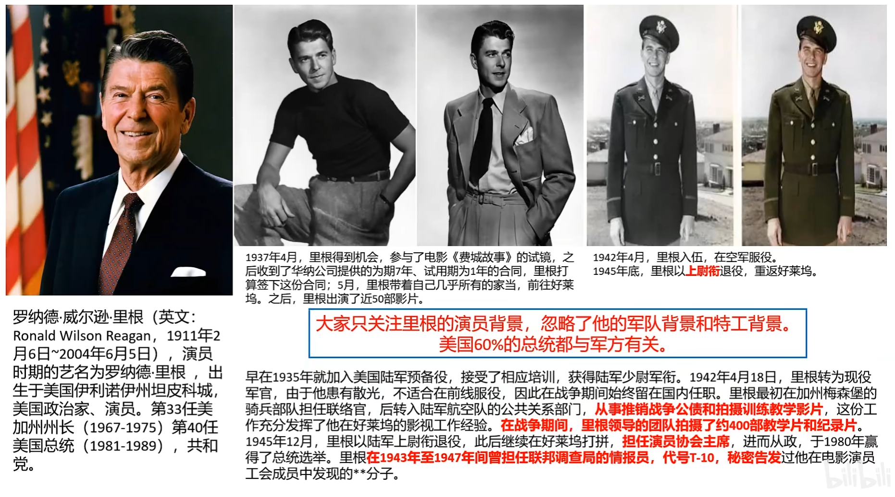

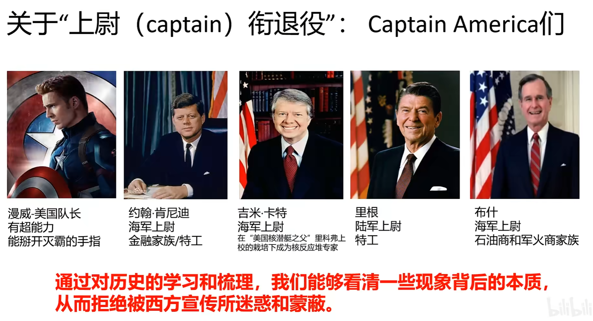

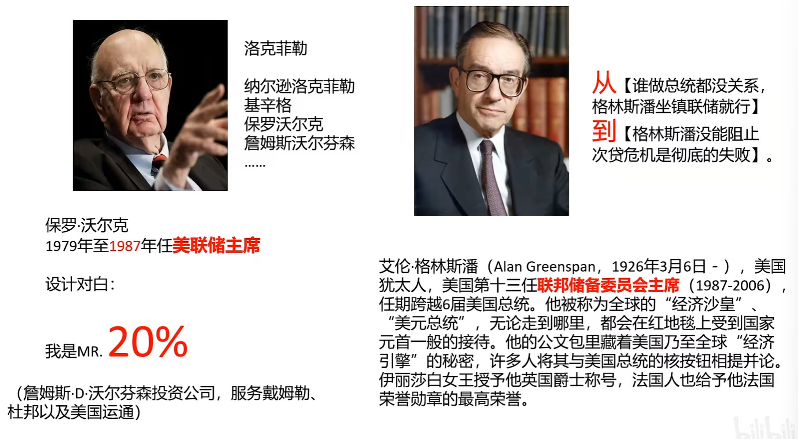

20%利率

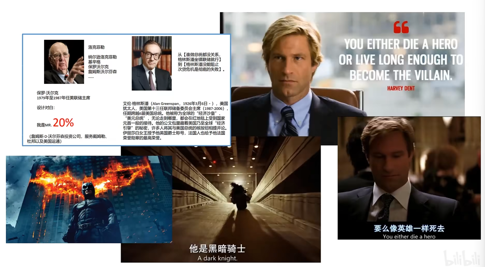

### 保罗沃尔克的史诗级加息为何能推行？

【联想】2021-2022年，美联储想加息抗通胀，但阻力重重……

**STEP1：输出通胀。** 1971年8月美国总统尼克松宣布美元和黄金脱钩，美国不再向任何国家兑换黄金。

**STEP2：美元为锚。** 1973年3月美元指数发布，反映六种货币对美元汇率变化的几何平均加权值，表达美元脱钩黄金后世界物价的变动。

**STEP3：石油危机。** 1973年至1980年两次石油危机依次爆发。美元指数下行15%，油价暴涨10倍。

**STEP4：扭曲财政。** 1973年至1985年前苏联的石油出口外贸占比提升至约80%，占年收入约60%。同时，里根提出“星球大战计划”，与前苏联拼消耗，增大其财政支出。80年代中期，中情局测算，石油价格每下跌1美元，前苏联年度财政收入减少10亿美元。

**STEP5：前苏联解体。** 史诗式加息摧毁了商品牛市，也击垮了前苏联的财政。美国用“自己衰退，拖死对手”的“七伤拳”打败了英国和前苏联。据统计，从1987年到1991年这4年里，至少有78万苏联人移居美国。其中，高级工程师占了18%，有建树的科学家大概700多人。

**1987年**10月16日美股单日下跌17.5%创历史记录

“事实上，利率也再一次开始攀升。日本电话电报公司准备在当年秋天首次公开发行350亿美元股票。受到该预期影响，日本投资者为了认购这些股票开始抛售美国证券，特别是美国国债，巨大的卖压将美国国债利率推到了10%以上。当最安全的投资工具的收益率都如此之高时，很多人开始怀疑是否应该购买平均市盈率高达23倍的股票了”

——《伟大的博弈》第三版P547

两家很有声望的老牌投行倒闭，其他60多家小公司也未能幸免。  
这里面包括了**乔丹·贝尔福特**初出茅庐的公司。

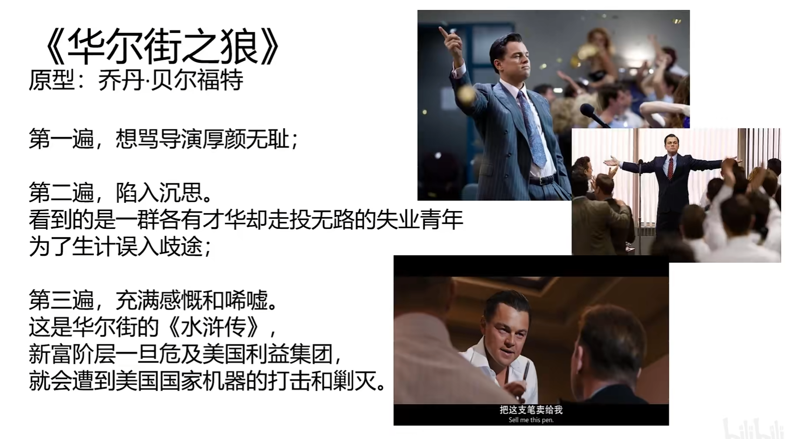

**《华尔街之狼》**  
原型：乔丹·贝尔福特

第一遍，想骂导演厚颜无耻；

第二遍，陷入沉思。  

看到的是一群各有才华却走投无路的失业青年  

为了生计误入歧途；

第三遍，充满感慨和唏嘘。  

这是华尔街的《水浒传》，  
新富阶层一旦危及美国利益集团，  
就会遭到美国国家机器的打击和剿灭。

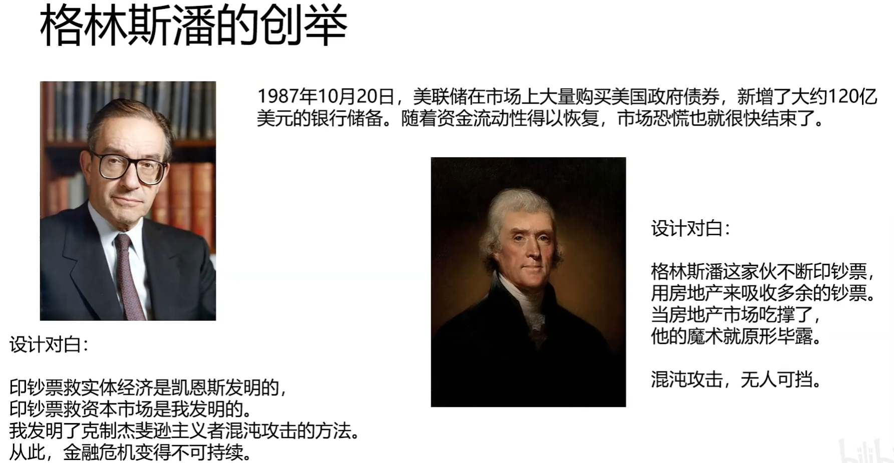

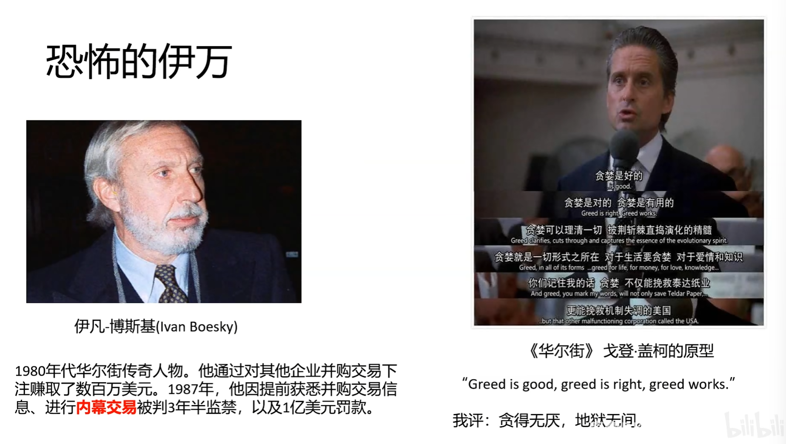

贪得无厌，地狱无间

君子爱财，取之有道

图中的文字内容如下：

---

**2020年被特朗普特赦的男人**  
**垃圾债之王**

迈克尔·米尔肯  
（Michael Milken）

一人建立了整个垃圾债市场。1977年占到垃圾债市场的25%

**设计对白：**  
如果没有我，移动电话今天还在科幻小说里。

**华尔街抵押债券市场被所罗门兄弟和第一波士顿公司牢牢控制，垃圾债入不了他们的法眼。但米尔肯很早就发现，在选择贷款或投资对象时，投资者只关注那些过去表现好的蓝筹公司，而对于那些暂时收益不佳，但潜力巨大的公司却视而不见。通过历史数据的研究，他发现多元化的长期低级别债券投资组合不仅能带来更高的回报，而且风险也不大。受此启发，米尔肯开始了他的垃圾债投资之路。**

当时的垃圾债市场流动性匮乏，但米尔肯对垃圾债发行公司的经营状况、偿债能力等做了大量深入研究，从中挖掘盈利前景，并低价买入。于是，米尔肯转型做垃圾债包销，专门为那些新兴公司甚至高风险公司筹集资金，给垃圾债市场带来流动性，也助推垃圾债成为投资者追逐的投资工具，导致其他投行也争相介入。

**美国垃圾债市场的覆灭**

潮水退去的时候，才知道谁在“果”泳。

- 在经济蓬勃发展时期，垃圾债的高收益很容易让人忘记其“垃圾债”本质，特别是对**城镇银行和储贷机构**来说，他们沉迷于赚取垃圾债的高收益和储蓄低利率之间的利差，认为能躺着赚钱，但忽视了垃圾债的风险。

- 当经济增速开始放缓，过多过滥的垃圾债问题逐步积累爆发，违约率开始急剧上升，最终成为**1987年股灾的导火索之一**。

- 垃圾债泡沫破裂后，**一大批中小银行申请破产，沦为牺牲品**。

- 1989年10月，美国总统老布什签署了“金融机构改革、恢复和强制法案”，彻底重组了储贷机构。为此，美国政府**付出了1660亿美元的救助成本，1800余家储贷机构破产**，数百人认罪获刑，其中就包括米尔肯。

- **备忘：** 上世纪80年代，特朗普迎来了自己无限风光的时代，在纽约搞地产大获成功后转战大西洋赌城，并开下海口称要建全世界最豪华的赌场——“泰姬·马哈尔”。这个赌场光初期投资就高达10亿美元，为此特朗普发行了6.75亿美元，利率达到14%的垃圾债，“泰姬·马哈尔”赌场最终得以建成。如果没有米尔肯一手做大的垃圾债，特朗普的地产大亨梦并不见得会如此顺风顺水。除了特朗普，共和党大佬罗姆尼（Mitt Romney）也蒙受米尔肯的“恩惠”。80年代罗姆尼成立私募公司贝恩资本（Bain Capital）时，米尔肯就给他提供了3亿美元融资。

资本主义的问题在于资本家本身的贪得无厌

## 第二十课：最伟大的作品，永远是下一个局

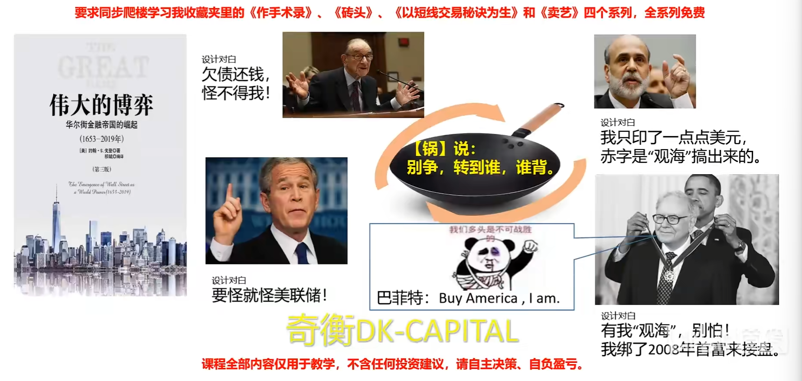

用常识去理解世界，不要被高深的套路套住

### 最伟大的经济陈述

“货币市场基金持有大量雷曼兄弟公司的票据。这件事发生在一夜之间，在3000多万美国民众认为美国货币市场是安全之时，雷曼兄弟公司崩溃了。这引起大量货币市场基金大幅下跌，失去价值。在雷曼兄弟公司倒闭后的最初三天时间里，3.5万亿美元规模的货币市场基金有1750亿美元的资金流出。所有货币市场基金都持有商业票据。通用电气等持有巨额的商业票据。在此之后，美国工业几乎陷入停滞。小布什说：‘如果货币政策不放松，市场将会崩溃’——我相信这是所有时代最伟大的经济陈述。这就是为什么他支持保尔森和伯南克。

2008年9月，我们遇到了真正的深渊。企业继续停留在商业票据市场。如果保尔森和伯南克没有干预，市场可能已经完了。伯克希尔哈撒韦总是预留200亿美元以上的现金。这听起来很疯狂，从来不需要这样的事情，但如果有一天，也许是在未来100年，当世界再次停止，我们将做好准备。总会有一些事件发生，也可能就是在明天。在那个时候，你需要的是现金。现金到时就像是氧气。”

——沃伦·巴菲特

**钱仓滚存**

**2008年华尔街究竟发生了什么？一个横跨百年的、“居者有其屋”的美国梦，到了2008年变成大型翻车现场。**

击鼓传花闭环：

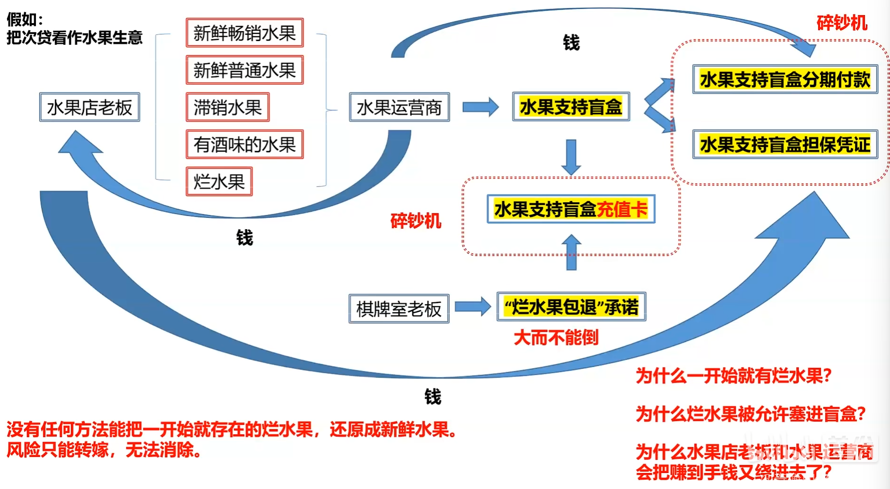

风险是本身没钱还的人参与了信贷。

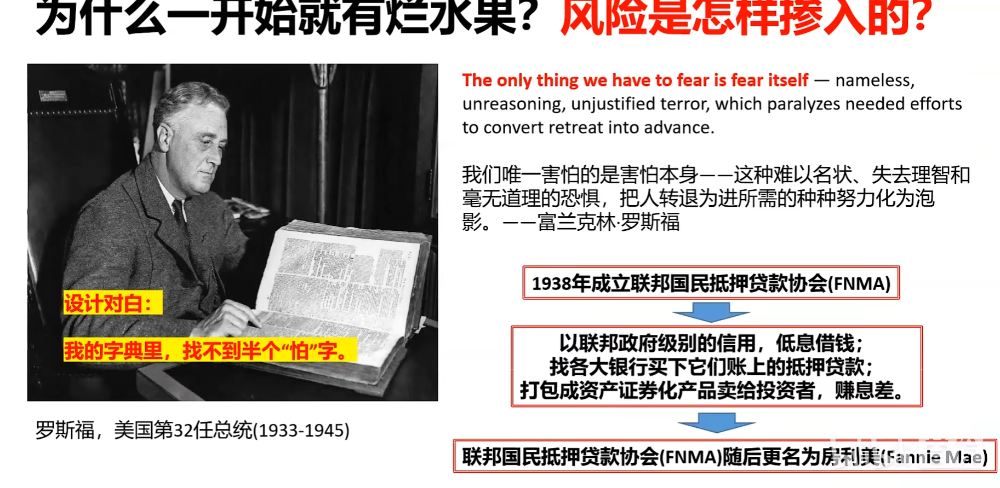
 
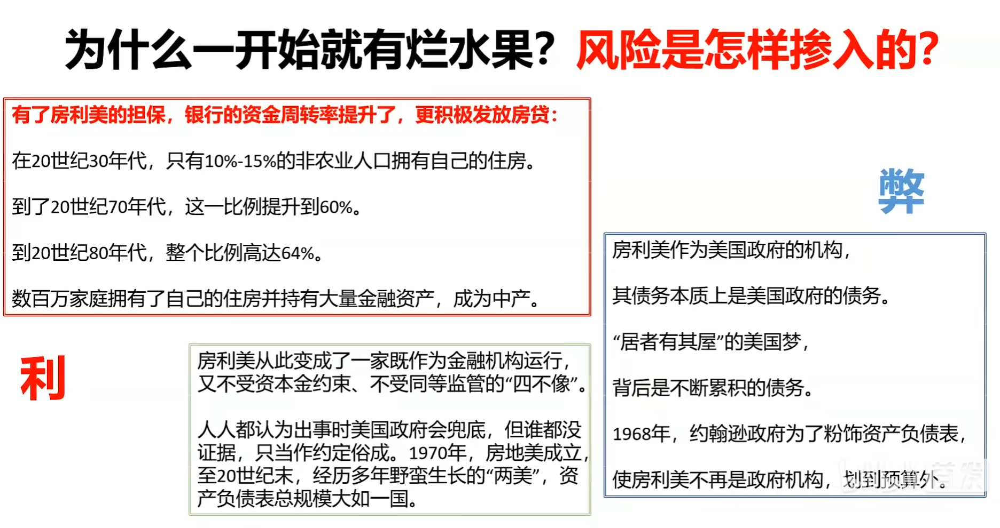

**为什么烂水果被允许塞进盲盒？**

到了20世纪80年代，美国家庭拥有住房比例为64%。  
房利美和房地美野蛮生长的空间已经所剩无几。剩下：

（1）收入不稳定、信用不足的群体；  
（2）只愿意租房的群体；  
（3）频繁迁徙而不得不租房的家庭。

**赚钞票的空间没了，赚选票的空间仍在。**

房利美和房地美被民主党的职业政客把控。  
监管“两房”的议员经常获得“两房”的政治捐赠。

为了选票，  
“两房”开始向银行购买有问题的抵押贷款，  
从而帮助信用存疑的人获得房贷。  
从此，“两房”的资本金越来越紧张。  
金融杠杆放大到40倍。

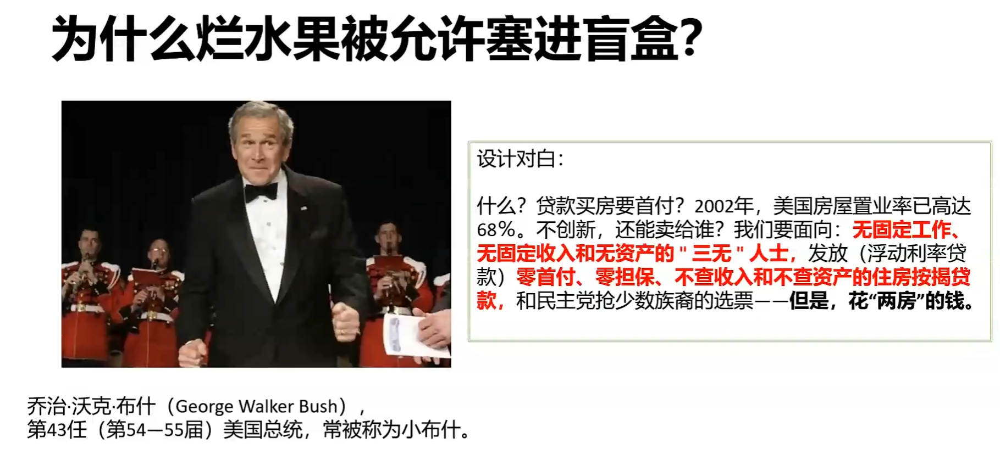

**浮动利率贷款：因美国加息，贷款人还不上月供产生违约**

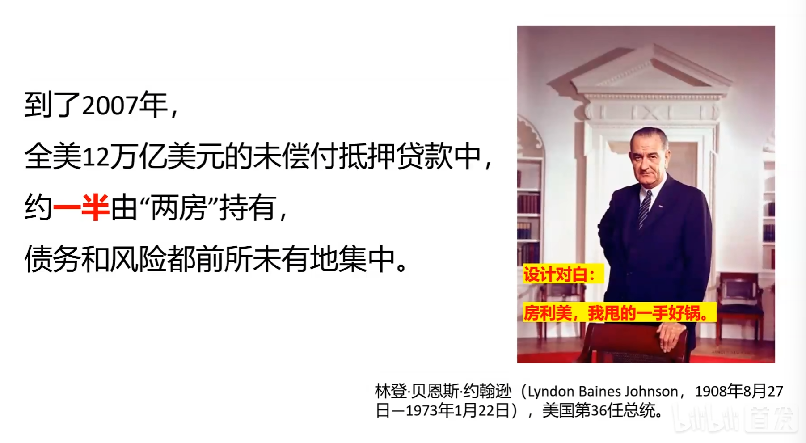

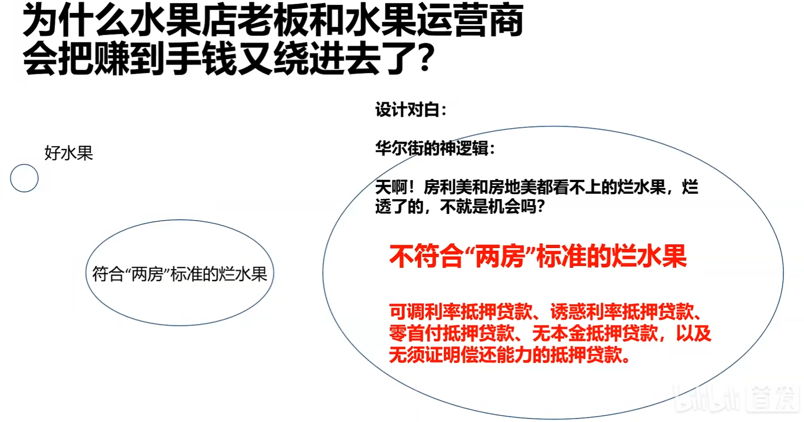

华尔街分析师的报告不完全是独立分析的报告，而是配合老板为了推动某些生意而写出来的

垃圾贷款终归是垃圾

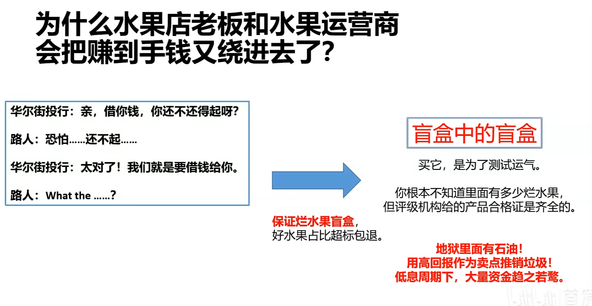

需要独立判断一门生意是否有现金流产生

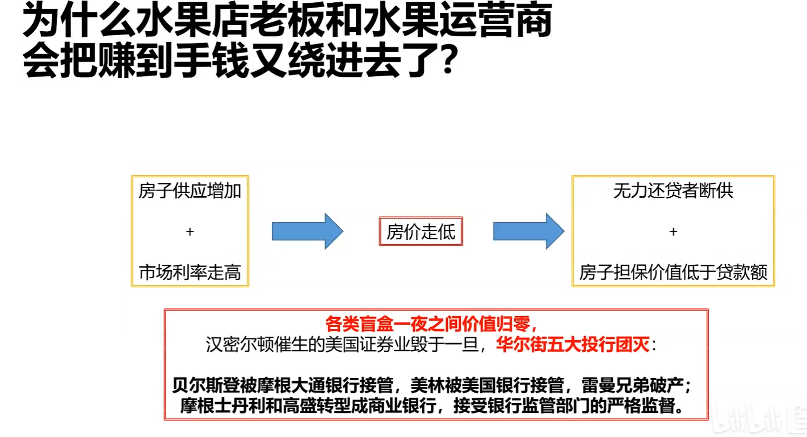

房子同时失去担保价值和现金流->盲盒变成垃圾

成为银行才能在美联储的贴现窗口借到钱

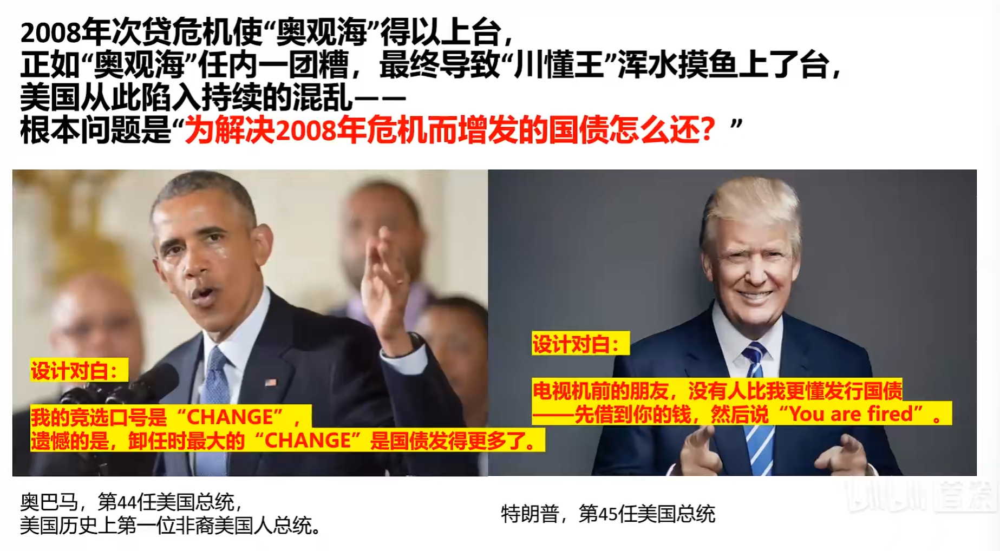

## 总结

只要债务存续，风险就未被转嫁，伟大的博弈就会一直击鼓传花进行下去。
