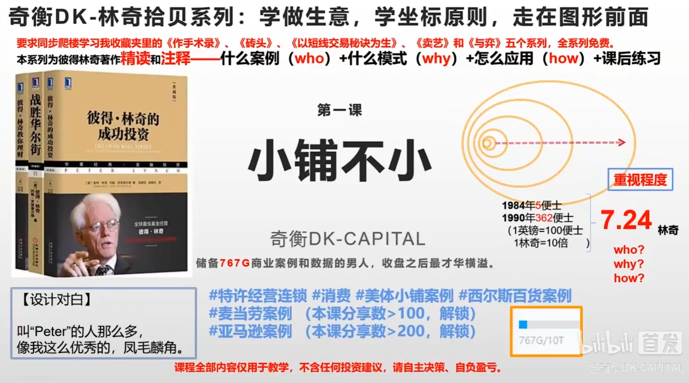

# 林奇识贝

## 第一课：小铺不小

坚持学习知识不容易被忽悠

值价校验，坐标原则

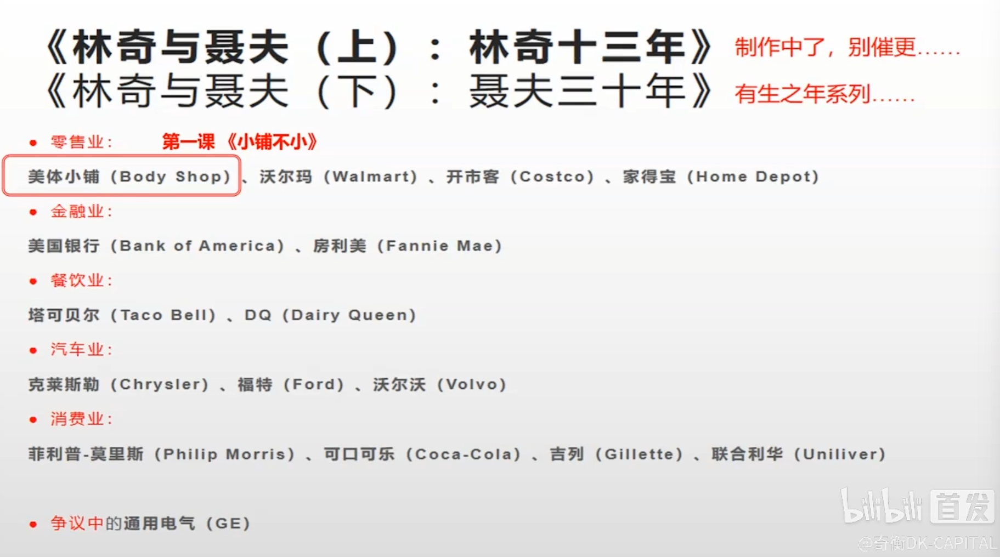

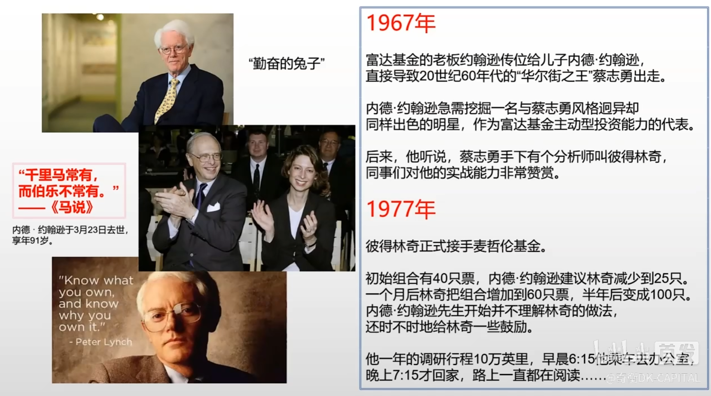

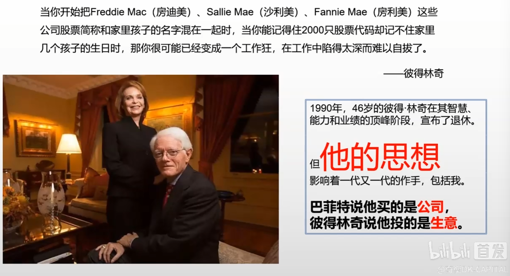

彼得林奇调研路程一年10万英里

### 调研什么？生意

商业竞争过程是“逼死你死”

第一类：扩张--走别人的路，让别人无路可走

常见于消费类行业（快鱼吃慢鱼：持续的激烈竞争会导致低毛利，后下来的唯一方法是抢占对手的市场份额。）

常见的扩张方式是特许连锁

### 特许连锁

特许连锁，又称特许经营连锁，是指特许者将自己所拥有的商标、商号、产品、专利和专有技术、经营模式等以特许经营合同的形式授予被特许者使用，被特许者按合同规定，在特许者统一的业务模式下从事经营活动，并向特许者支付相应的费用。

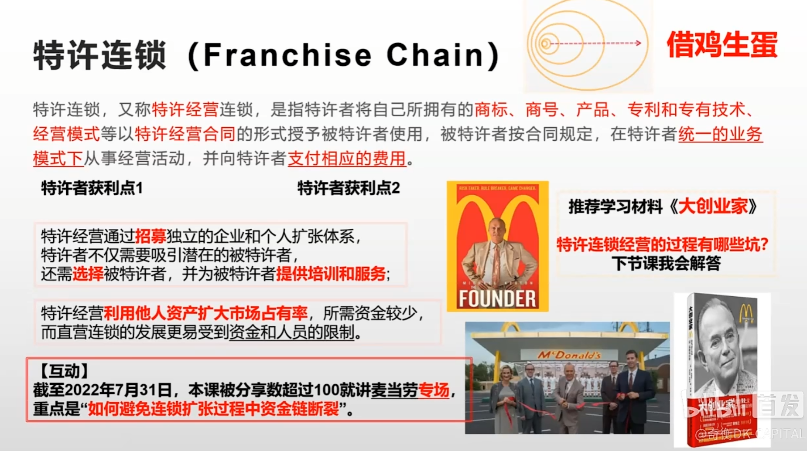

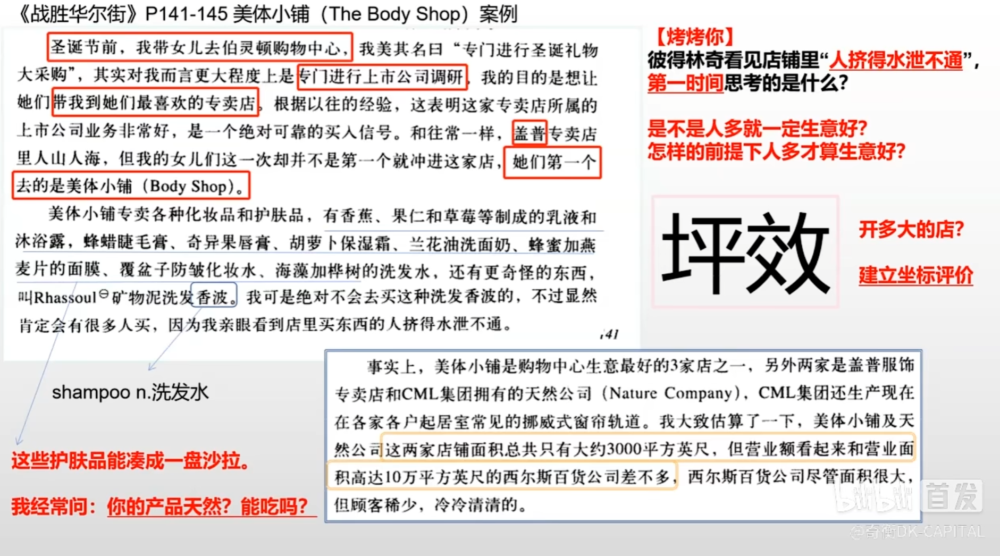

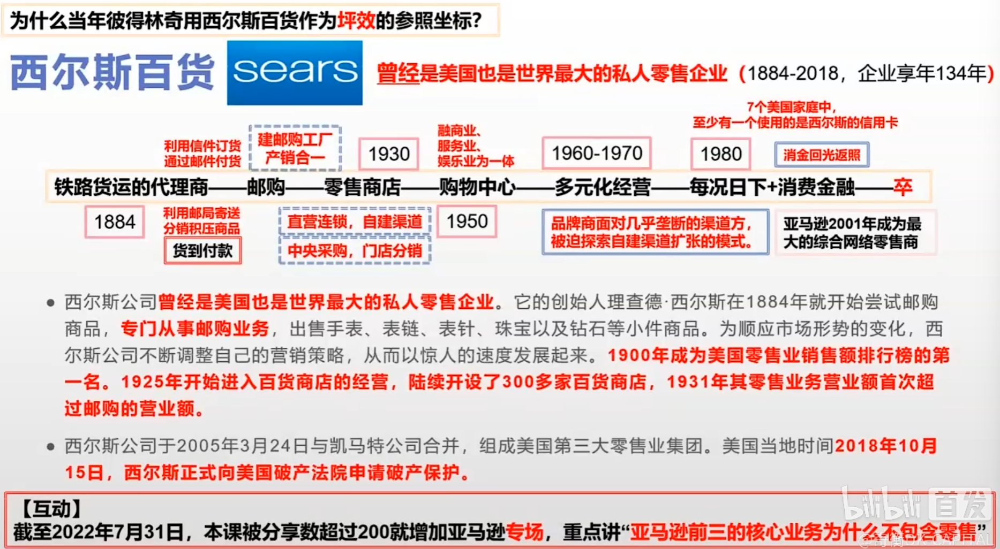

**坪效=年营业额/门店营业面积**

以营业额倒退经营面积，从而决定/判断店面合理大小

坪效指标是**小铺经营**的理论依据：更小的营业面积，更多的营业额产出。

目前最常见的模式是**O2O**--线下（offline）小铺，线上（online）获客，实现**坪效最大化**

无奸不商：信息不对称

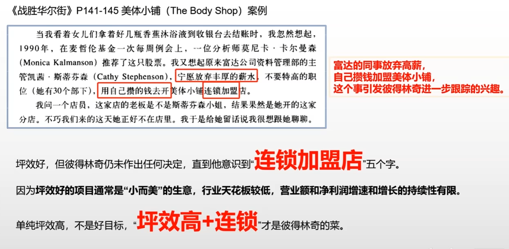

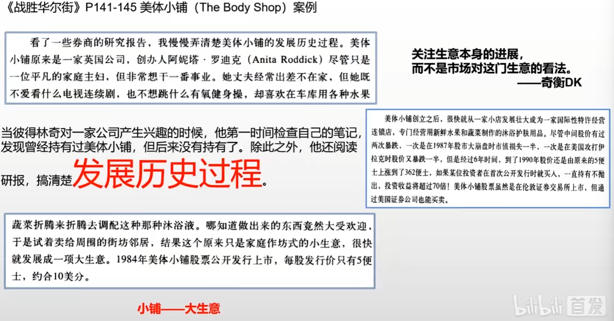

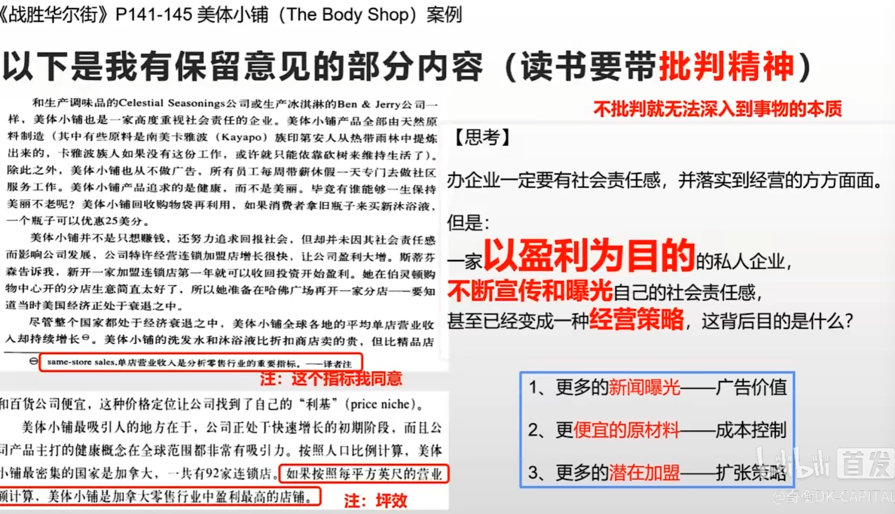

对于消费品来说，供应链是很重要的

### 美体小铺经营策略的来历

- 创始人罗迪克姐姐33岁从银行贷款4000英镑，建了一条25种护肤和护发化妆品生产线。
- 她从当地一个草药医生处批发来一些原料后，开始在自家厨房倒腾第一批产品。
- 为了节省成本，她选择了最便宜的瓶子——塑料瓶。并且，用手写标签介绍产品原料和性能。
- 她花25美元请了当地一个学艺术的学生为她设计公司标志。然后，想出来“BODY SHOP”的名字
- 为了省租金，她第一家店开在一家棺材店附近，结果……
- “BODY SHOP”尽管想表达“身体护理”的意思，但邻居们却联想到另一层含义——SHI体店
- 结果，邻居们起诉罗迪克姐姐，要求店铺改名，而罗迪克姐姐把这事曝光给了当地报纸。
- 由于猎奇心态，BODY SHOP一夜之间成为当地关注的焦点，第一批顾客和种子用户到手。

创业初期的“神操作”还有——在街上撒草莓汁，一路撒到自己店门口来获客。

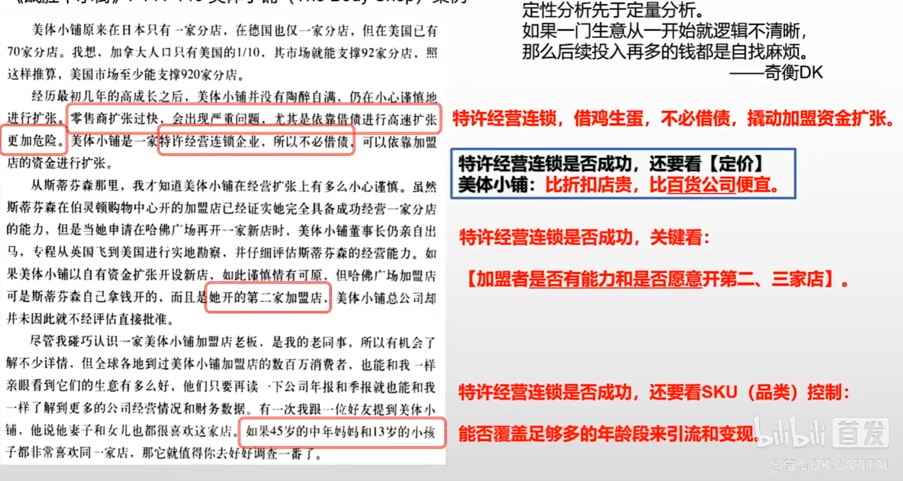

特许经营连锁，借鸡生蛋，不必借债，撬动加盟资金扩张。

特许经营连锁是否成功，关键看：

【加盟者是否有能力和意愿开第二、三家店】

好的连锁品牌起码有1/3是加盟者开第二家店。

特许经营连锁是否成功，还要看SKU（品类）控制：能否覆盖足够多的年龄段来引流和变现。

流量产品+高毛利产品

特许经营连锁是否成功，还要看定价

美体小铺：比折扣店贵，比百货公司便宜

### 最后才是估值，不要还没搞懂生意本身，就满嘴市盈率

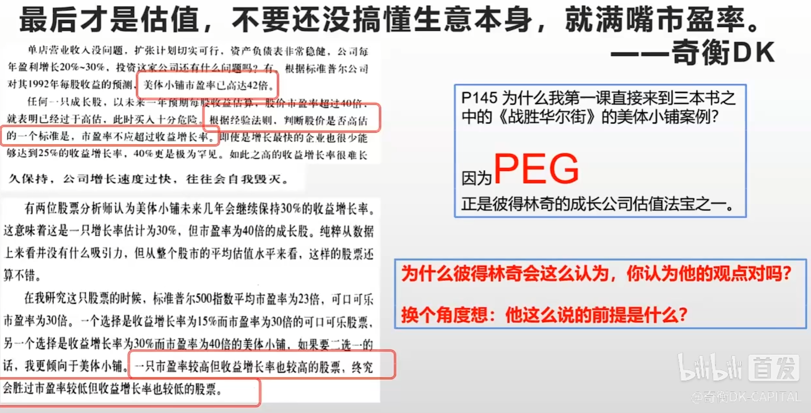

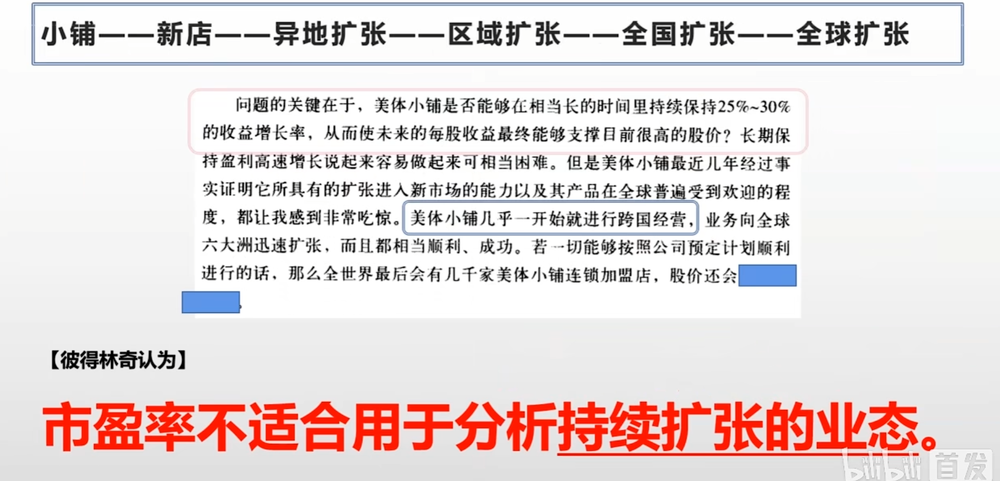

彼得林奇认为：

**市盈率不适合用于分析持续扩张的业态**

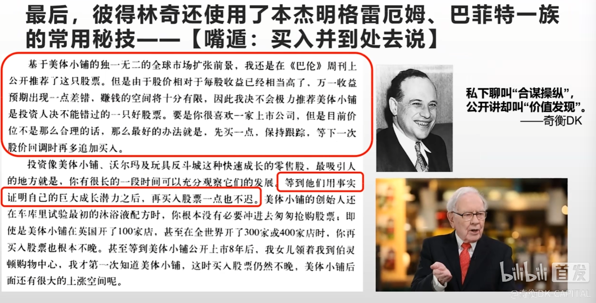

买入并到处说

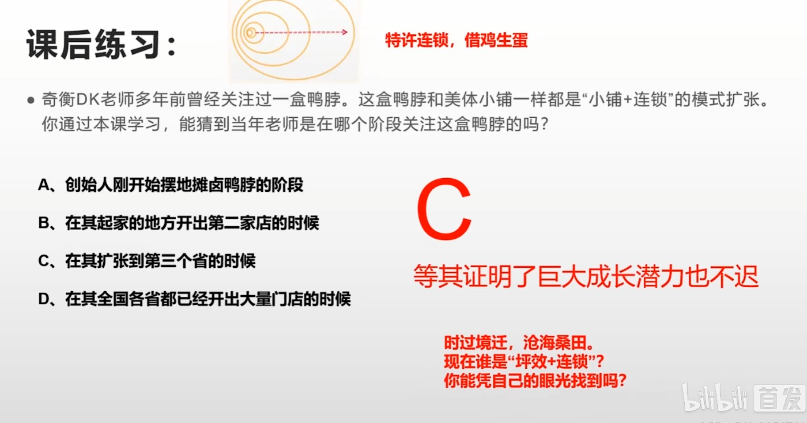

等其证明了巨大成长潜力也不迟
 
## 案例一：麦当劳做的是什么生意

### 表面上看，麦当劳的商业模式有

1. 卖产品赚差价：把门店餐饮的利润大部分都分给加盟商，总部这部分收入仅占总营收的10%
2. 供应链收入，赚集中采购的差价：门店的食材由总部统一供应
3. 卖加盟权赚加盟费：一次性收费+持续性抽成，50%
4. 融资性收入：商业地产业主或二房东，贡献总部利润40%

> 如何研究“双主业/多主业”的公司

利润分配

企业真正的护城河，是商业模式显而易见，但盈利模式让人捉摸不透，即使看懂了也无法复制。

1. 如果说麦当劳卖汉堡不赚钱，那为什么想加盟的人还那么多？
2. 如果说麦当劳是做地产的，那么为什么它的三十年总市值走势几乎不受利率周期影响？
3. 为什么要把剃须刀改成电吹风的样子？

### 还原麦当劳的创业故事

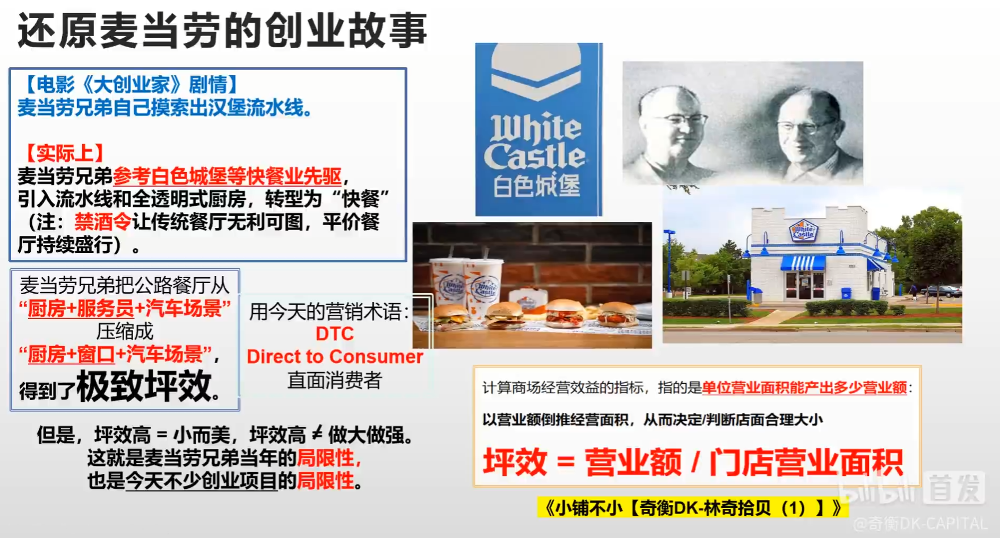

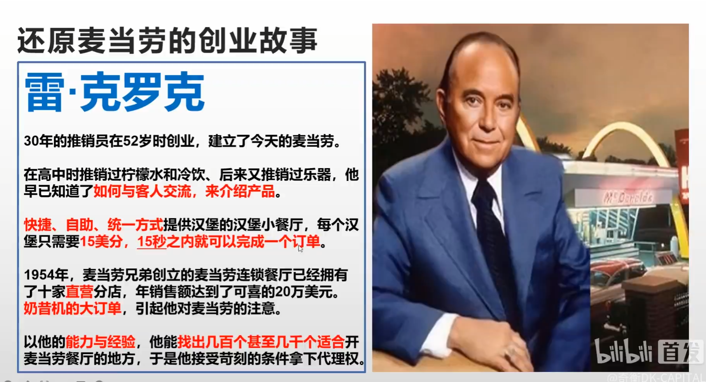

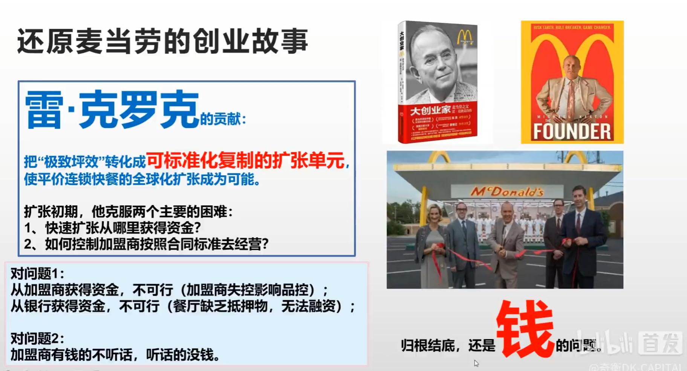

图中的文字内容是：
好项目 ≠ 好生意
薄利多销 ≠ 好盈利模式
**对品牌来说**
一个薄利多销的产品，
主要属性是流量产品，
主要功能是获客引流。
——奇衡DK

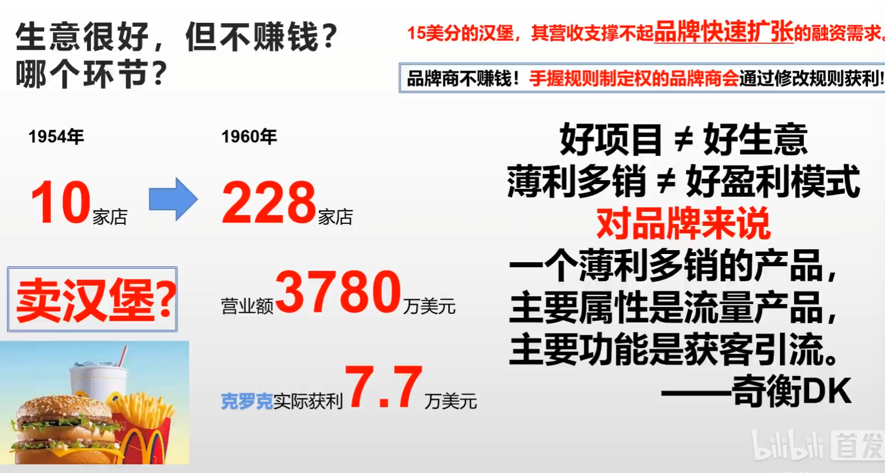

企业家精神：不断创新，绕过限制

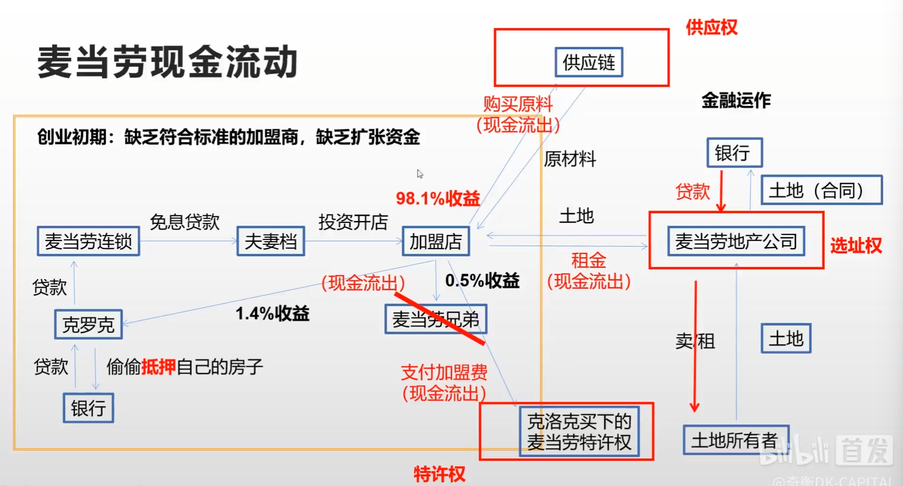

加盟店一定要租，租金流出给麦当劳地产公司

净利润的本质是老板愿意分红的额度区间。

### 1961年买断麦当劳特许经营权，其实是买下了游戏规则制定权

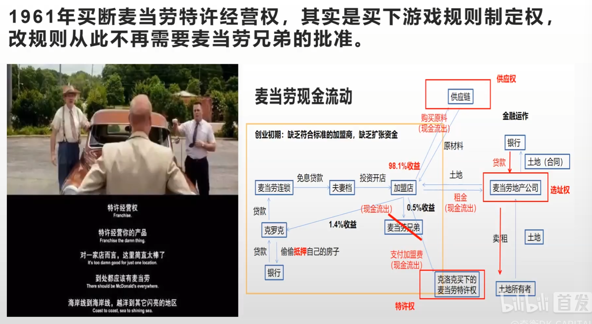

创业第一步考虑的是游戏规则，第二步考虑的是如何赚钱。

麦当劳公司的盈利模式，
是通过**卖授权**来分享**店群**的**高利润**。

供应原料也好，收加盟费也好，做二房东也好，
能**从开店者手中持续分到钱**的前提，
就是开店者真金白银地赚到钱。

这是因为麦当劳是**中央厨房**和**预制菜**的先驱。
通过中央厨房和预制菜技术提升单店盈利，吸引开店，
在通过特许经营权下的各种操作分享店群的盈利。
实现你开店淘金我卖铲卖水，羊毛出在羊身上。

扩张一开始要让利

卖汉堡很赚钱，不能让消费者知道汉堡毛利很高

麦当劳卖汉堡很赚钱，才会有人愿意加盟开店。

麦当劳不是做地产的，所以不收利率周期影响。

为什么要把剃须刀改装成电吹风的样子？因为卖汉堡很赚钱

## 案例二：亚马逊

模式成功干直营，竞争激烈的时候干连锁加盟

亚马逊：技术进步（扩张租服务器）对传统线下商业模式（线下租店铺）的冲击

大众书籍卷价格，小众书籍赚溢价

>亚马逊的三大基石：Prime、Markplace和AWS
>-- 贝索斯

### 为什么当年彼得林奇用西尔斯百货作为坪效的参考标准？

从垂直电商到综合电商

1995年目标“地球上最大的书店” -> 2000年目标“地球上最大的网络零售商”

企业做大做强，是分钱分对了。-- 奇衡DK

经营者考虑每一笔钱的投入，是否能带来更大的回报。

所以给员工的激励，不是因为你多么努力工作，而是因为你帮公司挣了多少钱。

佣金提成的本质是效果广告

销售的两个作用：

1. 挖掘新客户能力强
2. 让老客户复购

销售佣金越高，毛利率越高，毛利越高，吸引的销售人员越多

### Prime会员的收费基石

 
规模经济也指规模经济效益，即

通过一定的经济规模形成的**产业链的完整性、资源配置与再生效率的提高**带来的企业**边际效益的增加**

### 在亚马逊，一切都利用高性能的技术进行衡量和优化

电商=应用+搜索+广告+支付+物流+互联

- 应用：虚拟货架和广告位
- 搜索：替代报纸
- 广告：亚马逊是全球最大广告主，撬动更多广告收入，广告位分销
- 支付：Amazon Pay，从支付中获取客户支付信息，并卖给客户
- 物流：亚马逊物流，仓库和运力分销
- 互联：会员（运费分销）+AWS，运费和算力分销

客户留存是最重要的，亚马逊是一笔投入分笔收益的生意

在电商与实体之间的市场空白，建基础设施做包租公

## 第二课 沃尔玛折扣店

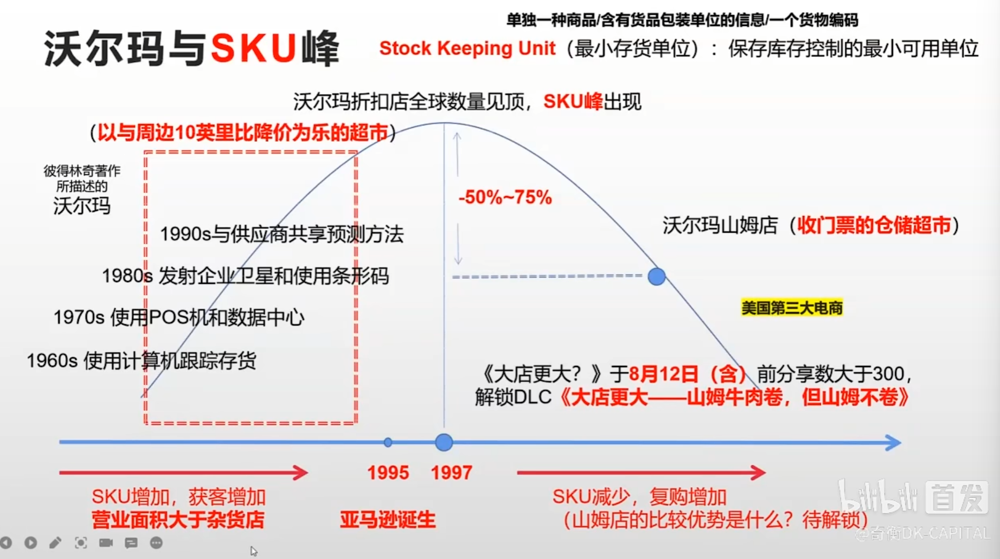

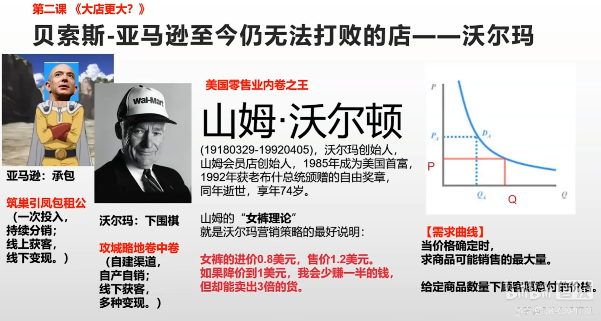

女裤理论就是微观经济学里面的需求曲线

创业需要研究定价策略，定价策略的最终目的是获得消费者剩余

沃尔玛折扣店：欧美商界眼中的“蝗虫”

沃尔玛折扣店周围10英里（愿意开车去购物的合理距离）之内的小商场、小超市统统都会倒闭，就和蝗虫过境一样。

根据早前的统计，在美国165个城市中，沃尔玛进入后整个地区商品价格会下降1.5%到3%，物价下降最高能达到7%到13%

每开一家沃尔玛，该地区5年内就能增加50个就业岗位，但是平均会有4家其他店铺消失

蝗虫线

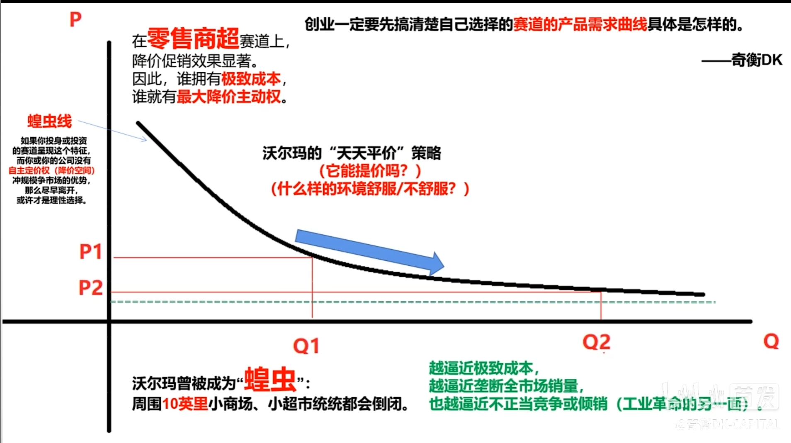

创业一定要先搞清楚自己选择的赛道的产品需求曲线是什么样子的
 
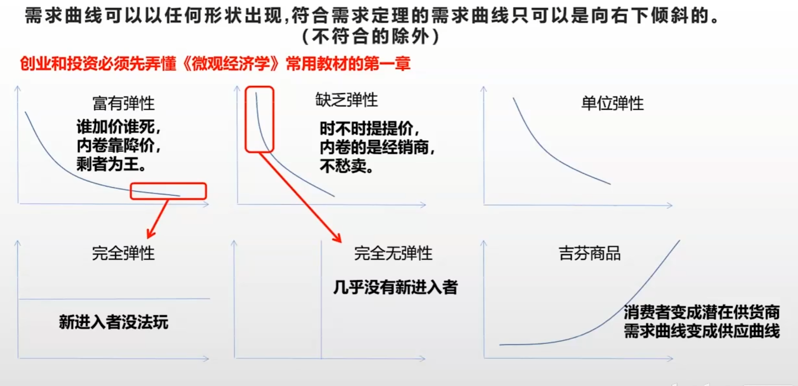

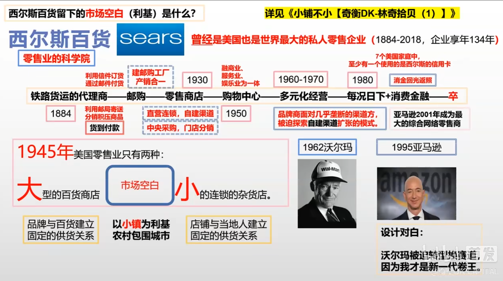

利基：

- 指针对企业的优势细分出来的市场，这个市场不大，而且没有得到令人满意的服务。产品推进这个市场，有盈利的基础。在这里特指，针对性、专业性很强的产品
- 这就是现在的垂直市场，垂直市场是新进入者切入零售行业的入口，但死守垂直市场的零售、品牌商，要么被收购，要么死路一条

从垂直市场获得利基是一种“占山为王”的策略，但如果不打算直取宋都，那么只有被招安或者被剿灭的结局。

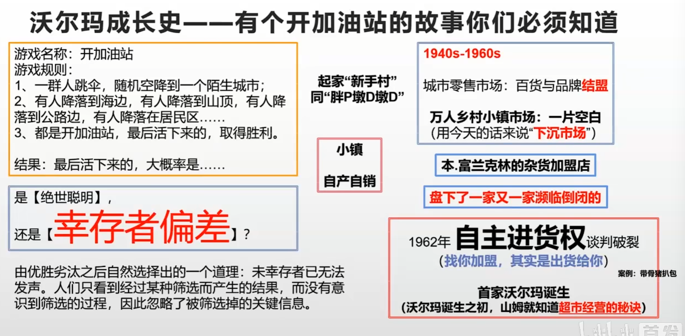

找你加盟其实是出货给你

**相对垄断，自产自销**

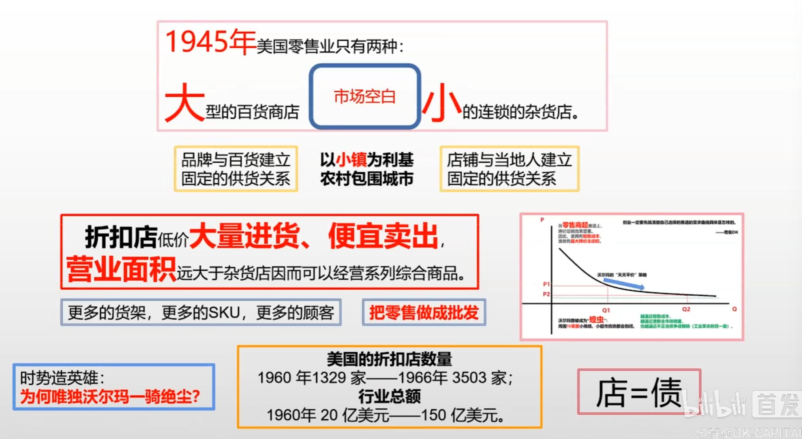

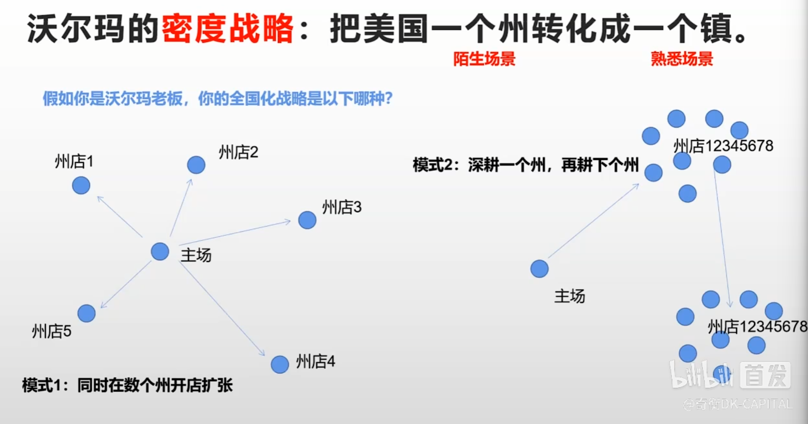

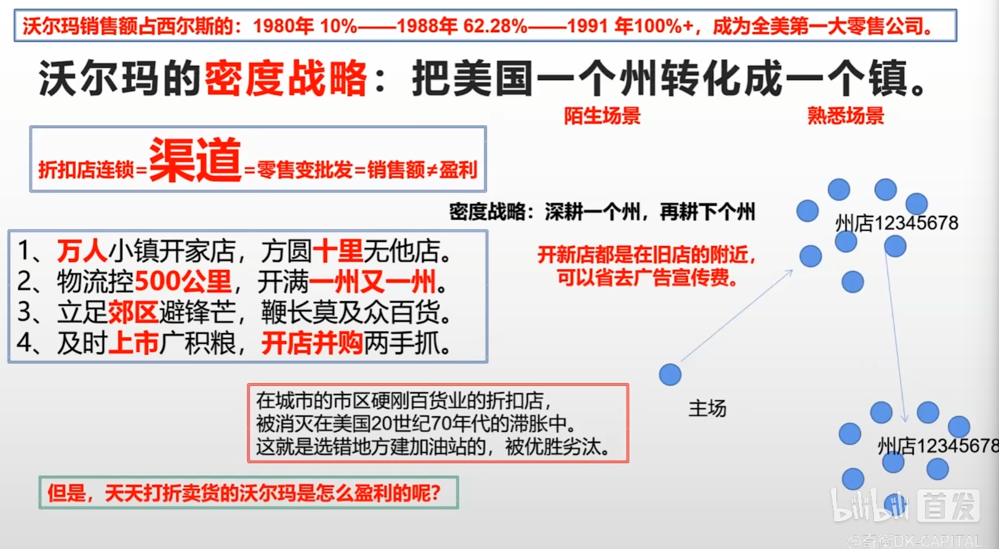

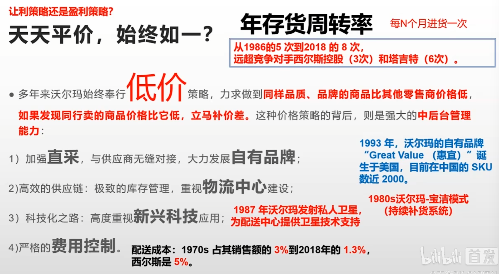

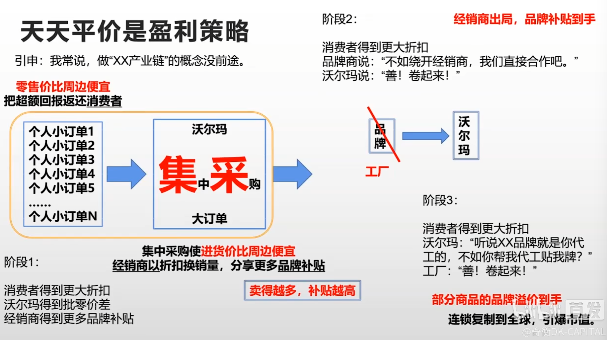

盈利靠业态，竞争靠品控

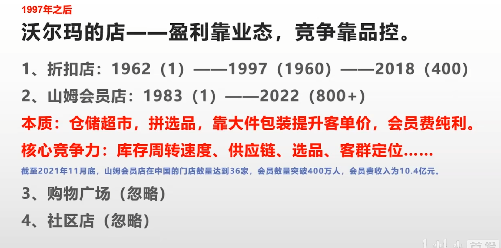

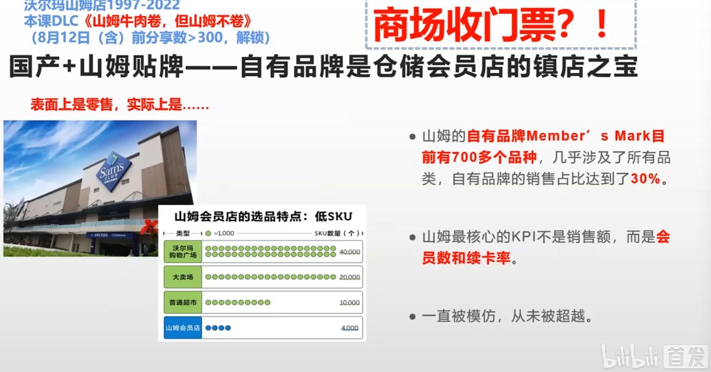

纯粹做渠道、不自产自销的零售连锁，实在想象不出来如何实现盈利

## 案例三：山姆会员店

1. 蝗虫线是一把双刃剑，压价可以逼近垄断态势，但提价会导致销量骤降
2. 如果销量骤降，那么沃尔玛的采购议价力将大降，极致成本将不复存在
3. 如果极致成本不复存在，整个沃尔玛的利基崩塌。

沃尔玛连锁折扣店业态的命门：通货膨胀

连锁超市死于持续的通货膨胀：

因为它无法提价，但供应商开始提价时，它又被迫提价

在持续通胀环境下，折扣店开着开着就没了。

谁长期持有/经营，谁倒霉。

要么保持客群而不提价，卖货亏差价。

要么保持利润而提价，逐渐流失客群

### 消费者剩余

消费者消费一定数量的某种商品愿意支付的最高价格（客单价/购买金额，与预算有关系）与这些商品的实际市场价格之间的差额。
马歇尔从边际效用价值论演绎出消费者剩余的概念。

你口袋里有10块，我让你去我的A店

他口袋里有100块，我让你去我的B店

同一个商品在A店和B店的单价（每克售价）相同，
在A店我按500克的形态和包装卖（偏零售），在B店我按2000克的形态和包装卖（偏批发）。

你和他都觉得超值（单价相同是关键），但他比你买的多（因为他有钱）。

最后你和他都花光兜里的钱出门

这个模式解决了：

你和他出现在同一个店，
相同价格，你和他都觉得便宜，我亏了；

相同价格，你觉得贵，他觉得便宜，我是去你；

相同价格，你和他都觉得贵，我完蛋。

**但是新的问题产生了**

你和他为什么那么听我话：

你去A店，他去B店？

他去了B店，为什么买更多？

超值=买家秀和卖家秀差异小

会员制零售，卖的不是商品，而是一种超值的感觉

模式1：价廉物美（沃尔玛折扣店：普罗大众）

模式2：物超所值（沃尔玛山姆店：中产阶层）

沃尔玛山姆店准确地把握了中产阶层的定位。

中产阶层：有车有房，但有钱舍不得花的人群。

为了提高客单价，获取中产阶层的消费者剩余。

### 差异化定价能获取消费者剩余，但没说实际上怎么做。

从**会员费定价博弈**到**消费者剩余顺利**获取

#### 会员费支付前博弈

为什么他去了B店，买更多？

因为支付了会员费。

个人会员：260元

卓越会员：680元

会员年费的本质是一年内必须消费品支出预算的利息。

因为你的消费预算就是**你愿意放弃或不得不放弃利息**的一笔**储蓄**，所以会员**年费定价**可衡量**年消费力**。

假设2%利息，花1万元交200会员费=（放弃）存1万元和200元利息

假设市场无风险利率2%：未考虑运费，因为运费是购买的会员权益，代价是放弃选择其他店消费

个人会员一年内必需消费品支出预算是260/2%=13,000元（每月约1,100元）

卓越会员一年内必需消费品支出预算是680/2%=34,000元（每月约2,600元）

#### 为什么交了会员年费的人不狠狠花钱会觉得亏了？

A手持储蓄1.3万元，支付了会员年费260元，产生了成本（2%）

理性人视为沉没成本，大众视为必须赚回来的前期投入

本来就要花这笔钱，但是山姆会员店把他限制在山姆会员店花钱

没有好的自有品牌产品，会员店不可能开的起来

会员制零售竞争小

沃尔玛：

用供应链在低通胀领域采购再卖到高通胀的地方，赚差价

## 第三课：开市客会员店

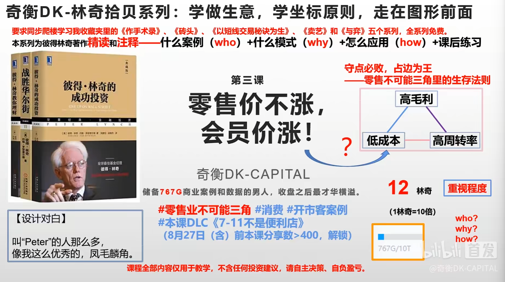

Costco=4000sku + 14%毛利 + 服务中产阶层
 
商家的所有宣传话语都是营销策略

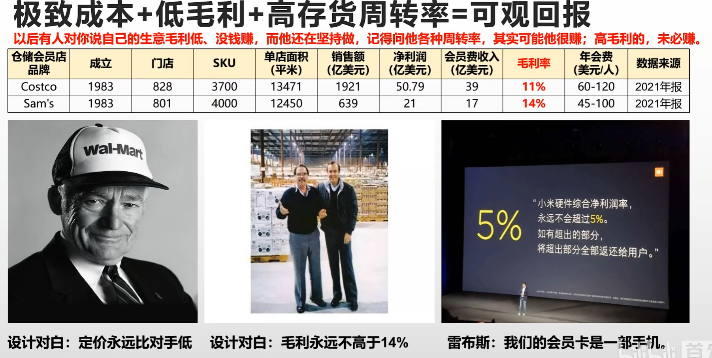

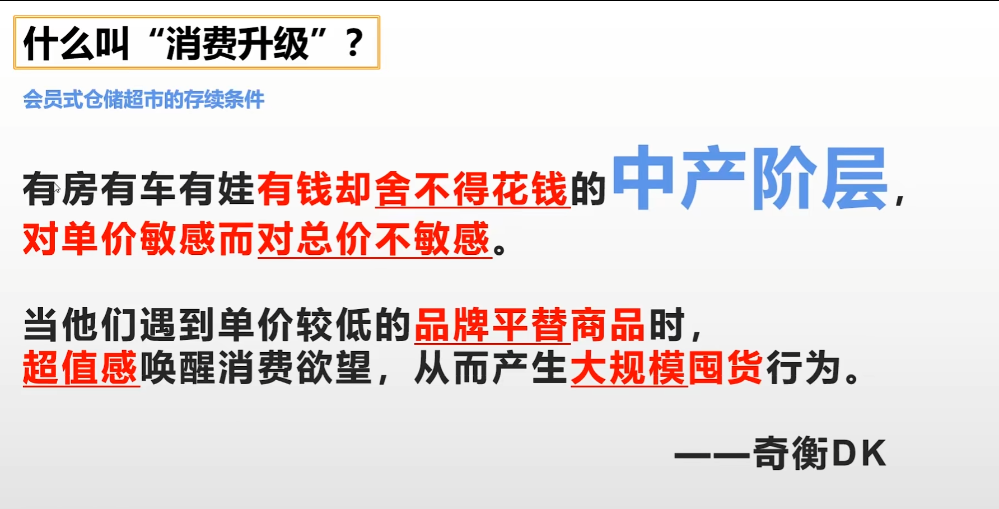

有房有车有娃有钱却**不舍得花钱**（主要以固定资产形式持有、具备信用融资的条件，但缺乏稳定的、可预测的净现金流）的中产阶层，对单价敏感而对总价不敏感（预算内消费需求未满足）。

当他们遇到单价较低的**品牌平替**（与知名的、可比的品牌商品质量相同或相近）商品时，**超值感**（去除了广告费和渠道费的零售价、折扣等于消费者补贴）唤醒消费欲望，从而产生**大规模**（现场“买买买”的羊群效应，促使争相囤货，线上买比较理性）囤货行为。

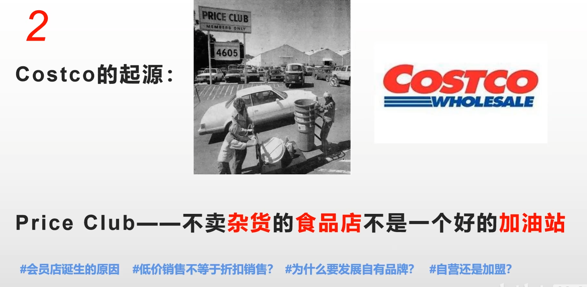

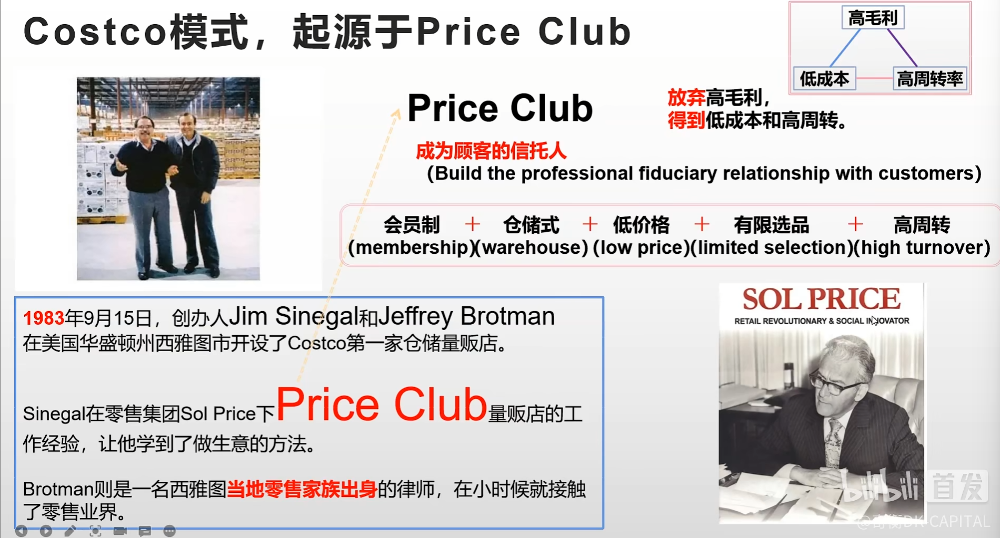

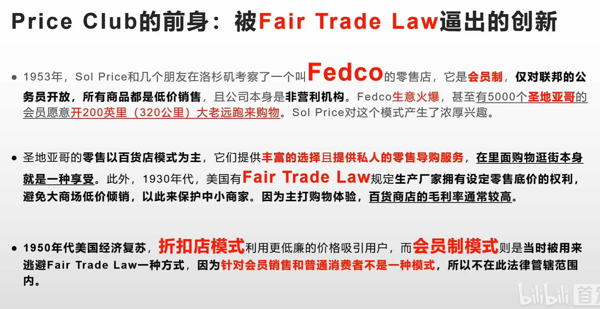

会员制一开始是为了绕开法律限制，一开始定价很低

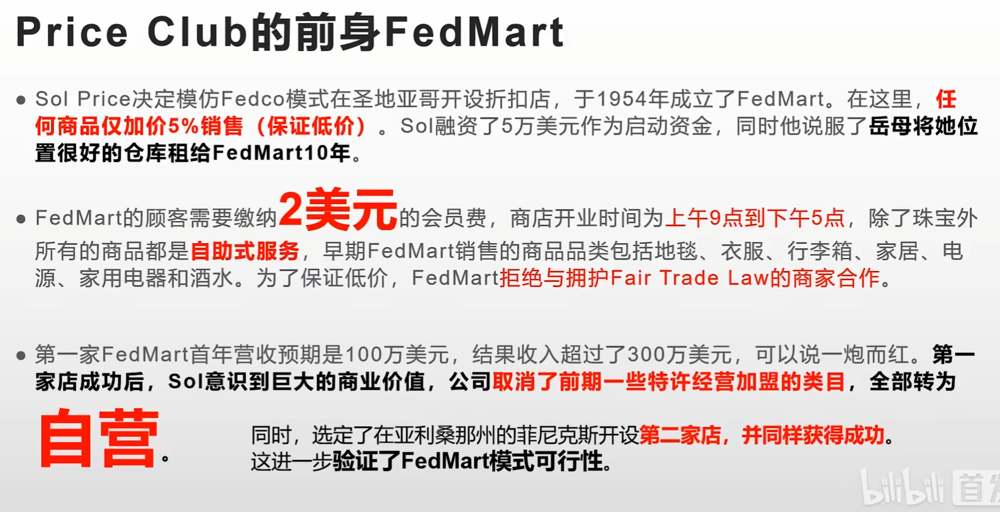

好赚钱的生意一般不会加盟

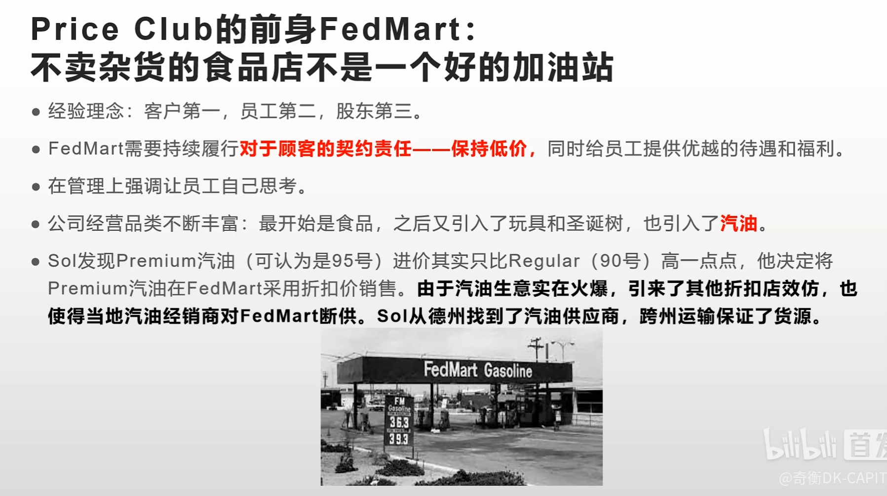

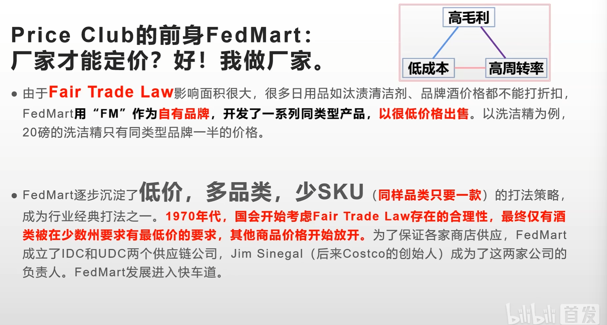

做零售最重要的是供应链

### 大家打价格战，我不跟

- Sol Price认为：
- 折扣店是对常规零售价打折来促销，FedMart的低毛利不等于打折促销。
- 反对低于成本销售商品，因为这必须在其他商品上提高价格来弥补损失，客户最总会感受到“羊毛出在羊身上”
- Sol的对策：减少SKU+加大Size包装=提升坪效
- 与会员客户博弈：大Size代表商品低单位价格但高总价，引导会员为得到更低单价而提前支付未来消费预算。
- 与员工的博弈：员工的成本和福利占零售业80%的成本，而低SKU则能够有效降低员工的负担和公司运营成本。

### Price Club的诞生：塞翁失马，焉知非福
- 1960年代美国折扣店全面兴起，竞争激烈下FedMart开始经营承压。
- Kmart折扣店大规模进行广告投放和低于成本价销售某些商品来吸引流量，并进行激进的扩张。
- 1963年，FedMart取消了2美元的会员费，结果客流并没有显著上升。
- 1964年，FedMart开始放开加盟制度，加盟店可以自主采购商品，但主要还是从FedMart旗下供应链公司采购，且加盟店有权自主确定商品售价，但FedMart向他们施压保证与自营店价格相同。
- FedMart的经营理念是先进的，但一系列的窘境让Sol Price萌生了出售FedMart的想法。
- Mann的公司购买了FedMart60%的股份，半年后把60岁的Sol Price踢出局。
- 成立了Price Company。他们把目光投入了FedMart旗下的供应链公司IDC，决定尝试一个仓储式生意，以小B作为目标用户，以更低廉价格，革新传统的供应链模式（送到小B店里）。他们为此进行一轮潜在用户调研，结果不尽如人意，大部分小商户不愿意因为低价而换取方便的配送服务，还有一小部分人对这种模式根本不感兴趣。

### Price Club的诞生：双重会员结构
——本来只想做个付费的淘特，结果做成了开市客。

- Sol Price依然决定尝试【成为供货商】。
- 因为Price家族在当地已经积累了相当口碑，并加入Club，公司名称用了家族名字。基于会员制模式Price Club应运而生，**会员费**为25美元，高于2美元的会员费让Price Club能够进一步降低商品的售价。
- 1976年，第一家Price Club在圣地亚哥开业，一开始并不成功，第一周的销售额仅3万美元。
- 圣地亚哥信用卡联盟找到公司，希望将Price Club的销售开放给信用卡会员。Sol和管理团队商量后觉得可行，但还需要考虑原来B端消费者顾虑，不想和C端消费者一个价格拿到商品。于是产生了一个折中方案：B端还是购买25美元会员，而C端会员则免费购物，但需要多付5%的溢价。此后，Price Club便成为双重会员结构——B端25美元会员，C端免费，而这两种会员的平衡点则是年销售500美元（=25/5%）。到11月，门店周销售额达到15万美元，会员规模突破13000，B端会员突破1500，生意基本进入正轨。

### Price Club的诞生：启发了整个美国零售业
- Price Club加入了“网红食品”热狗（Costco网红热狗的来历），售价1.5美元，至今没涨价。
- 1978年，Home Depot的创始人Bernard Marcus参观了Price Club深受启发，并于1979年借鉴仓储模式开设第一家专注于家庭硬件销售Home Depot。
- 此外，1982年一个西雅图的商人Bernie Brotman找到Price Club想合作在西雅图开一家店，公司高管讨论后不愿意放开加盟，且公司可以自己进入西雅图市场于是拒绝了服务，后来Brotman找到了Jim Sinegal创立了Costco，1983年在西雅图开设了第一家会员式仓储店。
- 此外，1982年，借鉴FedMart的理念创立了Walmart的Sam Walton来到Price Club视察，Sol Price知无不言地进行了分享，1983年第一家Sam Club正式开业。

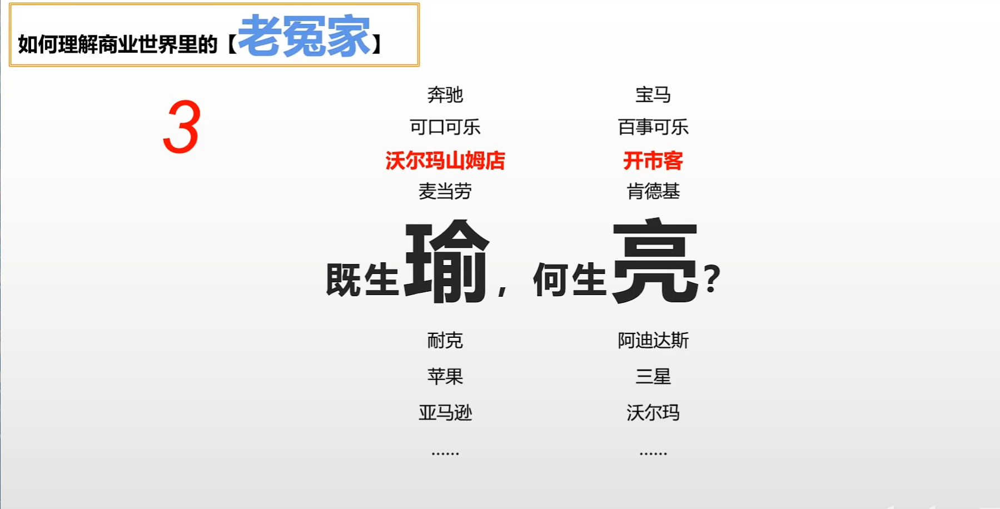

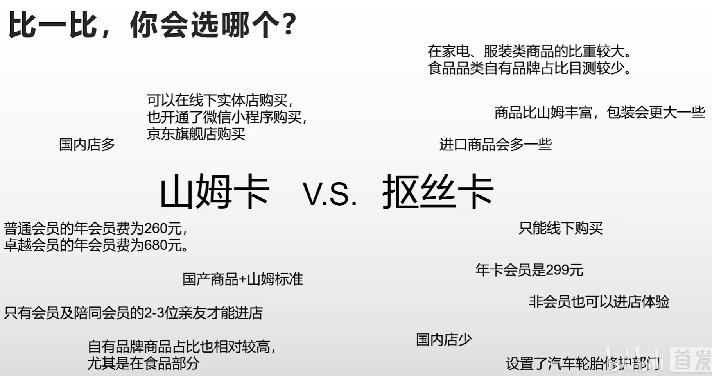

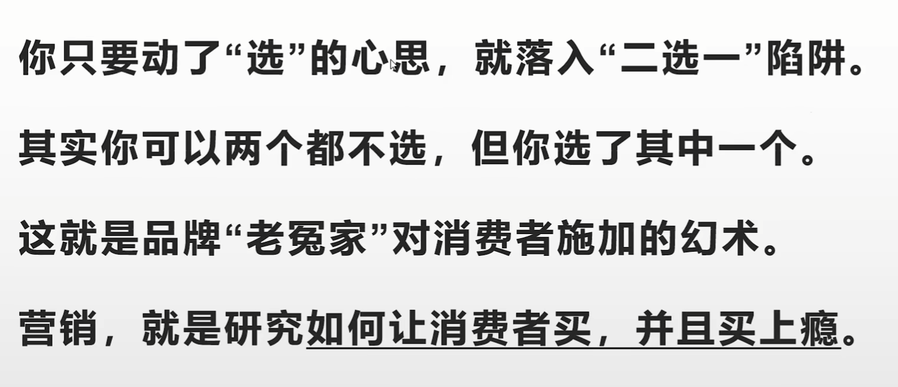

### 零售业不可能三角--守点必败，占边为王

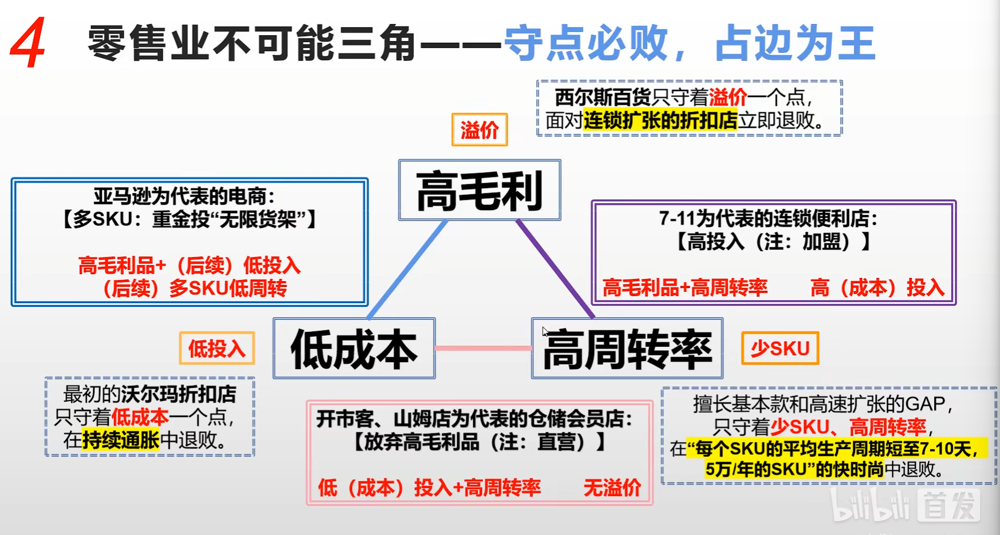

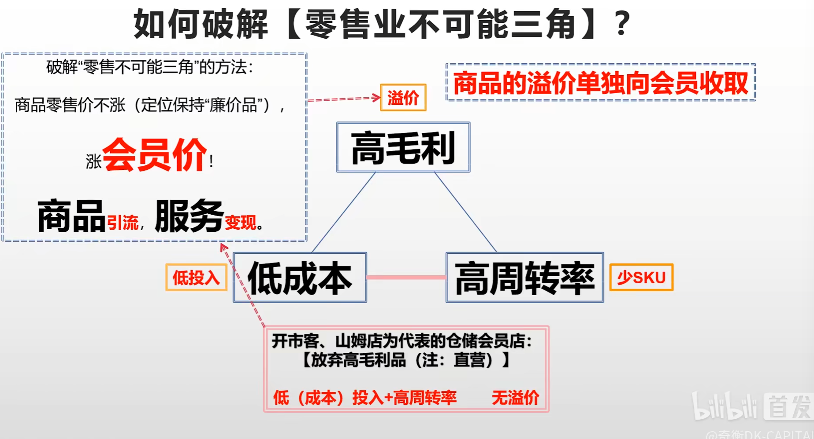

## DLC 4：7-11便利店

店面to c，公司to b

供应链会提供限时限量的sku

消费者花了大价钱为了获得便利。

客户便利=商家高成本

## 第四课：家得宝

家装是一门长期低频、短期窗口期高频的生意。

家装是完整周期里不赚钱的服务行业。

真正的盈利模式在于建材批发的零售。

家装服务是为建材生意引流接单。

—— 奇衡 DK

美国已经过了家装DIY时代，
自发到店买建材自用的客户越来越少，
沃尔玛在家装服务方面没优势

服务是为了卖产品

DIY=没服务=低成本

tob的服务是垫资

### 为什么在中国没有家得宝？

批发零售的尽头是仓储物流

如果零售的尽头是物流，
那么重资产打造供应链并且活到第三阶段就赢家通吃，
称之为“穿越者”

**毛利率**主要反映的是两家公司的采购成本以及各自供应链体系的运营成本。

Home Depot拥有更为现代化的供应链体系，而Lowe’s的供应链体系建设时间较早，效率不及HD。

零售行业各方意识到“穿越者”存在的时候，如果“穿越者”的布局已经完成，那么**只剩一个方法弯道超车**
——**并购物流资产去迅速追赶供应链的代际劣势**。

进入b点行业，日子不会难过

## 第五课：全食超市

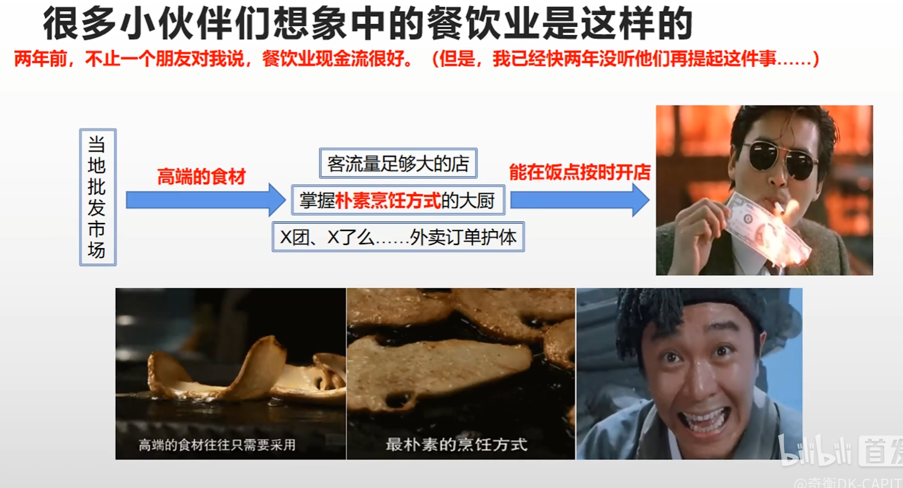

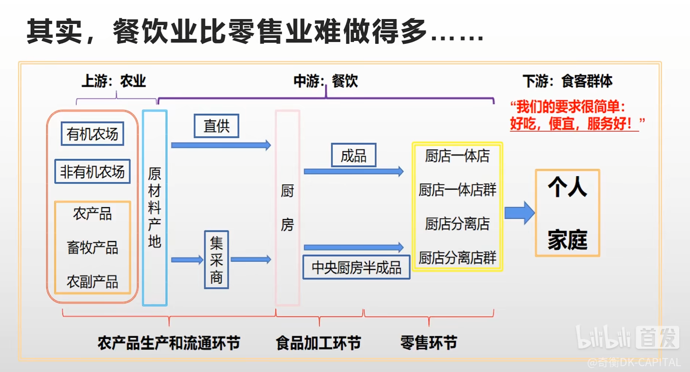


与营销相比，品控才是餐饮业成功的关键。

吃进肚子里的东西，如果品控不行，任何理念都不香了

喊着健康的口号对产品定高价，就是收智商税


## DLC5：星巴克和瑞幸

所有饮料生意都是水的生意

咖啡是一种怎么样的产品？

弱成瘾性咖啡因（受众少）水，通常加糖加奶变成**类奶茶饮品**（受众多）。

为了把成形的咖啡产品卖给大众的成本是59%，赚9.5%的净利润

投入目标和战略需要匹配

在不可能三角的同一边竞争，叫内卷。基于博弈分析的错位竞争才是出路

星巴克2025战略的本质是星巴克“雀巢化”、“瑞幸化”，从卖咖啡、卖生活场景，转变成卖咖啡味饮品。

类比7-11贴近客户密集开店卖预制食品的做法，但**直营模式**使星巴克开店成本难以转嫁。

简单来说，烧的钱可能赚不回来。

## 答疑课

咖啡饮品=咖啡因（弱成瘾性）+糖（热量）+奶（口感）

研究餐饮就是研究热量+成瘾

奶茶里面也有咖啡因

对餐饮品类丰富程度的要求不断增加，只有两个原因：

一是因为饿，二是因为吃饱了撑着

一个品类如果净利率够高是不会开放加盟的，因为加盟的本质是出货给加盟商，加盟商赚的越多，公司的利润就越少。

## 第六课：塔克贝尔（塔克钟）


百胜集团的抗通胀对策：长供+集采+活租+临工


## DLC6：炸鸡店


生意做起来一定要有爆品

先品控，后扩张


### 小结：


当卖的是标准品的时候，你要卖的其实是服务，因为标准品由于市场竞争而毛利归零，只能拼服务。

当卖的是特色品的时候，你卖的是产品，而有了产品才能以其为立足点，建立品牌这个流量池。

为什么不研究收入增长，因为这是副产品


开店是为了不开店，打工是为了不打工


赔本赚吆喝，是生存之道，但不是生活出路


## 第七课：DQ

【背景知识】经济高速发展下催生出的享受型消费观已普现于年轻消费者群体，高压环境需要多巴胺经济的调节，冰淇淋的反季节消费也由此攀升。

> 没有冰淇淋，人生只不过是一段孤独的旅程。
> ——奇衡DK


冰淇淋是一种定向改良的“基本款”，用来搭售其他配料


“量产冰淇淋”这个品类，
长期冷藏下使配方口感永远是个谜。
供需双方存在信息不对称，就存在“柠檬效应”。

数据造假、以次充好泛滥，消费者见怪不怪。
因此，消费者只愿意接受“量产的平价雪糕”。

现制冰淇淋能吃出具体配方，消除信息不对称，
所以，它对量产冰淇淋存在“血脉压制”。

现制冰淇淋就是针对量产冰淇淋的弱点开发出来的。

——奇衡DK


## DLC7：饱和布店


店的密度是护城河

高坪效的小店开多了可以把零售变成批发

1. **知识点1**：将生产的卤制产品直接批发给加盟店门店，以此获得收入和利润。
2. **知识点2**：批发业务让卤制品公司在较短时期内具备销售网络覆盖能力、获得门店规模竞争优势。
3. **知识点3**：大规模扩张会因为疏于对单店盈利能力的提升而导致加盟增长放缓，进而影响营收和利润。
4. **知识点4**：加盟模式不能准确的反映出加盟方的经营困境，长期关店的损失不体现在业绩报表。
5. **知识点5**：大幅扩张门店会导致应收账款和应付账款同时增大幅加。


商业领域打击竞争对手或潜在竞争对手的现象有：

1. 控制上游，原料断供
2. 控制产能，有单无厂
3. 控制渠道，无处卖货
4. 控制流量，无人问津


## 第八课：银行


先有商流和物流，后有储蓄和资金流

银行业有着极高门槛--持续繁荣的贸易带来滚滚财源

利息是对贸易必经之路的征税

没有实业，金融不可能起家


背锅侠把证来的税全花给了美第奇家族


## DLC8: 富国银行

银行需要祖传的银两

商业银行在市场化经营中不一定能通过盈利来形成足够的准备金

毛利 = 营业收入-营业成本

表外业务是出路

表外业务不需要准备金

信誉之于银行就相当于品控之于餐饮，都是生意的命门

金融超市

过度营销

经营零售银行的秘诀：以表内业务引流，以表外业务赚钱

## 第九课：银行


要开银行，要么有祖传的银两，要么有祖传银两的人愿意在你缺钱的时候借给你

## DLC9：双三角模型快速看懂先锋、黑石和贝莱德

要敢于差异化竞争，所有躺赚的钱都不可持续，提供价值才能收费

## 第十课：Too Big To Fail But Fail

如果无法在小概率的失败中幸免于难，那么再高的胜率对你来说都毫无意义。

因此，所谓“风险管理”，关键是管住小概率致命失败。

避免小概率的致命失败，才是风险管理的核心。

避开麻烦比陷入麻烦之后抽身容易得多


地狱里面有石油


## 第十一课：水则资车，工业

和商业受“零售业不可能三角”约束不同，工业比拼的是极致成本——世上没有完美的工业品，工业不是比拼谁的产品卖得好，而是比拼谁在极致成本两大类和六个细项之间更有优势。消费者对工业品只有一个要求，就是物美价廉，因此先达到极致成本的厂商就掌握了行业定价权和市场主导权。

生意难做的本质是**产品售价在走低，综合成本却在走高**

生产订单的成本在于试错成本

生产订单和生产产品的成本小于售价水平才能活下去

工业品的生产成本可以通过大规模生产来降低。当生产方式优于社会平均水平时，工业品的生产成本会跌破其市场销售均价而产生盈利。厂商要解决三大问题：

1. 是否掌握优于社会平均水平的生产方式？研发成本
2. 是否在持续扩大销路的同时获得足够资本扩产？营销成本，融资成本，固定资产成本
3. 生产成本下降速度能否追上市场销售均价下降速度？内卷成本

没有解决三大问题的思想准备和业力储备，搞生产恐怕失败收场。

## DLC10：保时捷

定位就是定价

 

一眼认出是某个品牌的=视觉锤

## 第十二课：逆袭的克莱斯勒


为什么行业第三的克莱斯勒没有摆脱行业周期的诅咒？为什么汽车业像金融业一样会深受金融危机影响？


创新不是无根之木，不是无源之水


无助于掌控中上游、提升议价力的下游市场占有率，不是商业护城河。危急关头，规模反而成为了负担。 -- 奇衡DK

1973-1974年，石油危机爆发，打压大型豪华车需求的同时为日本省油车开辟了新的市场。美国三巨头受到危机。

盲目追求低质量的市场占有率是开工厂的最大陷阱。


如果你不是职业经理人，而是真正的老板（企业拥有者），那么你的产品取舍应该以客户为中心，以优化服务旅程为逻辑起点，而不是以赚不赚钱，能不能完成kpi为逻辑起点。


## DLC11：克莱斯勒的陨落

效益来自工艺改进而不是管理。业绩提升，应该奖励不断发明和创造的工程师，而不是经理和销售

生意难做的本质是产品售价在走低，综合成本却在走高

## 第十三课：进击的菲亚特

创业前必须知道的事情：Go big，or go home

大老板营销投资人，厂长营销产品

消灭竞争对手的最好方式不是和它们卷价格或者卷技术，而是趁它们经营困难的时候收购它们

坚持学习不是为了找份好工作，而是为了当逆袭机会出现时，你配得上

大老板生产资产，而资产能带来融资

要做大，先要知道什么不该做

拔掉野草，浇灌鲜花

一有自由现金流就逐渐降低自己的负债率

谈判，先清楚谈判底线再开始

每个行业最后只需要一两个品牌

通过极致成本不断减少竞争对手，资本的选择越少，你的资产越值钱

资产：未来现金流可预测

## 第十四课：日产


内燃机规模化的时代已经过去，现在是电动机的时代。汽车的最终形态是只能载人机器人。


## 第十五课：福特


esg评级：高质量增长

波音往事：你曾受过的苦，都是你的财富


抵押福特几乎所有资产（股票、工厂甚至F字母蓝色椭圆形商标）换来236亿美元的贷款，在次贷危机发生前筹足过冬粮仓，放弃美国联邦政府援助。


经营出现问题的时候，员工是公司的负担


换家战术，在保留核心资产和品牌的前提下，最大限度地变现资产、回收现金，以升级核心业务。


### 总结

1. 多元化往往变成“多元恶化”
2. “多元恶化”会带来隐蔽资产地释放和困难反转地窗口，重点关注资金链是否断裂，以及公司CEO的更换和新CEO的应对策略
3. 职业经理人应对危机的三板斧：
   1. 裁员
   2. 变现资产
   3. 重构生产流程

## 第十六课：沃尔沃

营销=短期效果

价值=长期效果

安全是驾驶的固有风险

车不开的时候最安全，只要上路就不安全

有了沃尔沃，滚珠轴承开始应用于汽车。

沃尔沃有市场，投资者怎么换都在运营，基业长青

## 第十七课：可口可乐可复制吗


抵制像百事可乐的新可口可乐=抵制百事可乐

你所见的所有消费品牌的大型舆论事件，都可以默认是这些品牌在做的事件营销，本质上是故意为你所见的广告。

换而言之，如果你没有大规模事件营销的能力，那么就做不好消费品生意。


## 第十八课：不懂卖芝士的啤酒厂不是一家好烟商

**流量盲盒**

企业经营的高端局从你在原赛道成功甚至无敌的那一刻便开始了，因为你为了寻求低成本的新增长点，必须硬着头皮去切别人的蛋糕，从而解锁了更高端的对手。企业怕没生意，更怕有生意但对手又多又强。

**卖产品、卖服务的长期预期回报是零甚至是负**，因为你的成本不断攀升，不断在你扩张的过程中抬高你的盈亏平衡点。**要么即使转手，要么走完企业生命周期把赚的钱全部赔回去。**

**只有“品牌寻租”的长期预期回报才是正的，因为他的边际成本为零**。问题是企业做大容易，做成“品牌寻租”的模式却无比困难。它没有定式。

流量盲盒：

厂商知道总有一半广告费被浪费了，但厂商永远不知道是哪一半。

好产品不等于好生意。

消费者都住在各自的“信息孤岛”，通过常去的地方与世界链接。

定制广告：集中市场营销战略

在同质化竞争的品牌寡头争夺战中，最重要的是计算赢得胜利需要多少资金而不是计算投入产出比

## 第十九课：产品研发，还是饱和营销？

研究海外成熟品牌，是为了探索如何让我们的民族品牌做大做强。为中华品牌之崛起而学习。


汰渍领先两年抢占50%市场


消费品牌的老板永远思考如何获取有成本优势的流量。

宝洁的成功在于它引流的目的是自产自销

up主做不大的原因是无法自产自销，单位时间只能赚到单位的钱


在产品更新换代的烧钱长跑中，你有钱投资转型，对手只能投胎转生。


通过复购来增加销量和长期正利润


复购盈利模型：

净利润=（销售额+复购累计销售额）-（成本2+成本1）
      = 复购利润-战略性亏损

通过培养消费习惯来提升复购

## 第二十课：消费品牌的尽头是什么？

流媒体+品牌网站=DTC（直面消费者）

## 第二十一课：GE


五步分析第一步就错了，后面都是白用工

第一步应该是测量现有质量水平，了解真实情况和客户

公司拥有者有动力以客户为中心，因为客户是公司的资产；但是，职业经理人与公司拥有者订立的契约，决定其名义上必然以公司拥有者为中心（而不是公司客户）。在经营过程中，职业经理人又是经纪人，以自身利益最大化为出发点，其职权所掌握的公司资产其实是自身利益最大化的“原材料”。这就是经济学和管理学交织时，不同假设前提带来的利益冲突和道德风险。


报表业绩增长有时候是在摧毁企业长期价值。要懂得分辨。
