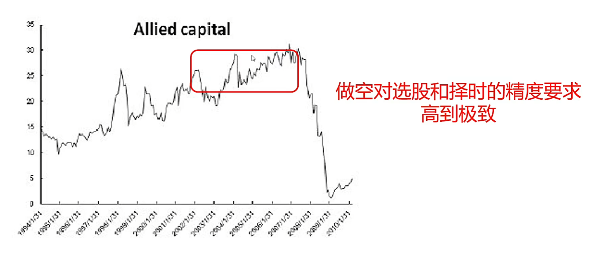
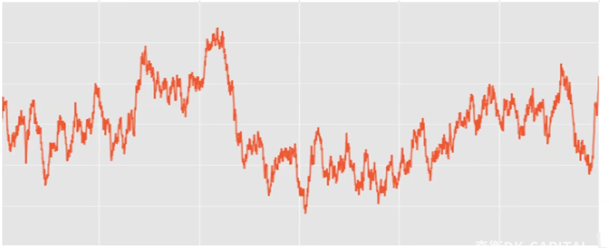

# 空头之王（一路骗到底\Fooling Some of the People All the Time ）

## 第一集：做空雷曼兄弟爆赚10亿美元

从如何做空的角度来选股。

选股--诈骗和反诈骗

当发现这个股票没有任何角度做空，这可能是一个值得重仓做多的股票。

You may fool all the people some of the time. You may even fool some of the people all the time. But you can never fool all the people all the time—Albert Lincoln.

你能在有些时候欺骗所有的人,也能在所有的时候欺骗有些人，但是你绝不能在所有的时候欺骗所有的人。

- 做空加唱空雷曼兄弟，后来跟比尔·阿克曼做空康宝莱亏损

- 康宝莱：扩张了中国市场

- 特斯拉：空头主力，连续做空特斯拉，被轧空

巴菲特不做空，他认为财富在于与国运并肩，没人能通过做空股票创造财富。巴菲特不借股票做空，而是持有现金不买股票。

巴菲特曾经在股东大会上回答过为什么不做空的问题。他说，他们也曾发现过一些规模巨大的公司诈骗行为，而且他们的判断一般都是正确的。但很不幸，他们很难判断诈骗行为能维持多久，能走多远，所以做空挣钱很不容易。判断高价股票注定走向灾难并不难，但想依靠这个认识来挣钱太难。这也就是凯恩斯所说的，**在市场回归理性之前，你很可能早已破产**。

做空不能看太远，做空必须择时，抓住股市崩盘做空骗子公司。

### 背景介绍--绿光资本

做空并且公开做空理由引起市场恐慌

- 在2000年纳斯达克泡沫破灭后，绿光资本名利双收，让艾因霍恩对自己的判断能力更有信心。于是，在2002年的一次投资慈善募捐晚会上，当艾因霍恩被邀请分享他的最佳投资建议时，他直截了当地回答：做空联合资本（Allied Capital）。

- 联合资本是当时全美第二大公开交易的企业发展公司，艾因霍恩通过研究它的财务报表认为，这家公司通过会计造假来隐藏亏损，值得做空。结果，演讲的第二天，股价暴跌。从02年抗到08年。

做空对选股和择时的精度要求高到极致。

绿光资本在做空联合资本上没怎么赚钱，结果大卫艾因霍恩用同样的手法做空和唱空雷曼兄弟赚了十亿美元

## 第二集：你买的不是股票

本课知识点：做空、航空股、回购、价值投资原则、判断好公司

使用群体标签：股票/基本面/中周期波段/以交易为生/入门

通过讲做空来排除坏股票。

本集介绍持有一年以内。

### 尽职调查

做空股票：在做空交易中，你还是在想低买高卖，借入该股票，再将股票借给你，股价下跌越多，你赚到的钱越多。从经纪商借入股票，融券。

你卖出不属于你的东西是你破产的起点。

80%的人不是学做空股票，而是看一个公司是否有问题。

炒股最重要的是低买高卖。

### 航空股：过去十年，美国大航空公司自由现金流96%用于回购

>我在康奈尔大学读的本科专业是政府管理，但是大三时我在华盛顿证券交易委员会经济分析部实习之后，便对经济学更感兴趣。我写的毕业论文阐述美国航空业周期性监管问题。政策制定者在两个相互竞争的利益集团之间寻找平衡：航空公司要赚钱，但消费者要航空运费低廉，还要在哪里都能乘到飞机。在反对竞争的周期阶段，监管者允许航空公司垄断经营空中航线、夺取枢纽城市、通过兼并消除竞争，这样航空公司便可以赚得丰厚利润。这种形势让消费者和政界人士大为不满，他们又要求监管者出台支持竞争的措施，以提供更多、更便宜的航空服务，而这会扼杀航空业的盈利。在航空公司遭受亏损甚至破产之后，政策制定者认识到有航空公司还是好事情。为诱使航空公司购买飞机、提供服务，要让航空业有赚取利润的机会才行，于是反对竞争的周期阶段又回归了。这种恶性循环的周期模式或许可以解释为什么沃伦·巴菲特说了这样一句俏皮话：投资者本应该在雏鹰市将莱特兄弟的飞机从空中击落。这篇毕业论文让我在政府管理系赢得最优毕业成绩，同时也毫不奇怪，绿光资本为何从未拥有过一家美国航空公司的股票。

### 回购股票

上市公司用现金在股票二级市场买入自家股票，用于注销或者股权激励。如果把上市公司融资理解为“发股票--借钱”，那么回购就是“收股票--还钱”。借钱回购股票的公司不能买。

特斯拉的ceo mask和苹果ceo cook都是收股票工资。

股票是合法违约的债。所以股价有不确定性。关注回购注销的公司。

### 巴菲特买卖航空股的逻辑

航空股和旅游业挂钩。

- 买垄断：美国航空业进入成熟期，三家传统是美国航空、美联航、达美航空是网络型航空公司，两家廉价是西南航空和捷蓝航空，五家合计市场份额已经近70%。

- 卖不确定性：新冠病毒令很多行业都面临巨大压力，而**旅游业**一直是受影响最严重的行业之一。具体来说，航空公司在场危机中遭受了不成比例的痛苦，**大流行病**已使航空业发生了非常重大的变化。不清楚未来三四年人们是否会像去年那样坐飞机，而航班现在太多了。航空公司会做一个非常巨大的改变，**会借很多的钱，自己的利润会吐出来**，回购自己的股票。

### 做价值投资的原则

买垄断，卖不确定性。 

### 判断好公司的三个基本问题

不要看净利润，净利润可以调整，净利润产生的机制更重要。

哪些是良好的公司行为，哪些是不好的，更甭提会标明激进的或保守的会计处理方法。有三个基本问题需要解决：第一，公司业务的真正经济效益怎样？第二，这些经济效益与公司业绩报告相对照，情况如何？第三，公司决策者与投资者，在利益一致性方面，情况又如何？

### 结语

- 回答上述三个问题之前就买进，你买的不是股票，是寂寞。
- 回答了上述三个问题后再买进，你买的不是股票，是公司。
- 买股票和买公司不完全是同一回事。

## 第三集：对冲基金四大特征

本课知识点：收益归因、收益结构、超额收益、绝对收益

### 股票分析方法 

**普遍的投资分析框架--挑物美价廉**

也就是分析公司的经济价值和决策者与投资者之间的利益一致性。我们的投资研究过程与多数传统的价值投资者所使用的分析框架相反。很多价值投资者是先确定一只股票是否价格便宜，如果便宜，他们便力求确定那只股票是否便宜得理由充分。他们识别投资机会的一个典型过程是，通过计算机屏幕，发现统计意义上的便宜性，诸如低市盈率、低市销率或低市净率，同时盈利上升之类。然后，他们将识别出的公司作为可能的投资对象进行评估。**找大幅下跌的股票，看基本面。**

很容易给自己挖坑。

**绿光资本的反传统分析法--挑软柿子捏**

绿光资本采取完全相反的方法。我们开始便提出问题：一只股票为何可能在市场上被错误估价。一旦有了一套想法，我们便分析该股票，确定它是否真正便宜，或被高估。为了投资，我们需要明白为何存在这一机会，并相信我们较之交易对方拥有相当大的分析优势。市场是个没有人情味的地方。我们买入某只股票时，通常并不知道谁在卖出。如果我们的交易对手无知无识、不谙市道，那便愚蠢至极。在多数情况下，今天卖出股票的人比我们跟踪该股票行情的时间更长，也更加密切，以前曾是买入者，现在已改变主意转为卖出者。更糟糕的是，交易对家可能是公司内部人，或者是信息灵通的业内玩家，在主要供应商、客户或竞争对手那里工作。有些投资者相信，他们买卖华尔街分析师研究最少的那些股票会占有优势。我们认为，一只股票是否“跟踪不足”并不重要，因为我们从其手上买入

**多空配对交易——赌价差收敛**

尽管我们的投资研究过程在很大程度上依赖于我在西格尔考勒瑞公司受到的训练，但绿光资本构建投资组合的方式不同于西格尔考勒瑞公司。在西格尔考勒瑞公司，最大的投资都是多空配对交易。所谓多空配对交易，就是将身处同一行业并且市场交易估值大幅偏离的两家公司进行搭配投资。西格尔考勒瑞公司会买入估值较便宜的那家公司，同时卖空更昂贵的另一家公司。在理想的情况下，持有多头仓位的公司较之持有空头仓位的公司拥有更好的前景，或者会计政策更为保守。多空配对交易试图通过既消除市场风险又消除行业风险，同时利用随着时间推移而产生的估值收敛来防范投资组合内投资的损失。

**系统性风险和非系统性风险**

我们不使用指数来对冲，因为我们通过选择风险回报特征很差的单只股票做空，可以创造更多的收益。指数对冲的期望值是负数，因为随着时间的逐渐推移，市场会向上走，而空头只是在下跌行情中带来好处。做空单只股票有两个获利途径——要么市场下跌，要么事实证明特定公司的分析是正确的。在实践中，我们在多头
上较之空头有更多的暴露，因为我们的空头仓位较之多头仓位往往对市场更为敏感，波动性更大。再者，市场随着时间推移往往会走高，我们也希望参与其中。管理投资组合只有在市场下跌行情中才能有超好表现，在心理上很有挑战。我压根儿不想把自己的生命浪费在期待市场崩盘上。

不要怕腰斩，未来肯定会涨得更高。

**绝对收益**

我们认为自己是“绝对收益”投资者，因此并不将我们的投资结果与只做多的指数进行比较。这意味着，我们的目标是随着时间的推移，无论市场环境如何，都要努力实现正收益。我相信，对冲基金之所以有巨大吸引力，是因为它具有博取绝对收益的导向。多数只做多的投资者，包括共同基金，都是相对收益投资者，其目标是投资表现优于某一基准，通常这一基准是标准普尔500指数。在评估一个投资机会的过程中，相对收益投资者提出的问题是：“这一投资将会胜过我的基准吗？”相比之下，绝对收益投资者会问：“该项投资的回报是否大于其风险？”这会导致分析框架完全不同。结果，两类投资者可能考察同样的情形，但得出的投资结论却大相径庭。

### 结语

- 对冲基金
- 先分析对手，再分析股票--收益归因：你的盈利来自别人的亏损。
- 多空配对或不配对交易--收益结构：组合中同时存在多空方向。
- 超额收益来自非系统性风险--超额收益：承担非系统性风险的补偿。
- 追求绝对收益--绝对收益：实际盈利，而不是相对盈利。

## 第四集：沉迷炒股怎么办？

本课知识点：市值覆盖倍数、流动资产、破净资产、利率定价

### 净营运资本覆盖倍数

我们1996年5月赚到3.1%的收益率（每当我引用绿光资本的基金收益率，除非特别说明是“毛收益率”，否则是指扣除业绩费和其他费用之后的收益率，也就是合伙人获得的“净收益率”。我讨论单个投资，总是使用毛收益率）。当月月底，我们将基金15%的资本投资于安东尼公司，这是一家小型零售商，近期刚摆脱破产窘境，重新开始盈利。市场给该公司的市值是1800万美元，不过其拥有两倍于市值的净营运资本（流动资产减去所有负债）。绿光资本6月的收益率是6.9%。（零售困难反转型）

### 流动资产

- 流动资产的内容包括货币资金、短期投资、应收票据、应收账款和存货
- 流动资产是一年内可以变现的资产。
- 货币现金及现金等价物，短期应收账款和高流动性存货。

### 破净资产是低估？

利率=成本率+损失率

1997年伊始，我们势头强劲，第一季度获得13.1%的收益率。接下来，我犯了一个代价高昂的错误。坏结果通常有两种类型。有时，分析风险和回报之后，一项投资看起来很有吸引力，但是不幸的事情或不太可能出现的事情发生了；有时，分析本身就有缺陷，投资品的质地不良，我们该当最终遭受损失。这次错误属于后者。我们将6%的资本投放于瑞莱斯公司，该公司向信用记录有污点的人发放汽车贷款，利率为18%。投资该公司的关键问题是：18%的贷款利率是否足够覆盖贷款违约造成的损失，而这些损失更难估计。我分析了车辆收回数据，确定瑞莱斯公司收回了20%的贷款汽车，每次损失40%的贷款。贷款期为2年，所以我计算出每年贷款损失率等于20%×40%÷2或者4%。那么高的贷款利率看来足以覆盖损失，而且公司股票看起来也便宜，交易价低于账面价值。

### 在地铁里寻找亿万富翁

我犯的错误在于损失分析的框架设定不当。车辆收回的统计数据并未包括收回者未能找到的汽车大约10%的贷款。显然，这些贷款是百分之百损失了。这就意味着实际贷款损失是我计算的两倍以上。18%的利息并未覆盖贷款资金成本、真实损失和经营费用。我们投资的钱大约丧失一半，这时我才意识到自己犯了错。这笔投资损失导致我们在4月份第一次出现月度亏损，亏损率为0.3%。

## 第五集：什么股可以买？

知识点：什么股可以买？什么股不能买？

品尼高公司是一家科技公司，在我们投资前已有两三个季度业绩报告令人失望（股价比较无聊，业绩平平）。公司股价下跌，趋向账面价值，而账面价值多为现金（轻资产公司）。很多价值投资者（伪价值投资，巴菲特不会因为是科技公司就回避）回避投资于科技公司，因为它们的产品复杂，竞争领域变化迅速。我们的看法是，科技公司若不在亏损经营，按照账面价值进行交易，并且看来拥有一种靠得住的产品，便是很好的投资对象。事实证明，品尼高公司正是这样的例子，当该公司业绩报告趋好时，股价涨了两倍。

需要买了之后拿得住

最后，一些做空交易也为1997年的收益贡献良多，其中包括波士顿炸鸡公司和新秀丽公司。波士顿炸鸡公司的会计惯例使其得以在特许经营人的餐馆开张之时，提前确认收入和利润。波士顿炸鸡公司为餐馆开张和预付费用以及给特许经营人贷款的已获利息提供融资。特许经营人的餐馆盈利不足以支撑应支付给母公司的账款。波士顿炸鸡公司的股东并不关心，或者可能甚至对特许经营人在亏本经营并不知情，因为波士顿炸鸡公司未将特许经营企业并入其财务报表。我们相信，如果餐馆的经济效益并非强劲得足以让特许经营人偿还对波士顿炸鸡公司的债务，并且为其自身赚取合理收益，那么他们将不再开张新的餐馆，因此波士顿炸鸡公司的市盈率会随着公司增长停滞而下跌。后来的事实证明还要糟糕，因为特许经营人在贷款上违约了。最终，波士顿炸鸡公司走向破产。

新秀丽公司同样也崩盘了。我们在28美元时做空其股票，并看着股票飙升至45美元。我一再检视出现这种情形的原因，然后决定大量做空。新秀丽公司此前已提高产品售价，同时扩张了销售网络。该公司自身已开出很多门店，与其大宗客户即零售商展开激烈竞争。我们在曼哈顿看到一个箱包店，橱窗上贴有一个“新秀丽折价40%”的告示牌。我们把告示牌买下来挂在自己的办公室。当时店员朝我们滑稽地笑了笑。后来的事实表明，这并非唯一设法消化新秀丽公司多余存货的门店。当新秀丽公司承认顾客并不认可提价，零售商存货充斥时，其股票骤然下跌至6美元。（靠开连锁店的公司，一旦扩张停止，可能估值也就到顶了，门店扩张到头，竞争不断增强，存货增加）

## 第六集：不是不爆，时候未到

我们1998年开端不错，基金到4月获得9.9%的收益。然后，我们持有的最大空头仓位计算机学习中心成了问题。计算机学习中心是一家营利性教育公司，利用慷慨的政府学生贷款，对学生和政府两方敲竹杠。该公司每年向未受过教育的人每人收取2万美元，教授计算机技能，它们什么样的学生都来者不拒。有家做空机构派一个人故意通不过该公司一所学校的录取考试。一位招生主管给她答案，让她再次参加考试。因为该公司提供劣等产品，并且行为不端，所以我们重仓建立了空头头寸。华盛顿特区一家电视台做了一次专题报道，采访大量愤怒地抱怨教学设施不佳的学生，并播放秘密拍摄的录像，显示一位招生主管向一位可能接受教育的学生承诺，一旦毕业便能获得高得荒唐的预期起薪。股票市场对之做出的反应是：打了一个呵欠。

计算机学习中心公告第一季度收益强劲（收益强劲加创新高，可以继续持有，空头做不了事情）。首席执行官里德·贝克特尔威胁做空者，告诉《华盛顿邮报》：“公司股票每上涨1美元，空头们就得从银行账户里拿出400万美元。”《华盛顿邮报》称，他告诉一位投资者“我们已遭广岛之苦”，空头们“该到受长崎之痛的时候了”。此后不久，公司股票开始下跌，因为教育部宣布调查合规问题，伊利诺伊州总监察官也正式提出民事欺诈的投诉，股价下沉。我们感觉到离终局不远了，便加大空

两三个月之后，计算机学习中心支付50万美元罚款，承诺更加规范经营，由此与伊利诺伊州总监察官了结此案。总监察官认为处罚严厉，但股票市场判断这是计算机学习中心为摆脱困境付出的微不足道的代价。多头们散布传言说，教育部已完成调查，不会采取强力行动。波士顿的三家共同基金都在已经持有的重仓中增加了头寸，股票旋即翻倍，看来计算机学习中心可能真的逍遥法外了。我决定吞噬苦果，于7月平掉空头仓位。我们在此仓位大约损失2.5%的资本。

这次空头平仓是一个糟糕的决定，因为**后来事实证明**（不能够做对的就是没看对）我们对该公司的判断是正确的。监管行动的曝光和该公司更为保守的行为，致使入学人数和收益未达到预期，因此扼杀了公司股票。这类情况在有争议的做空交易中实际上会多有发生：很多时候，多头们在关键批评上（在此案例中，监管者没有立即让该公司毙命）赢得战役，但空头们却赢得战争，因为经营或会计变革会导致业绩令人失望。教育部又费时两年才完成其调查工作。调查完成之时，教育部要求计算机学习中心退还向政府预支的所有学生贷款，这迫使它们破产倒闭。（空头最大的敌人是时间）

做空一家受政府监督的公司，对于投资者来说，关键问题在于，即便当政府采取行动时，其行动速度也不会比股票市场快。两年对政府调查而言也许已非常迅速，但对于像绿光资本这样的报告月度业绩的投资者来说，即使采取的是长期策略，那也太漫长。基于我决定平掉计算机学习中心，我有了更强的承受能力，同时也学会变得更有耐心。很多投资实例教会我这一教训，计算机学习中心是其中代价更为高昂的公司之一。（在市场中需要保持本金）

赚钱的技能无法通过亏钱学会，只能指导你下次不在同一种地方亏钱

## 第七集：在股市里，风花雪月，迟早被虐

### 空头是多头的唯一知己

你炒股不赚钱，是因为你买股票的时候，不懂得用空头的角度来考察一下--

【股价背后支撑的资产的泡沫程度】

股票就是欠了不用还的钱

## 第八集：股市反诈骗指南

有借有还，再借不难--没得还怎么办？

找担保人，写欠条--贷款（间接融资）or 发债（直接融资）

描绘一个前景，找人入股--发行股票（直接融资）--还债

配套融资可以用于还债。

### 击鼓传花

债务流转：

商业信用--银行贷款--股票发行

亲戚朋友合作伙伴--银行--股东--终究没钱还的，股价崩盘谁负责还债？

### SHSE，一家保险公司

什么是运气？运气就是概率随时间推移的摄动

#### 抛硬币过程中，抛出正面的概率是多少？

#### 投资是运气管理，研究运气好的时候多赚，运气差的时候少亏

我们在佛罗里达州专门从事工伤保险的SHSE公司的非互助化交易中**运气**极好。公司作为互助机构**会计政策保守**（意味着定价低估），首次公开发行募集的**所有资金均归属公司**，管理层**团队受赠大量原始股**（管理层和股东利益一致）和股票期权，这三者结合在一起，使非互助化看来可以引起市场高度兴奋。1997年5月，我们将基金大约15%的资本按每股14美元的价格进行投资。

更美妙的是，SHSE公司近期已用非常优惠的条件购买再保险，从而降低了风险。从根本上讲，再保险公司愿意承担多数风险，向SHSE公司支付巨额费用。我们相信，当市场意识到SHSE公司由一个风险企业演变为一个品质高且费用可预测的企业时，公司盈利和市盈率均将上升。当SHSE公司于1998年6月宣布按每股33美元的价格以现金支付形式出售给利宝公司时，我们实际上非常失望。

剧情立即反转——占便宜的利宝变接盘侠，失望的绿光喜出望外,因为鱼龙混杂的工伤保险单变成了沙丁鱼罐头

最终结果表明，该公司管理层很机智，我们也很幸运。首次公开发行路演时，首席执行官漫不经心地说想“在保质书期满之前”出售公司，我听过这一说法，但直到这一年尤尼卡公司丑行被揭露，才充分注意到。尤尼卡公司是再保险经纪商，诱使再保险公司按照没有经济利益的条款给工伤保险提供再保险。有时，同样的风险被转嫁数次。风险每转嫁一次，尤尼卡公司就收取一笔费用。当再保险公司看清实情时，其中好几个公司拒绝支付赔偿金。随着骗局被揭开，几乎每一只工伤保险股票都崩盘了。我猜想，尤尼卡公司提供的优惠再保险使SHSE公司得以改变了其业务模式。尤尼卡公司东窗事发本来很可能导致SHSE公司随同其他工伤保险公司发生崩盘。不过，任何问题都与利宝公司有关，而不是与我们有关。有时候幸运比精明更好。

### 从绿光资本对SHSE的投资诠释：

所有股票都是垃圾，只不过某些在特定时候股价会上涨而已。--奇衡DK-CAPITAL

#### 保险和再保险

- 纯粹的保险是“保证有风险”
- 风险从被保险人转移到保险公司
- 保险公司靠盈利覆盖概率亏损

- 有了再保险，
- 风险从被保险人转移到保险公司
- 保险公司再把风险转移给再保险公司
- 保险公司赚保费价差，或及时回收现金

## 第九集：有可能在一个绩优股上亏很惨

赌徒只关心业绩，股东还要关心业绩是怎么来的。

空头不敢做空遇到行业困境的公司，防止有人提价收购，空头会袭击财务造假，信息披露造假，所有散户都认为会一直上涨的公司。

另一个表现出色的空头仓位是世纪公司，这是一家通过收购一系列从事同类业务的小公司而组成的公司，它提供会计服务，但其自身会计糟糕透顶。在这类公司中，合并方以低于其在公开市场可得的市盈率倍数，购买小型私营公司。每次收购有助于增加盈利，从而驱动股价走高，并让合并方得以利用其“货币”在无休止、志得意满的循环中收购更多的私营公司。迈克尔·德格鲁特领导世纪公司，他既有名，又有钱。像多数累积收购众多同类小公司的公司一样，世纪公司声称会改善所购公司的经营，创造15%的内部年收入增长率。实际上，出售小公司者往往是临近职业生涯结束的企业家，他们出售企业给世纪公司之后便去玩高尔夫。（伯克希尔哈撒韦）

世纪公司的会计在数个方面不符合一般会计准则（GAAP）。首先，世纪公司从收购“生效”日开始确认新购公司的收入，而该日期出现在收购交易实际结束之前。其次，世纪公司按市场价值40%的折扣给其作为“货币”发行的股票进行估值。这些伎俩使其得以过早地确认收入，少报商誉，误导投资者对其收购公司时所支付市盈率倍数的认识。

我们在绿光资本历史上第一次发函向证券交易委员会反映。我们批评世纪公司的会计，请证券交易委员会坚持要求公司在将来的报送文件中做出更为清晰的披露，但证券交易委员会从未回应过我们。然而，1年后，世纪公司重新编制其会计账目，使用“交易结束”日而非“生效”日开始确认收入，增加商誉。该公司减少“内部”增长率，大幅偏离预算，并更换了管理层团队。公司股票大幅下跌，从1998年8月的25美元跌至2000年10月的不足1美元。

## 第十集：从牛冠A股的生物柴油板块分享顶级基金经理秘诀

一年五倍易得，五年一倍难求

### 为什么空头不敢做空大盘股

大盘股有非常多的机构、投资者研究，价格很公正，银行股赚的是流动性差价。

虽然我们1998年创造了富有吸引力的风险调整后收益，但我们并未实现目标。增长型股票和大市值公司是市场的宠儿。很多领衔市场上涨的巨型公司股票，恐怕将费时数年才能达到这一年实现的让人流鼻血的估值水平。标准普尔500指数不屑于理会亚洲经济危机，回报率达到令人极度兴奋的28.3%。可口可乐公司引领市场，交易价大约为盈利的50倍。该公司盈利品质低下，因为它逐一退出了对装瓶子公司的投资，创造了在其盈利中占据重要地位的投资收益。**我没有胆量做空可口可乐，但我本应该对其做空**。我以为，对于规模如此庞大的公司，我不可能具有独特的洞见。我反而因在投资者会议上解释可口可乐的问题，以及考问可能雇用的职员对这一话题的看法，而感到自我满足。

市盈率只适合用在大盘股。

对于一般家庭，不要all in成长股，等到每年股价大跌的时候买大盘股拿分红。

网络泡沫从1998年的低位开始启动，冲向辉煌荣耀的最高点。我相信，美国在线与其空头之间的较量催生了这场泡沫大潮。

很多空头认为美国在线盈利品质低下，而其股票以高倍市盈率交易。美国在线在营销或“赢得客户成本”上花费重金，以招徕按月付费的用户。空头们相信，美国在线虚增利润，手段是将这些成本进行资本化，并在用户关系期望寿命期间注销这些成本。美国在线的会计不符合一般会计准则，因为该准则要求这类成本计入当期费用。

网络泡沫从1998年的低位开始启动，冲向辉煌荣耀的最高点。我相信，美国在线与其空头之间的较量催生了这场泡沫大潮。

很多空头认为美国在线盈利品质低下，而其股票以高倍市盈率交易。美国在线在营销或“赢得客户成本”上花费重金，以招徕按月付费的用户。空头们相信，美国在线虚增利润，手段是将这些成本进行资本化，并在用户关系期望寿命期间注销这些成本。美国在线的会计不符合一般会计准则，因为该准则要求这类成本计入当期费用。

美国在线最后和时代华纳合并，腾讯的最终形态是泛娱乐化。大基本面不改，机构就会买。

我对做空美国在线做了评估，认定即使其会计政策错误，做空它也非常糟糕，因为其业务的真实经济效益好得让人难以置信。鉴于该公司的经济利润，其股票并不昂贵。我将现金预付的赢得客户成本与在客户关系期望寿命期间的用户付费进行比较，计算出一位用户的净现值。美国在线的用户此时正大量涌现，过不了多久便能证明其看上去过高的股价名正言顺。再考虑到可能出现新的收入流，包括广告收入，我看做空它真的是个很坏的想法。或许这正是“价值投资者”比尔·米勒所看到的诱人之处，使其满怀信心地出手建立多头重仓。我没有勇气买入美国在线，但不对其做空，并可以与做空者争辩，就感到满足了。（空无可空就是做多）

比尔米勒是谁？他持有美国在线，一战封神。

- Bill Miller可谓是美国共同基金历史上“点石成金”的金手指。上世纪90年代，他以业绩连续十五年跑赢标普500指数享誉业界。就连超级巨骗麦道夫最风光的时候也做不到这样。Mille被很多人认为是迄今最伟大的基金管理人之一。然而，他在08年金融危机中惨遭滑铁卢，管理的基金当年巨亏58%，比标普500股指当年跌幅多了20个百分点。

- Bill Miller的持股时间都很长久，平均持有年限长达4年。而大盘主要基金的持股年限仅为一年。2008年，当这些资产最初价格下跌的时候，Bill Miller认为人们反应过度了，并且认为美联储最终将注入流动性以终结危机。于是，他仍抱着过去十几年与大众逆势操作的习惯，趁机低价抄底。

长期持有赚到的钱来自于长期持有受到的风险，只要持有时间足够长，肯定会遇到黑天鹅。