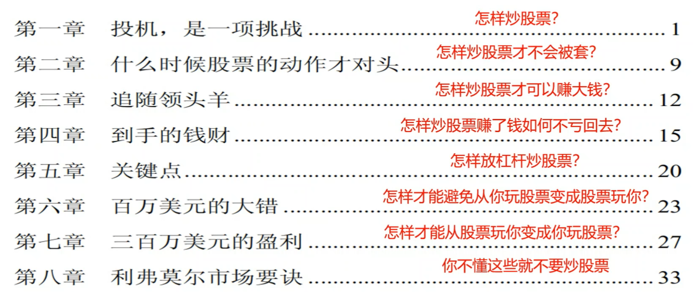
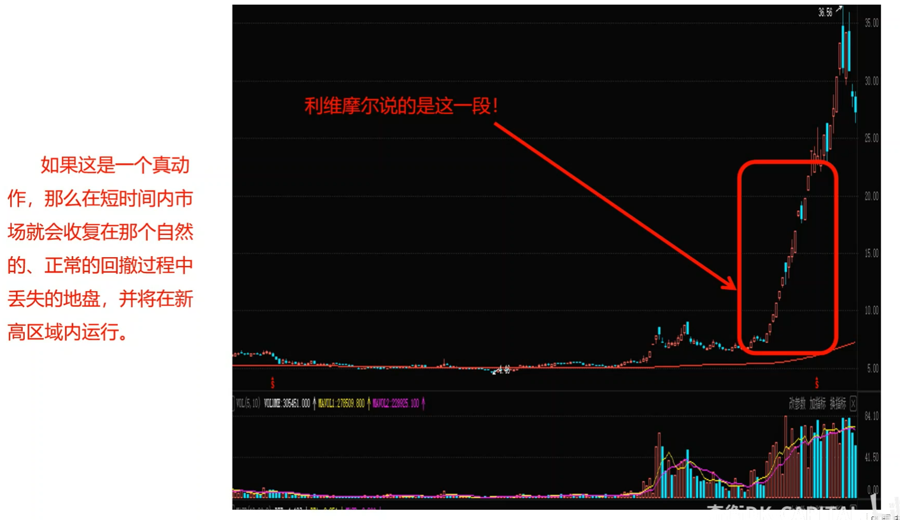
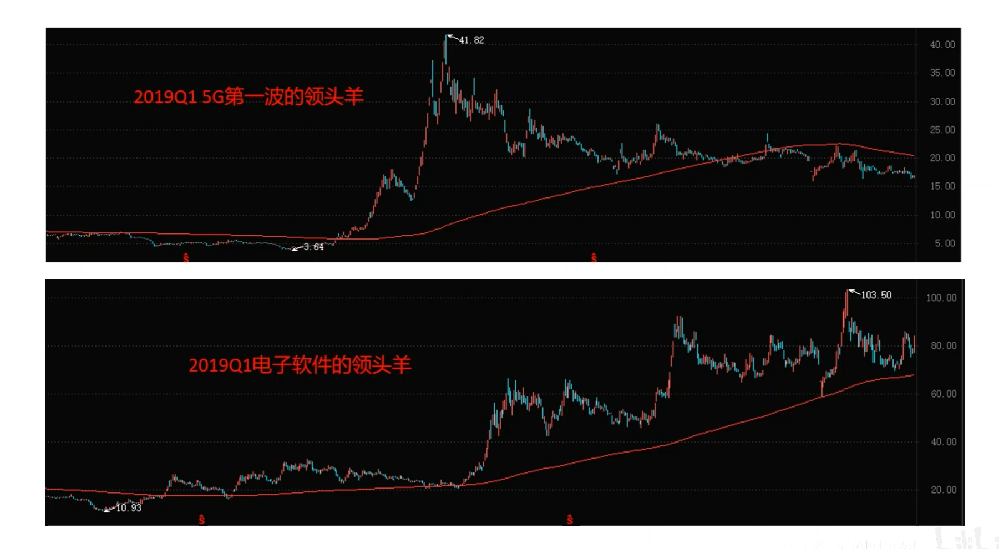
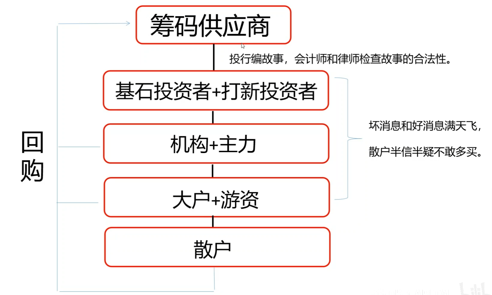
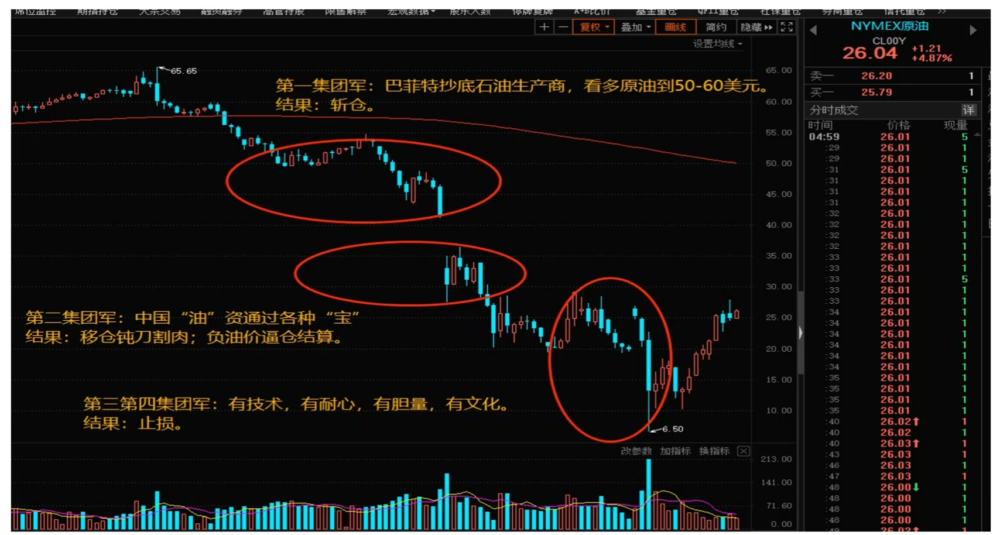
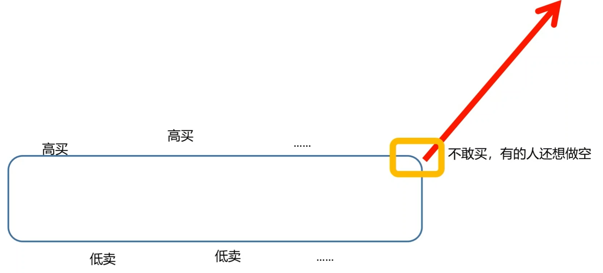
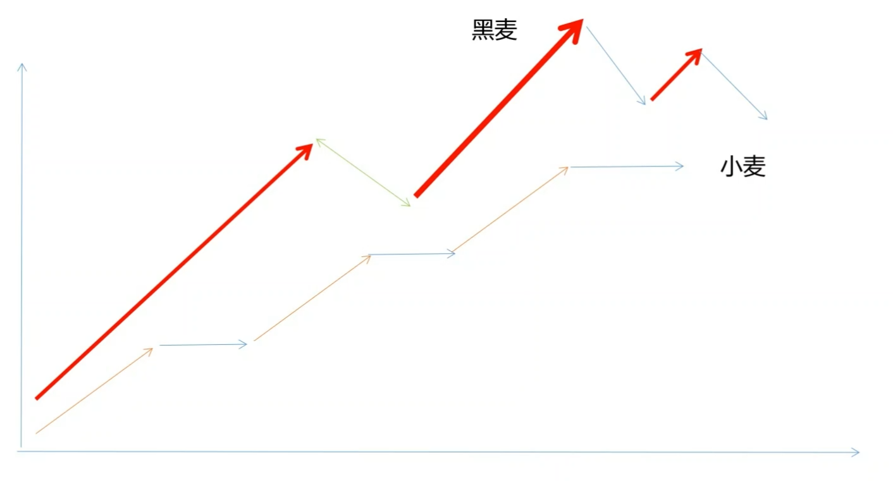

# 奇衡解读股票作手操盘术

## 解读操盘术

### 第一阶段

1877年7月26日出生；

14岁，在券商工作，负责写黑板报价；

15岁，第一次投机，同年赚得人生第一个1000美元；

20岁，赚得人生第一个10000美元；

21岁，在NYSE交易；

22岁，亏光，从零开始；

23岁，获利50000美元，但很快又输光。

总结一条经验：不要频繁交易。

盘口价差会吃掉本金

市场的涨跌是为了让本来躺赚的人无利可图，这就是市场波动的真相。

市场不一定完全有效，但市场是公平的。

没有一种方法能持续稳定获利。

### 第二阶段

25岁，重获成功；

29岁，做空太平洋铁路股票，获利25万美元；

29岁，听信Ed Harding的消息，亏损4万美元；

30岁，趁加息做空赚得人生的第一个100万美元；

31岁，听信棉花大王Percy Thomas，巨亏。

总结一条经验：独立思考，自主决策。

### 第三阶段

38岁，借钱东山再起；

40岁，还清所有债务，为家庭买信托隔离资产；

45岁，口述成书《股票作手回忆录》；

47岁，小麦一战获利300万美元；（用特斯拉做比亚迪的补涨）

52岁，1929年大崩盘获利1亿美元，投机之王；

56岁，破产。但因为信托而并未陷入贫困；

62岁，写成《股票作手操盘术》；

63岁，自杀。

遗言：我的人生是一场失败

### 评价

1. 这是一本金融领域的《老人与海》，是一个作手用一生去和强大的市场力量博弈而三起三落的故事。
2. 里面记载了个人投资者在股票和期货市场里各种可能成功的途径，同样也记载了各种通向失败的途径。
3. 这本书的知识能帮助你少走弯路，但里面的方法论相互矛盾，而且主角在理性与疯狂之间不断摇摆。
4. 这本书是利维摩尔全盛时期通过口述而让财经记者执笔写成的小说，有自我炒作的成分。
5. “阻力最小路线”的交易思想是正确的，但是利维摩尔使用的模型有本质缺陷——“最”。

市场永远是对的......（但）我的一生是一个失败。 --杰西利维摩尔

## 第一课

- 投机，天下最彻头彻尾充满魔力的游戏。但是，这个游戏愚蠢的人不能玩，懒得动脑子的人不能玩，心理不健全的人不能玩，企图一夜暴富的冒险家不能玩。这些人如果贸然卷入，到死终究是一贫如洗。
- 很多年以来，当我出席晚宴的时候，只要有陌生人在场，则几乎总有人陌生人走过来做到我身边，稍作寒暄便言归正传：“我怎样才能从市场挣快钱？”
- 当我还年轻的时候，会不厌其烦地设法解释，盼着从市场上既快又容易地挣钱是不切实际的，你会碰上如此这般的麻烦；或者想尽办法找个礼貌的借口，从困境中脱身。最近这些年，我的回答只剩下生硬的一句，“不知道。”

股市不是赚快钱的地方，因为赚有多快，亏就有多快。

- 记不清有多少个夜晚，我在床上辗转反侧，反省自己为什么没能预见一段行情即将到来，第二天一大早便醒来，心里想出一个新点子。我几乎等不及天亮，急于通过历史行情记录来检验新点子是否有效。在绝大多数情况下，这样的新点子都离百分之百正确相差十万八千里，但是其中多少总有些正确的成分，而且这些可取之处已经储存在我的潜意识中了。再过一阵，或许又有其他想法在脑子里成形，我便立即着手检验它。
- 从现代量化交易的角度说，这叫“归因分析”，是提取交易因子的过程。

归因而知进退。

- 证券市场万变不离其宗，阳光之下没有新鲜事。
- 在有的市场条件下，我们应当投机；同样肯定地，在有的市场条件下，我们不应当投机。
- 有一条谚语再正确不过了：“你可以赢一场赛马，但你不可能赢所有赛马。”市场操作也是同样的道理。有的时候，我们可以从股票市场投资或投机中获利，但是如果我们日复一日、周复一周地总在市场里打滚，就不可能始终如一地获利了。只有那些有勇无谋的莽汉才想这样做。这种事本来就是不可能的。
- 为了投资或投机成功，我们必须就某个股票下一步的重要动向形成自己的判断。**投机其实就是预期即将到来的市场运动。为了形成正确的预期，我们必须构筑一个坚实的基础。** 举例来说，在公布某一则新闻后，你就必须站在市场的角度，独立地在自己的头脑中分析它可能对行情造成的影响。你要尽力预期这则消息在一般投资大众心目中的心理效应——特别是其中那些与该消息有直接利害关系的人。如果你从市场角度判断，它将产生明确的看涨或看跌效果，那么**千万不要草率地认定自己的看法，而要等到市场变化本身已经验证了你的意见之后，才能在自己的判断上签字画押，因为它的市场效应未必如你倾向于认为的那样明确，一个是“是怎样”，另一个是“应怎样”。**

### 专业交易者的心境管理

1. 不断设计和检验交易结构，不断积累高胜率的交易结构；
2. 不断积累与价格涨跌有关的因素和逻辑；
3. 产生明确的多空判断之后，不立即按自己主观的多空判断下单；
4. 观察并确认市场按自己主观的多空判断方向走时，跟随。

业余赌徒？

1. 积累但不检验，凭抽样经验猜胜率；
2. 凭抽样经验判断多空；
3. 按自己主观判断下单，然后希望市场如愿以偿。

市场永远是对的。对投资者或投机者来说，除非市场按照你的个人意见变化，否则个人意见一文不值。

## 怎么样炒股票才不会被套？

**一棵韭菜的日常：行情反复折磨，再一骑绝尘。**

- 某人也许能够对某个股票形成某种意见，相信这只股票将要出现一轮显著上涨或下跌行情，而且他的意见也是正确的，因为市场后来果然这样变化了，即便如此，这位仁兄也依然有可能赔钱，因为他可能把自己的判断过早地付诸行动。他相信自己的意见是正确的，于是立即采取行动，然而他刚刚进场下单，市场就走向了相反的方向。行情越来越陷入胶着状态，他也越来越疲惫，于是平仓离开市场。或许过了几个天后，行情走势又显得很对路了，于是他再次杀入，但是一等他入市，市场就再度转向和他相左的方向。祸不单行，这一次他又开始怀疑自己的看法，又把头寸割掉了。终于，行情启动了。但是，由于他当初急于求成而接连犯了两次错误，这一回反而失去了勇气。也有可能他已经在其他地方另下了赌注，已经难以再增加头寸了。总之，欲速则不达，等到这个股票行情真正启动的时候，他已经失去了机会。

趋势启动前的洗盘，亏钱的时候有他，赚钱的时候没有他。

一笔成功的交易看法占20%，做法看80%，关键是怎么做

看准一个目标-耐心等待机会不要过早进场-行情启动的时候要敢于追进去

第一集团军：价格低就买。

第二集团军：利用市场情绪抄底的，不懂技术被套。

第三集团军：反复止损。

第四集团军：换月。有耐心但不信邪。

有杠杆的东西，绝对不做左侧。

交易做右侧。

打个比方说，某个股票当前的成交价位于 25.00 美元，它已经在 22.00 美元到 28.00 美元的区间里维持了相当长时间了。假定你相信这个股票最终将攀升到 50.00 美元，也就是说现在它的价格是 25.00 美元，而你的意见是它应当上涨到 50.00 美元。且慢！耐心！一定要等这个股票活跃起来，等它创新高，比如说上涨到 30.00 美元。只有到了这个时候，你才能“就市论市”地知道，你的想法已经被证实。这个股票必定已经进入了非常强势的状态，否则根本不可能达到 30.00 美元的高度。只有当这个股票已经出现了这些变化后，我们才能判断，这个股票很可能正处在大幅上涨过程中——行动已经开始。这才是你为自己的意见签字画押的时候。你是没有在 25.00 美元的时候就买进，但决不要让这件事给自己带来任何烦恼。如果你真的在那儿买进了，那么结局很可能是这样的，你等啊等啊，被折磨得疲惫不堪，早在行情发动之前就已经抛掉了原来的头寸，而正因为你在较低的价格卖出的，你也许会悔恨交加，因此后来本当再次买进的时候，却没有买进。

庄家开始抬轿子才是你进场的时机。

### 怎样炒股票才不会被套？

1. 重势不重价。
2. 如果一个股票真的从20涨到50，那么它是不是应该先经过30？
3. 韭菜的弱点在于【对低价的执着】和【对暴利的向往】。
4. 韭菜放弃了确定性，而把成功寄托在一厢情愿。（正在上涨的股票是最安全的，买入就盈利）

买别人喜欢的票，不要买自己喜欢的票。

## 第三课

怎么炒股才不会被套--找到阻力最小方向做主升浪

“真正从投机买卖得来的利润，都来自那些从一开始就一直盈利的头寸。”

做自己认为正确的事情，不为外界所动，这就是投资成功的基础。

>利润总是能够自己照顾自己，而亏损则永远不会自动了结。投机者不得不对当初的小额亏损采取止损措施来确保自己不会蒙受巨大损失。这样一来，他就能维持自己账户的生存，终有一日，当他心中形成了某种建设性想法时，还能重整旗鼓，开立新头寸，持有与过去犯错误时相同数额的股票。

散户思维：止住盈利，让亏损起飞

**进场=充分的理由+一定的形式**

确保投机事业持续下去的唯一抉择是，小心守护自己的资本账户，决不允许亏损大到足以威胁未来操作的程度，留得青山在，不怕没柴烧。一方面，我认为成功的投资者或投机者事前必定总是有充分的理由才入市做多或做空的，另一方面，我也认为他们必定根据一定形式的准则或要领来确定首次入市建立头寸的时机。

炒股票必须炒主升浪，主升浪的特点是--放量涨，缩量跌，一两天内创新高。

## 交易的最高境界：活在当下，不求甚解

在那些重大运动背后，必然存在着一股不可阻挡的力量。了解这一点就完全足够了。如果你非要追问背后的原因，反而画蛇添足。你会被一叶障目，错失良机。只要认清市场运动的确已经发生，顺势而为就能够从中受益。不要和市场讨价还价，最重要的是不要对抗市场。

如果你做不到不求甚解，那么你抓不住领头羊。

### 1925年，他用领头羊判断庄家是否离场。

庄家同时坐庄小麦和黑麦两个期货品种，现货囤积大量小麦。

黑麦比小麦市场小得多，非常好操纵。每次小麦颓势，庄家拉黑麦。

黑麦一直比小麦强势得多，直到某天起，黑麦涨幅少于小麦。

黑麦开始掉头向下，小麦还在空中“强势震荡”

集中注意力研究当日行情中最突出的那些股票，如果你不能从领头的活跃股票上赢得利润，也就不能在整个股票市场赢得利润。

辨析：龙头股看业绩看份额，领头羊只看强势。

这些领头羊的共同特征是业绩烂，整个炒作的逻辑是这么烂都有戏，板块有戏

### 对于领头羊，两种做法

- 激进做法：适合资金量较小的趋势投资者，直接追领头羊。代价：止损
- 保守做法：做存在领头羊的版块的龙头股。代价：股价表现滞后，甚至涨幅小。庄家真正的头寸在龙头股。

用领头羊来择时，用龙头股来配置。

## 炒股票赚了钱如何不亏回去？

记住：股市是金融天才设计出来借钱不用还的机制，最后谁亏就是谁还

如果把炒股比作一门生意

- 个人投资者从哪里进货？
- 二级市场
- 个人投资者从哪里出货？
- 二级市场
- 入货和出货在同一个地方

炒股难就难在你要说服出货给你的人加价买回去。

散户炒股票，往往在信息食物链末端，
就像在便利店买一瓶可乐，觉得3.5很便宜，
然后到路边怂恿别人加价买，过期就自己喝掉。

杰西利弗莫尔说：
- **对亏损的头寸不可以在低位再次买进、摊低平均成本**
- **因为你可能是筹码分销链的最后一手**

不抄底就不会陷入“缠身之亏”

- 如果某人打算按照这种经不住推敲的准则行动，他就应该坚持摊低成本，市场跌到 44，再买进 200 股；到 41，再买进 400股；到 38，再买进 800 股；到 35，再买进 1600 股；到 32，再买进 3200 股；到 29，再买进 6400 股，以此类推。有多少投机者能够承受这样的压力？如果能够把这样的对策执行到底，倒是不应当放弃它。（散户可以左侧定投指数基金）
- 所有投机者都有一个主要的**通病，急于求成**，总想在很短的时间内发财致富。他们不是花费 2 到 3 年的时间来使自己的资本增值 500%，而是企图在 2 到 3 个月内做到这一点。偶尔，他们会成功然而，此类大胆交易商最终有没有保住胜利果实呢？没有。为什么？因为这些钱**来得不稳妥，来得快去得快**，只在他们那里过手了片刻。这样的投机者丧失了平衡感。这样的投机者永远不会满足。他们孤注一掷，不停地投入自己所有的力量或资金，直到某个地方失算，终于出事了——某个变化剧烈的、无法预料的、毁灭性的事件。
- 投机者应当将以下这一点看成一项行为准则，每当他把一个成功的交易平仓了结的时候，总取出一半的利润，储存到保险箱里积蓄起来。投机者唯一能从华尔街赚到的钱，就是当投机者了结一笔成功的交易后从账户里提出来的钱。
- 当一个投机者有足够好的运气将原来的资本金翻一番后，他应该立即把利润的一半提出来，放在一旁作为储备。

落袋并出金，把止盈和利润归零养成习惯

## 关键点：如何使用杠杆交易

做交易一定平静。

为什么魔术看起来都不可思议？因为你一开始就被误导了。

二级市场庄家也很忐忑，庄家在不同阶段有不同的人。

### **为什么要识别关键点？（意义）**

>我的经验始终如一地表明，如果没有在行情开始后不久就入市，我就从来不会从这轮行情中获得太大的收益。原因可能是，如果没有及时入市，就丧失了一大段利润储备，而在后来行情演变过程中，直至行情终了，这段利润储备都是勇气和耐心的可靠保障，因此是十分必要的——在行情演变过程中，直至行情结束，市场必定会不时出现各种各样的小规模回落行情或者小规模回升行情，这段利润储备正是我不为之所动、顺利通过的可靠保障。

获取安全垫，本杰明格雷厄姆口中的安全边际。

价值投资最终归宿是指数投资，a股赚波动，美股赚趋势

量化投资通过计算机识别市场中的无效。

就两种，一种是做均值回归的价值派，一种是做趋势跟踪的技术派。手法上来说一个是做流动性拐点，一个是做流动性激增。无他

《股票作手回忆录》和《证券分析》演化了现代的投资理论

在2浪拐点建底仓，在突破3浪高点的时候如果没有仓位，不要加杠杆，5浪前也要建底仓，这样才能吃到5浪的涨幅

>在一轮行情中，大部分市场运动发生在整个过程的最后四十八小时内，这是最重要的持有头寸的时间，也就是说，在这段时间内一定要持有头寸、处身场内。这一点很重要。

于35-37建底仓不能加杠杆，右侧可以加杠杆。

40-45，价值发现庄在买

回落到40左右，左侧庄会打爆左侧上杠杆抄底的人的保证金，接着往下稍微探一点

从40左右拿到49，升穿就可以加杠杆，没有就抛\继续持有底仓

## 怎么样才能避免股票玩你？

你们的对手是一直“心机苹果”。所有ALL IN的人，在作手眼中都是肉在砧板上。

底部不是散户买出来的

### 棉花一役，损失惨重--早起的虫儿被鸟吃

- 多年以前，我曾经对棉花强烈地看涨。我已经形成了明确意见，认为棉花即将出现一轮很大的涨势。但是，就像常常发生的那样，此时市场本身尚未准备好。然而，我一得出结论，当即一头扑进棉花市场。
  
- 我最初的头寸是 20,000 包，以市价买进。这笔指令把原本呆滞的市场刺激得上升了 15 点。后来，当我的指令中最后 100 包成交后，市场便开始下滑，24 小时之内回到了开始买进时的价格。在这个价位上，市场沉睡了许多天。最后，我腻烦透了，全部卖出，包括佣金在内，损失了大约 30,000 美元。自然，我的最后 100 包是在向下回撤行情的最低价成交的。

吸筹，吸筹，拉升，出货

### 危险的习惯--容易被一网打尽

太多的投机者听凭冲动买进或卖出，几乎把所有的头寸都堆积在同一个价位上，而不是拉开战线。这种做法是错误而危险的。

第三笔中仓位砍掉

- 按照这样的程序，所有的交易自始自终都是盈利的。你的头寸的确向你显示利润，这一事实就是证明你正确的有力证据。

## 在行情无法回头的时候朝着行情的方向重仓

重仓：在行情的方向上每一笔突破加仓，最后加到重仓

### 什么时候行情无法回头？

A是B的参照物，A在狂飙，导致价差乖离

当B往A的方向开始运动的时候，行情无法回头

**格雷厄姆力**

价格沿阻力最小路线运动的根本动力，他就是一价定律里面的价值回归力。

一价定律：如果有两个类似的资产，价格不一致，那么套利者会买入低价卖出高价，直到价格一致。

庄家通过拉升黑麦来操纵小麦，通过流量激活行情

杰西利维摩尔两次进场做多小麦

第一次：升穿关键点追入

第二次：卖飞之后，发现阻力最小路线依然向上，而且黑麦仍在飞

**杰西利维摩尔的止盈，可圈可点**

当小麦市场向下回落的时候，黑麦市场也亦步亦趋地回落，从其1925年1月28日的最高点1.82美元，下跌到1.54美元，跌幅达28美分，与此同时小麦的回落幅度为28美分。5月2日，五月小麦回升到距离前期最高点3美分的位置，价格是2.02美元，但是黑麦并没有像小麦那样从下跌中强劲复苏，而是只能回升到1.70美元，此处比其前期最高点低12美分。

- 在整个大牛市期间，黑麦总是必定领先小麦一步。现在，它不但没有领导谷物交易池里的上涨行情，自己反倒落后了。小麦已经恢复了这轮不正常回撤的绝大部分跌幅，而黑麦却做不到，大约落下了每蒲式耳12美分。这个动作完全不同于往常。
- 于是我立即着手研究，目的是要确定黑麦没有和小麦同比例地向上收复失地的原因。原因很快就水落石出了。公众对小麦市场抱有极大兴趣，但是对黑麦市场并无兴趣。如果黑麦市场行情完全是一人所为，那么为什么突然之间，他就忽视了它呢？我的结论是，要么他不再对黑麦有任何兴趣，已经出货离场，要么由于他在两个市场同时卷入过深，已经没有余力进一步加码了。
- 那就是我正在观察和等待的秘密警告信号。我自信地判断，如果某人在小麦市场上持有巨额头寸，却由于种种原因没有保护黑麦市场（他的原因到底是什么我并不关心），那么他同样不会或者不能支撑小麦市场。于是，我立即下达“市价指令”，卖出5,000,000蒲式耳五月小麦。这笔单子的成交价从2.01美元卖到1.99美元。那一天晚上，小麦收市于1.97美元附近，黑麦收市于1.65美元。我很高兴，因为卖出指令最后成交的部分已经低于2.00美元，而2.00美元属于关键点，市场已经向下突破了这个关键点，我对自己的头寸觉得很有把握。自然，我绝不会对这笔交易有任何忧虑。

初段：我什么都不懂，所以我不敢下单。

韭菜段：我觉得我懂了不少，我就是明日股神！

韭黄段：我发现我懂的东西远远不够，但我依然在下单。

中段：我发现我懂的东西可能都是错的，我不敢下单。

入门段：我每笔交易都谨小慎微，因为我觉得很可能是错的。

起飞段：我形成了自己的交易逻辑和策略，我敢于交易了！

坠机段：我信心满满的交易逻辑和策略在我重仓的时候失效了！

老司机段：我开车走遍你盘中的套路，路再难行，绝不翻车。

佛段：盈亏看淡，毫无交易冲动，适时参与，平时远离市场。

神段：只有一个操作——反手。

## 你不懂这些就别炒股了

**股票市场没有任何新东西，价格运动一直重复进行，尽管不同股票的具体情况各有不同，但是它们的一般价格形态是完全一致的。**

核准制导致供应远大于需求，买方不愿意接，就会出现这种结构。

中国股市运行结构要彻底改变，就要从买方市场变成卖方市场。

>沙特阿美IPO：沙特与华尔街就2万亿还是1.5万亿估值的讨价还价。从行政供应变成市场供应，股票无法以市场无法接受的估值发行。

### 不要预测，永远做两手准备。

计划你的交易，交易你的计划，而不要预测价格。

杰西利维摩尔和本杰明格雷厄姆在同一波崩盘中破产。

他们都以为--跌那么多，不会再跌了把。

你预测，就会有偏见，就会导致你看不到真相；

你重仓，甚至放杠杆，但没有浮盈时，你已经无法冷静思考了。

深度回调，庄家已经出完货了。

自由落地，跌倒底部。

新庄进去，没有止损--跟庄

左侧不要用杠杆，右侧可以用杠杆。

不要抄底期货

**瞳力**

经过长期努力，其中的秘密终于展现出来。我的行情记录明白地告诉我，它们不会帮助我追逐小规模的日内波动。但是，只要我瞪大眼睛，就能看到预告重大运动即将到来的价格形态正在形成。

时间要素：时候未到，瞎猜无效。

如果要对即将到来的重大运动形成正确的意见，时间要素是至关紧要的。

**趋势比照是判断趋势始末（假突破）的关键**

我并不把单个股票的动作看作整个股票群趋势变化的标志。为了确认某个股票群的趋势已经明确改变，我通过该股票群中两个股票的动作组合来构成整个股票群的标志，这就是组合价格……如果仅仅依赖这一个股票，就有卷入假信号的危险。将两个股票的运动结合起来，就能得到基本的保障。因此，趋势改变信号需要从组合价格变动上得到明确的验证。

## 总结

投机，天下最彻头彻尾充满魔力的游戏。但是，这个游戏愚蠢的人不能玩，懒得动脑子的人不能玩，心理不健全的人不能玩，企图一夜暴富的冒险家不能玩。这些人如果贸然卷入，到死终究是一贫如洗。

