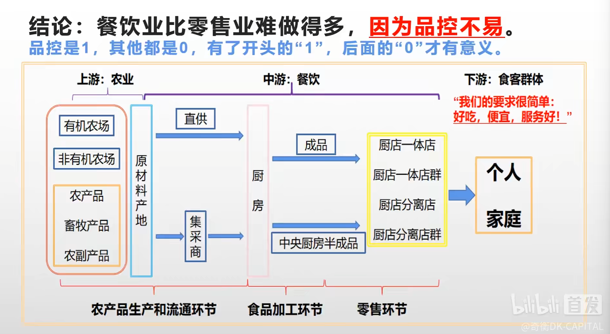

市场为什么会价值回归？因为市场不够钱，所以只能板块轮动。价值回归是板块轮动概念。

而市场有足够的钱时，没有打折的股票。（巴菲特时代）

而市场彻底没钱的时候，打多少折都不会价值回归（杰西利维摩尔自杀时）

1934年，本杰明格雷厄姆写下《证券分析》，总结了上述三句话的第一句。总结为一个原则就是息价原则。

一种投资方法之所以有理，是因为它逻辑严谨；

而这种投资方法之所以有用，是因为市场上使用这种方法的人掌握定价权

内在价值就像幽灵，人人都在谈论它，但谁都没有真正见过他。而能力圈，就是懂行者给不懂行者下的圈套。

资本主义的问题在于资本家本身的贪得无厌

君子爱财，取之有道

## 林奇拾贝

### 第一课，美体小铺 

关注生意本身的进展，而不是市场对这门生意的看法

定性分析先于定量分析。
如果一门生意从一开始就逻辑不清晰，那么后续投入再多的钱都是自找麻烦

最后才是估值，不要还没搞懂生意本身，就满嘴市盈率

市盈率不应该超过收益增长率

市盈率不适合用于分析持续扩张的业态

### 案例二，亚马逊

企业做大做强，是分钱分对了。

### 第二课：沃尔玛

创业一定要先搞清楚自己选择的赛道的产品需求曲线是什么样子的

垂直市场是新进入者切入零售行业的入口，但死守垂直市场的零售、品牌商，要么被收购，要么死路一条

纯粹做渠道、不自产自销的零售连锁，实在想象不出来如何实现盈利

沃尔玛折扣店商业模式的根基是“蝗虫线”（需求曲线的一种）

连锁超市死于持续的通货膨胀：

因为它无法提价，但供应商开始提价时，它又被迫提价

在持续通胀环境下，折扣店开着开着就没了。

谁长期持有/经营，谁倒霉。

要么保持客群而不提价，卖货亏差价。

要么保持利润而提价，逐渐流失客群

### DLC 4：7-11

7-11店=货架+柜台+自助设备

因此，7-11店可以卖更多高毛利的半成品和纯服务

### 第四课：家得宝

家装是一门长期低频、短期窗口期高频的生意。

家装是完整周期里不赚钱的服务行业。

真正的盈利模式在于建材批发的零售。

家装服务是为建材生意引流接单。

—— 奇衡 DK

美国已经过了家装DIY时代，
自发到店买建材自用的客户越来越少，
沃尔玛在家装服务方面没优势

批发零售的尽头是仓储物流

如果有人直接布局零售第三阶段并存活下来，

那么将会最终胜出

市场竞争是理性人的陷阱，而通过预判对手的预判做出的非理性行为，是摆脱“亚当斯密陷阱”的唯一方法。

**打得过你就打，打不过就换个打得过的维度继续打**

### 第五课：全食超市

与营销相比，品控才是餐饮业成功的关键。

吃进肚子里的东西，如果品控不行，任何理念都不香了

喊着健康的口号对产品定高价，就是收智商税

对餐饮业的企业家来说，最重要的社会责任不是去教大家怎么生活，而是做好店内的品控。创业和投资，品控维度上应设置一票否决，远离“喷射战士基地”。

品控是1，其他都是0，有了开头的“1”，后面的“0”才有意义 

### DLC5：星巴克和瑞幸

