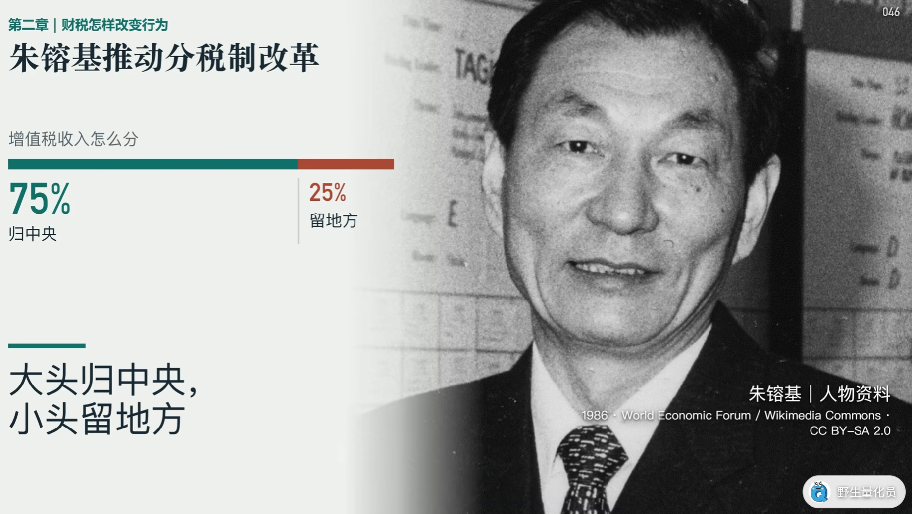
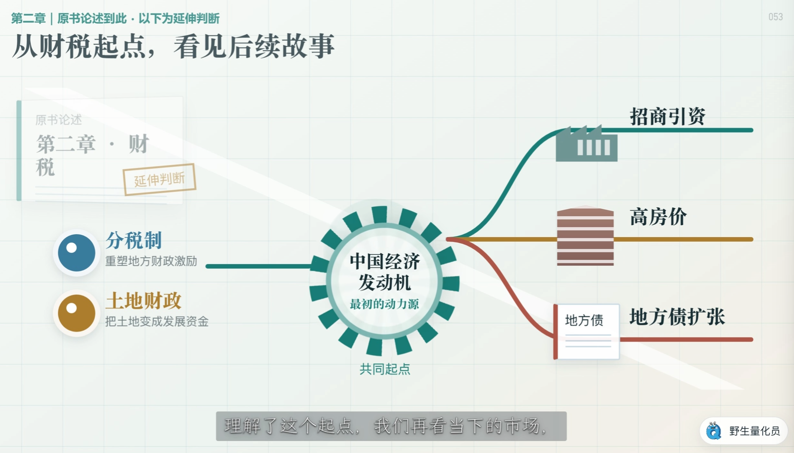

## 第一章

政府是裁判员也是运动员，戒掉政策原教旨主义

需要评估政策是否符合地方政府和执行者的利益，否则会遇到软阻力

如果企业盈利来自政府补贴，后续很可能泥沙俱下

不要迷信写在纸面上的事情，当规则模糊不清，情况复杂的时候，谁有权拍板，谁就掌握了真正的权力

## 第二章：财税与政府行为，分税制改革

增值税大头交给中央

新的财源是土地

政府低价征收土地，高价卖给企业收取土地出让金

广义土地财政占89%财政支出

地方政府没有土地财政就很难有钱

房价下跌是因为土地财政的旧引擎已经失效

抛弃房价永远涨的执念

警惕地方政府的隐性债务风险

关注税制改革带来的新机会

投资转向金融资产

分税制改革重塑了中央和地方的财政关系，深刻改变了地方政府的经济发展方式

