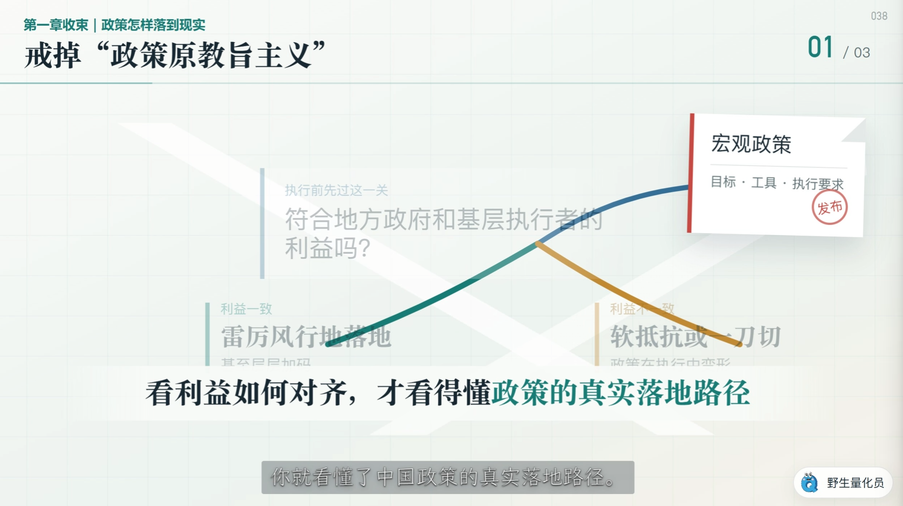
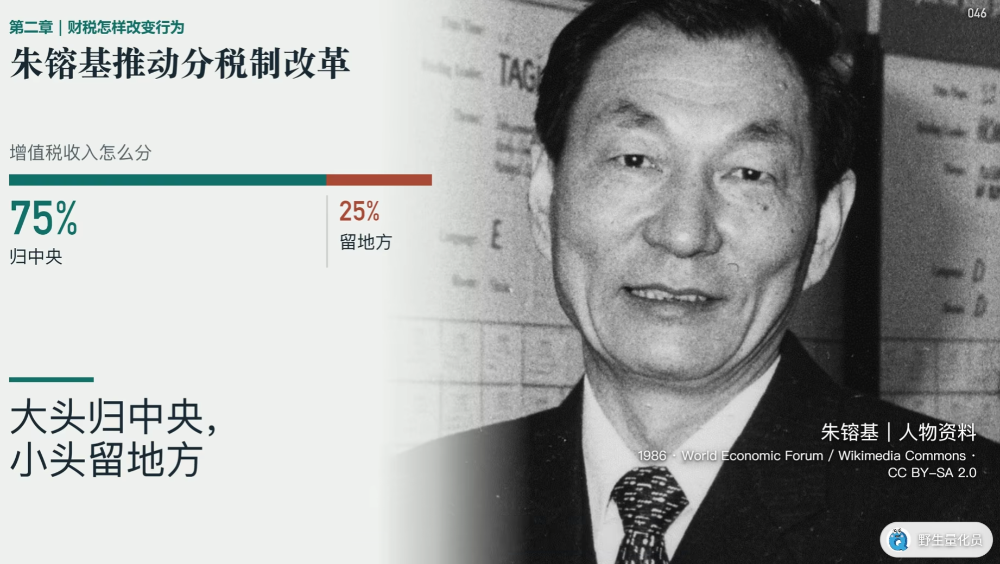
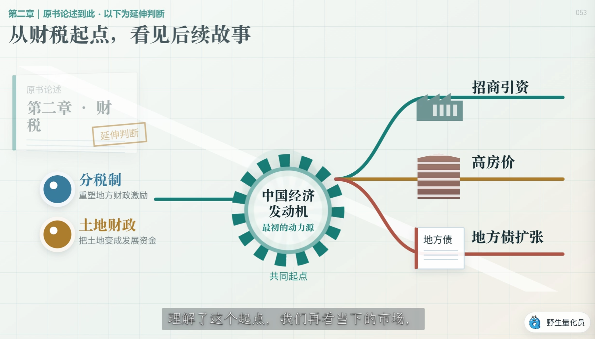
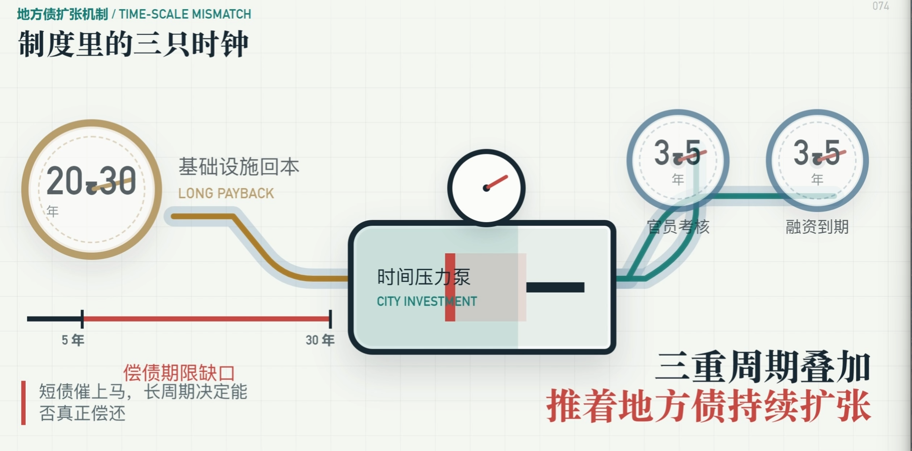
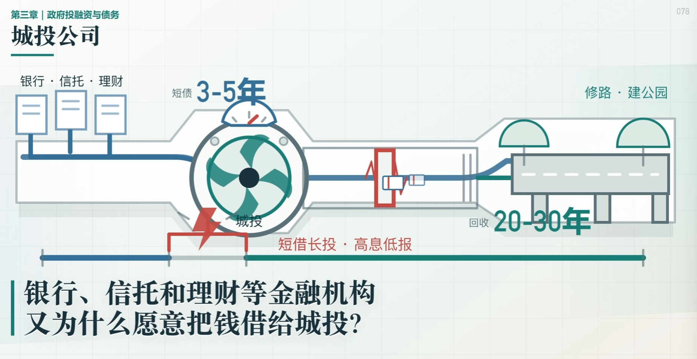
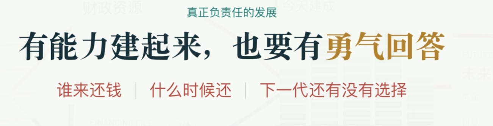

## 第一章

政府是裁判员也是运动员，戒掉政策原教旨主义

需要评估政策是否符合地方政府和执行者的利益，否则会遇到软阻力

如果企业盈利来自政府补贴，后续很可能泥沙俱下

不要迷信写在纸面上的事情，当规则模糊不清，情况复杂的时候，谁有权拍板，谁就掌握了真正的权力

## 第二章：财税与政府行为，分税制改革

增值税大头交给中央

新的财源是土地

政府低价征收土地，高价卖给企业收取土地出让金

广义土地财政占89%财政支出

地方政府没有土地财政就很难有钱

房价下跌是因为土地财政的旧引擎已经失效

抛弃房价永远涨的执念

警惕地方政府的隐性债务风险

关注税制改革带来的新机会

投资转向金融资产

分税制改革重塑了中央和地方的财政关系，深刻改变了地方政府的经济发展方式

## 第三章：政府投融资与债务

土地怎样变成杠杆

土地财政怎么演变成土地金融

**正反馈循环**

土地注资 -> 抵押融资 -> 基建升值 -> 再融资

地方真正风险不是还不起而是期限错配

如果房价地价不涨就会资金链断裂

地方需要打破刚兑

土地金融循环建立在地价不能持续下跌，借来的钱需要现金流还钱

很多基础设施是无效的，难以收回成本导致还不上款

认为政府一定会兜底导致大量资金流向城投债

中央不兜底，地方债务自行消化

土地既是地方政府重要的财政资源，也是撬动融资的重要资产；

土地财政和土地金融共同塑造的地方政府的投资方式。

债务表上的数字看起来冰冷，背后却是今天修好的道路和明天必须偿还的账单。

## 第四章：政府怎么样推动工业化

招商引资，搞工业化

中国经济奇迹中最硬核的部分

政府以极低价格出让土地的做法实际上是对制造业的巨额隐性补贴

会导致产能过剩

产能过剩不仅不是坏事，反而是产业崛起的必经之路

中国产业政策的成功不在于选对赢家而在于创造充分竞争

光伏新能源并没有投向一家企业而是投向全行业

## 第五章：房价、居民债务与贫富差距

房价的持续上行拉开了有房与无房的财富鸿沟

也提高了居民的债务，直接挤压消费能力，导致经济更依赖投资与出口

人口净流出的城市的房价会承压

优质的公共服务是房价的护城河

消费信心指数的核心价值在于提供情绪层面的“温度计”，而非精确的“计时器”。它最有效的用法，是与收入预期、就业数据、企业盈利趋势相互印证。如果信心指数回升，但企业盈利仍在恶化，那么这种回升可能只是短期波动；反之，若信心指数在低位企稳，同时企业盈利出现改善迹象，则可能构成更有力的底部反转验证。

## 第六章：去杠杆与金融风险

债务怎样化解

