# 专业投机原理

## 美元指数周期决定你一生的财富

https://www.bilibili.com/video/BV1U5411W7SZ

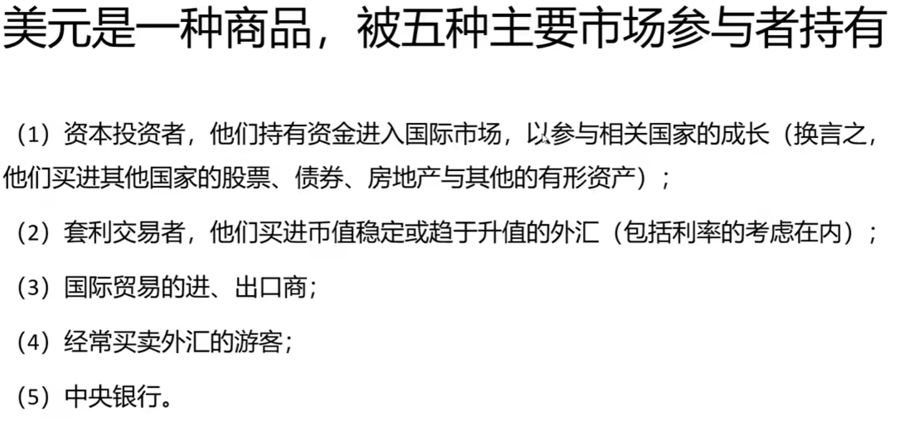


### 无节制的财政，终将导致美元指数创新低。


#### 1. 美元指数在共和党执政时会下跌，共和党对财政的无节制支出会导致美元指数下跌。


#### 2. 美元指数下跌，商品指数会上涨（路透crb商品指数，商品指数etf：DBC）


#### 3. 美元和欧元对着干

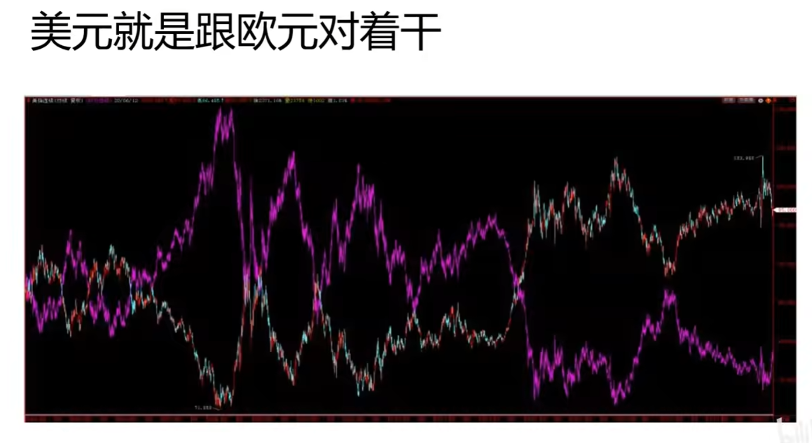

#### 4. 美元直接和原油互相影响

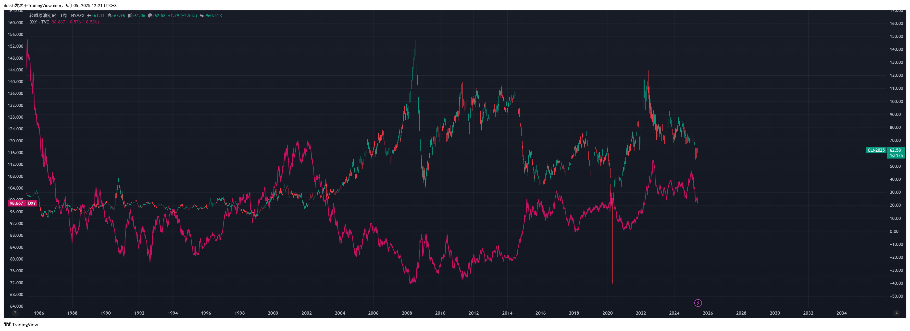


#### 5. 美元和黄金负相关，美元通过黄金来影响标普500，交易员通过黄金来对冲标普500的风险

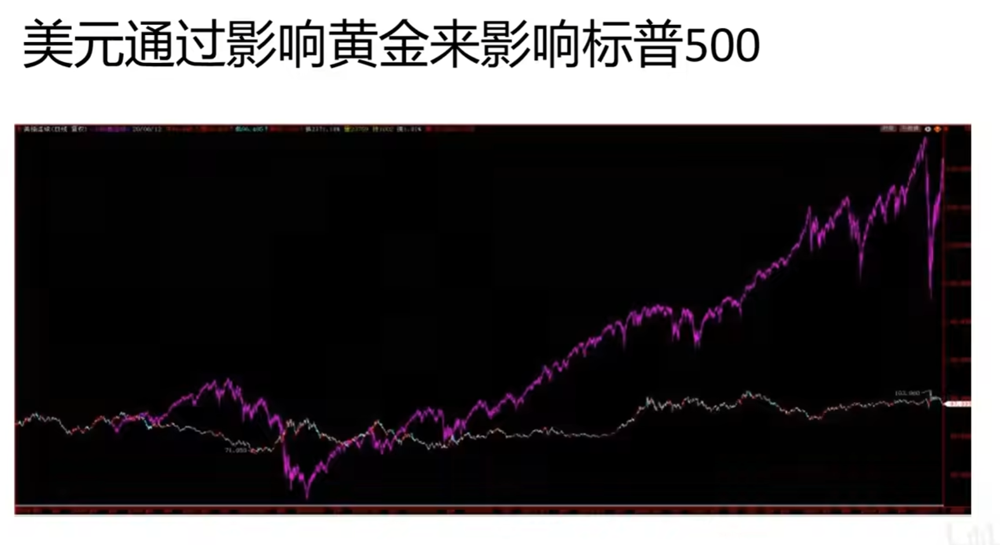

## “投机”投的是什么机？

https://www.bilibili.com/video/BV18v41167Mi


### 基于波动周期的角色界定

1. 交易者：日内交易，活动主要集中在盘中交易或短期趋势上，时间框架是数分钟到数星期之内。
2. 投机者：持有时间从几天到几个月，主要关注短期价格波动和市场情绪。
3. 投资者：持有时间从几个月到几年，关注长期趋势和基本面分析。

### 感悟

- 市场是公平的，涨跌概率是50%，但市场的参与者不公平。
- 当且仅当有人作弊时，市场才会不公平。
- 天平倾侧有两种利用方式：
  - 顺势下注继续倾侧
  - 逆势下注等待天平回归平衡

## 鳄鱼法则

https://www.bilibili.com/video/BV1UK4y147rY

鳄鱼法则——为回本而投入的钱再多也白搭

我有一个交易法则称为“鳄鱼法则”。这源自于鳄鱼的吞噬方式：**猎物愈试图挣扎，鳄鱼的收获便愈多**。假定一只鳄鱼咬住你的脚；它咬着你的脚并等待你挣扎。如果你用手臂试图挣脱你的脚，则它的嘴巴一张一合，便同时咬住你的脚与手臂。你愈挣扎，便陷得愈深。

当你知道自己犯错时，立即了结出场

万一鳄鱼咬住你的脚，务必记住：你唯一的机会便是牺牲一只脚。若以市场的言语表达，这项原则是：当你知道自己犯错时，立即了结出场，不可再找借口、期待、祷告或采取其他任何动作，赶紧离场。不可试图调整头寸、避险或其他无谓的措施；赶紧认赔出场！


## 批判地继承道氏理论

https://www.bilibili.com/video/BV1Ak4y1B7ku

### 股指的真正作用--识别资金流进流出

- 当市场主要股指创新高（低）的时候，代表资金流进（出）
- 当市场主要股指升（跌）穿年线的时候，代表资金流进（出）
- 当市场主要股指相互验证的时候，代表资金流进（出）势不可挡

## 趋势

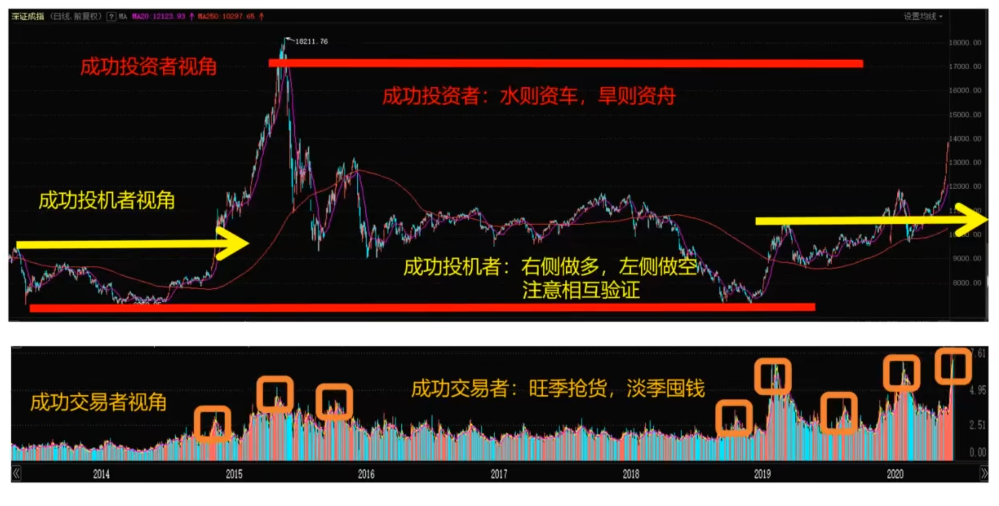

### 如果是投资，那么眼中只需要有区间

相对低估建仓，相对高估减仓。建仓不止损，水则资车，旱则资舟


### 如果是投机，那么眼中只需要有趋势

右侧做多，左侧做空。注意相互验证。


### 如果是交易，那么眼中只需要成交量

旺季抢货，淡季囤钱，放量买，放量卖。注意成交量的变化。


## 2B法则

### 在上升趋势中，如果价格已经创新高而未能持续上升，稍后又跌破前先高点，则趋势可能发生反转


### 下跌趋势亦然 

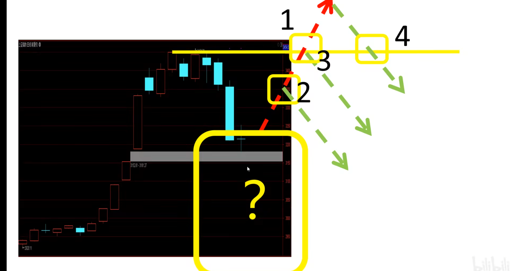

看人气，人气足，右侧做多，薄止损。快速创新高，继续持有。


## 交易守则

### 根据计划进行交易，并严格遵守计划

首先决定你的时间结构。

当日交易者：日内交易，活动主要集中在盘中交易或短期趋势上，时间框架是数分钟到数小时之内。
短线交易者：持有时间从几天到几周。
中线交易者：持有时间从几周到几个月。
长线交易者：持有时间从几个月到几年。

### 顺势交易，“趋势是你的朋友”

### 在许可的范围内，尽可能使用停损单


### 一旦心在怀疑，立即出场


### 务必要有耐心，不可过度扩张交易


### 迅速认赔，让获利的头寸持续发展


### 在弱势中买进，在强势中卖出。应该以买进的意愿来同等对待卖出。

### 在多头市场的初期阶段，应该扮演投资者的角色。在多头市场的后期与空头市场中，应该扮演投机者的角色。


### 不可摊平亏损--亏损的头寸不可以加码

除非左侧不加杠杆定投指数基金

空头市场：运行在年线下方，低仓位，不带杠杆，尽可能不长期持有，做短线


### 价格变动迅速时，不可建立头寸


### 不可根据特殊情报交易。换言之“顺势交易，而不是顺着朋友的意见”。另外，不论你对某只股票或某个市场有多么强烈的感觉，也不可以提供免费消息或意见。


### 永远得分析自己的错误

### 务必提防“错误的并购消息”

### 如果一笔交易的成功与否，必须取决于交易指令的正确执行，则不该从事该笔交易。


### 必须要保有自己的交易记录

## 只在高流动性的市场交易

守则12

## 交易就像减肥，大部分人都以失败告终

- 情绪与理性同时主宰人类行为
- 情绪与理性互不关联，需要独立操控
- 情绪盯着看得见的东西，理性聚焦看不见的东西
- 解决方案：备忘录、量化算法、回忆痛苦经验

第六感：人的本能，观察一言一行与正常水平的乖离产生的感觉

### 右侧做空

做空的时候，即使看对了，大投行和大机构有足够的资金扭曲1-2天的行情，他们会在你面前拉高价格形成假突破，打掉大部分人的损，甚至诱使你反手买入。左侧做空的风险在于，你可能会被迫平仓。不能在盘面平静的时候积攒仓位，要在有大额抛单，刚开始下跌的时候再做空。

## 如何在不具备完整的知识的前提下执行交易

### 减法

- 理念：当A和B是一个硬币的两面时，没有证据证明A发生，那么我们就默认现在处于B状态。
- 常见误区：找证据证明现在处于A还是处于B
- 应用：当一个国家的主要股指处于年线上方的时候，无论是不是牛市，都当作牛市来做；处于年线下方时，无论是不是熊市，都当作熊市来做。 

### 校验

- 理念：厨房里面不会有一只蟑螂。
- 常见误区：盯着看蟑螂，试图找到它们的踪迹。
- 应用：当一个国家处于牛（熊）市时，它的主要股指方向都相同。如果有一个股指方向和其他股指不一致，那么就产生了矛盾。此时需要校验其他股指的方向，直到所有股指方向一致。

### 底线

- 理念：进退有据
- 常见误区：持仓没底线
- 应用:大级别周期下，前期高点和前期低点作为重要参考

### 总结

以少胜多--做减法

以全克偏--做校验

以静制动--设底线

## 维克多三大指导原则

1. 大体而言，市场走势是基本经济力量运作的结果，后者又是政治活动与决策的后果。
2. 如果我们知道如何观察，过去的事件可以反映未来的事件。
3. 在市场中获利的关键，是判定既有的错误理念，观察它的发展，并在他人尚沉迷于这些错误理念时，采取果断的行动。

## 奇衡经济学

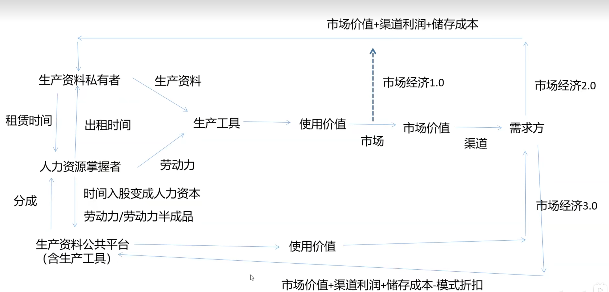


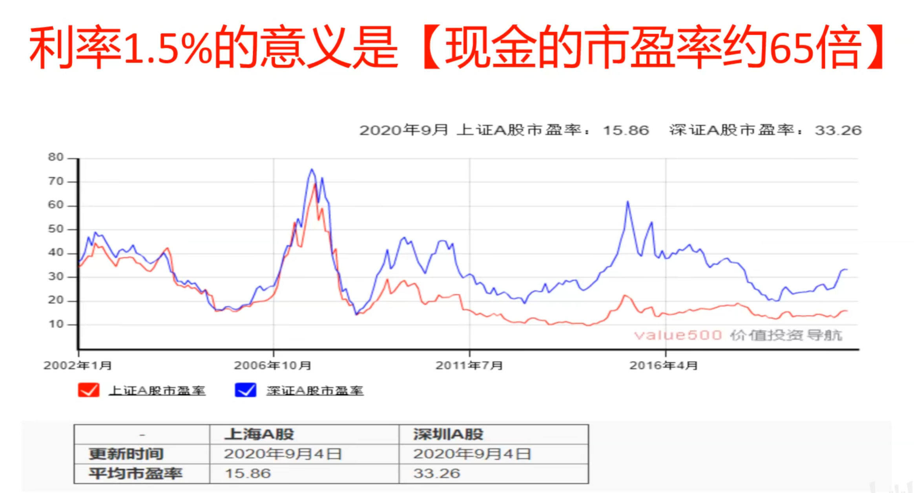


## 人生指导

### 如何知道自己值多少钱

- 人生游戏的第一关：一条命，装备全靠捡
- 在第一关里，你最值钱的资产是你自己
- 资产的定义：能为你带来正现金流的东西
- 资产的估值是用现金流来计算的
- 在第一关里面，你的价值也是用你能创造的现金流来计算
- 用每年创造的价值除以无风险收益率

### 如何实现财务自由

- 第一步，投资你自己，提高生命出租的回报，掌握前人知识
- 第二步，从社会给你的青春补偿金和精神损失费中积累储蓄
- 第三步，100,000与500,000的区别就是资金和资本的区别
- 第四步，学会使用杠杆，但要亏得起
- 第五步，在风口对着你的时候，刚好使用杠杆
- 第六步，在大赚一笔之后，落袋为安，创造睡后收入，重新开始
- 记住：社会是奖励冒险家的，奖励方式是财富转移

先打工，储蓄，学投资，投资的目的是学会如何使用杠杆

### 财务自由实现不了，怎么办

- 情况一：财务自由的标准水涨船高
- 解决方案：从追求净资产目标改变为追求净现金流目标
- 找矿，不如开发印钞机
- 情况二：找不准风口，更不敢用杠杆
- 解决方案：绝大数人都如此，记住一句话：
- 找到只需要花时间而不花钱的低投入项目，开始积累个人品牌

## 行情一般有四个阶段


持仓人少=抛压越轻=上涨压力小=上涨空间大

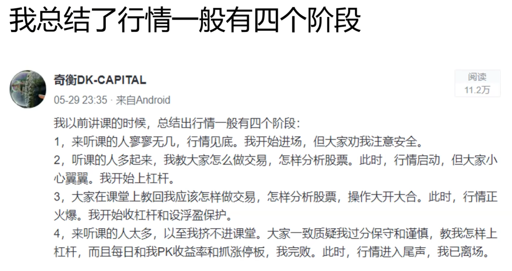

行情好的时候，人人是股神。

行情不好的时候，先杀高市盈率的。

这里蕴涵着两点启示。第一，当分析家认为某只股票的“价值合理”时，务必记住，价值究竟如何，只有市场说了才算数。价值是一种主观的东西，它不断变化。重点仅在于市场是否认同分析家的评估，就是如此而已。第二，如果你相信某只股票或某类股票的“价格高估”，你必须确定你的分析已经把市场中绝大多数人的看法考虑在内。戴高乐（Charles DeGaulle）曾经说过：“条约就像玫瑰花与年轻的女孩一样，只有当它们持续有效时，它们才持续有效。”将“条约”换成“趋势”，这句话仍然有效。有一条古老的交易法则，即“情况没有变化时，便没有变化”，这是绝对的真理。不可把市场远远地抛弃在后面。接受索罗斯的劝告，顺着谬误的趋势交易，而在真相大白以前离开。
 
心法：
- 行情没有变化的时候，就是没有变化
- 行情一旦出现不确定性，即使还没有风险，也主动回避

## 货币、信用与经济循环

### 一次经济/价格泡沫产生的基本要素：

1. 一个新事物，谁也不知道它值多少钱
2. 要有供求双方
3. 要信息发达
4. 要有信贷介入
5. 要有外部资金
6. 没有政策打压

### 天然公认的一般等价物是不存在的

- 货币是一种经济管理工具，详见《管子》，黄金是基于金本位的货币，现在处于小金本位，弹性兑付货币。
- 放松银根，水涨船高；收紧银根，水落石出。
- 如何理解一国购买另一国商品以替代本国生产的举措，通过出口商品赚外汇，荒废农业生产，通过外汇进口粮食，此时外国停止供应粮食，这个时候本国陷入不好的境地。
- 关注“谁拿到了新发的货币”，别打存量货币的主意。（18年的btc，20年的新能源汽车，23年的AI）

### 如何理解利率

- 为什么贷款一定要有本金和利息？如果无利息，借钱人承担全部风险，贷款人无风险。
- 为什么有人愿意放贷？借贷人通过利息来补偿风险，抵押贷款人通过抵押品来补偿风险。
- 什么是市场毛利率？贷款市场利率。
- 利率如何定价？货币的报价。
- 卖方利率=成本利率+违约概率+市场供需因子。
- 买方利率=央行基准利率+市场供需因子。

### 如何理解经济循环

- 财富不断产生，也不断消费，不断损耗，最后积聚在少数人手上。
- 在银根紧缩时有抵押物融资以清算价买入别人的资产、
- 又在银根放松时可以按照市场价卖出别人追捧的资产者，富。
- 在银根放松时过度扩张信用、以致于在银根收紧时只能按清算价卖出资产者，贫。
- 无法按照清算价买资产者，直接输掉下一个回合。

### 《黄金、h股和中证500》

黄金ETF(SH518880)

H股ETF(SH510900)

中证500ETF(SH510500)$


一、黄金——关键词：逼仓

1、黄金天然是货币。如何理解这句每个读过高一政治课本的人都知道的平平无奇的一句话？金本位的真面目是一种信用货币和商品黄金周期性挂钩和脱钩的动态财富估值体系。世界经济一直处于这种“周期金本位”之中——各国彼此信任时，接受政府信用（纸币）交易（英镑、美元崛起）；各国彼此怀疑时，只看黄金储备（一、二战期间）。巴菲特活了89年，见证过布雷顿森林版本的“美元代币”金本位建立，也见证了牙买加体系替代布雷顿森林体系后的美元“放飞自我”。他知道，谁是世界第一大强国，谁就有权定义“金本位的具体形态”。根据我的经验，所有能在美国主流交易所上市的品种，都是美国默许的美元计价财富载体，因为有具体的需求（注：国债、黄金、原油、比特币……）。不要问为什么是这样，因为当前世界货币体系本身就是美元霸权，是美国根据自身战略意图建立的。金融学之所以不能被认为是科学，是因为它本身由一系列人为制定的规则构成，加入数学和逻辑是为了让更多的人信服和理解，真正的诡计隐蔽在前提假设里面。之所以叫“霸权”，是因为这是一个你不想玩也得玩的游戏，你只能选择怎样趋利避害，不能选择“不玩”。综上，说“黄金天然是货币”，因为马克思发现了金本位的霸权真相。这句话还包含了两层意思：（1）大金本位：在周期金本位格局下，谁想成为世界货币，谁就要和黄金挂钩，这样才能得到数代人都以黄金为财富载体的各大利益集团和西方列强国家认可，得以广泛流通；（2）小金本位：谁都可以在美国的期货交易所用美元买到他所想要数量的黄金，即从布雷顿森林体系的“刚性兑付”变成牙买加体系后的“无限担保”。美国需要无限的黄金现货供应来打压来自全球的多头，以维持美元的信用，而这些现货主要来自英国的伦敦金市。


2、小金本位的弱点。007系列电影除了最早揭示“反派死于话多”的真理之外，还在牙买加体系建立（1972）前就揭示了“小金本位”的关键弱点。1964年9月上映的《007硬掰金手指》（自己译的）里，电影里面，反派“金手指”的“大满贯计划”就是（1）黑市溢价收黄金来囤积；（2）在美国最大金库附近放毒气，然后袭击金库，不是抢黄金，而是在里面放核弹，让世界主要的黄金储备受到辐射60年不能流通；（3）反派在黑市对黄金囤货归边，提价十倍。大家可能看完电影就算了，但我会思考——金手指在黑市对黄金提价十倍，是在逼迫谁买单？即翻译成金融术语：囤货归边逼谁的仓？看过上一段文字就知道，英美为了维持世界霸权，会全力打压黄金。所以，囤货归边就是为了最终让英美买单——黄金价格飞涨，会令市场越来越担心纸币会变成废纸，就像上证指数2015年飞涨会让A股股民怀疑自己以前怪错了“要你命3000”一样。所以，女王要派肖恩康纳利去把“金手指”收拾掉嘛。如果是美国拍的电影，估计是要派汤姆克鲁斯去。但是，不得不说，这个反派背后的真正主谋（《金手指》的编剧和原著作者伊恩弗莱明）是真正理解“小金本位”的弱点的——从刚性兑付变成无限担保，只是缓解了“美国黄金不足”的困境，而无法改变“美国黄金不足”的事实。只要全球的多头集中力量去冲击黄金市场，美国期货交易所的交割库可能无法按时交出足够的现货金，连“无限担保”都无法实现，只能选择“限仓”之类的“违约”手段。而让美国期货交易所（它是空头的隐性担保人，因为是场内集中交易所）无法按时足额交割黄金的关键手段就是切断世界的物流。在美国控制范围外囤积黄金，中俄分别使用开设交易所和央行入市买金的手段，都无法实现对美国小金本位进行逼仓，但本次全球卫生安全事件实现了。


3、黄金定价和逼仓。我们日常生活已经不使用银两和金锭了，使用什么货币已经被严格规定，而能选的只有支付方式（手机还是现金）和储藏手段（买房还是买股）。国与国之间，使用的货币选择也是有限的：美元还是黄金。美元的国际“支付宝”叫做SWIFT，用于国际结算，几乎与牙买加体系同时建立。而配套建立的，还有美国的COMEX黄金期货市场。整个游戏的逻辑是【放心在SWIFT用美元刷卡吧，你拿着美元找我要黄金，我用COMEX按时足量在全世界给你找来，你要得多要得急，就多给手续费咯（盘口价差和流动性溢价）】，这就是“小金本位”。我们一直都在弱联系的金本位内，而且金本位有可能随时进入强周期。这就是为什么在纸币泛滥的现代经济环境下，老掉牙的黄金依然是大家关注的热点。为什么黄金没有涨到天上去呢？因为一直有人在盘口抛黄金——市场要多少，这个“人”就抛多少，谁想做多逼仓就打爆谁的仓。如何压制黄金价格？很简单，只要让全世界的主要财富持有者相信，黄金持续供过于求，因为供过于求的东西没有囤积居奇的价值。如何实现？（当年白银被逼仓，就是因为亨特兄弟成功说服中东富国，白银供不应求，让土豪参与囤积居奇抗通胀）在金融市场上，出现源源不断的抛压，谁做多就灭谁。如何降低做空的成本？在金融衍生品市场用杠杆和卖空机制——保证金制度意味着可以通过国际投行的授信来实现远超本金规模的货量控制。而卖空机制意味着空头主力可以先做空，然后到临近交割的时候，再向黄金生产商买进黄金。当然，它们可能很早就签了类似“长协价”的定价合同，锁定了远期的购金成本。（注：衍生品分为远期、期货、期权和互换，而远期是到期结算的，不用每日无负债结算，期货则是每日无负债结算）2013年以来每年，黄金期货市场的空头就已经早早建立做空头寸，把多头都打趴下，临近到期时再从黄金生产商那里买现货金来运到交易所交割。当然，里面有相当一部分空头头寸，在明面上都是套期保值的头寸，否则会被交易所以操纵市场等罪状拉出午门斩首（摩根大通收购了贝尔斯登，接手它的白银庄家地位，一开始采取操纵压价，被交易所强力打压，后来就变成套期保值，得到交易所认可而合法化，对任何多头进行无情剿灭，而且对多头的官司也百战百胜）。但是，如果这些空头最终无法按时足额交割黄金，怎么办？如果无法交割，那么空头就要毁约。在期货交易所毁约，后果就像John Wick在杀手组织的中立酒店里开枪厮杀一样，会被组织（交易所）重罚。因此，为了游戏次年可以继续玩下去，空头会不惜一切代价从期货市场把空单平仓，这是期货价格，尤其是近月的期货价格就会飙升。如果有人或者一群人有足够实力，就会和空头抢盘口的单来做多，进行逼仓。这叫囤货归边。一般来说，全球物流没问题的话，全球金矿商会把每年的产出如期交付先借黄金抛出的“人”，让他们归还黄金。如果不理解，可以看看《大时代》，方展博破的“六股局”就是他发现庄家根本手上没货，全部都是靠从券商借股票来抛出，采取“以本伤人”的策略屠杀多头。一旦联合全市场来逼仓，庄家就没有足够的钱把股票买回去还给券商。

囤货归边有两种，一种是利用市场的供应短缺杀对手一个措手不及，另一种是蓄谋已久的请君入瓮和关门打狗。目前，疫情在全球肆虐导致物流短暂中断，市场的多头会利用实物黄金无法如期运至交割仓库的契机，杀空头一个措手不及。近期现货黄金报价在各经纪商平台出现异常波动，报价缺失与报价失真等问题，而且，黄金期货和现货市场发生了多年罕见的价格断层，期现溢价一度升至十多年来的最高水平。现货市场的买卖报价差异飙升至平日的十多倍。Comex近月合约临近交割，金价波动幅度增大加现货流通紧张导致逼仓；部分欧洲冶炼厂因为疫情影响关闭，生产企业在现货市场鲜有报价和成交，导致伦敦金的报价失真。俄罗斯央行停止买入黄金，增加俄罗斯每年生产黄金的出口，主要流向英国——伦敦是世界最大的现货金市场。问题是，整个大宗商品市场，从CRB指数来看，已经低迷了五年。矿商的产能在不断压缩，行业在不断整合，商品的供过于求的关系已经处于非常敏感的变盘临界。在纸币泛滥的环境下，多头买下所有可交割库存也不需要多少钱，那时候空头还有没有安身立命的寸土？我不敢轻易参与逼仓，因为我怕007来收拾我，joking。

2020年，我会以年线作为基准择机买一点黄金ETF（518880），毕竟英美黄金库存紧张不用怕，我们还有上海黄金交易所库存。黄金不能生息，对我没有什么用，但它在特定的供求背景下随时可能选择突破方向。

二、H股——关键词：破净


曾经恒生指数跌破24000，风声鹤唳。但是，大家却很少去关注，历史上，像1998年、2008年、2013年和2016年这些年份，港股市场都出现某个维度的整体破净现象，随后一轮行情由此展开，也无风雨也无晴。这个事情比黄金好理解多了。H股是在香港上市的国内公司，打开F10一看，除了腾讯，基本上就是一只沪深300指数的翻版。想配置大金融，但是又嫌沪深300调整不够充分的，可以考虑H股的指数来替代。道理很简单——同款酸奶，沃尔玛打八折，我为什么要去家乐福原价买？如果我要买沪深300，我会考虑用H股ETF（510900）去替代。港股市场非常成熟，平时都定价很合理，所以一定要趁恐慌的时候下手，买在人心惶惶时。这就是价值投资。

三、中证500——关键词：等权重

定投中证500ETF，继续使用这种“左侧收筹码，右侧上杠杆”的策略，这是结合融资融券制度开发的升级版定投手法，是像“天翔龙闪”一样全无空隙的二段攻击战术。如果配置了H股ETF去替代沪深300，那么加上中证500就凑成了中证800指数，这样基本上实现对A股市场的全覆盖。在中长期利率下行的周期里，不会错过随时发生的资产价格泡沫。如果单纯持有中证500，那么它的等权重特征可以防止权重股的短期极端波动带来指数的短期极端波动——当然，你所放弃的风险，就是你所放弃的超额收益。得与失，要根据自己的风险偏好和承受能力评估后选择。不懂选择怎么办？坚持定投，买到大涨为止，做多中国。

## 纪念约翰罗--税收、财政支出与债务

《国富论》和《道德情操论》一起看。

《国富论》《资本论》《就业、利息和货币通论》的源头是《论货币与贸易》

《论货币与贸易》的思想体现在密西西比泡沫

物物交换 → 小范围一般等价物 → 随着国家领土扩大，一般等价物的承认，范围在不断扩大 → 货币 → 金本位（西方）和银本位（东方）

贵金属本位的优点是购买力稳定，信用极强，缺点是经济扩张时通货紧缩，没有足够的货币代表新增财富，经济不扩张，新发现金矿导致通货膨胀。欧洲人发现新大陆，从美洲运送黄金回欧洲，引发通货膨胀。

贵金属本位下，国王一直缺钱，一直向贵族和商人借钱，要么不还，要么不断重铸货币减少含金量。

贵族和商人不再借钱给国王，把钱存在民间金匠铺，用存金凭据代表财富或用于支付。

约翰罗的父亲就是金匠铺的老板，而金匠铺就变成了现代银行的雏形，他在荷兰有丰富的银行从业经验。

约翰罗实践中发现，金匠铺根本不需要把存金和凭据一一对应，因为几乎不可能所有人同时取。如果银行由国家来经营，那么可以发行超出存金部分的凭据（凯恩斯《通论》的思想源泉），去加速贸易周转从而增加国家财富（亚当斯密《国富论》的思想源泉）。

> 其他人：长远来看经济总会回归均衡，刺激经济做法只会将现在的问题拖到未来
> 
> 凯恩斯：长期来看我们都死了

### 实践

法国摄政王正为巨额国债发愁，他宣布大幅减少铸币含金量的赖账计划已经失败。听完约翰罗的方案，他决定利用约翰罗来帮他实现债务处置。于是，约翰罗成为当时法国的CFO。（后世所有债务处置方案的源泉）


约翰罗要解决的问题：
新发行的货币超出了金本位的支撑，应该用什么作为担保物？

约翰罗的解决方案：
1. 成立通用银行，获得官方独家印钞权，数月后宣布更名为“皇家银行”，印钞与金银脱钩。（这是美国建立金本位后又和黄金脱钩的剧本来源）
2. 成立密西西比公司，获得密西西比殖民地独家贸易垄断权——征税权。（这是后世所有概念炒作的剧本来源）

约翰罗的手段：第一步，密西西比公司IPO，为了稳住贵族，给予大幅打折的发行价，而对公众承诺稳定分红，允许大家拿手中的国债去兑换每一轮融资的新股。大众为什么买？因为荷兰东印度公司的成功。（这就是债转股的来源）

约翰罗的手段：第二步，密西西比公司新增东印度贸易垄断权，同时发行一轮一轮新股去回收旧国债。大众本来是法国的债主，在投机狂潮中都变成密西西比公司的股东。（这就是美国汉密尔顿“旋转门计划”的来源）

约翰罗的手段：第三步，用“皇家银行”印钞票去支撑密西西比公司的高股价。成功吸引全欧洲的黄金流入，疯狂追捧密西西比公司的股价。而约翰罗牵头，引导从股票投机狂潮中获利了结的人，把现金流向土地买卖。欧洲不断涌入的投机者使法国寸金尺土，纸醉金迷。（这就是美国通过纳斯达克泡沫引进全球资本的剧本来源）

约翰罗方案的成效：
1. 大众手中的法国国债几乎全部转换成股票；
2. 法国成功从资本汇兑项目引进全欧洲资本；
3. 法国土地升值，使贵族为首的土地拥有者财富剧增；
4. 法国的贸易和消费因为股市的财富效应而激增。

新发行的钞票以土地作为支撑；

新发行的股票以贸易利润垄断权作为支撑；

新引进的欧洲资本为法国带来大量的金银库存。

因为缺乏经验，所以约翰罗在关键时刻只顾买土地，
没有一鼓作气处理好前述三个支撑的问题：

1. 当土地泡沫超过了股市泡沫时，土地冻结了储蓄；
2. 当大众发现贸易垄断权被高估时，会挤兑股市；
3. 外资流入会导致超发货币（金银+土地+热钱金银），外资流出会导致市场货币紧缩，挤兑股市。

大众发现，密西西比与印度完全不是同一回事。逃回来的人让大众知道密西西比并非遍地黄金。

法国贵族要求以更低的定增价购买密西西比公司股票，被约翰罗拒绝，于是贵族带头挤兑约翰罗的皇家银行，引发恐慌。热钱加速流出导致约翰罗无法印钞票托市，他发现热钱通过民间途径走私黄金出境，才紧急禁止民间使用金银，引发全面恐慌。

这就是后世的蒙代尔不可能三角：约翰罗不能同时实现钞票汇率（国际价值）稳定、利率稳定（国内价值）和钞票跨境自由兑换。

如果他及时禁止欧洲投机客在获利了结后把黄金运走；（外汇管制）

如果他及时宣布法国货币汇率大幅贬值；（2014年普京稳住俄罗斯经济的手段）

如果他手中还有国有土地，他还可以宣布降息，同时实施推动国有土地招拍挂，增加市场流动性。

马克思批判约翰罗“纸币价值挂钩贸易需求”的观点，认为纸币应该挂钩更恒定的东西——时间，于是创造了劳动价值论：在社会生产力水平稳定的前提下，价值由单位时间的劳动创造。劳动券可以抑制泡沫。

但是，社会生产力水平因科技进步而飞跃提升，导致单位时间劳动价值大幅下降，怎么办？

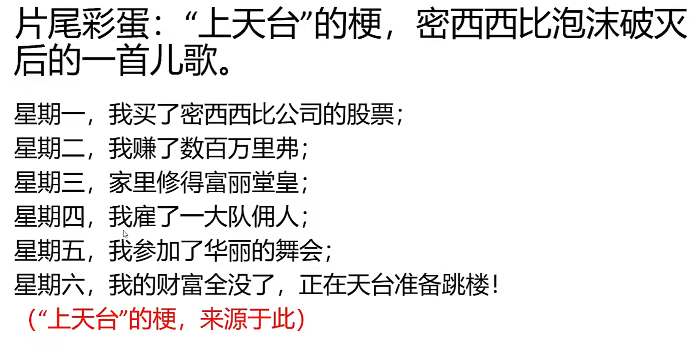

### 总结

欠100单位黄金，手中有10单位，发行值得90单位黄金的证券，新投资人购买，将100单位黄金用于还款，新发行的证券开始泡沫阶段。

所有的债务处置方法的源头就是密西西比泡沫。

目前最容易施行的债务处置，用新增的征税作为担保借新债还旧债，第二才是债转股

国债的终极抵押：征税

征税少，国债就有泡沫

## 技术分析

### 首个关注指标是品种年度适宜交易频率

- 专业玩家，把投资，投机和交易当作生意
- 做生意，一定要先计算成本。
- 这个成本主要是【即使不赚钱，都要支付的成本】
- 比如：1亿本金，每次“税费差”合计1%（盘口价差+交易佣金），若策略年周转接近100次，可以滚蛋了
- 必须降低交易频率，降低到与品种波动匹配。

### 年度全额周转次数小于或等于策略有利波动周期出现次数

1. 多久全额交易一次
2. 有策略吗？策略包含进场，出场，出场后再进场
3. 什么是有利波动？


### 计算年度适宜交易频率的目的

- 在沉闷的行情里面不要频繁交易
- 我要的不是方向，而是波动--在强势买入，在弱势卖出
- 波动必须达到一定的强度才能交易，例如：月线涨跌幅。

### 第二个关心的指标是利率

- 宏观分析乱入技术分析？
- 切记，技术分析是用来行动的，类似硬盘的读和写
- 利率是cpu，决定二级市场的整体走向

### 技术分析应用的基本原则

- 在中长期利率走低的背景下，找趋势指标的金叉做多，找震荡指标的顶钝化做多。
- 在中长期利率走高的背景下，找趋势指标的死叉做空，找震荡指标的底钝化做空。

好的，我们来详细解析一下这两句话的含义，并结合具体的技术指标进行分析。这两句话的核心是：**根据中长期利率的趋势方向，选择不同类型技术指标发出的信号进行交易，目标是顺应宏观趋势。**

**核心逻辑：**

1.  **中长期利率是主导背景：** 利率的长期趋势（走高或走低）反映了宏观经济基本面、货币政策预期和资金成本的变化，对大类资产（债券、股票、外汇、商品）价格有根本性影响。技术分析信号需要在这个宏观背景下解读才更有意义。
2.  **趋势指标 vs 震荡指标：**
    *   **趋势指标：** 旨在识别和跟踪价格的主要方向（上升趋势或下降趋势）。在强劲的趋势行情中表现最好。**当趋势确立时，它们发出的信号（金叉/死叉）更可靠。**
    *   **震荡指标：** 旨在识别短期超买或超卖状态以及可能的趋势衰竭点。在震荡市或趋势转换初期表现更敏感。**在强劲趋势中，它们发出的极端信号（钝化）可能不是反转信号，而是趋势延续的信号。**
3.  **信号选择与趋势匹配：**
    *   **顺趋势交易：** 在明确的中长期趋势背景下，优先选择顺应趋势方向的信号进行操作，风险相对较小，成功率更高。
    *   **指标信号的“悖论”解读：** 震荡指标在极端位置（超买/超卖）的持续（钝化），在强劲趋势中，往往不是反转信号，反而是趋势强劲、可能延续的信号。

**详细解析与指标应用：**

#### 场景一：中长期利率走低（例如：宽松货币政策，经济预期疲软）

*   **对资产的影响（一般情况）：**
    *   **债券价格上涨（收益率下降）：** 这是最直接的影响。
    *   **股票可能受益（估值提升）：** 低利率降低企业融资成本，提升股票估值。
    *   **黄金等避险/抗通胀资产可能受益：** 低利率环境降低持有黄金的机会成本，且宽松可能引发通胀担忧。
    *   **高增长/科技股可能更受益：** 其未来现金流折现价值更高。
*   **交易策略：**
    1.  **找趋势指标的金叉做多：**
        *   **含义：** 在利率下行（利好风险资产或债券本身）的背景下，寻找**趋势指标发出买入信号（金叉）**，作为**顺应趋势**的入场点。这通常是趋势启动或延续的信号。
        *   **具体指标示例：**
            *   **MACD (Moving Average Convergence Divergence)：**
                *   **金叉定义：** 快线（DIF）从下方穿越慢线（DEA）向上。
                *   **应用：** 在利率下行背景下（例如做多国债期货、做多股指），当MACD在零轴附近或上方出现金叉时，视为买入信号。这确认了价格上涨动能的增强，符合宏观背景。
            *   **均线系统 (Moving Averages)：**
                *   **金叉定义：** 短期均线（如5日、10日）从下方穿越长期均线（如50日、200日）向上。
                *   **应用：** 在利率下行背景下，价格回调至长期均线获得支撑后，短期均线上穿长期均线形成金叉，是重要的趋势延续买入信号（例如在股指或国债期货上）。
    2.  **找震荡指标的顶钝化做多：**
        *   **含义：** 在利率下行（潜在利好）的强劲上涨趋势中，当**震荡指标进入超买区并持续高位运行（顶钝化）**时，**不要轻易做空，反而可以视为趋势强劲的信号，寻找机会逢低做多或在突破时追多**。此时的“超买”可能只是强势的表现，并不意味着立即反转。
        *   **具体指标示例：**
            *   **KDJ / Stochastic Oscillator：**
                *   **顶钝化定义：** K线和D线持续运行在80以上的超买区域，即使价格短期回调，指标也拒绝快速跌回中性区域（50以下），或在超买区反复震荡。
                *   **应用：** 在利率下行推动的强劲牛市中（如债券牛市、股市牛市），KDJ在高位钝化，表明市场极度强势。此时不应盲目做空，而应等待价格短暂回调（指标可能从高位稍回落但仍在高位）或突破关键阻力位时寻找做多机会。做多信号需要结合其他因素（如趋势线支撑、量能）。
            *   **RSI (Relative Strength Index)：**
                *   **顶钝化定义：** RSI持续运行在70以上的超买区域，即使价格创新高，RSI也可能出现顶背离（价格新高，RSI不创新高），但在强劲趋势中，背离后价格仍可能继续上涨一段时间，钝化状态持续。
                *   **应用：** 与KDJ类似。在利率下行背景下的强趋势中，RSI高位钝化是强势特征。看到钝化或第一次顶背离就做空风险很大。更安全的做法是等待RSI从超买区有效回落（如跌破70甚至60）并结合价格形态（如跌破短期趋势线）才考虑趋势是否可能转变，否则仍以寻找做多机会为主。

**场景一总结：** 利率下行是利好背景。优先利用**趋势指标的金叉**捕捉顺应趋势的启动/延续点。同时，警惕**震荡指标的顶钝化**，此时它**不是做空信号，反而是趋势强劲的警示，应避免逆势做空，并可能在回调或突破时寻找顺趋势（做多）的机会**。

---

#### 场景二：中长期利率走高（例如：紧缩货币政策，经济过热预期）

*   **对资产的影响（一般情况）：**
    *   **债券价格下跌（收益率上升）：** 最直接的影响。
    *   **股票可能承压（估值压缩）：** 高利率增加企业成本，降低股票估值。
    *   **成长股/科技股压力更大：** 对利率更敏感。
    *   **美元可能走强：** 高利率吸引资本流入。
    *   **黄金可能承压：** 高利率提升持有黄金的机会成本。
*   **交易策略：**
    1.  **找趋势指标的死叉做空：**
        *   **含义：** 在利率上行（利空风险资产或债券本身）的背景下，寻找**趋势指标发出卖出信号（死叉）**，作为**顺应趋势**的入场点。这通常是趋势启动或延续的信号。
        *   **具体指标示例：**
            *   **MACD：**
                *   **死叉定义：** 快线（DIF）从上方穿越慢线（DEA）向下。
                *   **应用：** 在利率上行背景下（例如做空国债期货、做空股指），当MACD在零轴附近或下方出现死叉时，视为卖出/做空信号。这确认了价格下跌动能的增强，符合宏观背景。
            *   **均线系统：**
                *   **死叉定义：** 短期均线（如5日、10日）从上方穿越长期均线（如50日、200日）向下。
                *   **应用：** 在利率上行背景下，价格反弹至长期均线遇到阻力后，短期均线下穿长期均线形成死叉，是重要的趋势延续做空信号（例如在股指或国债期货上）。
    2.  **找震荡指标的底钝化做空：**
        *   **含义：** 在利率上行（潜在利空）的强劲下跌趋势中，当**震荡指标进入超卖区并持续低位运行（底钝化）**时，**不要轻易做多，反而可以视为下跌趋势强劲的信号，寻找机会逢高做空或在破位时追空**。此时的“超卖”可能只是弱势的表现，并不意味着立即反转。
        *   **具体指标示例：**
            *   **KDJ / Stochastic Oscillator：**
                *   **底钝化定义：** K线和D线持续运行在20以下的超卖区域，即使价格短期反弹，指标也拒绝快速回到中性区域（50以上），或在超卖区反复震荡。
                *   **应用：** 在利率上行推动的强劲熊市中（如债券熊市、股市熊市），KDJ在低位钝化，表明市场极度弱势。此时不应盲目抄底做多，而应等待价格短暂反弹（指标可能从低位稍回升但仍在低位）或跌破关键支撑位时寻找做空机会。做空信号需要结合其他因素（如趋势线阻力、量能）。
            *   **RSI：**
                *   **底钝化定义：** RSI持续运行在30以下的超卖区域，即使价格创新低，RSI也可能出现底背离（价格新低，RSI不创新低），但在强劲下跌趋势中，背离后价格仍可能继续下跌一段时间，钝化状态持续。
                *   **应用：** 与KDJ类似。在利率上行背景下的强趋势中，RSI低位钝化是弱势特征。看到钝化或第一次底背离就做多风险很大。更安全的做法是等待RSI从超卖区有效回升（如升破30甚至40）并结合价格形态（如突破短期趋势线）才考虑趋势是否可能转变，否则仍以寻找做空机会为主。

**场景二总结：** 利率上行是利空背景。优先利用**趋势指标的死叉**捕捉顺应趋势的启动/延续点。同时，警惕**震荡指标的底钝化**，此时它**不是做多信号，反而是趋势（下跌）强劲的警示，应避免逆势做多，并可能在反弹或破位时寻找顺趋势（做空）的机会**。

**关键要点与注意事项：**

1.  **宏观背景优先：** 技术信号的有效性高度依赖于所处的宏观环境（利率趋势）。脱离背景机械使用金叉/死叉或超买/超卖信号容易出错。
2.  **趋势与震荡指标的辩证使用：**
    *   趋势指标（金叉/死叉）在**趋势确立时**是顺趋势操作的**核心信号**。
    *   震荡指标（顶/底钝化）在**强劲趋势中**发出的极端信号，**不应作为逆势操作的依据，反而应视为趋势强劲的确认，提示不要逆势操作，并可能为顺趋势操作提供（回调/反弹结束后的）入场参考点**。此时它们的价值在于提示“不要做什么”（不要逆势），而不是直接告诉你“做什么”。
3.  **信号确认：** 任何单一指标发出的信号都可能失效。务必结合：
    *   **多个指标共振：** 例如，MACD死叉的同时，价格跌破关键均线，且RSI处于下行趋势（即使未超卖）。
    *   **价格形态：** 支撑/阻力位、趋势线、通道、头肩顶/底等。
    *   **成交量：** 信号伴随的成交量变化能增加可信度（如死叉放量下跌）。
    *   **更大时间周期：** 周线、月线的趋势方向对日线操作至关重要。
4.  **风险管理：** 无论信号看起来多么完美，都必须设置止损。技术分析是概率游戏，没有100%准确的信号。
5.  **利率与资产关系并非绝对：** 虽然提供了“一般情况”下的影响，但现实中资产价格受多重因素影响（如利率上行初期可能因经济强劲利好股市，后期因估值压力利空；地缘政治等）。交易具体资产时，需深入分析该资产与利率关系的具体逻辑。
6.  **“做多”与“做空”的对象：** 策略适用于可以做空的市场（如股指期货、国债期货、外汇市场）。对于只能做多的市场（如A股个股），在利率上行背景下，“做空”策略可能体现为**空仓观望**或利用**趋势指标死叉/震荡指标底钝化作为卖出信号**。

**总结：**

这两句话提供了一种将宏观利率趋势分析与微观技术指标信号相结合的框架：

*   **利率走低 -> 潜在利好 -> 主思路做多：**
    *   用**趋势指标金叉**找多单入场点（顺趋势启动/延续）。
    *   看到**震荡指标顶钝化**，**不要做空**，理解为趋势强，可找机会**继续做多**（回调买或突破追）。
*   **利率走高 -> 潜在利空 -> 主思路做空：**
    *   用**趋势指标死叉**找空单入场点（顺趋势启动/延续）。
    *   看到**震荡指标底钝化**，**不要做多**，理解为趋势（跌）强，可找机会**继续做空**（反弹空或破位追）。

理解并灵活应用这种“顺大势（利率）、借指标（趋势/震荡）、巧解读（金叉/死叉 vs 钝化）”的逻辑，能显著提高技术交易在相应宏观环境下的胜率和风险控制能力。用于交易的指标不能用于判断大势。

>为什么不能用判断大势的指标去做交易？
>
>A：你在哪？
>
>B：我在一家麦当劳对面。
>
>A：那家麦当劳在哪？
>
>B：在我对面啊！
>
>你问你的技术指标：现在市场向上还是向下？
>
>技术指标显示：现在是金叉。
>
>你问你的技术指标：金叉要做多还是做空？
>
>技术指标显示：涨才会有金叉啊！
>
>你问你的技术指标：金叉我做多怎么亏了钱？
>
>技术指标显示：历史上金叉后面有可能涨，也有可能跌。

### 先大势，后指标

- 在上涨趋势里面找做多信号，
- 在下跌趋势里面找做空信号。
- 先发现趋势，后用指标交易。
- 趋势是事后才明朗的，所以用利率周期来粗略估计趋势的发展。
- 那些试图用技术指标来判断趋势的人，南辕北辙！
- 那些试图寻找超高胜率指标或参数的人，虚度光阴！
- 那些试图用技术指标来公开预测未来的人，自欺欺人！

### 技术指标的本质

- 价格是对成交状况的抽样，是瞬时值。
- 盘面上出现数百个价格，或许只有少数几个是关键点。
- 关键点的识别需要复杂的工序，意味着大多数人盯的价格是错的。
- 这些无效的价格在特定时间内在统计模型中呈现一定规律。
- 技术指标就是这些不稳定规律的量化反映。
- 技术指标又驱动着相信这些不稳定规律会一直稳定的人去交易。
- 当趋同行动者在同一时间足够多时，就会产生趋同驱动力。
- 趋同驱动力是瞬时的，但交易者的死穴就是认为效果长久。


### 如何选择合适的指标？

- 适者生存，谓之“合适”。
- 绝大多数人注定亏钱，这是因为绝大多数人的交易都是错的。
- 合适的技术指标就是那些多人用的技术指标，多人在的周期。
- 每个技术指标背后都是一个行为一致的群体。
- 例如：“均线爱好者联盟”、“MACD爱好者”，...，“缠论爱好联盟”
- 用缠论，赚钱少，教缠论，赚钱多
- 这些群体越大，对价格的趋同推动力就越强。
- 就如【现在创业赚钱不易，催生出一群赚创业者钱的人】
- 选择合适的技术指标--群体行动一致性越强越合适。
- 然后，去捕猎这群人。

### 使用技术指标的正确思路--捕猎使用技术指标的羊群

用趋势指标做震荡，用震荡指标做趋势


### 用趋势指标做震荡--吃一口就走

- 赚谁的钱
- 赚【认为技术指标可以判断长远将来、做对方向打死不走者】的钱 
- 怎么赚他们的钱？
- 进场时和他们一起用趋势指标进场
- 离场的时候你用震荡指标，承受卖飞的风险，把货倒给晚进场的人。
- 利润的本质是什么？（分析原则：你的利润是对手的亏损）。
- 趋势指标信众为了抓住趋势，必须承受反复假突破的成本。
- 他们当中只有不到20%能坚持下来（因为钱多、识广）


### 用震荡指标做趋势

- 赚谁的钱？
- 赚【踏空后不计成本进场、反向持仓不计成本止损者】的钱
- 怎么赚他们的钱？
- 震荡指标发生“本该反转却没有反转”的情景，而且波动继续扩大
- 离场时你用价量背离，承受卖飞的风险，把货倒给晚进场的人。
- 利润的本质是什么？（分析原则：你的利润是对手的亏损）。
- 震荡指标信众是一群喜欢逆市的人，在大势面前往往逆势。
- 震荡指标具备短期胜率高但是长期累计利润熬不住一波大亏的特征。
- 这个群体几乎都是新韭菜

### deepseek总结的具体操作手法

以下是对该交易策略的深度分析和实例说明，核心可总结为：**利用市场群体对技术指标的集体认知偏差实现反向猎杀**。

---

#### **策略核心逻辑拆解**
1. **趋势判定优先**  
   - 趋势需通过宏观因子（如利率周期）预判，而非技术指标。  
   - *例*：美联储加息周期中，长线看空美股；中国降息周期中，长线看多A股。  

2. **技术指标的本质是群体行为量化**  
   - 指标有效性源于使用者数量：越多人相信均线金叉看涨，金叉时买入力量越强。  
   - *群体行为规律*：  
     - 趋势指标信徒 → 在震荡市中反复止损（假突破）  
     - 震荡指标信徒 → 在趋势市中逆势操作（提前猜顶底）  

3. **盈利模式：猎杀指标信徒**  
   - **做震荡市**：利用趋势指标信徒的"执念"（认为假突破是真趋势）  
   - **做趋势市**：利用震荡指标信徒的"逆势偏好"（超买超卖区反向操作）  

---

#### **具体操作手法与实例**
##### **1. 用趋势指标做震荡（猎杀"趋势执念者"）**
- **目标群体**：坚信均线/MACD突破预示大趋势的交易者。  
- **操作流程**：  
  ① 在震荡区间上沿，当均线出现"金叉"时**跟随做多**（与趋势信徒同向进场）  
  ② 价格冲高至阻力位后，用RSI超买（>80）或KDJ死叉**提前平多**  
  ③ 将多头头寸转卖给后续追涨者，赚取差价  

> **实例（黄金4H图震荡市）**：  
> - 价格在$1950-$1980区间震荡3周。  
> - 当10日均线上穿30日均线（"金叉"），趋势交易者集体做多。  
> - 价格冲至$1978（区间上沿）且RSI达85，立即平多反手做空。  
> - 结果：价格回落至$1955，空单盈利$23，趋势信徒止损$15。  

##### **2. 用震荡指标做趋势（猎杀"逆势猜顶底者"）**
- **目标群体**：依赖RSI/KDJ超买超卖反向操作的交易者。  
- **操作流程**：  
  ① 在上涨趋势中，当RSI>80时**逆群体做多**（因逆势者正在做空）  
  ② 持有至出现量价背离（价格新高但成交量萎缩）时平仓  
  ③ 将多头头寸转卖给踏空后追涨者  

> **实例（比特币牛市）**：  
> - 比特币从$2.5万涨至$3.5万，RSI连续2周>80。  
> - 震荡交易者在RSI>80时反复做空，被迫在更高位止损。  
> - 当价格突破$3.5万但成交量下降（背离），立即平多。  
> - 结果：多单盈利$1万，逆势空单爆仓。  

---

#### **关键原则与风险控制**
1. **趋势锚定工具**：  
   - 用**利率预期**判断大方向（如CME美联储观察工具）。  
   - *例*：若市场预期6个月内降息，则只做多不做空。  

2. **指标选择法则**：  
   - 选用**散户聚集的指标**：日线MA、MACD、RSI（而非冷门指标）。  
   - 选择**主流周期**：4H/日线（参与者最多）。  

3. **离场信号优先级**：  
   - **震荡市**：RSI极端值 > 趋势指标信号  
   - **趋势市**：量价背离 > 震荡指标信号  

4. **风险警示**：  
   - 震荡市做空需带止损（突破区间上沿3%止损）。  
   - 趋势市追涨需控仓（回调5%即减仓）。  

---

#### **策略的深层逻辑**
- **市场博弈本质**：  
  ```mermaid
  graph LR
    A[技术指标信徒] -->|在震荡市追涨杀跌| B(反复止损)
    A -->|在趋势市逆势操作| C(爆仓亏损)
    D[策略执行者] -->|收割A的止损资金| E(盈利)
  ```
- **技术指标的真相**：  
  - 均线金叉有效，因大量程序化交易在此时自动买入 → 制造短期上涨。  
  - 但群体行动力仅持续数小时，之后需及时离场。  

- **反常识结论**：  
  > 在趋势市中，RSI持续超买=强势信号，应**继续持多**；  
  > 在震荡市中，MACD金叉=诱多陷阱，应**逢高做空**。  

---

#### **总结：盈利的三重认知差**
1. **趋势认知差**：用宏观工具预判趋势，而非滞后指标。  
2. **群体行为差**：预判指标信徒的集体行动方向。  
3. **操作时序差**：比趋势信徒早离场，比逆势信徒晚进场。  

此策略本质是**利用市场多数人的技术指标依赖症实现定向收割**，需严守纪律与仓位管理。

### 结语

世上再没有什么比技术指标使用者的行为更好预测

### 教学案例


开辟中国的市场可以将美国濒临破产的公司盘活

先基本面分析，特斯拉在上海工厂开工的时候发生基本面的大变化

趋势的相互确认--第一浪的判断最重要

回调不被洗，甚至加仓


第一浪没上车，在二浪上车，三浪上车创新高可能吞没整个三浪

特斯拉代表全球电动车股票的价值坐标

为什么股神巴菲特看好的比亚迪国内没人买。

电动车是强周期行业，需要用相对估值，比亚迪的估值通过特斯拉获得

交易A必须找到B作为价值坐标，如果B价值远高于A，买A就有安全边际

在足够活跃的品种市场中，价格反映一切。

基本面不够，技术面来凑。


# 奇衡解读股票作手操盘术

## 解读操盘术

### 第一阶段

1877年7月26日出生；

14岁，在券商工作，负责写黑板报价；

15岁，第一次投机，同年赚得人生第一个1000美元；

20岁，赚得人生第一个10000美元；

21岁，在NYSE交易；

22岁，亏光，从零开始；

23岁，获利50000美元，但很快又输光。

总结一条经验：不要频繁交易。

盘口价差会吃掉本金

市场的涨跌是为了让本来躺赚的人无利可图，这就是市场波动的真相。

市场不一定完全有效，但市场是公平的。

没有一种方法能持续稳定获利。

### 第二阶段

25岁，重获成功；

29岁，做空太平洋铁路股票，获利25万美元；

29岁，听信Ed Harding的消息，亏损4万美元；

30岁，趁加息做空赚得人生的第一个100万美元；

31岁，听信棉花大王Percy Thomas，巨亏。

总结一条经验：独立思考，自主决策。


### 第三阶段

38岁，借钱东山再起；

40岁，还清所有债务，为家庭买信托隔离资产；

45岁，口述成书《股票作手回忆录》；

47岁，小麦一战获利300万美元；（用特斯拉做比亚迪的补涨）

52岁，1929年大崩盘获利1亿美元，投机之王；

56岁，破产。但因为信托而并未陷入贫困；

62岁，写成《股票作手操盘术》；

63岁，自杀。

遗言：我的人生是一场失败

### 评价

1. 这是一本金融领域的《老人与海》，是一个作手用一生去和强大的市场力量博弈而三起三落的故事。
2. 里面记载了个人投资者在股票和期货市场里各种可能成功的途径，同样也记载了各种通向失败的途径。
3. 这本书的知识能帮助你少走弯路，但里面的方法论相互矛盾，而且主角在理性与疯狂之间不断摇摆。
4. 这本书是利维摩尔全盛时期通过口述而让财经记者执笔写成的小说，有自我炒作的成分。
5. “阻力最小路线”的交易思想是正确的，但是利维摩尔使用的模型有本质缺陷——“最”。

市场永远是对的......（但）我的一生是一个失败。 --杰西利维摩尔

## 第一课

- 投机，天下最彻头彻尾充满魔力的游戏。但是，这个游戏愚蠢的人不能玩，懒得动脑子的人不能玩，心理不健全的人不能玩，企图一夜暴富的冒险家不能玩。这些人如果贸然卷入，到死终究是一贫如洗。
- 很多年以来，当我出席晚宴的时候，只要有陌生人在场，则几乎总有人陌生人走过来做到我身边，稍作寒暄便言归正传：“我怎样才能从市场挣快钱？”
- 当我还年轻的时候，会不厌其烦地设法解释，盼着从市场上既快又容易地挣钱是不切实际的，你会碰上如此这般的麻烦；或者想尽办法找个礼貌的借口，从困境中脱身。最近这些年，我的回答只剩下生硬的一句，“不知道。”

股市不是赚快钱的地方，因为赚有多快，亏就有多快。


- 记不清有多少个夜晚，我在床上辗转反侧，反省自己为什么没能预见一段行情即将到来，第二天一大早便醒来，心里想出一个新点子。我几乎等不及天亮，急于通过历史行情记录来检验新点子是否有效。在绝大多数情况下，这样的新点子都离百分之百正确相差十万八千里，但是其中多少总有些正确的成分，而且这些可取之处已经储存在我的潜意识中了。再过一阵，或许又有其他想法在脑子里成形，我便立即着手检验它。
- 从现代量化交易的角度说，这叫“归因分析”，是提取交易因子的过程。

归因而知进退。

- 证券市场万变不离其宗，阳光之下没有新鲜事。
- 在有的市场条件下，我们应当投机；同样肯定地，在有的市场条件下，我们不应当投机。
- 有一条谚语再正确不过了：“你可以赢一场赛马，但你不可能赢所有赛马。”市场操作也是同样的道理。有的时候，我们可以从股票市场投资或投机中获利，但是如果我们日复一日、周复一周地总在市场里打滚，就不可能始终如一地获利了。只有那些有勇无谋的莽汉才想这样做。这种事本来就是不可能的。
- 为了投资或投机成功，我们必须就某个股票下一步的重要动向形成自己的判断。**投机其实就是预期即将到来的市场运动。为了形成正确的预期，我们必须构筑一个坚实的基础。** 举例来说，在公布某一则新闻后，你就必须站在市场的角度，独立地在自己的头脑中分析它可能对行情造成的影响。你要尽力预期这则消息在一般投资大众心目中的心理效应——特别是其中那些与该消息有直接利害关系的人。如果你从市场角度判断，它将产生明确的看涨或看跌效果，那么**千万不要草率地认定自己的看法，而要等到市场变化本身已经验证了你的意见之后，才能在自己的判断上签字画押，因为它的市场效应未必如你倾向于认为的那样明确，一个是“是怎样”，另一个是“应怎样”。**

### 专业交易者的心境管理

1. 不断设计和检验交易结构，不断积累高胜率的交易结构；
2. 不断积累与价格涨跌有关的因素和逻辑；
3. 产生明确的多空判断之后，不立即按自己主观的多空判断下单；
4. 观察并确认市场按自己主观的多空判断方向走时，跟随。

业余赌徒？

1. 积累但不检验，凭抽样经验猜胜率；
2. 凭抽样经验判断多空；
3. 按自己主观判断下单，然后希望市场如愿以偿。

市场永远是对的。对投资者或投机者来说，除非市场按照你的个人意见变化，否则个人意见一文不值。


## 怎么样炒股票才不会被套？


**一棵韭菜的日常：行情反复折磨，再一骑绝尘。**

- 某人也许能够对某个股票形成某种意见，相信这只股票将要出现一轮显著上涨或下跌行情，而且他的意见也是正确的，因为市场后来果然这样变化了，即便如此，这位仁兄也依然有可能赔钱，因为他可能把自己的判断过早地付诸行动。他相信自己的意见是正确的，于是立即采取行动，然而他刚刚进场下单，市场就走向了相反的方向。行情越来越陷入胶着状态，他也越来越疲惫，于是平仓离开市场。或许过了几个天后，行情走势又显得很对路了，于是他再次杀入，但是一等他入市，市场就再度转向和他相左的方向。祸不单行，这一次他又开始怀疑自己的看法，又把头寸割掉了。终于，行情启动了。但是，由于他当初急于求成而接连犯了两次错误，这一回反而失去了勇气。也有可能他已经在其他地方另下了赌注，已经难以再增加头寸了。总之，欲速则不达，等到这个股票行情真正启动的时候，他已经失去了机会。

趋势启动前的洗盘，亏钱的时候有他，赚钱的时候没有他。

一笔成功的交易看法占20%，做法看80%，关键是怎么做

看准一个目标-耐心等待机会不要过早进场-行情启动的时候要敢于追进去

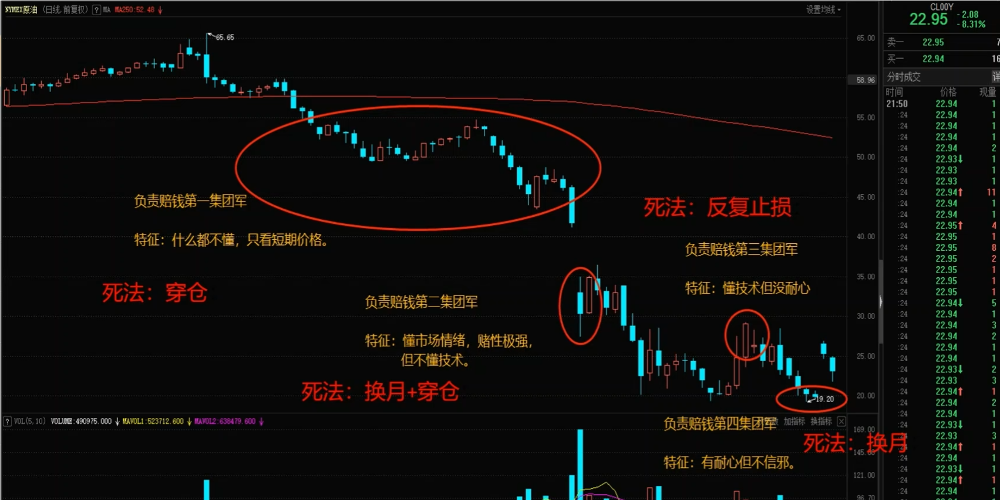

第一集团军：价格低就买。

第二集团军：利用市场情绪抄底的，不懂技术被套。

第三集团军：反复止损。

第四集团军：换月。有耐心但不信邪。

有杠杆的东西，绝对不做左侧。

交易做右侧。

打个比方说，某个股票当前的成交价位于 25.00 美元，它已经在 22.00 美元到 28.00 美元的区间里维持了相当长时间了。假定你相信这个股票最终将攀升到 50.00 美元，也就是说现在它的价格是 25.00 美元，而你的意见是它应当上涨到 50.00 美元。且慢！耐心！一定要等这个股票活跃起来，等它创新高，比如说上涨到 30.00 美元。只有到了这个时候，你才能“就市论市”地知道，你的想法已经被证实。这个股票必定已经进入了非常强势的状态，否则根本不可能达到 30.00 美元的高度。只有当这个股票已经出现了这些变化后，我们才能判断，这个股票很可能正处在大幅上涨过程中——行动已经开始。这才是你为自己的意见签字画押的时候。你是没有在 25.00 美元的时候就买进，但决不要让这件事给自己带来任何烦恼。如果你真的在那儿买进了，那么结局很可能是这样的，你等啊等啊，被折磨得疲惫不堪，早在行情发动之前就已经抛掉了原来的头寸，而正因为你在较低的价格卖出的，你也许会悔恨交加，因此后来本当再次买进的时候，却没有买进。

庄家开始抬轿子才是你进场的时机。

### 怎样炒股票才不会被套？

1. 重势不重价。
2. 如果一个股票真的从20涨到50，那么它是不是应该先经过30？
3. 韭菜的弱点在于【对低价的执着】和【对暴利的向往】。
4. 韭菜放弃了确定性，而把成功寄托在一厢情愿。（正在上涨的股票是最安全的，买入就盈利）

买别人喜欢的票，不要买自己喜欢的票。

## 第三课

怎么炒股才不会被套--找到阻力最小方向做主升浪

“真正从投机买卖得来的利润，都来自那些从一开始就一直盈利的头寸。”

做自己认为正确的事情，不为外界所动，这就是投资成功的基础。

>利润总是能够自己照顾自己，而亏损则永远不会自动了结。投机者不得不对当初的小额亏损采取止损措施来确保自己不会蒙受巨大损失。这样一来，他就能维持自己账户的生存，终有一日，当他心中形成了某种建设性想法时，还能重整旗鼓，开立新头寸，持有与过去犯错误时相同数额的股票。

散户思维：止住盈利，让亏损起飞

**进场=充分的理由+一定的形式**

确保投机事业持续下去的唯一抉择是，小心守护自己的资本账户，决不允许亏损大到足以威胁未来操作的程度，留得青山在，不怕没柴烧。一方面，我认为成功的投资者或投机者事前必定总是有充分的理由才入市做多或做空的，另一方面，我也认为他们必定根据一定形式的准则或要领来确定首次入市建立头寸的时机。

炒股票必须炒主升浪，主升浪的特点是--放量涨，缩量跌，一两天内创新高。


## 交易的最高境界：活在当下，不求甚解

在那些重大运动背后，必然存在着一股不可阻挡的力量。了解这一点就完全足够了。如果你非要追问背后的原因，反而画蛇添足。你会被一叶障目，错失良机。只要认清市场运动的确已经发生，顺势而为就能够从中受益。不要和市场讨价还价，最重要的是不要对抗市场。

如果你做不到不求甚解，那么你抓不住领头羊。

### 1925年，他用领头羊判断庄家是否离场。

庄家同时坐庄小麦和黑麦两个期货品种，现货囤积大量小麦。

黑麦比小麦市场小得多，非常好操纵。每次小麦颓势，庄家拉黑麦。

黑麦一直比小麦强势得多，直到某天起，黑麦涨幅少于小麦。

黑麦开始掉头向下，小麦还在空中“强势震荡”

集中注意力研究当日行情中最突出的那些股票，如果你不能从领头的活跃股票上赢得利润，也就不能在整个股票市场赢得利润。

辨析：龙头股看业绩看份额，领头羊只看强势。


这些领头羊的共同特征是业绩烂，整个炒作的逻辑是这么烂都有戏，板块有戏

### 对于领头羊，两种做法

- 激进做法：适合资金量较小的趋势投资者，直接追领头羊。代价：止损
- 保守做法：做存在领头羊的版块的龙头股。代价：股价表现滞后，甚至涨幅小。庄家真正的头寸在龙头股。

用领头羊来择时，用龙头股来配置。

## 炒股票赚了钱如何不亏回去？

记住：股市是金融天才设计出来借钱不用还的机制，最后谁亏就是谁还

如果把炒股比作一门生意

- 个人投资者从哪里进货？
- 二级市场
- 个人投资者从哪里出货？
- 二级市场
- 入货和出货在同一个地方

炒股难就难在你要说服出货给你的人加价买回去。


散户炒股票，往往在信息食物链末端，
就像在便利店买一瓶可乐，觉得3.5很便宜，
然后到路边怂恿别人加价买，过期就自己喝掉。

杰西利弗莫尔说：
- **对亏损的头寸不可以在低位再次买进、摊低平均成本**
- **因为你可能是筹码分销链的最后一手**

不抄底就不会陷入“缠身之亏”


- 如果某人打算按照这种经不住推敲的准则行动，他就应该坚持摊低成本，市场跌到 44，再买进 200 股；到 41，再买进 400股；到 38，再买进 800 股；到 35，再买进 1600 股；到 32，再买进 3200 股；到 29，再买进 6400 股，以此类推。有多少投机者能够承受这样的压力？如果能够把这样的对策执行到底，倒是不应当放弃它。（散户可以左侧定投指数基金）
- 所有投机者都有一个主要的**通病，急于求成**，总想在很短的时间内发财致富。他们不是花费 2 到 3 年的时间来使自己的资本增值 500%，而是企图在 2 到 3 个月内做到这一点。偶尔，他们会成功然而，此类大胆交易商最终有没有保住胜利果实呢？没有。为什么？因为这些钱**来得不稳妥，来得快去得快**，只在他们那里过手了片刻。这样的投机者丧失了平衡感。这样的投机者永远不会满足。他们孤注一掷，不停地投入自己所有的力量或资金，直到某个地方失算，终于出事了——某个变化剧烈的、无法预料的、毁灭性的事件。
- 投机者应当将以下这一点看成一项行为准则，每当他把一个成功的交易平仓了结的时候，总取出一半的利润，储存到保险箱里积蓄起来。投机者唯一能从华尔街赚到的钱，就是当投机者了结一笔成功的交易后从账户里提出来的钱。
- 当一个投机者有足够好的运气将原来的资本金翻一番后，他应该立即把利润的一半提出来，放在一旁作为储备。

落袋并出金，把止盈和利润归零养成习惯

## 关键点：如何使用杠杆交易

做交易一定平静。

为什么魔术看起来都不可思议？因为你一开始就被误导了。

二级市场庄家也很忐忑，庄家在不同阶段有不同的人。

### **为什么要识别关键点？（意义）**

>我的经验始终如一地表明，如果没有在行情开始后不久就入市，我就从来不会从这轮行情中获得太大的收益。原因可能是，如果没有及时入市，就丧失了一大段利润储备，而在后来行情演变过程中，直至行情终了，这段利润储备都是勇气和耐心的可靠保障，因此是十分必要的——在行情演变过程中，直至行情结束，市场必定会不时出现各种各样的小规模回落行情或者小规模回升行情，这段利润储备正是我不为之所动、顺利通过的可靠保障。

获取安全垫，本杰明格雷厄姆口中的安全边际。

价值投资最终归宿是指数投资，a股赚波动，美股赚趋势

量化投资通过计算机识别市场中的无效。

就两种，一种是做均值回归的价值派，一种是做趋势跟踪的技术派。手法上来说一个是做流动性拐点，一个是做流动性激增。无他

《股票作手回忆录》和《证券分析》演化了现代的投资理论

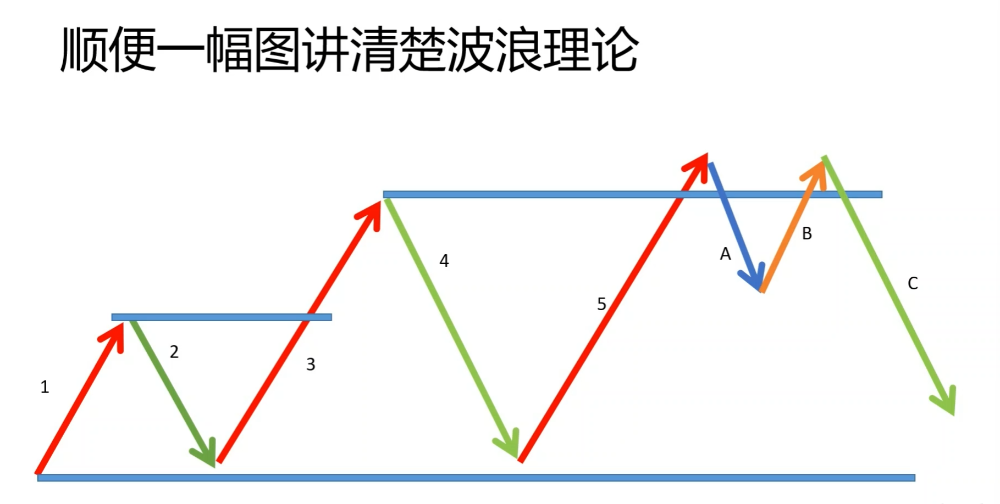

在2浪拐点建底仓，在突破3浪高点的时候如果没有仓位，不要加杠杆，5浪前也要建底仓，这样才能吃到5浪的涨幅

>在一轮行情中，大部分市场运动发生在整个过程的最后四十八小时内，这是最重要的持有头寸的时间，也就是说，在这段时间内一定要持有头寸、处身场内。这一点很重要。

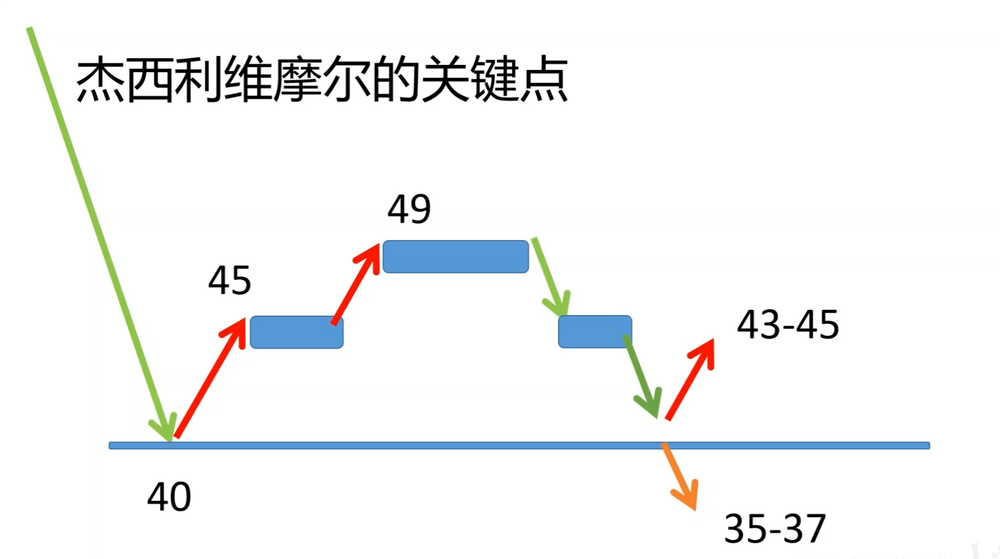

于35-37建底仓不能加杠杆，右侧可以加杠杆。

40-45，价值发现庄在买

回落到40左右，左侧庄会打爆左侧上杠杆抄底的人的保证金，接着往下稍微探一点

从40左右拿到49，升穿就可以加杠杆，没有就抛\继续持有底仓

## 怎么样才能避免股票玩你？

你们的对手是一直“心机苹果”。所有ALL IN的人，在作手眼中都是肉在砧板上。

底部不是散户买出来的

### 棉花一役，损失惨重--早起的虫儿被鸟吃

- 多年以前，我曾经对棉花强烈地看涨。我已经形成了明确意见，认为棉花即将出现一轮很大的涨势。但是，就像常常发生的那样，此时市场本身尚未准备好。然而，我一得出结论，当即一头扑进棉花市场。
  
- 我最初的头寸是 20,000 包，以市价买进。这笔指令把原本呆滞的市场刺激得上升了 15 点。后来，当我的指令中最后 100 包成交后，市场便开始下滑，24 小时之内回到了开始买进时的价格。在这个价位上，市场沉睡了许多天。最后，我腻烦透了，全部卖出，包括佣金在内，损失了大约 30,000 美元。自然，我的最后 100 包是在向下回撤行情的最低价成交的。


吸筹，吸筹，拉升，出货

### 危险的习惯--容易被一网打尽

太多的投机者听凭冲动买进或卖出，几乎把所有的头寸都堆积在同一个价位上，而不是拉开战线。这种做法是错误而危险的。

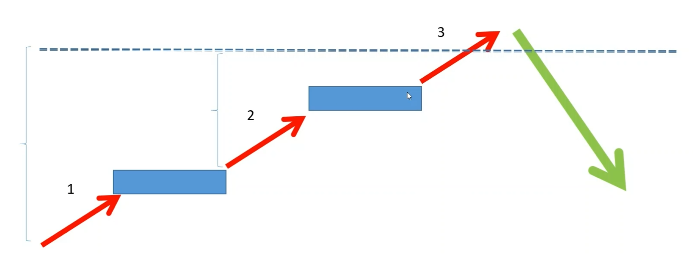

第三笔中仓位砍掉

- 按照这样的程序，所有的交易自始自终都是盈利的。你的头寸的确向你显示利润，这一事实就是证明你正确的有力证据。

## 在行情无法回头的时候朝着行情的方向重仓

重仓：在行情的方向上每一笔突破加仓，最后加到重仓


### 什么时候行情无法回头？

A是B的参照物，A在狂飙，导致价差乖离

当B往A的方向开始运动的时候，行情无法回头

**格雷厄姆力**

价格沿阻力最小路线运动的根本动力，他就是一价定律里面的价值回归力。

一价定律：如果有两个类似的资产，价格不一致，那么套利者会买入低价卖出高价，直到价格一致。


庄家通过拉升黑麦来操纵小麦，通过流量激活行情

杰西利维摩尔两次进场做多小麦

第一次：升穿关键点追入

第二次：卖飞之后，发现阻力最小路线依然向上，而且黑麦仍在飞

**杰西利维摩尔的止盈，可圈可点**

当小麦市场向下回落的时候，黑麦市场也亦步亦趋地回落，从其1925年1月28日的最高点1.82美元，下跌到1.54美元，跌幅达28美分，与此同时小麦的回落幅度为28美分。5月2日，五月小麦回升到距离前期最高点3美分的位置，价格是2.02美元，但是黑麦并没有像小麦那样从下跌中强劲复苏，而是只能回升到1.70美元，此处比其前期最高点低12美分。

- 在整个大牛市期间，黑麦总是必定领先小麦一步。现在，它不但没有领导谷物交易池里的上涨行情，自己反倒落后了。小麦已经恢复了这轮不正常回撤的绝大部分跌幅，而黑麦却做不到，大约落下了每蒲式耳12美分。这个动作完全不同于往常。
- 于是我立即着手研究，目的是要确定黑麦没有和小麦同比例地向上收复失地的原因。原因很快就水落石出了。公众对小麦市场抱有极大兴趣，但是对黑麦市场并无兴趣。如果黑麦市场行情完全是一人所为，那么为什么突然之间，他就忽视了它呢？我的结论是，要么他不再对黑麦有任何兴趣，已经出货离场，要么由于他在两个市场同时卷入过深，已经没有余力进一步加码了。
- 那就是我正在观察和等待的秘密警告信号。我自信地判断，如果某人在小麦市场上持有巨额头寸，却由于种种原因没有保护黑麦市场（他的原因到底是什么我并不关心），那么他同样不会或者不能支撑小麦市场。于是，我立即下达“市价指令”，卖出5,000,000蒲式耳五月小麦。这笔单子的成交价从2.01美元卖到1.99美元。那一天晚上，小麦收市于1.97美元附近，黑麦收市于1.65美元。我很高兴，因为卖出指令最后成交的部分已经低于2.00美元，而2.00美元属于关键点，市场已经向下突破了这个关键点，我对自己的头寸觉得很有把握。自然，我绝不会对这笔交易有任何忧虑。

初段：我什么都不懂，所以我不敢下单。

韭菜段：我觉得我懂了不少，我就是明日股神！

韭黄段：我发现我懂的东西远远不够，但我依然在下单。

中段：我发现我懂的东西可能都是错的，我不敢下单。

入门段：我每笔交易都谨小慎微，因为我觉得很可能是错的。

起飞段：我形成了自己的交易逻辑和策略，我敢于交易了！

坠机段：我信心满满的交易逻辑和策略在我重仓的时候失效了！

老司机段：我开车走遍你盘中的套路，路再难行，绝不翻车。

佛段：盈亏看淡，毫无交易冲动，适时参与，平时远离市场。

神段：只有一个操作——反手。

## 你不懂这些就别炒股了

**股票市场没有任何新东西，价格运动一直重复进行，尽管不同股票的具体情况各有不同，但是它们的一般价格形态是完全一致的。**

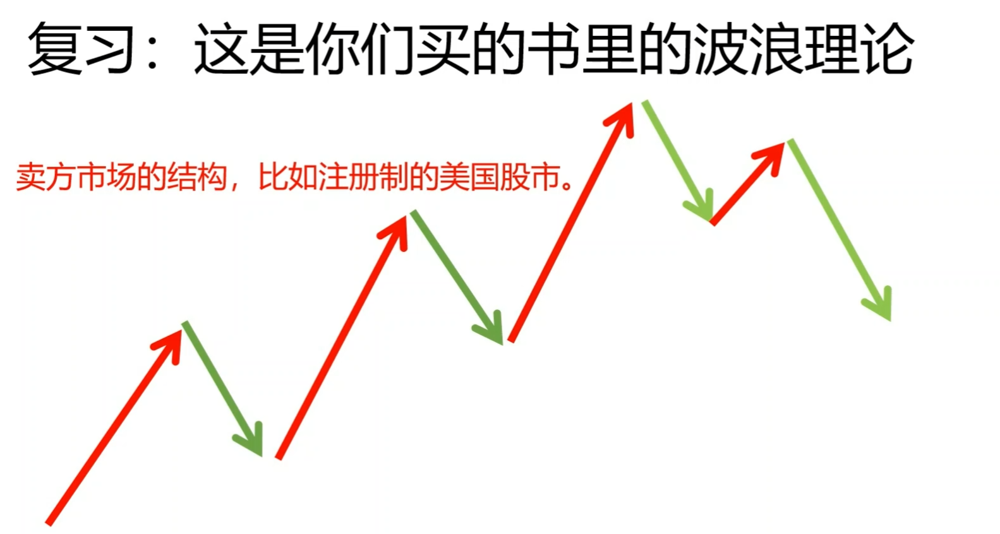

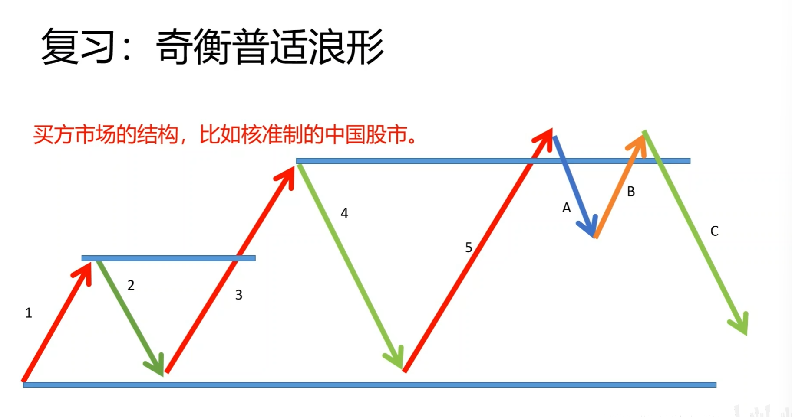

核准制导致供应远大于需求，买方不愿意接，就会出现这种结构。

中国股市运行结构要彻底改变，就要从买方市场变成卖方市场。

>沙特阿美IPO：沙特与华尔街就2万亿还是1.5万亿估值的讨价还价。从行政供应变成市场供应，股票无法以市场无法接受的估值发行。

### 不要预测，永远做两手准备。

计划你的交易，交易你的计划，而不要预测价格。

杰西利维摩尔和本杰明格雷厄姆在同一波崩盘中破产。

他们都以为--跌那么多，不会再跌了把。

你预测，就会有偏见，就会导致你看不到真相；

你重仓，甚至放杠杆，但没有浮盈时，你已经无法冷静思考了。

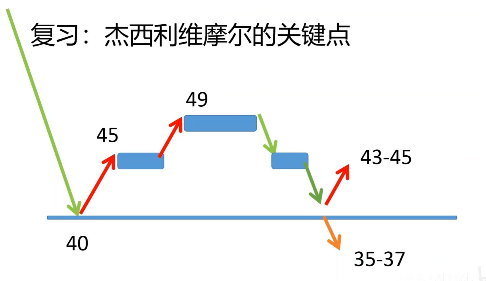

深度回调，庄家已经出完货了。

自由落地，跌倒底部。

新庄进去，没有止损--跟庄

左侧不要用杠杆，右侧可以用杠杆。

不要抄底期货

**瞳力**

经过长期努力，其中的秘密终于展现出来。我的行情记录明白地告诉我，它们不会帮助我追逐小规模的日内波动。但是，只要我瞪大眼睛，就能看到预告重大运动即将到来的价格形态正在形成。

时间要素：时候未到，瞎猜无效。

如果要对即将到来的重大运动形成正确的意见，时间要素是至关紧要的。

**趋势比照是判断趋势始末（假突破）的关键**

我并不把单个股票的动作看作整个股票群趋势变化的标志。为了确认某个股票群的趋势已经明确改变，我通过该股票群中两个股票的动作组合来构成整个股票群的标志，这就是组合价格……如果仅仅依赖这一个股票，就有卷入假信号的危险。将两个股票的运动结合起来，就能得到基本的保障。因此，趋势改变信号需要从组合价格变动上得到明确的验证。

## 总结

投机，天下最彻头彻尾充满魔力的游戏。但是，这个游戏愚蠢的人不能玩，懒得动脑子的人不能玩，心理不健全的人不能玩，企图一夜暴富的冒险家不能玩。这些人如果贸然卷入，到死终究是一贫如洗。

# 空头之王（一路骗到底\Fooling Some of the People All the Time ）

## 第一集：做空雷曼兄弟爆赚10亿美元

从如何做空的角度来选股。

选股--诈骗和反诈骗

当发现这个股票没有任何角度做空，这可能是一个值得重仓做多的股票。

You may fool all the people some of the time. You may even fool some of the people all the time. But you can never fool all the people all the time—Albert Lincoln.

你能在有些时候欺骗所有的人,也能在所有的时候欺骗有些人，但是你绝不能在所有的时候欺骗所有的人。

- 做空加唱空雷曼兄弟，后来跟比尔·阿克曼做空康宝莱亏损

- 康宝莱：扩张了中国市场

- 特斯拉：空头主力，连续做空特斯拉，被轧空


巴菲特不做空，他认为财富在于与国运并肩，没人能通过做空股票创造财富。巴菲特不借股票做空，而是持有现金不买股票。


巴菲特曾经在股东大会上回答过为什么不做空的问题。他说，他们也曾发现过一些规模巨大的公司诈骗行为，而且他们的判断一般都是正确的。但很不幸，他们很难判断诈骗行为能维持多久，能走多远，所以做空挣钱很不容易。判断高价股票注定走向灾难并不难，但想依靠这个认识来挣钱太难。这也就是凯恩斯所说的，**在市场回归理性之前，你很可能早已破产**。

做空不能看太远，做空必须择时，抓住股市崩盘做空骗子公司。

### 背景介绍--绿光资本

做空并且公开做空理由引起市场恐慌

- 在2000年纳斯达克泡沫破灭后，绿光资本名利双收，让艾因霍恩对自己的判断能力更有信心。于是，在2002年的一次投资慈善募捐晚会上，当艾因霍恩被邀请分享他的最佳投资建议时，他直截了当地回答：做空联合资本（Allied Capital）。

- 联合资本是当时全美第二大公开交易的企业发展公司，艾因霍恩通过研究它的财务报表认为，这家公司通过会计造假来隐藏亏损，值得做空。结果，演讲的第二天，股价暴跌。从02年抗到08年。


做空对选股和择时的精度要求高到极致。

绿光资本在做空联合资本上没怎么赚钱，结果大卫艾因霍恩用同样的手法做空和唱空雷曼兄弟赚了十亿美元

## 第二集：你买的不是股票

本课知识点：做空、航空股、回购、价值投资原则、判断好公司

使用群体标签：股票/基本面/中周期波段/以交易为生/入门

通过讲做空来排除坏股票。

本集介绍持有一年以内。

### 尽职调查

做空股票：在做空交易中，你还是在想低买高卖，借入该股票，再将股票借给你，股价下跌越多，你赚到的钱越多。从经纪商借入股票，融券。

你卖出不属于你的东西是你破产的起点。

80%的人不是学做空股票，而是看一个公司是否有问题。

炒股最重要的是低买高卖。

### 航空股：过去十年，美国大航空公司自由现金流96%用于回购


>我在康奈尔大学读的本科专业是政府管理，但是大三时我在华盛顿证券交易委员会经济分析部实习之后，便对经济学更感兴趣。我写的毕业论文阐述美国航空业周期性监管问题。政策制定者在两个相互竞争的利益集团之间寻找平衡：航空公司要赚钱，但消费者要航空运费低廉，还要在哪里都能乘到飞机。在反对竞争的周期阶段，监管者允许航空公司垄断经营空中航线、夺取枢纽城市、通过兼并消除竞争，这样航空公司便可以赚得丰厚利润。这种形势让消费者和政界人士大为不满，他们又要求监管者出台支持竞争的措施，以提供更多、更便宜的航空服务，而这会扼杀航空业的盈利。在航空公司遭受亏损甚至破产之后，政策制定者认识到有航空公司还是好事情。为诱使航空公司购买飞机、提供服务，要让航空业有赚取利润的机会才行，于是反对竞争的周期阶段又回归了。这种恶性循环的周期模式或许可以解释为什么沃伦·巴菲特说了这样一句俏皮话：投资者本应该在雏鹰市将莱特兄弟的飞机从空中击落。这篇毕业论文让我在政府管理系赢得最优毕业成绩，同时也毫不奇怪，绿光资本为何从未拥有过一家美国航空公司的股票。

### 回购股票

上市公司用现金在股票二级市场买入自家股票，用于注销或者股权激励。如果把上市公司融资理解为“发股票--借钱”，那么回购就是“收股票--还钱”。借钱回购股票的公司不能买。

特斯拉的ceo mask和苹果ceo cook都是收股票工资。

股票是合法违约的债。所以股价有不确定性。关注回购注销的公司。

### 巴菲特买卖航空股的逻辑

航空股和旅游业挂钩。

- 买垄断：美国航空业进入成熟期，三家传统是美国航空、美联航、达美航空是网络型航空公司，两家廉价是西南航空和捷蓝航空，五家合计市场份额已经近70%。

- 卖不确定性：新冠病毒令很多行业都面临巨大压力，而**旅游业**一直是受影响最严重的行业之一。具体来说，航空公司在场危机中遭受了不成比例的痛苦，**大流行病**已使航空业发生了非常重大的变化。不清楚未来三四年人们是否会像去年那样坐飞机，而航班现在太多了。航空公司会做一个非常巨大的改变，**会借很多的钱，自己的利润会吐出来**，回购自己的股票。

### 做价值投资的原则

买垄断，卖不确定性。 

### 判断好公司的三个基本问题

不要看净利润，净利润可以调整，净利润产生的机制更重要。

哪些是良好的公司行为，哪些是不好的，更甭提会标明激进的或保守的会计处理方法。有三个基本问题需要解决：第一，公司业务的真正经济效益怎样？第二，这些经济效益与公司业绩报告相对照，情况如何？第三，公司决策者与投资者，在利益一致性方面，情况又如何？

### 结语

- 回答上述三个问题之前就买进，你买的不是股票，是寂寞。
- 回答了上述三个问题后再买进，你买的不是股票，是公司。
- 买股票和买公司不完全是同一回事。

## 第三集：对冲基金四大特征

本课知识点：收益归因、收益结构、超额收益、绝对收益

### 股票分析方法 

**普遍的投资分析框架--挑物美价廉**

也就是分析公司的经济价值和决策者与投资者之间的利益一致性。我们的投资研究过程与多数传统的价值投资者所使用的分析框架相反。很多价值投资者是先确定一只股票是否价格便宜，如果便宜，他们便力求确定那只股票是否便宜得理由充分。他们识别投资机会的一个典型过程是，通过计算机屏幕，发现统计意义上的便宜性，诸如低市盈率、低市销率或低市净率，同时盈利上升之类。然后，他们将识别出的公司作为可能的投资对象进行评估。**找大幅下跌的股票，看基本面。**

很容易给自己挖坑。


**绿光资本的反传统分析法--挑软柿子捏**

绿光资本采取完全相反的方法。我们开始便提出问题：一只股票为何可能在市场上被错误估价。一旦有了一套想法，我们便分析该股票，确定它是否真正便宜，或被高估。为了投资，我们需要明白为何存在这一机会，并相信我们较之交易对方拥有相当大的分析优势。市场是个没有人情味的地方。我们买入某只股票时，通常并不知道谁在卖出。如果我们的交易对手无知无识、不谙市道，那便愚蠢至极。在多数情况下，今天卖出股票的人比我们跟踪该股票行情的时间更长，也更加密切，以前曾是买入者，现在已改变主意转为卖出者。更糟糕的是，交易对家可能是公司内部人，或者是信息灵通的业内玩家，在主要供应商、客户或竞争对手那里工作。有些投资者相信，他们买卖华尔街分析师研究最少的那些股票会占有优势。我们认为，一只股票是否“跟踪不足”并不重要，因为我们从其手上买入

**多空配对交易——赌价差收敛**

尽管我们的投资研究过程在很大程度上依赖于我在西格尔考勒瑞公司受到的训练，但绿光资本构建投资组合的方式不同于西格尔考勒瑞公司。在西格尔考勒瑞公司，最大的投资都是多空配对交易。所谓多空配对交易，就是将身处同一行业并且市场交易估值大幅偏离的两家公司进行搭配投资。西格尔考勒瑞公司会买入估值较便宜的那家公司，同时卖空更昂贵的另一家公司。在理想的情况下，持有多头仓位的公司较之持有空头仓位的公司拥有更好的前景，或者会计政策更为保守。多空配对交易试图通过既消除市场风险又消除行业风险，同时利用随着时间推移而产生的估值收敛来防范投资组合内投资的损失。

**系统性风险和非系统性风险**

我们不使用指数来对冲，因为我们通过选择风险回报特征很差的单只股票做空，可以创造更多的收益。指数对冲的期望值是负数，因为随着时间的逐渐推移，市场会向上走，而空头只是在下跌行情中带来好处。做空单只股票有两个获利途径——要么市场下跌，要么事实证明特定公司的分析是正确的。在实践中，我们在多头
上较之空头有更多的暴露，因为我们的空头仓位较之多头仓位往往对市场更为敏感，波动性更大。再者，市场随着时间推移往往会走高，我们也希望参与其中。管理投资组合只有在市场下跌行情中才能有超好表现，在心理上很有挑战。我压根儿不想把自己的生命浪费在期待市场崩盘上。

不要怕腰斩，未来肯定会涨得更高。

**绝对收益**

我们认为自己是“绝对收益”投资者，因此并不将我们的投资结果与只做多的指数进行比较。这意味着，我们的目标是随着时间的推移，无论市场环境如何，都要努力实现正收益。我相信，对冲基金之所以有巨大吸引力，是因为它具有博取绝对收益的导向。多数只做多的投资者，包括共同基金，都是相对收益投资者，其目标是投资表现优于某一基准，通常这一基准是标准普尔500指数。在评估一个投资机会的过程中，相对收益投资者提出的问题是：“这一投资将会胜过我的基准吗？”相比之下，绝对收益投资者会问：“该项投资的回报是否大于其风险？”这会导致分析框架完全不同。结果，两类投资者可能考察同样的情形，但得出的投资结论却大相径庭。

### 结语

- 对冲基金
- 先分析对手，再分析股票--收益归因：你的盈利来自别人的亏损。
- 多空配对或不配对交易--收益结构：组合中同时存在多空方向。
- 超额收益来自非系统性风险--超额收益：承担非系统性风险的补偿。
- 追求绝对收益--绝对收益：实际盈利，而不是相对盈利。


## 第四集：沉迷炒股怎么办？

本课知识点：市值覆盖倍数、流动资产、破净资产、利率定价

### 净营运资本覆盖倍数


我们1996年5月赚到3.1%的收益率（每当我引用绿光资本的基金收益率，除非特别说明是“毛收益率”，否则是指扣除业绩费和其他费用之后的收益率，也就是合伙人获得的“净收益率”。我讨论单个投资，总是使用毛收益率）。当月月底，我们将基金15%的资本投资于安东尼公司，这是一家小型零售商，近期刚摆脱破产窘境，重新开始盈利。市场给该公司的市值是1800万美元，不过其拥有两倍于市值的净营运资本（流动资产减去所有负债）。绿光资本6月的收益率是6.9%。（零售困难反转型）

### 流动资产

- 流动资产的内容包括货币资金、短期投资、应收票据、应收账款和存货
- 流动资产是一年内可以变现的资产。
- 货币现金及现金等价物，短期应收账款和高流动性存货。

### 破净资产是低估？

利率=成本率+损失率

1997年伊始，我们势头强劲，第一季度获得13.1%的收益率。接下来，我犯了一个代价高昂的错误。坏结果通常有两种类型。有时，分析风险和回报之后，一项投资看起来很有吸引力，但是不幸的事情或不太可能出现的事情发生了；有时，分析本身就有缺陷，投资品的质地不良，我们该当最终遭受损失。这次错误属于后者。我们将6%的资本投放于瑞莱斯公司，该公司向信用记录有污点的人发放汽车贷款，利率为18%。投资该公司的关键问题是：18%的贷款利率是否足够覆盖贷款违约造成的损失，而这些损失更难估计。我分析了车辆收回数据，确定瑞莱斯公司收回了20%的贷款汽车，每次损失40%的贷款。贷款期为2年，所以我计算出每年贷款损失率等于20%×40%÷2或者4%。那么高的贷款利率看来足以覆盖损失，而且公司股票看起来也便宜，交易价低于账面价值。


### 在地铁里寻找亿万富翁

我犯的错误在于损失分析的框架设定不当。车辆收回的统计数据并未包括收回者未能找到的汽车大约10%的贷款。显然，这些贷款是百分之百损失了。这就意味着实际贷款损失是我计算的两倍以上。18%的利息并未覆盖贷款资金成本、真实损失和经营费用。我们投资的钱大约丧失一半，这时我才意识到自己犯了错。这笔投资损失导致我们在4月份第一次出现月度亏损，亏损率为0.3%。

## 第五集：什么股可以买？

知识点：什么股可以买？什么股不能买？

品尼高公司是一家科技公司，在我们投资前已有两三个季度业绩报告令人失望（股价比较无聊，业绩平平）。公司股价下跌，趋向账面价值，而账面价值多为现金（轻资产公司）。很多价值投资者（伪价值投资，巴菲特不会因为是科技公司就回避）回避投资于科技公司，因为它们的产品复杂，竞争领域变化迅速。我们的看法是，科技公司若不在亏损经营，按照账面价值进行交易，并且看来拥有一种靠得住的产品，便是很好的投资对象。事实证明，品尼高公司正是这样的例子，当该公司业绩报告趋好时，股价涨了两倍。

需要买了之后拿得住

最后，一些做空交易也为1997年的收益贡献良多，其中包括波士顿炸鸡公司和新秀丽公司。波士顿炸鸡公司的会计惯例使其得以在特许经营人的餐馆开张之时，提前确认收入和利润。波士顿炸鸡公司为餐馆开张和预付费用以及给特许经营人贷款的已获利息提供融资。特许经营人的餐馆盈利不足以支撑应支付给母公司的账款。波士顿炸鸡公司的股东并不关心，或者可能甚至对特许经营人在亏本经营并不知情，因为波士顿炸鸡公司未将特许经营企业并入其财务报表。我们相信，如果餐馆的经济效益并非强劲得足以让特许经营人偿还对波士顿炸鸡公司的债务，并且为其自身赚取合理收益，那么他们将不再开张新的餐馆，因此波士顿炸鸡公司的市盈率会随着公司增长停滞而下跌。后来的事实证明还要糟糕，因为特许经营人在贷款上违约了。最终，波士顿炸鸡公司走向破产。

新秀丽公司同样也崩盘了。我们在28美元时做空其股票，并看着股票飙升至45美元。我一再检视出现这种情形的原因，然后决定大量做空。新秀丽公司此前已提高产品售价，同时扩张了销售网络。该公司自身已开出很多门店，与其大宗客户即零售商展开激烈竞争。我们在曼哈顿看到一个箱包店，橱窗上贴有一个“新秀丽折价40%”的告示牌。我们把告示牌买下来挂在自己的办公室。当时店员朝我们滑稽地笑了笑。后来的事实表明，这并非唯一设法消化新秀丽公司多余存货的门店。当新秀丽公司承认顾客并不认可提价，零售商存货充斥时，其股票骤然下跌至6美元。（靠开连锁店的公司，一旦扩张停止，可能估值也就到顶了，门店扩张到头，竞争不断增强，存货增加）

## 第六集：不是不爆，时候未到

我们1998年开端不错，基金到4月获得9.9%的收益。然后，我们持有的最大空头仓位计算机学习中心成了问题。计算机学习中心是一家营利性教育公司，利用慷慨的政府学生贷款，对学生和政府两方敲竹杠。该公司每年向未受过教育的人每人收取2万美元，教授计算机技能，它们什么样的学生都来者不拒。有家做空机构派一个人故意通不过该公司一所学校的录取考试。一位招生主管给她答案，让她再次参加考试。因为该公司提供劣等产品，并且行为不端，所以我们重仓建立了空头头寸。华盛顿特区一家电视台做了一次专题报道，采访大量愤怒地抱怨教学设施不佳的学生，并播放秘密拍摄的录像，显示一位招生主管向一位可能接受教育的学生承诺，一旦毕业便能获得高得荒唐的预期起薪。股票市场对之做出的反应是：打了一个呵欠。

计算机学习中心公告第一季度收益强劲（收益强劲加创新高，可以继续持有，空头做不了事情）。首席执行官里德·贝克特尔威胁做空者，告诉《华盛顿邮报》：“公司股票每上涨1美元，空头们就得从银行账户里拿出400万美元。”《华盛顿邮报》称，他告诉一位投资者“我们已遭广岛之苦”，空头们“该到受长崎之痛的时候了”。此后不久，公司股票开始下跌，因为教育部宣布调查合规问题，伊利诺伊州总监察官也正式提出民事欺诈的投诉，股价下沉。我们感觉到离终局不远了，便加大空


两三个月之后，计算机学习中心支付50万美元罚款，承诺更加规范经营，由此与伊利诺伊州总监察官了结此案。总监察官认为处罚严厉，但股票市场判断这是计算机学习中心为摆脱困境付出的微不足道的代价。多头们散布传言说，教育部已完成调查，不会采取强力行动。波士顿的三家共同基金都在已经持有的重仓中增加了头寸，股票旋即翻倍，看来计算机学习中心可能真的逍遥法外了。我决定吞噬苦果，于7月平掉空头仓位。我们在此仓位大约损失2.5%的资本。

这次空头平仓是一个糟糕的决定，因为**后来事实证明**（不能够做对的就是没看对）我们对该公司的判断是正确的。监管行动的曝光和该公司更为保守的行为，致使入学人数和收益未达到预期，因此扼杀了公司股票。这类情况在有争议的做空交易中实际上会多有发生：很多时候，多头们在关键批评上（在此案例中，监管者没有立即让该公司毙命）赢得战役，但空头们却赢得战争，因为经营或会计变革会导致业绩令人失望。教育部又费时两年才完成其调查工作。调查完成之时，教育部要求计算机学习中心退还向政府预支的所有学生贷款，这迫使它们破产倒闭。（空头最大的敌人是时间）

做空一家受政府监督的公司，对于投资者来说，关键问题在于，即便当政府采取行动时，其行动速度也不会比股票市场快。两年对政府调查而言也许已非常迅速，但对于像绿光资本这样的报告月度业绩的投资者来说，即使采取的是长期策略，那也太漫长。基于我决定平掉计算机学习中心，我有了更强的承受能力，同时也学会变得更有耐心。很多投资实例教会我这一教训，计算机学习中心是其中代价更为高昂的公司之一。（在市场中需要保持本金）

赚钱的技能无法通过亏钱学会，只能指导你下次不在同一种地方亏钱

## 第七集：在股市里，风花雪月，迟早被虐

### 空头是多头的唯一知己

你炒股不赚钱，是因为你买股票的时候，不懂得用空头的角度来考察一下--

【股价背后支撑的资产的泡沫程度】

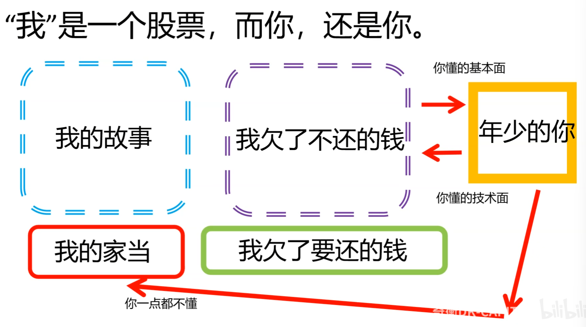

股票就是欠了不用还的钱

## 第八集：股市反诈骗指南

有借有还，再借不难--没得还怎么办？

找担保人，写欠条--贷款（间接融资）or 发债（直接融资）

描绘一个前景，找人入股--发行股票（直接融资）--还债

配套融资可以用于还债。

### 击鼓传花

债务流转：

商业信用--银行贷款--股票发行

亲戚朋友合作伙伴--银行--股东--终究没钱还的，股价崩盘谁负责还债？

### SHSE，一家保险公司

什么是运气？运气就是概率随时间推移的摄动

#### 抛硬币过程中，抛出正面的概率是多少？


#### 投资是运气管理，研究运气好的时候多赚，运气差的时候少亏

我们在佛罗里达州专门从事工伤保险的SHSE公司的非互助化交易中**运气**极好。公司作为互助机构**会计政策保守**（意味着定价低估），首次公开发行募集的**所有资金均归属公司**，管理层**团队受赠大量原始股**（管理层和股东利益一致）和股票期权，这三者结合在一起，使非互助化看来可以引起市场高度兴奋。1997年5月，我们将基金大约15%的资本按每股14美元的价格进行投资。

更美妙的是，SHSE公司近期已用非常优惠的条件购买再保险，从而降低了风险。从根本上讲，再保险公司愿意承担多数风险，向SHSE公司支付巨额费用。我们相信，当市场意识到SHSE公司由一个风险企业演变为一个品质高且费用可预测的企业时，公司盈利和市盈率均将上升。当SHSE公司于1998年6月宣布按每股33美元的价格以现金支付形式出售给利宝公司时，我们实际上非常失望。

剧情立即反转——占便宜的利宝变接盘侠，失望的绿光喜出望外,因为鱼龙混杂的工伤保险单变成了沙丁鱼罐头

最终结果表明，该公司管理层很机智，我们也很幸运。首次公开发行路演时，首席执行官漫不经心地说想“在保质书期满之前”出售公司，我听过这一说法，但直到这一年尤尼卡公司丑行被揭露，才充分注意到。尤尼卡公司是再保险经纪商，诱使再保险公司按照没有经济利益的条款给工伤保险提供再保险。有时，同样的风险被转嫁数次。风险每转嫁一次，尤尼卡公司就收取一笔费用。当再保险公司看清实情时，其中好几个公司拒绝支付赔偿金。随着骗局被揭开，几乎每一只工伤保险股票都崩盘了。我猜想，尤尼卡公司提供的优惠再保险使SHSE公司得以改变了其业务模式。尤尼卡公司东窗事发本来很可能导致SHSE公司随同其他工伤保险公司发生崩盘。不过，任何问题都与利宝公司有关，而不是与我们有关。有时候幸运比精明更好。

### 从绿光资本对SHSE的投资诠释：

所有股票都是垃圾，只不过某些在特定时候股价会上涨而已。--奇衡DK-CAPITAL


#### 保险和再保险

- 纯粹的保险是“保证有风险”
- 风险从被保险人转移到保险公司
- 保险公司靠盈利覆盖概率亏损

- 有了再保险，
- 风险从被保险人转移到保险公司
- 保险公司再把风险转移给再保险公司
- 保险公司赚保费价差，或及时回收现金

## 第九集：有可能在一个绩优股上亏很惨

赌徒只关心业绩，股东还要关心业绩是怎么来的。

空头不敢做空遇到行业困境的公司，防止有人提价收购，空头会袭击财务造假，信息披露造假，所有散户都认为会一直上涨的公司。

另一个表现出色的空头仓位是世纪公司，这是一家通过收购一系列从事同类业务的小公司而组成的公司，它提供会计服务，但其自身会计糟糕透顶。在这类公司中，合并方以低于其在公开市场可得的市盈率倍数，购买小型私营公司。每次收购有助于增加盈利，从而驱动股价走高，并让合并方得以利用其“货币”在无休止、志得意满的循环中收购更多的私营公司。迈克尔·德格鲁特领导世纪公司，他既有名，又有钱。像多数累积收购众多同类小公司的公司一样，世纪公司声称会改善所购公司的经营，创造15%的内部年收入增长率。实际上，出售小公司者往往是临近职业生涯结束的企业家，他们出售企业给世纪公司之后便去玩高尔夫。（伯克希尔哈撒韦）

世纪公司的会计在数个方面不符合一般会计准则（GAAP）。首先，世纪公司从收购“生效”日开始确认新购公司的收入，而该日期出现在收购交易实际结束之前。其次，世纪公司按市场价值40%的折扣给其作为“货币”发行的股票进行估值。这些伎俩使其得以过早地确认收入，少报商誉，误导投资者对其收购公司时所支付市盈率倍数的认识。

我们在绿光资本历史上第一次发函向证券交易委员会反映。我们批评世纪公司的会计，请证券交易委员会坚持要求公司在将来的报送文件中做出更为清晰的披露，但证券交易委员会从未回应过我们。然而，1年后，世纪公司重新编制其会计账目，使用“交易结束”日而非“生效”日开始确认收入，增加商誉。该公司减少“内部”增长率，大幅偏离预算，并更换了管理层团队。公司股票大幅下跌，从1998年8月的25美元跌至2000年10月的不足1美元。

## 第十集：从牛冠A股的生物柴油板块分享顶级基金经理秘诀

一年五倍易得，五年一倍难求

### 为什么空头不敢做空大盘股

大盘股有非常多的机构、投资者研究，价格很公正，银行股赚的是流动性差价。

虽然我们1998年创造了富有吸引力的风险调整后收益，但我们并未实现目标。增长型股票和大市值公司是市场的宠儿。很多领衔市场上涨的巨型公司股票，恐怕将费时数年才能达到这一年实现的让人流鼻血的估值水平。标准普尔500指数不屑于理会亚洲经济危机，回报率达到令人极度兴奋的28.3%。可口可乐公司引领市场，交易价大约为盈利的50倍。该公司盈利品质低下，因为它逐一退出了对装瓶子公司的投资，创造了在其盈利中占据重要地位的投资收益。**我没有胆量做空可口可乐，但我本应该对其做空**。我以为，对于规模如此庞大的公司，我不可能具有独特的洞见。我反而因在投资者会议上解释可口可乐的问题，以及考问可能雇用的职员对这一话题的看法，而感到自我满足。

市盈率只适合用在大盘股。

对于一般家庭，不要all in成长股，等到每年股价大跌的时候买大盘股拿分红。

网络泡沫从1998年的低位开始启动，冲向辉煌荣耀的最高点。我相信，美国在线与其空头之间的较量催生了这场泡沫大潮。

很多空头认为美国在线盈利品质低下，而其股票以高倍市盈率交易。美国在线在营销或“赢得客户成本”上花费重金，以招徕按月付费的用户。空头们相信，美国在线虚增利润，手段是将这些成本进行资本化，并在用户关系期望寿命期间注销这些成本。美国在线的会计不符合一般会计准则，因为该准则要求这类成本计入当期费用。

网络泡沫从1998年的低位开始启动，冲向辉煌荣耀的最高点。我相信，美国在线与其空头之间的较量催生了这场泡沫大潮。

很多空头认为美国在线盈利品质低下，而其股票以高倍市盈率交易。美国在线在营销或“赢得客户成本”上花费重金，以招徕按月付费的用户。空头们相信，美国在线虚增利润，手段是将这些成本进行资本化，并在用户关系期望寿命期间注销这些成本。美国在线的会计不符合一般会计准则，因为该准则要求这类成本计入当期费用。

美国在线最后和时代华纳合并，腾讯的最终形态是泛娱乐化。大基本面不改，机构就会买。

我对做空美国在线做了评估，认定即使其会计政策错误，做空它也非常糟糕，因为其业务的真实经济效益好得让人难以置信。鉴于该公司的经济利润，其股票并不昂贵。我将现金预付的赢得客户成本与在客户关系期望寿命期间的用户付费进行比较，计算出一位用户的净现值。美国在线的用户此时正大量涌现，过不了多久便能证明其看上去过高的股价名正言顺。再考虑到可能出现新的收入流，包括广告收入，我看做空它真的是个很坏的想法。或许这正是“价值投资者”比尔·米勒所看到的诱人之处，使其满怀信心地出手建立多头重仓。我没有勇气买入美国在线，但不对其做空，并可以与做空者争辩，就感到满足了。（空无可空就是做多）

比尔米勒是谁？他持有美国在线，一战封神。

- Bill Miller可谓是美国共同基金历史上“点石成金”的金手指。上世纪90年代，他以业绩连续十五年跑赢标普500指数享誉业界。就连超级巨骗麦道夫最风光的时候也做不到这样。Mille被很多人认为是迄今最伟大的基金管理人之一。然而，他在08年金融危机中惨遭滑铁卢，管理的基金当年巨亏58%，比标普500股指当年跌幅多了20个百分点。

- Bill Miller的持股时间都很长久，平均持有年限长达4年。而大盘主要基金的持股年限仅为一年。2008年，当这些资产最初价格下跌的时候，Bill Miller认为人们反应过度了，并且认为美联储最终将注入流动性以终结危机。于是，他仍抱着过去十几年与大众逆势操作的习惯，趁机低价抄底。

长期持有赚到的钱来自于长期持有受到的风险，只要持有时间足够长，肯定会遇到黑天鹅。

# Asymmetries for All Markets

## 第六课 别墅里面唱k，黑天鹅到处乱飞

>马科维兹：分散化是金融市场上唯一的免费午餐
>
>《威尼斯商人》安东尼奥：我多谢我的幸运，我的买卖并没有寄托在一只船上，也并非是到一个地方去的；我的全部财产也并不完全靠今年的命运；所以，我的货物并不足使我忧愁。

### 分散化是免费午餐吗？

1975年《天下没有免费的午餐》

1. 商品都是有成本的。定价高于成本才能获利，供应才会继续
2. 为什么市场上有人在供应“免费午餐”？因为有人在补贴。
3. 补贴最后必定分摊给全市场，使得“免费的午餐”

### 风险

在转嫁和回避之间，马科维兹选择稀释

风险的本质特征只有一个：只可转嫁，不可消除。

#### 风险承接的前端付费模式：

定价偏差（面包v.s.面粉）=项目未来现金流折线值（包含了自清偿现金流考量--分红回本）-市场可成交价（包含了流动性考量）

当定价偏差大于零时，它叫安全边际。（即：“安全边际”存在的前提是项目存在自清偿现金流且存在转售流动性）

当定价偏差小于等于零时，它叫智商税。

1）当你无法确定是否存在自清偿现金流或无法确定是否存在转售流动性时，如果你进场。代入公式，最大持有风险是**本钱亏完**。

2）当存在自清偿现金流且存在转售流动性时，代入公式，最大持有风险是**定价偏差本身**最大风险从一开始就可以确定。你如果没去严谨计算，没有回避，那么你就被转嫁了风险。（存在安全边际时，别人将风险转嫁给你，那么你在未来可能可以收获回报）

#### 风险承接的后端付费模式：

“人人学本杰明·格雷厄姆的话，未来现金流折现不明朗的公司就没法融资了。同学，你学过如何计算平均数吗？学过的话，我教你一个神奇的方法，不用考虑面包面粉谁贵的问题。”

通过选择低协方差或负协方差的资产组合，即使单个资产风险较高，组合整体风险也可降低？

算术平均数（一组数据的总和除以数据个数，**反映数据的“集中趋势”**）

#### 马科维茨创造了一种暂时稀释风险的思路

组合的风险不仅取决于单个资产的方差，还取决于资产间的协方差。如果协方差较低或为负，组合方差会比各资产方差的加权平均更小，从而降低风险。需要计算新组合的方差，比较是否比单独持有任一组合的风险更低。

#### 系统性根源，正是被MPT“分散”的非系统性风险。

分散化所稀释的**非系统性风险**全部沉淀为**系统性风险**，在**流动性收缩、没有后继资金击鼓传花的时候**，通过**黑天鹅、灰犀牛、乌龙指等**分摊给全市场每一个参与者。


当市场主要采购商的仓库都装满时，供应商就会发现自己的产品开始滞销，然后供应商之间就开始价格战。（泡泡玛特）

安东尼奥的资产虽然分散在不同的航线，但是**全部集中于远洋商船，缺乏流动资金**。

为帮助朋友巴萨尼奥求婚，因商船远航未归（投资分散于多条航线），手头缺乏现金他被迫向夏洛克借款，但**因多艘商船意外沉没（风暴或海盗所致）导致无法偿债**，触发“割肉抵债”的致命条款。最终因条款模糊性险遭杀害。由于得到帮助，债主夏洛克无法执行条件，反被控“谋害威尼斯公民”，被判没收半数财产。

### 以“黑天鹅”为比喻，风险稀释的本质，是对风险对价的延迟支付

休谟否定了因果关系的必然性与客观性。

1、原因与结果并不必然伴随，而仅仅是一种时间与空间上的接续与接近关系，我们不能从自己所认为的“原因”和“结果”之间看到必然联结。

2、原因与结果不具有客观性，它们不过是一种“习惯性联想”，当两个事物经常性地一先一后出现，人们就会形成一种认识习惯，认为它们之间是有因果性的，这表明因果关系是主观的而不是客观的。


## 第七课 如何做出让自己不会后悔的选择？在非对称中反脆弱！

管理风险就是管理运气。

如何在不确定性环境中，做出让自己不会后悔的选择？

### 游戏石头剪子布游戏

假设有一个石头剪子布游戏，赢一次获得10块钱，输一次损失1万块钱玩不玩？对手是青蛙


然后就会把失败总结为运气不好，甚至会抱怨自己被做局了。

**实际上不是命不好，而是数学没学好**

### part1

#### 如何在不确定性环境中，做出让自己不会后悔的选择？

1. 能否正确看待小概率极端事件？--正态分布or肥尾？
2. 是否拥有识别风险的量化工具？--随机or结构？（冰冻三尺非一日之寒）
3. 是否掌握计算风险大小的方法？--波动性or脆弱性？（金玉其外，败絮其中）
4. 是否能够从非对称中反脆弱性？


#### 长期资本公司


极端事件发生的概率比正态分布假设要高

### part2 三页ppt读懂塔勒布

**你可能对风险一无所知，所以你身世浮沉**

石头剪子布的结果是随机的。青蛙蛤蟆和人类玩石头剪子布时，有对称型风险。

人类找到了某种确定性--青蛙蛤蟆好像只能出布。

人类找青蛙玩石头剪子布，是为了追求低风险，低波动。

青蛙蛤蟆是能握拳头的，所以有了肥尾。*出剪刀会输的风险远比想象中高得多*

人类出剪刀输给青蛙、蛤蟆就叫黑天鹅事件。

**之前赢的，一次过全吐出来。赢了也带不走**

名义上的低风险实际上是脆弱的。


**真正的风险是本来就存在，却被忽视的。**

#### 只要你穿透的问、追根究底地问，往往风险无所遁形


长期资本公司（LTCM）

回测了1970-1990年代**20年**的欧美国债的利差历史数据；

回测了1973-1997年**25年**的隐含波动率数据。

但是，他们没有覆盖：

1873铁路泡沫、1882年法国股灾、1907年美国银行挤兑、1929年“大萧条”……

1998年俄罗斯违约是**按正态分布概率**为十亿分之一，但实际**每50年**发生一次。

真正的风险是本来就存在，却被模型忽视。

#### 这个生意参不参与？


不参与，因为不知道生意一旦走坏的时候，你会承受怎样规模的损失。

你有没有考虑过你的对手盘的感受？

他们不会做点什么来翻盘吗？

你不担心他们在放长线钓大鱼吗？

这些都是不确定性......

#### 看风险，最重要的不是看发生频率，而是看事件发生时的致命性。


“我从1米的地方跳下来100此和我从100米的地方跳下来一次。前者更具反脆弱特征。”

“如果我有一个生意，运气好时赚100万，运气不好时亏500万。这就是个脆弱的结构；反过来：如果最差是亏100万，但最好的结果可以赚500万。这才是反脆弱的。”

——塔勒布

参与不会让你死的游戏。

为什么有风险的存在？因为市场上不断有人逃单，而最后又要抓人把别人逃的单都买了。这就是很多人最后一事无成的关键所在——自己多年努力全部被迫给别人买了单。

**所谓“致命性”，通俗来说，你要不要为过去逃单的所有人买单**

##### 1. 随机--事件的结果存在于多种可能性中且不可预先确定的状态。

解读：吃饭有时候买单，有时候逃单；

##### 2. 肥尾--极端事件对系统产生非线性影响，而正态分布假设低估了极端值出现的概率。

解读：吃饭逃单的人比理论上要多。（正态分布假设错就错在假设所有人都自觉买单）

##### 3. 黑天鹅--非常难预测，且不寻常的事件，通常会引起市场连锁负面反应甚至崩盘。

解读：没想到，多吃了一口就打烊了，留在饭桌的人要AA制把前面所有人的单买了。

##### 4. 非对称--决策者与后果承担者之间的责任不对等现象，本质是风险分配失衡导致的系统性脆弱。

解读：你叫朋友帮忙打包一个叉烧饭，而你的朋友却告诉老板把他逃的单全部记到你的账上。

##### 5. 反脆弱--面对不期而至的“黑天鹅”时，投资者该如何有效控制组合回撤，避免财富被大幅侵蚀？

解读：单总是要有人买的，但如何把不该自己买的单转嫁给“有缘人”？

### part3 如何在非对称中反脆弱？

非对称的根源是什么？为什么市场上存在得失偏差巨大的结构？

第一句：黑天鹅藏在肥尾之中。--定位风险

第二句：非对称风险的根源是人人在努力反脆弱。--归因风险

第三句：与其卷自己，不弱做个随即致富的傻瓜。--利用风险

**如果无法归因，即使定位了也无法利用。**


#### 如何理解【反脆弱会导致非对称风险】？

为什么确定性中会产生不确定性？

所有能分析出来的不确定性，都不叫不确定性，因为都贴现到价格里。

真正的不确定性是分析认为不可能发生却实际发生了的事情。

比如--契约、惯例、合谋......这一切被认为不确定性被消除的地方。


最优解是把绑匪干掉。

为什么他们没想到？

1、无合谋得到的随即结果不是最优解，因此，推动了两人合谋。
2、合谋得到的公示结果也不是最优解，因此，推动了两人违约。
3、双方都想通过违约产生特定最优解，最后产生了最优解，博弈结束。


产生的最优解是绑匪框架下的最优解。

我认为，谁先提出“出见剪刀”的，就是主动违约的一方。但是，故事没有提及。

如果绑匪一开始规定“谁违约，赢了也干掉”，增大违约成本，就能改变博弈格局。

### 总结

所有达不到最优解的契约与合谋都会导致违约。青蛙一直输，就会违约求胜，只要违约成本足够低。这就是不确定性中的确定性。

不打不相识，势均力敌，才是朋友。--美国谚语

1、任何有限博弈（参与者与策略有限）必存在至少一个混合策略纳什均衡

2、所有参与人的混合策略互为最优反应，即：**无人能通过单方面改变概率分布提高收益，就达到了混合策略纳什均衡**在里面**没有塔勒布所说的“反脆弱”空间和余地。**的时候就产生了确定性。（如果你能通过反脆弱来提高自己的收益，说明此时依旧有不稳定的确定性，当所有人没有反脆弱的余地和空间时，确定性产生了）

3、如何在不确定性之中做出让自己不会后悔的选择？**就是在混合策略纳什均衡出现之前，不要轻易做出冒险的选择**。

AI的理解：

> 您提出的这三个观点非常深刻，它们分别触及了混合策略纳什均衡的理论基础、核心定义以及其哲学内涵和现实启示。我将为您逐一解析，并将它们串联成一个完整的理解。
>
> ---
>
> ### 1. 对“任何有限博弈必存在至少一个混合策略纳什均衡”的理解
>
> 这句话是**纳什均衡存在性定理**的核心内容，由数学家约翰·纳什证明，这也是他获得诺贝尔奖的关键贡献。
>
> *   **“有限博弈”意味着什么？**
>     *   参与者数量是有限的（比如2个，10个，1000个，但不是无限个）。
>     *   每个参与者可选的**纯策略**数量是有限的（比如“剪刀、石头、布”只有3个策略，而不是无限多个）。
>
> *   **为什么它如此重要？**
>     *   在纳什之前，博弈论面临一个巨大困境：像“猜硬币”、“剪刀石头布”这样简单且常见的博弈，竟然找不到一个稳定的纯策略结果（即纯策略纳什均衡）。这让人怀疑博弈论是否真的能预测现实。
>     *   纳什的证明**解决了这个理论危机**。他通过将策略空间从“确定的纯策略”**扩展**到“概率性的混合策略”，证明了在这个更广阔的空间里，**至少存在一个稳定的点（即均衡）**。
>     *   您可以把它类比为代数基本定理（n次复系数多项式方程在复数域内有且只有n个根）。它提供了一个**保证**：对于绝大多数我们日常生活中遇到的博弈，理论上都存在一个稳定的行为模式（可能是随机化的）。这为分析冲突和合作提供了坚实的基础。
>
> *   **简单比喻**：这就像说，在一个有限的、有边界的容器（有限博弈）里，无论水（参与者的策略选择）怎么流动，总存在至少一个“漩涡中心”或“平静点”（混合策略纳什均衡），使得周围的流动都围绕它达到一种动态平衡。
>
> ---
>
> ### 2. 对“所有参与人的混合策略互为最优反应…没有反脆弱空间”的理解
>
> 这句话精准地描述了均衡的状态，并引入了塔勒布的思想进行对比，非常精彩。
>
> *   **“互为最优反应”是纳什均衡的核心定义**。
>     *   在均衡点上，我基于你的策略（概率分布），我的策略是最好的；你基于我的策略，你的策略也是最好的。**单方面改变只会让自己吃亏或保持不变，绝无可能变得更好**。这是一种完美的、“内卷”到极致的僵局。
>
> *   **为什么“没有反脆弱的空间和余地”？**
>     *   **反脆弱**（Antifragile）是塔勒布提出的概念，指事物能从波动、压力、混乱和不确定性中**获益**、成长和壮大。
>     *   **混合策略纳什均衡是一个“极致脆弱”或“至多强韧”的状态，但绝非反脆弱。**
>         *   **脆弱**：偏离均衡会受损。
>         *   **强韧**：能抵御冲击和偏离，保持不变（这就是均衡的状态，你偏离了，系统的压力会把你推回均衡点）。
>         *   **反脆弱**：**需要从偏离和冲击中变得更好**。
>     *   在纳什均衡点上，任何**偏离**（改变自己的概率分布）都是一种“冲击”，但这个冲击带来的结果只能是**收益不变或下降**，**绝无可能上升**。因此，参与者没有任何动机去主动寻求变化、冒险或创新，因为那只会打破对自己有利（或至少不坏）的僵局。系统被锁定在一种**静态最优**中，排斥一切可能带来不确定性的变化，而反脆弱恰恰生于不确定性之中。
>     *   **结论**：纳什均衡描述的是一个极其**保守**和**稳定**的系统。它是一切变化的终点，也是所有创新的坟墓。在这个点上，“折腾”没有好处。因此，它天然地**排斥“反脆弱”**。
>
> ---
>
> ### 3. 对“在混合策略纳什均衡出现之前，不要轻易做出冒险的选择”的理解
>
> 这是一个从博弈论中衍生出的**极高明的现实决策智慧**。
>
> *   **“均衡出现之前”意味着什么？**
>     *   意味着局势未明，对手的策略模式尚未稳定，整个系统还处于**动态博弈**和**试探**阶段。充满了巨大的不确定性。
>
> *   **为什么不要轻易冒险？**
>     *   因为在这个阶段，信息不全，你的“最优反应”是算不出来的。任何一个**过早的、孤注一掷的纯策略选择**（例如，把所有资金投入一个项目、在谈判中过早亮出底牌、在战争中率先倾巢出动），都极有可能被尚未成型的环境或对手的随机策略所“克制”，从而导致灾难性后果。
>     *   你的冒险行为，很可能恰好成了对手达成其均衡的“垫脚石”。
>
> *   **正确的做法是什么？—— 模仿混合策略**
>     *   既然不知道最优解是什么，那么**最优的策略就是让自己“不可预测”**，也就是模仿混合策略的思维。
>     *   **保持灵活性**：不要过早地将所有资源投入一个方向。就像投资者构建投资组合以分散风险一样。
>     *   **积极试探**：用小成本的行动去试探对手和环境，收集信息，逐步修正自己对局势的判断，窥探均衡点的可能形态。这就像扑克牌中的小额下注。
>     *   **保留余地**：让自己有多个选择，并且在不同选择之间根据反馈灵活切换。这样，无论最终的均衡点在哪里，你都不会因为过早地陷入一个极端而无法适应。
>     *   这本质上是一种 **“在不确定性中寻求强韧（Robustness）”** 的生存策略，避免在到达安全区（均衡点）之前就因为一次冒进而被淘汰出局。

### 总结与关联

这三句话勾勒出了混合策略纳什均衡的全貌：

1.  **理论基础（存在性定理）**：它告诉我们“**有解**”，为分析问题提供了希望和框架。
2.  **核心性质（互为最优反应）**：它定义了什么是“解”——一个**静态、稳定、但保守和反创新**的僵局。它是一个系统演化的**终点**。
3.  **现实应用（决策智慧）**：它指导我们**在抵达终点之前该如何行走**——即通过保持随机性、灵活性和试探性来规避风险，安全地“苟”到局势明朗（均衡出现）。

最终，您的第三点智慧正是在承认第一点和第二点的基础上，为如何在充满不确定性的现实世界中行动提供了完美的注脚：既然均衡是稳定但保守的终点，那么在抵达它之前，最明智的选择就是避免任何可能让你无法抵达终点的巨大风险。

# 其他

## 这个底抄还是不抄、怎么抄？ 2020-03-24 美股

https://www.bilibili.com/video/BV1H7411U7Br/?spm_id_from=333.1387.upload.video_card.click&vd_source=2a2441551a55be16b9f3248ef7e6216c

一个国家的股市值不值得重仓配置，一看其央行是否货币宽松，二看主要股指是否站上年线

如果在市场恐慌、股价暴跌的时候没有现金，那么投资和投机的知识懂得再多也没有用。

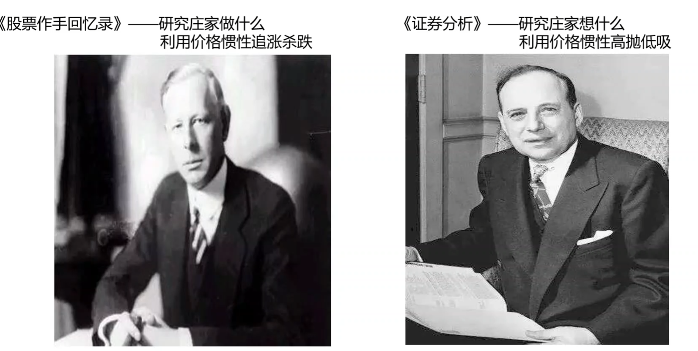

最好的摊平方法，按时间定投，twap指数基金，定投范围可以参考过去熊市。不要空间摊平。

市场每一个股票都可能退市，但市场不会消失。

定投指数基金是每天研究时间小于3小时的人比较容易成功的方法。

## 晚婚时代

https://www.bilibili.com/video/BV1Rn3BzkEKP

面对挑战，不必吐槽，鼓起勇气克服困难即可。

不以单一指标讨论问题，必须多维度看数据。


# 短线交易秘诀

## 第一课：威廉指标WR


外汇，期货适用技术分析，期货首选技术指标

顺日线趋势，升穿50空，止损放在前高，盈利后将止损提到成本线

不要用钱来表达多空观点，没有定价权不要猜价格。

股指使用威廉指标不太流畅，不适合威廉指标。

威廉指标适合在趋势持续时间比较长的地方使用

## 第二课：交易仓位管理 ulimited blade works

模型（二）：威廉信封

- 如何让空信封瞬间变得有价值
- 把5000美元放入桌面15个空信封的任意一个，随机打乱
- 宣布谁抽到那个信封，钱就有了价值
- 突然间，另外14个空信封也有了价值
- 这就是股市、期市价值创造的原理
- 5000美元，在15个信封中的任意一个
- 第一回合：抽到“那个信封”的概率是1/15
- 所以，每个信封的数学期望约为333美元
- 记住：统计学家淹死在水深均值1米的河里。
- 但是，每个人都相信自己能抽到“那个信封”
- 威廉信封模型最奇妙的在第二回合
- 每个空信封抽走后，剩下的空信封会升值
- 抽走5个空信封，剩下每个价值500美元
- 因为每个信封代表1/10的中奖机会
- 只剩下两个信封时，每个信封值2500美元
- 你支付的钱并不是买信封，而是买机会
- 买机会，就是投机
- 换而言之，你以为自己在买股票还骗自己说在买公司，其实你只想买个涨停
- 融合理解【威廉信封】，目的是熬到最后
- 艾略特认为一波行情可以抽五次信封
- 这是五浪结构的五次进场机会
- 维克多斯波朗迪认为可以抽三次信封
- 这是123法则结合2B结构，只在拐点抽
- 杰西利维摩尔认为可以只抽一次信封，用关键点识别阻力最小路线，只抽突破。

拉瑞威廉姆斯怎么抽信封

- 通过控制每笔交易的仓位，
- 让自己在任何行情结构下尽可能多抽信封
- 拉瑞威廉姆斯抽信封，第一次抽多少仓位
- 3%--大开大合的手法是散户亏损的捷径
- 杰西利维摩尔每次重仓抽，遇到连续回撤

威廉信封的意义

- 巴菲特：如果你要成功抄底，那么请确保有持续不断的现金不断抄底
- 定投，把成本分摊在年线上面，利润是价格乖离年线的钱

ulimited balde works

就是【我要有钱一直买到你涨为止】

## 第三课：阿卡姆疯人院

如何管理我们内心的疯狂

为什么把二级市场比作疯人院？

绝大多数人注定会输，但是他们都认为自己必定会赢

想要赢，必须清楚：

何时保持清醒，何时一起疯。

### 为什么绝大多数人注定会输？

- 不愿意花时间去了解二级市场的运作
- 再掘金的路上为卖铲子和卖水的人打工
- 一知半解，知易行难
- 明白长期利益最重要，但沉迷于短期刺激

交易必须以清晰明确的原则为基础。交易时必须分析自己的感受，以确信所做的决策有合理的依据，同时还要设计资金管理计划，以免蒙受一连串的损失导致出局。公众需要大师，新大师总会出现。作为一位聪明的交易者，你必须认识到，长期来看，没有哪位大师能让你发财，必须自己努力。


### 为什么要仓位管理？

1974年，我做出了一个价值判断：生牛合约的价格会一飞冲天。所以我开始建仓，在每磅43美分的时候，我建立了第一笔头寸。我“知道生牛合约的价值”在哪儿，这个价位远低于牛肉的价值。所以，当价格下跌到40美分的区域时，我买入了更多。毕竟43美分已经很便宜了，40美分的价格当然更好。

当价格接着下跌到38美分的时候，我捡了个大便宜，我可不傻，趁便宜又买了一些。但是却看到价格一路下跌到35美分，然后到30美分，最后跌到了28美分——也就是在这儿，各位，我被敲出局了。我的钱是有限的，这波行情让我在不到30天里付出了300万美元的代价。

就在两个月后，生牛合约的价格飙升到了每磅60美分。但这跟我没什么关系了——一笔十拿九稳的交易让我损失惨重，而且过了1/4个世纪，我被敲出局的消息至今还在圈内广为传播。尽管在这之后我有过许多成功的交易，后面也会提到。

### 赢家不按照个人喜恶行动

- 赢家只按照规则行事
- 按照个人喜恶行事，容易违反规则。
- 赢家之所以能在数次灾难中活下来，是因为赢家在发生灾难的时候，及时坐上第一只救生艇

## 第四课：技术分析之如何判断高低点

- 模型1 威廉指标--重心摆动
- 模型2 威廉信封--空心封越少越贵
- 模型3 威廉水手--非随机市场
- 模型4 威廉分形--顶底分形和包含

交易获利的两种模型

交易获利基本上有两种做法：用小的头寸捕捉到一次大的价格波动；或者用大的头寸捕捉一次小的价格波动。

### 如何用大头寸捕捉小波动？

从短期来看，市场会上下剧烈波动，在叫做“均价”的平衡点附近上下波动。

我的目标是判断何时从低位折返到均价，这就是超额的波动。

股价从A点运动到B点遵循一定的结构规律，但这种规律并不清晰。

### 模型（三）威廉水手

大部分时间，商品价格像是个喝醉了的水手，徘徊在街头，既不知道要去哪儿，也不知道去过哪儿。数学家会说过去的价格运动与未来的趋势没有关联。

关于这一点，他们可能错了：因为确实存在一些关联。尽管喝醉的水手摇摇摆摆、跌跌撞撞，好像走得并非随机的路线，但他的醉态有迹可循。他总是想去一些地方，而我们也总能找到这些地方。

顶底分形

- 底分形：三根连续的k线/美国线，中间一根的低点比左右两根的低点要低，这是短期低点，用来做多。
- 顶分形：三根连续的K线/美国线，中间一根的高点比左右两根的高点要高，这是短期高点，用来做空。

### 模型（四）威廉分形

- 三根K线判断高低点，相邻高低点再组合。
- 高点和低点之间叫做一个swing（摆动）
- 内包含或者外包含时，价格没有方向


技术分析的结构都是不稳定结构


## 第五课：如何买在起涨点

### 入市之前必须明白

- 所有股票都是垃圾，只是其中一些在特定的时候股价会上涨
- 股价上涨的唯一理由就是流通股供不应求
- 要买的不是好股票也不是低估的股票而是正在上涨的股票，不要浪费时间研究上涨的逻辑
- 正在上涨的股票会涨到无法继续上涨为止


不能破位，可能引起恐慌抛盘，此时形成了底部结构，一直洗就会洗出很多底分型，迪玛克认为相似的结构不会出现超过13次


## 第六课：什么是多空力度

威廉分型包含未来函数，不能单纯用分型抄底，底分型也能被称为阶段低点模型。

> 我们几乎每天都能观察到多空双方力量在市场中起作用。我在1965年写下的操作法则的是：任何时段，卖方的代表都是价格从日中高点向收盘价的波动，而买方的代表是收盘价减去最低价。我的观点是，收盘价和最低价之间的差距揭示了买方的力量，最高价和收盘价之间的距离揭示了卖方对价格的影响。

收盘价和最低价之间的差距揭示了买方的力量，最高价和收盘价之间的距离揭示了卖方对价格的影响。


需要先判断有没有行情和方向，形成这些方向后再用技术指标

主动长线建立在短线交易秘诀之上

## 第七课：威廉时钟及布林通道的真正用法

我仍然相信市场确实有周期，应该有三种周期，但不是时间周期。时间周期问题的根源在于能够从图表中明显地看到一种主导的周期。问题是，很快有另外一种周期成为主导，替代我们刚刚看到并作为投资依据的周期。

**周期是确定性的根源。**

短线交易赚的钱是别人亏的钱。

当你想交易获利时，是否曾停下来想过你所期望的利润来自何方呢？市场上有钱是因为公司盈利增长、利率降低或大豆收成好吗？不对，市场上有钱只是因为其他交易者把钱带到了市场。你想赚的钱是属于其他人的，他们并不想把钱给你。

交易意味着要去抢别人的，当然别人也想抢你的。这是一件高难度的事情。要赢特别困难，因为经纪公司和场内交易员还要从胜败双方身上揩油。

蒂姆·史莱特（Tim Slater）曾将交易比做一场中世纪的战争。一名男子拿着剑走到战场，想杀死对手，同时对手也想杀死他。胜方获得败方的武器、财产和妻子，把他的孩子当奴隶卖掉。现在我们是在交易所交易，而不是在野外打仗。当你从别人手里赚到钱时，与你杀死他没什么区别。他也可能会失去房子、财产和妻子，他的孩子也会遭殃。

### 交易者的错觉

- 因为行情的变化是随着时间推移而刷新的，
- 所以我们很容易有一个错觉：

**价格有时间周期**

最常听到的A股谬论：五穷六绝七翻身。

### 方法论

第一步：破除迷信，放弃时间周期

第二部：价格周期不是时间，是一种空间的收缩和扩张，其切换只与波幅有关，与时间无关，时间要影响价格周期，也要先影响波幅。

公开课只讲肉眼可见的张弛波幅。


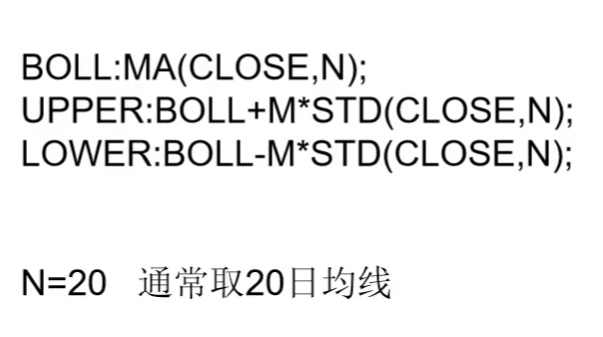

布林通道不是关键点。

### 奇衡波幅不对称定理

定理：波动坍缩之后必然扩大，扩大之后未必坍缩。

当一个品种成交低迷，波幅会坍缩，交易所会改变交易规则，降低交易成本，吸引更多人参与。

推论：每次坍缩，都是大涨或大跌倒计时。


## 第八课：短线交易的利润来自哪里？

波动来自实实在在的盘口博弈，来自定价权和控股权的争夺

### 交易**大忌**

#### 大忌1：根据不可证伪的东西交易

大忌：不问苍生问鬼神，客观地了解产业链

做交易不应该有信仰，交易是概率，科学

后果：自欺欺人，殚精竭虑，走火入魔

自我修养：子不语怪力乱神

成功的算法背后的逻辑很简单和可以执行

#### 大忌2：根据现货供求来交易

供需平衡表在期货交易里面相当于九九乘法表，重要但是基础

用价格来判断供需平衡

相信自己

用现货理解期货会有很大偏差，供需平衡表

现货商习惯了高抛低吸的操作，逢高做空被逼空

何谓“神仙打架”？--为了定价权

站位站错方向被市场教育

价格极端扭曲会影响参与者的看法

何谓“神仙打架”？--为了控股权

### 注意

- 承认神仙打架的存在，不否定内在价值
- 迷信价值不可取，迷信技术不可取
- 基本面分析研究对手在想什么
- 技术面分析研究对手在做什么
- 阻力最小路线来自多逼空，空逼多带来的
- 波动持续扩大--为了定价权和控股权


短线交易秘诀：活力需要时间累积

短线交易的难点在于--持有时间太短，无利可图，持有时间太长，风险过高

### 交易者的自我修养

1. 短线震荡很难预测
2. 必须控制损失
3. 只有价格朝对我们有利的方向巨幅波动，我们才有利可图
4. 时间是我们的朋友，用来创造收益
5. 以周为单位组织战斗（2-5个交易日）

### 如何选择最好的短线进场点？

- 原则1:开盘买入并持有到收盘，除非中间止损出来
- 原则2:开盘30分钟内没有发生幅度超过近5日下探波幅均值的下跌，可买
- 原则3:开盘30分钟内没有发生幅度超过近5日上探波幅均值的上涨，可卖。
- 原则4:遇到双向大幅波动，撤退。

## 第九课：不能用于实战的知识，都是糟粕

科学：明确定义+命题可证伪

防止未来函数的陷阱

波动扩大才是风险收益比和收益大的

做波动扩大经常空仓，等待

## 第十课：动能、趋势如何开始和结束？

>趋势按照我所称为的“价格活动的爆炸点”运动。简单地说，如果价格在一个小时、一周或者一月（你可以选择识别趋势的时间范围）内有爆炸性上扬或者下挫，市场将会朝这个方向持续运动，直到相反的方向产生了同样或者更强的爆炸力量。这就是大家知道的波动扩张，是Doug Brie根据我1980年早期的著作提出的“波动突破”的概念。

做交易赚钱是做波动扩张。

### 价格从中点向上或向下的爆炸性突破构成了趋势。

- 什么是爆炸性突破？
- 选择哪个点作为突破的中点。


### 每日价格波动范围的计算

- 每日价格波动范围=最高价-收盘价
- 用T-1日的波幅来衡量T日的波幅
- 波幅衡量方法：开盘价+每日价格波动范围

每日盯开盘价，为什么波动范围是最高价-收盘价


### 问题来了，多大的波幅算突破？

- 拉瑞威廉姆斯的做法：
- 各个主要品种分别度量，得到一组波幅。
- 每个品种在一定时间内使用的波幅不同。

起爆点：开盘价+（昨日最高-昨日收盘）*N

### 为什么波幅是“昨日最高-昨日收盘”

买卖双方不均衡，卖方占据多头


可能只有少数人做多，其他人想着把货抛出

只要没有人卖，波幅就很小，只要当天

从最高点到收盘点完成抛压的释放

## 第十一课：那个伟大的交易员，他自杀了


### 短线操作的三个重要问题

我们的基本概念或工作原理是某些因素导致了市场的爆炸性波动，并且使得市场呈现某些趋势，这些趋势，就我们的目的而言，在大多数市场中，它们是持续1~5天的。我们的目标是尽可能早的在爆炸趋势开始的时候介入。

这就引发了问题：“是什么引发了市场的爆炸性波动？什么时候最有可能发生？是否存在某些因素，使得我们可以控制这些爆炸性波动发生的时间和点位？”

坦白地说，这些是我大半生一直在处理的问题。很久以前，我认识到如果不能确定一个问题，就根本没有办法找到应对之策。现在知道了问题所在，让我们来寻找一些解决的方法。需要补充告诉你的是，我还没有找到这个巨大谜团的所有答案。能带来触动的只有亏损，使你认识到自己不是那么聪明，需要更多的学习。我仍然有亏损，大量的，因此我仍然需要更多的学习，永远都需要。

**新闻？**

引起这些波动的最大“因素”可能是新闻，但是根据新闻来交易是有问题的。首先，新闻的变化就如同天气一样迅速和不可预测。新闻，或者国际大事和市场的改变，可能是随机的，所以，市场在未知的新闻事件间摆动。数学家关于喝醉酒的水手的推论是很形象的，因为新闻使得价格来回振荡。其次，我们可能是信息链上最后一个获得这些消息的人，我们得到的时候已经太晚了。再次，没有什么东西能让我们获知或者观察到未来可能发生的某些特殊的信息。最后，多年的交易经验告诉我，那些接近信息的人通常会在信息公布前建立好自己的仓位。注意：不是同一组人在使用这些信息；小组会随着信息来源不同而发生变化。银行家可能会获得关于债券市场的内部消息，而不是关于牛的，但是饲养员可能有关于牛的信息却没有关于债券的，能控制所有信息来源的先知先觉者是不存在的。

**活跃市场里，价格消化一切**

- 价格形态？
- 指标信号？
- 价格趋势？事后才能被确认
- 一个市场与另一个市场的关系？用香蕉作为坐标系交易苹果
- 大众共识？管住自己，不要冲动，女性交易员会更冷静。

在短线交易中，大量无知的散户是绝对的输家。

期货收益巨大，但是非常困难。

短线交易里面你赚的钱是别人亏的。

作为局外人看局内的情况，会觉得很不可思议。

**善待你身边那些亏钱的朋友，珍惜他们给你的宝贵信号**

交易员不能有立场，要成为成功的交易员，不能有自己的立场，没有多没有空。

寻找有立场的交易员，给他们算算账，看看他们的立场能否有实力坚持。


对于短线交易员来说，我偏好Jake的调查，因为在每天收盘后，Jake都会给50个交易员打电话，问一下他们对特定市场的看法，是看涨还是看跌。因为他们是短线交易员，从理论上来说，他们对市场的看法通常是错误的，但可以用他们的建议作为不买进或卖出的风向标。我不会完全使用他们的意见作为买卖参考，而是确保它们跟我的交易不冲突。如果大部分人都在卖出，我就不会跟随他们卖出。我不是在诋毁大家的看法，只是不想跟他们站在一边。

短线交易不能跟大众一样。

1960年到1983年间有一位真正伟大的交易员，是前专业篮球运动员Frankie Joe。Frankie非常聪明，对于自己的交易方法有深刻的认识。他是一位非常了不起的人物，办事果断，并且善于与人交谈。我们有了长达3年的友谊后，他向我透露了他的交易技巧，就是在股票市场上高价卖出，低价买入。这就是全部的内容，一点也不多，一点也不少。这是那个时段最重要的技巧，为Frankie积累了很多财富。

接下来，里根政府的减税和削减政府预算引发了牛市，这是可以预测但是没有多少人预见到的情况。可以预测牛市终究会到来，但没有人能够预测到的是，股市没有出现过去18年来下跌又被拉升的现象。甚至当时最重要的交易员Frankie Joe，也没有能够预测到。他一直在高位卖出，却没有机会低价买进；因为股市根本没有下跌。最终，他对于一直亏损却没能盈利感到非常沮丧（就像其他伟大的交易员一样，他渴望成功），最后他选择了自杀。

在这个行业中，行得通的理论不会持久有效，这就是我为什么那么羡慕芭蕾舞演员的原因，他们以脚尖着地，却能屹立不倒。

时代变了。

有效市场：市场波动使得所有有利可图的策略最终变得无利可图。

与时俱进：我对市场没有观点。

- 我是中立的。
- 只关心“进场-出场-再进场”
- 市场没有对错，只有输赢
- 盈利出金，浮盈归零
- 现金才是现金，浮盈终究是浮盈
- 长期持有现金，偶尔有头寸
- 所有股票都是垃圾，只是其中某些在特定时候会上涨而已

## 第十二课：用交易日效应赚钱

1912年，一位记者问Harriman在股票市场上成功的秘诀和技巧，他回答说：“股票市场赚钱的秘诀，就是及时止损。股票下跌超过0.75点时，一定要抛出。但是如果股票价格朝着盈利的方向波动，那就别去管它。向上调整止损点，这样价格有波动的空间，可以升得更高。”

移动止损，当价格向上移动的时候，调整止损位，保护利润。

### 市场是有效的，但并非随机


所有游戏的输家通常都会抱怨有人作弊，或是根本没人赢过，这样他们的失败就有了借口；然而多年来许多人都曾战胜过市场。我读过学院派关于慨叹价格无法预测的著作，比如保罗·库特纳的经典著作《股票价格的随机特征》中阐述的观点就是：历史价格波动与第二天或者一周后的价格走势无关。这是真的，保罗与许多没做过交易的人都这样认为，因为市场是有效的，所有被披露的信息大家都已知道，并且反映在当期价格中。所以，今天价格波动只能是由于市场上有了新的信息（消息）。

失败只能怪自己，市场有多容易亏钱，就有多容易赚钱。

市场每天开盘都有机会，看本事赚钱

市场有效有程度，完全有效市场下，任何风吹草动都会影响价格，成交非常活跃。

市场大部分时间处于非完全有效状态。

市场价格有记忆，当多空双方焦灼在一起时，价格会围绕某一个中枢上下波动。

### 价格波动不是投硬币

因为各品种在交易日与交易日之间的波动各不相同

交易平台：金字塔决策交易系统，mt4，tb，tradestation

不是非常专业的平台

自建平台比较麻烦，低频交易不依赖平台

### 交易日效应：沪深300股指期货周一的波幅比其他天的波幅大

叠加交易日，赌波幅扩大，计算起爆点后建仓，模型自己改进起爆点计算

一般人主观交易做etf，大盘蓝筹股，不要动商品期货，更不要动期权

周二开盘消化周一晚到周二盘中的消息，周一开盘消化周五晚到周一早上的消息，所以有交易日效应

不能把策略在期货交易里面回测的散户在期货很危险

交易就像开飞机一样是一个技术活，不是靠信仰。

波动比较大的日子，从开盘拿到收盘，一年来说行情主要来自于某一个月的几根大阳线 

如果市场是随机的，胜率应该是50%的胜率

投机和交易与赌场的赌徒差不多，盈利的期望不确定，要从赌客变为赌场，这样才有正的期望值。

当有胜率优势，增加交易次数，长期来看是赢的。

交易日效应做交易模型背后的逻辑

### 期指交割日

可能会出现十字星

## 第十三课：短线获利形态的共同特征（一）

共性：反直觉

对策：顺势逆流

所有最好的形态共有的一个因素：利用代表市场极端情绪的形态，可以在价格反方向运动中建立可靠的交易。

投资大众在图表里 “看到” 的负面价格变化，对短期市场波动而言，往往是支撑价格上涨的（看着糟，实际短期可能涨 ），反过来也一样。拿收盘下跌的外包日线举例，当天最高价超前日最高价、最低价低于前日最低价，收盘价还低于前日最低价，看着形势很差，有些书说这是很好的做空信号，认为价格会跌。但作者反驳，说写这些书的人没好好研究价格走势图，像美元指数图显示，这种情况实际是牛市形态，说明不能光信书本理论，得结合图表深入分析。简单说就是别被表面负面价格变化唬住，也别盲目信传统书本观点，得看实际走势结构。 

观察外包含反转：今天阴线最高点高于昨日k线最高点，最低点低于昨日k线最低点，收盘价低于昨日k线收盘价。

从包含出现开始观察分形排列，外包含破新低不要害怕，可能是反转，观察分形排列

## 第十四课：短线获利形态的共同特征（二）

群体的势力要比你强大得多。不管你有多聪明，都不要与群体争辩。你只有一个选择，那就是要么加入群体要么独立行动。

市场似乎总是在人们斩仓后立即反转，对此许多交易者很不理解。这是因为群体成员正在遭遇同样的担心，所以大家都会同时斩仓。一旦恐慌性抛盘结束，市场就只有向上了。此时乐观情绪重返市场，群体变得贪婪，又开始新一轮狂买。

在理性框架内参与群体的疯狂

要赚钱需要意识到什么时候会拉高并吸引过来买，意识到是因为庄家的拉高意图而买入，一旦恐慌性抛盘结束，股价就会涨上去了，跌下来有承接之后就会止跌，有承接之后就是在酝酿一个反转


不用形态预测未来，一轮上升或下跌的时候，出现阴包阳，阴线的最高点就是做多的起点，做空的在最高点出场，如果价格往下走，打破了最低点，减仓，跌穿了阴线的最低点做空，止损点在阴线的最高点

独立思考，理性的参加群体行动，认真观察自己，并注意操作时的精神状态的变化。操作时记下买入的理由和卖出的条件，包括资金管理规则。只要没有平仓，就不要改变自己的交易计划。作为一个交易者，如果能在操作前把自己绑在操作计划和资金管理上，那肯定能活下来。

在二级市场里面交易，遇到的大部分突破都是假突破

默认是假突破，真突破卖飞了或者亏了就止损

有两个攻击日。第一个非常明显。“攻击日买入结构” 是指某个交易日，收盘价低于前一交易日的最低价，对图表分析独具慧眼的乔・斯脱维尔（Joe Stowell）称之为 “突出收盘价”。另外，这一天的收盘价还可以低于前 3 - 8 个交易日的最低价。对于图表分析师、公众或者职业技术分析师来说，这一形态看上去像是下降的突破，因此会出现非常多的卖单。

他们偶尔会正确，然而通常情况下，如果市场立刻反转，他们就犯了致命的错误。

“攻击日卖出结构” 则截然相反（见图 7 - 7）。这次要寻找的是一个交易日，其收盘价高于前一交易日的最高价，并且最有可能突破向上，收于价格波动的最高点。这正是晃动的诱饵，促使大家来不及看一眼就跳起来。图 7 - 7 展示了这种情况。这里向大家介绍了买入、卖出结构。

之前曾经说过，偶尔这会是有效突破。然而，如果第二个交易日价格向攻击日相反方向移动，并且价格高于低收的攻击日的最高价，大家可以视之为强烈的买入信号。同理，攻击日价格上扬，高位收盘价高于前一日的最高价，如果第二天价格低于攻击日的最低价，这是提醒我们做空的信号。

现象是第二天价格突然反转，投资者（低收盘价卖出者，高收盘价买入者）转为亏损，他们预见的突破没有出现！他们吞掉了钓钩，然而对于我们来说，价格对反转的反应是一个很好的入场时机。这就是形态，是基本原理，是行之有效的。

不要研究真假突破。大部分是假突破，遇到真突破不要爆仓。

攻击日买入结构：


## 第十五课：短线获利形态的共同特征（三）

每一个支撑或压力区域的强度取决于三方面因素：区域长度、区域高度和区域内的成交量。可以将这些因素视为振荡区的长度、宽度和深度。

**支撑或压力区域的长度是区域持续的时间或它被触及的次数，长度越长，则其强度就越大。**支撑和压力就像美酒，年代越久味越浓。两周的振荡区间只能提供微弱的支撑或压力，两月的振荡区间使人们有时间逐渐习惯于此，因此可以成为中度的支撑或压力位，而两年的区间就会成为人们广为接受的价值标准，继而成为重要的支撑或压力位。

支撑和压力位不是绝对的位置

有一个长时间的横盘区间，一旦向上突破，那么往上走的规模会比较大，但是不是横有多长，突破就有多大。有可能往上也有可能往下。

有人把多次触及的位置理解为阻力位或者压力位。

做长线的话观察横盘的时间

不要做被动长线投资者

想做短线就需要知道短线的特性

做长线的空间是通过时间换的

短线一定要快，跑得快

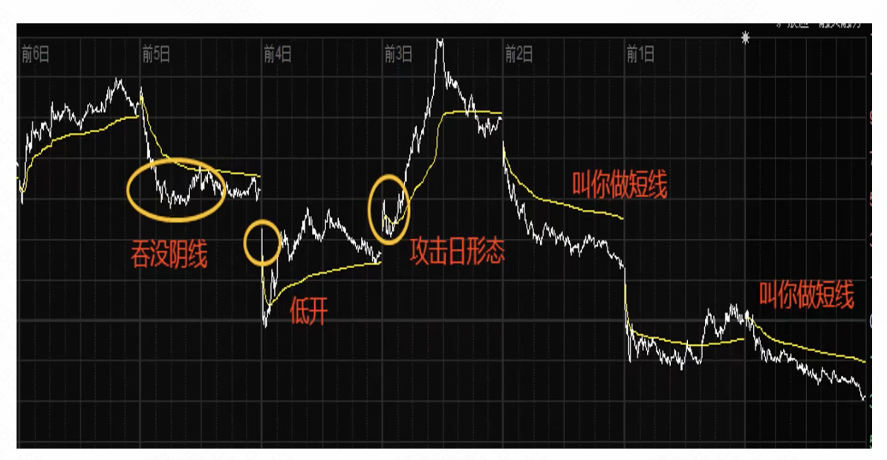


这些形态具有瞬时性，不以形态预测未来

不要用短线形态做长线

### 缺口被封闭的时候做短线反转

该形态基于过度的情绪反应，随后出现价格过度反应的快速反转。这个过度反应造成前一日收盘价与后一日开盘价之间存在一个极大的缺口。如果这样的过度反应发生在开盘价低于前一日最低价的时候，那么就为我们提示了买入信号。如此罕见的现象表明，市场很可能反转。造成这种情况的原因是，市场中出现疯狂卖压，大家在开盘时恐慌性抛售，从而导致当天开盘价低于前一日的最低价。这种情况非常特殊，因为开盘价一般都落在前一日的价格区间。

我们的做法是，低开之后入场，价格上扬至前一日的最低价。如果市场可以汇聚力量达到这一价位，抛售压力很有可能得到缓解，市场大幅上扬随后即至。

你或许在思考，卖出时机正好相反。你会寻找开盘价高于前一日的最高价的交易日。大家的情绪或筹划在开盘时汇聚了大量的买单，因而造成一个跳空高开，形成巨大缺口，促动价格涨过前一日的最高价。我们在价格回落到前一日的最高价时入场，表明缺口可以被封闭，这是强烈的卖出信号，预示价格可能会下跌。

本节的题目 “哎呀” 正是反映了公众因为消息、图线等信息而在开盘时纷纷做空导致价格下跌。这些人暂时看似决策明智，然而当价格回涨至前一日最低价，经纪人告诉他们价格向反方向运行时，通常大家会说 “哎呀，我们可能（又）犯错了，价格反弹力度很大。你还要继续空吗？”

拉瑞威廉姆斯做震荡，把所有的突破都当作假突破，因此做的时候不能上重仓

具有正期望的一致性交易能带来利润--奇衡dk-capital

正路是长线和短线搭配

主观交易最终总结为一个固定的模式去做，不要用小聪明

## 第十六课：没有买卖就没有伤害

市场横盘整理的时间远长于沿趋势运行的时间。大多数对原有交易区域的突破都是假突破。它们在价格返回原有区域之前吸引趋势跟随者。假突破是业余投资者的祸根，但专业玩家却很高兴。

专业玩家大多数时候都希望价格波动不要走得太远。他们一直等待，直到向上突破停止创出新高、或向下突破停止创出新低。然后他们就会涌进市场，对突破进行反向操作，将保护性止损单设在最新高点或低点处。这种止损单设得很窄，他们的风险很低，而一旦价格重返原有区域，则获利空间很大。收益 / 风险比如此之高，以至于即便只做对了一半，专业玩家也能从中获利。

**奇衡不认同**

重仓做主升浪更有利可图

做短线的特征：赔率和胜率之间选择胜率

做假突破如果遇到真正的突破，会损失很多钱的同时踏空

短线交易的书鼓励新低和新高做反弹

奇衡主张做突破，减少持仓时间和次数

### 迫切性

到底先有鸡还是先有蛋，先有买家还是先有卖家？我想每一个投机者尝到甜头之前都应该先参透这一富有禅意的问题。表面上看，如果卖家必须将股票或合约卖给买家，价格就永远不应该变化太大。它们难道不应该彼此平衡吗？

在完美的世界中，情况是这样的，然而我们生活在一个不完美的世界中，而且在玩儿一个更加不完美的游戏。现实中，正如你在日报上看到的或是经纪商转述的，价格确实在变动，有时候变动还很疯狂。价格变动的原因并不是由于买卖的股票或合约的数量，归根结底，它们是相互匹配并会最终成交的。价格波动的原因是买卖中的一方忽视了另一方的存在。

换言之，这个等式中的一方企图通过买高或卖低而从中获益。造成价格变动的不平衡因素不是交易量而是紧迫性…… 想要或急着想要的一方会把价格推高或压低。

股票突然拉升的原因是机构建仓，大笔买入，机构的冲击成本是很大的，机构建仓需要时间。

奇衡不赞成投资者在大横盘突破时做假突破

书中“最大震荡值”概念应用约束条件太多

你买的品种主升浪的时候你需要在场

大区间突破不要反向做，会冒损失本金的风险


## 第十七课

1. 杠杠只能做局部右侧，在左侧杠杠做多会亏很多钱
2. 算风险收益比

## 第十八课：在学会资金管理之前你什么都不是
 
在学会使用资金管理方法之前，你只不过是一位微不足道的投机者，在这儿赚点钱，在那儿亏点钱，永远都不会赚大钱。你永远都抓不住商品交易的魔戒，只能在交易中游走，捡到一点小钱，抓不住大钱。

大多数交易员都有信心，拿着一大笔钱去冒险，并且有能够预知未来的足够的信心。这产生了两个问题。

第一，我们认为自己的系统或者方法能够将盈利的交易和亏损的交易区分开来，第二，更糟糕的是，我们认为自己足够聪明能够做到这一点。因此，在各种交易中积累了不等数量的合约或者股票。

就像我们必须持续服从作战计划才能获胜一样，必须维持足够的现金，作为每笔交易的后盾。一旦你认为自己能够“确切”地捕捉赚大钱的机会，然后交易更多的合约，麻烦就会找上门来。

偶尔，**你可能会撞对，赚一大笔钱，但是最终你会由于持仓过大而亏损**。亏损本身已经够糟了，但是由于你没有好的资金管理方法，你将会情绪化，可能持有这个头寸太长时间，梦想会再有一次大的赚钱机会。这样的情况下，事情不会好转，反会更加糟糕！

口中的概率是信心的大小，主要影响因子是对过去积累的经验对市场的不完整认知加上新增加的信息

### 资金管理的精髓

- 拉瑞威廉姆斯：盈利的时候可以加仓，亏损的时候可以减仓（利润回吐的时候就可以减仓了），投资不是反人性的
- 奇衡DK：以结果倒推来确保--市场上涨的时候你有股可以卖，市场下跌的时候你有钱可以买。股市下跌时没有现金，上涨时候没有股票，投资的道理懂再多也没有用。

### 凯利公式的问题在哪里？

凯利公式不适用于二级市场的投资和杠杆交易。

1. 凯利公式原本用于“21点”，输赢有上下限，而不适用于期货等杠杆类交易。
2. 凯利公式的本质是对一个胜率稳定的模型在亏钱的时候持续加码逆向投资，博取大奇迹日。

务必阻止最大回撤发生在你资金越做越大的时候

## 第十九课：为什么你会错失交易良机

首先，如果你设置止损，就不会被重创，永远不会。当然，你的交易是亏损的，但是绝不会发生被封闭、追杀的情形。其次，如果在任何一个时间，你只是动用资金的 30% 进行交易，那你永远也不会爆仓，再强调一次，从来不会，也永远不会。设置止损，并只动用固定比例的资金进行交易是保持平稳心态的最迅速的方式。

要这么做，你必须充分了解，你是在与一个巨大的安全的网络进行交易。你将存活下来，因为你已经控制了这个看起来不可控制的游戏。

大回撤会让你几年的收益打水漂

保守一点，不要用太多杠杆，盈利要出金

当且仅当一开始就设定最大损失，才会安心执行交易计划

奇衡的做法：股票组合单个行业不会超过20%

放弃潜在利润换取交易系统的长治久安，博取更大的潜在利润会承受更大的潜在亏损

放弃了潜在利润会错失交易良机

学习知识要实用，一些知识需要实操才能理解

抄到底跟赚钱是两回事

持有指数就能赚时间的钱，货币量会不断新增，通货膨胀会推高权重股

### 跑步、交易和亏损

盈利是易于处理的，但是当所有交易进行的不是很理想时又该如何呢？

对于亏损我略有了解，我想比大多数人了解的要多，因为作为一个交易员，我有过辉煌的盈利和利润，很自然地，也受过打击。实际上，上个月我家就被不愉快的气氛笼罩着。找到一笔成功的交易比发现迈克・泰森的个性要难得多。

我的经历比你还要糟糕…… 我应该是一个专家，不应该发生这样的事情，加上背后有几千双眼睛看着（一直是这样），看我如何出丑。天啊，这就足以让我想停止出版评论了。

如何处理这些命中注定的失败所造成的污点？

关于这个问题，我的马拉松比赛经验给了我最大的启示。在我参加过的每场
马拉松比赛中，总计 17 场，总有一个点，我比预期会跑得好，跑得快。出于同样的原因，每场马拉松比赛中我总是遇到低潮，看起来不能回头，不能反弹。我不是在开玩笑。有次比赛跑到 23 英里时，我在路上躺了大约 5 分钟，看着我先前超过的选手从我身边跑过。

从赛跑中，我认识到摆脱麻烦的唯一方法是…… 放慢脚步…… 走一会儿……甚至可以躺在路上。简而言之，就是停下脚步，镇定下来，才能够重新启程并继
续原来的比赛。伙计们，猜猜会怎么样？对于失败的污点也是同样的。当失败袭来时，它一定会袭击你，后退一点，慢下来，甚至停止交易，但是要**留在场内**。

留在场内是最重要的

### 为什么大多数交易员错失很多良机

多年来，我一直在思考为什么在交易中不能更加成功，现在我可能找到答案
了……

答案是：市场能波动 0.1 美元，而大多数交易员不能。

这就是很多人在这个看似容易的游戏中失败的原因。

故事起源于你发现了一个做多的信号。当你买入后，像普通人一样，就是认
为市场会，应该会，也必须会向上。管它有没有危险，全速前进。

但是前进的路上可笑的事情发生了，市场一如既往地变幻无常，向反方向前
进了。在这个过程中，你的技术分析智囊发出了出场警告或者卖出的信号。瞧瞧，技术分析 “起作用了”。

问题是，你头脑中贪婪的反应不是这样的。它仍然认为买入信号是正确的，
要你继续持仓，过去可能出现过这种情况并成了现实。同时，现实正在告诉你过去是怎样的。但那是过去的事情了。你想象或积极思考课堂上或学校老师教你的信条 “坚持下去”，使得错误更严重。你一意孤行，直到你的自我想象破灭。

我们如此渴望正确，以至于一旦我们建立一个观点（市场将恢复），只有地狱或者高潮（追加保证金通知）才能使我们面对现实。

让我进一步阐明这个观点。望风的告诉窃贼（他们想要盗窃的心理无异于交
易员想要交易的心理），他有足够的时间去抢银行金库，于是窃贼开始抢，很高兴地把做梦都想得到的钱装起来。但是，这时候望风的吹哨子说 “警察来了”，窃贼会迅速逃走，他改变了自己的计划。这就是交易员和银行窃贼的不同…… 交易员会留在银行，并期望 “警察来了” 的警告是错误的！

你应该跟随的是最后一个信号，而不是之前你希望它有效的那个信号。幻想
在这个行业中没有用处，顺势交易才是现实的。学着跟随现实，而**不是追随希望去进行交易**，你就会突破并成为一个成功的交易员。加油！


**预想每一笔交易都是风险**

交易是顺人性，进去就有浮盈证明你是对的，对的就要拿长

**你应该跟随的是最新的信号，而不是你想象中的那个信号**


## 第二十课：逻辑学的基础是“你不能用A预测A”

**我有个奇怪的感觉：我目前进行的交易将是亏损的--非常大的亏损！**

只要没有浮盈或平仓，当下进行的交易都是亏损的

交易和运动很相似，最重要的运动能力是后来居上的天赋。

### 二级市场的赢家长什么样？

交易执行层面需要一根筋

现在来说说赢家

从哪儿开始呢？我很吃惊地发现我问这些赢家的问题和他们问我们的问题居然一样多，而输家很少提问。很少有赢家会交易期权。他们都会采用某种形势的资金管理而且都是技术派的交易者。任何人，无论男女，他们脑子里似乎都会记得某次失败的交易，惨痛到让他们发誓再也不要重蹈覆辙。所以他们会设止损，也会谈论因为未设止损而被三振出局的经验。因此他们很少会在心中喃喃自语地谈自己的交易。

一个最大的差异是，赢家会将精力集中到极少的几个他感兴趣的市场。有位赢家从 1956 年起，就一直只交易黄豆，没买卖过任何其他的产品。而输家就会经常转换市场，转换他们追随的专家，转换投资通讯，频繁到就像我走路会滑倒一样。赢家会做（或买）很多市场调查，而输家则更倾向于求助于某个人来拯救他们或帮他们挣钱。

所有的赢家完全相信他们会盈利，而拒绝让坏的事情发生在他们身上。他们身上有着一层保护光环，以至于不会让他们在市场里做傻事。他们惊异于有那么多人和他们的做法不一样，他们意识到有很多压力，但相信任何一位略有智慧的人都会采取和他们一样的做法。

在市场里面犯了错，就一定会受到惩罚。

## 第二十一课：传统图形分析

拉瑞威廉姆斯的主张：在混沌中建立有胜算的秩序。

忽视基本面是打牌不算牌，忽视技术面是打牌不看牌

--奇衡DK-CAPITAL

**《以交易为生》第三章**

### 图表师的入门是手绘K线图

图形分析师研究市场行为，试图识别出反复出现的价格形态。他们的目标是在价格形态再次出现时交易获利。大多数图形分析师看标有最高价、最低价、收盘价和成交量的柱形图，有些人也看开盘价和持仓量。点数图分析师只跟踪价格变化，并不关心时间、成交量和持仓量。

传统的绘图只需一支铅笔和一张纸。那些视觉导向的人喜欢用这种方法。他们通过手工画图往往能对价格走势有感觉。计算机加快了画图的速度，但却丢掉了画图时的某些感觉。

绘图的最大问题在于人的主观意愿性思维。交易者对形态的判断往往取决于他们是想买还是想卖。

图上的信息看到和看见是不一样的

### 图形：揉进了希望、恐惧和想象

在 20 世纪初，瑞士精神病专家赫尔曼・罗夏（Herman Rorschach）设计出一种测试方法来探究人的思维。他在 10 张纸上各滴一滴墨水，然后把每张纸都对折一次，形成对称的墨迹。大多数看到这些纸的人把他们所看到的东西描述成：解剖图的一部分、动物、建筑等等。但实际上，它们不过是墨迹而已！每个人看到的都是他脑子里的主观景象。大多数交易者看待价格图形就好比是一个巨大的罗夏测试。他们把自己的希望、恐惧和想象也揉进了图形之中。

**你所见的，皆故意被你所见**


打牌打得不是牌，打得是对手的心理战。

看图不要仅仅看图，要用图来看穿对手的心理。

图表基础：最低点多头定，最高点空头定

下跌会跌到多头表态。

当你记住所有图形之后，对手要预测你的行为，变得简单多了。

你忘记了要在混沌中建立有胜算的秩序，而不是教科书上说的秩序。

不断手绘k线图，类似的结构重复出现，脑子中就会记住发生概率很高的结构，这个比拿着书所学的图形所不能比拟的。

## 第二十二课：图形的交易法则

图形是人家出招，故意让你看到。交易法则是你如何接招。

当你记住所有图形之后，对手要预测你的行为，变得简单多了。

你忘记了要在混沌中建立有胜算的秩序，而不是教科书上的秩序

你所见的，皆故意被你所见。

花那么多钱画K线出来要你见啥？

不要违反证券法，操纵股票市场

### 基本图形与盘面语言：矩形

要在存在90%的杂信号的情况下找出10%的真信号

矩形表明成本区，矩形


先判断矩形所处的位置，高低位是上一轮牛熊的高低点

高位：

- “我很有钱。我要持有到《xw联播》大结局”

- “我要获利了结，超短线的快来送死”

市场先生会派筹码给做短线、波段的人，接着传递给菜鸟，向下突破的时候接到最后一棒。

低位：

- “我建好仓了，有没有人要锁筹码（寻找长线投资者，震荡洗盘的时候不会动，尤其是次新股，询问的时间很漫长，洗盘就是看哪些筹码是不动的，不要左侧加杠杆）”

- “市场里只有我，炒短线的快来接盘（老庄资金不够，拉不起来股价，拉的时候就有抛盘，成交量不用看，缩量是真的，放量不一定是真的，市场结构可以短期控制，但没有办法影响长期走势，偏偏炒短线的人需要利用短期走势，旱地拔葱后出手）”

成交量放大表明波动要变大了，是做短线的时候了。

**表示奇衡认可**

*表示奇衡不认可*

当价格走势呈矩形形态时，场内交易员经常可以通过**短线波段**操作获利，但是**大资金只能沿价格突破方向操作**。

（1）在**矩形内**操作时，于**矩形的下轨买入、上轨卖出**。在矩形内可以用振荡指标（oscillators）来判断价格何时将会反转。当随机指标（stochastic）、RSI 指标和**威廉指标**（Williams，见第 4 章 “计算机化技术分析”）触及其参考线开始转向时，表明价格将在**矩形内反转**。
如果*在矩形的下轨买入，就将保护性止损位设在矩形下轨之下一档*；如果在矩形的*上轨卖空，就将保护性止损位设在矩形上轨之上一档*。一旦看到价格反转的信号，就要迅速获利了结。**在矩形内操作时，持仓超过止损位很危险。（持仓不能超过止损位，超过了就要砍仓，砍错了也要砍）**

（2）*从更长的时间周期来分析*市场走势更容易发现矩形的上轨或下轨是否会被突破。如果你想抓住日线图上的突破，就看周线趋势，因为沿周线趋势方向突破的可能性更大（见第 9 章的 “三重滤网交易系统” 一节）。

（3）一旦在突破上轨时买入或突破下轨时放空，就把保护性止损位设在矩形*内侧一点儿*。随后价格可能会缩量回抽矩形被突破的一侧，但*有效突破之后价格不应该重新返回到矩形范围之内。*

不能通过更大的时间判断趋势，小时间周期的趋势反转可能导致大时间周期的趋势。

交易日线趋势就要用日线时间周期来判断趋势，上涨趋势：低点不断调高，高点不断创新高

保护性止损位需要设置在矩形外部，矩形内部价格是随机漫步。

奇衡不接受有效突破这类说辞，突破表示运行到矩阵外，只要突破，奇衡就会进场

先了解产业，政策，基本面，市场资金流向，市场偏好，找到方向，再在这个方向里面研究交易对手在做什么

有效突破不要等回踩

在矩形靠下沿建的仓，记账作为底仓；上沿，交易仓。

**突破后，加仓；出现上涨过程的拐点，卖交易仓；回落，设保护加仓。**

突破后加仓的止损位设置为大矩形最高的收盘价，并且是收盘跌破之后才止损，代价是扛到收盘，重新回到矩形里面，以矩形里面前20%的大阴线的平均值来计算抗一天突破加仓的风险。矩形规模越大，矩形里面对手囤积的资金规模越大，意味着没有足够的幅度，他也出不来，拉上去之后杀回来，Mr.market出不来

底仓可以接受利润回吐，交易仓需要赚到应该赚的。

底仓做趋势，交易仓做波段。

回踩之后买入交易仓，止损点放在矩形下沿，

止损位放在不可能去到的地方

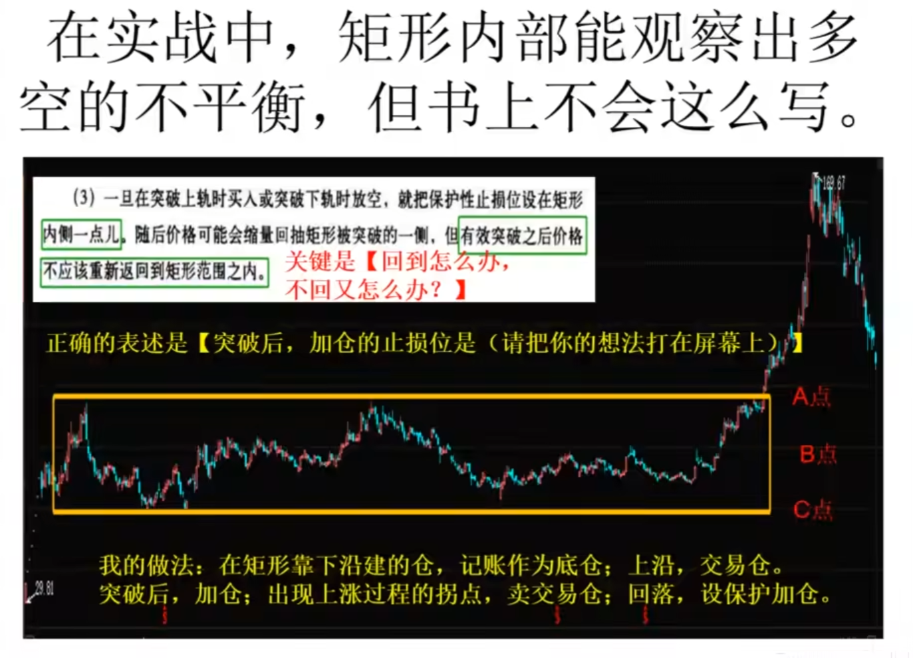

底仓和交易仓要区分

上涨趋势没有反转的时候，出现了一个新的矩形，要面对同一种 Mr.market 要面对同一群人的洗盘手法。

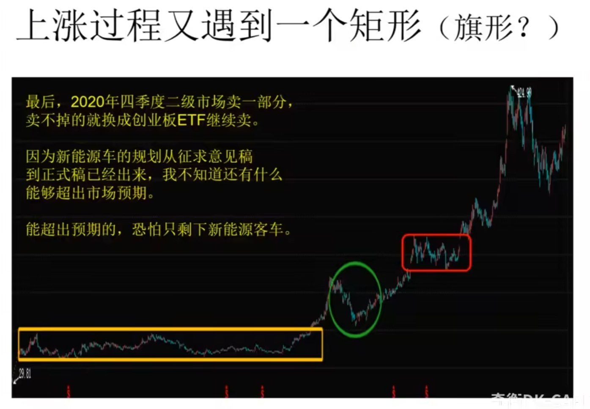


### 图形是人家出招，故意让你看到，交易法则是你如何接招。


三角形可以根据其角度分成三大类。*对称三角形*的上下边角度相等。如果上边与水平方向成30°，那么下边与水平方向也成30°，对称三角形表明多空双方势均力敌，因此成为趋势持续形态的可能性更大。

*上升三角形*的上边相对平缓，下边向上倾斜。其平缓的上边表明多方每次都有足够的力量将价格拉回到同一水平，而空方未能将价格打压到同一水平。上升三角形后价格出现向上突破的可能性更大。

*下降三角形*的下边相对平缓，上边向下倾斜。其平缓的下边表明空方每次都能将价格打压到同一水平，而多方却未能将价格抬升到同一水平。下降三角形后价格出现向下突破的可能性更大。

**三角形持续时间越长，成交量越小**。如果价格上涨到三角形的上边时成交量突然放大，则上边很有可能被突破。如果价格运行到三角形的下边时成交量大，则下边很有可能被突破。*有效突破往往伴随着成交量的突然放大，至少比之前的5日均量放大50%以上*。

*有效突破出现在三角形的前2/3部分*。如果*突破*出现在三角形的后1/3处，则*最好不要操作*。如果价格一路跟随到三角形的顶点，则后市走势可能还会比较平淡。三角形就好比是两位疲惫的拳击手之间的较量，他们互为“依靠”。突破越早说明其中一位拳击手的势力越强。如果直到三角形的顶点价格依然没有突破，则表明双方都已耗尽精力，可能不会有趋势性变化。

**最好不要在三角形内操作**，除非是个大三角形。随着三角形形态持续时间延长，其波动幅度逐渐缩小。潜在的盈利空间也逐渐缩小，而成交价差和佣金仍在一如既往地吞噬利润。

*（1）如果在三角形内操作，可以利用随机指标（见第4章的“随机指标”一节）和透视指标（Elder - ray，见第8章的“透视指标”一节）等振荡指标。它们能帮你抓住细微的波动。*

（2）在判断日线图上的三角形是否会向上突破或向下突破时，可以看看周线图（见第9章的“三重滤网交易系统”一节）。*如果周线趋势向上，那么日线图上的三角形很有可能会向上突破，反之亦然。*

（3）当你想在向上突破时买入时，把买单设在三角形上边一档即可。当三角形变窄时，要不断降低买入价位。如果想在向下突破时卖空，可以把卖空单设在三角形下边之下一档。当三角形变窄时，要不断提高卖空价位。一旦建仓，就要把保护性止损位设在三角形内侧。*价格有效突破后可能会回抽三角形的上下边，但不会重返三角形内很深。*

（4）当价格突破三角形后又回探三角形上下边时，要注意成交量的变化。带量回抽可能意味着突破失败，而缩量回抽则是一个很好的加仓机会。

*（5）当价格接近三角形下边的后1/3时，要撤销买卖单。出现在三角形下边的后1/3部分的突破很不可靠。*

### 这些交易知识，不懂毁一生

（1）所有形态都是某种矩形或者未完成的矩形

（2）突破哪边就去哪边，别考虑成交量等杂念。

（3）不要在各种矩形内部操作，盘整应该休息。（本金小可以高抛低吸，但是需要严格止损，不严格止损是会亏大钱，如果严格止损，最终是不赚钱的）

## 第二十三课：计算机化技术分析

不懂编程的图表师，不是一名合格的交易员

编程要学好

当年学英语就能做外贸赚外汇了。

懂编程可以让计算机做重复的事情。

### 发明计算机的初衷是什么？

A、打游戏

B、科学家没事干想做手工，但蟑螂屋用完了

C、破译敌军密码、计算原子弹配方

要发家致富不要想投机倒把，要想原创


盈利的策略：

盈亏比大于1，胜率30%-50%，年均交易次数小于每天一次


### 总结

不能写成算法让计算机自动执行的盘感都是自欺欺人。

关键的指标定下来就别调参数

只要调参数，问题就大了

## 第二十四课：量价关系

无法通过成交量来判断是散户入场还是大资金入场

成交量反映市场参与者的资金参与程度、情感投入程度和痛苦程度。

卖方和买方都渴望正确。

成交量放得越大，市场上痛苦的人就越多。

多空不是对半的，成交金额是对半的。

### 结语

量价关系里面有未来函数，放量不是买入的条件，而是决定了何时参与，不是以成交量作为买卖的判断依据

放量和主要指数运行在年线上方表明资金流向这个市场，不代表要开始做多，而是开始关注

## 第二十四课：三重滤网系统

对结界的宝具--乖离剑（EA）

### 市场波动是一场群体幻觉，认为自己可以战胜市场的人泥足深陷

量化是把所有的东西量化成数值产生客观的东西

可以问，但是解决问题需要靠自己

可以自己做交易模型，但是需要每一行都自己写。

主要作用不是发现行情，而是将每次操作都进行三次测试或过滤。可以减少不必要的操作。

滤波器是用来减少犯错的机会。

结合趋势跟随和反趋势技术。

第一重滤网：市场潮流

- 来自道氏理论：潮流
- 逻辑：利用趋势指标观察大周期
- 朴素做法：日线交易者观察周线MACD柱形
- 作用：买入、卖出和观望，排除一个
- 红柱收窄，排除“买入”
- 绿柱收窄，排除“卖出”

第二重滤网：市场波浪

- 来自道氏理论：波浪
- 逻辑：利用震荡指标观察交易周期
- 缺点：指标钝化
- 朴素做法：日线交易者观察KDJ超买卖
- 作用：买入、卖出和观望，选一个
- 周线MACD柱上升，KDJ小于30，**拟买入**
- 周线MACD柱下降，KDJ大于70，**拟卖出**

第三重滤网：盘中突破

- 来自道氏理论：涟漪
- 逻辑：在前两层滤网结果下，突破追入
- 炒期货追求入场就浮盈，浮盈扩大就做对了
- 前两重滤网拟多，突破昨日高点上一档，买入
- 前两重滤网拟空，突破昨日低点下一档，卖出
- 止损：多单以当天或昨天低点下一档
- 止损：空单以当天或昨天高点上一档

过滤了风险，同时也过滤了机会

三重滤网做几日的短线

总结：

- 三重滤网可以化解震荡指标的钝化
- 市场波动只不过是一场群体幻觉
