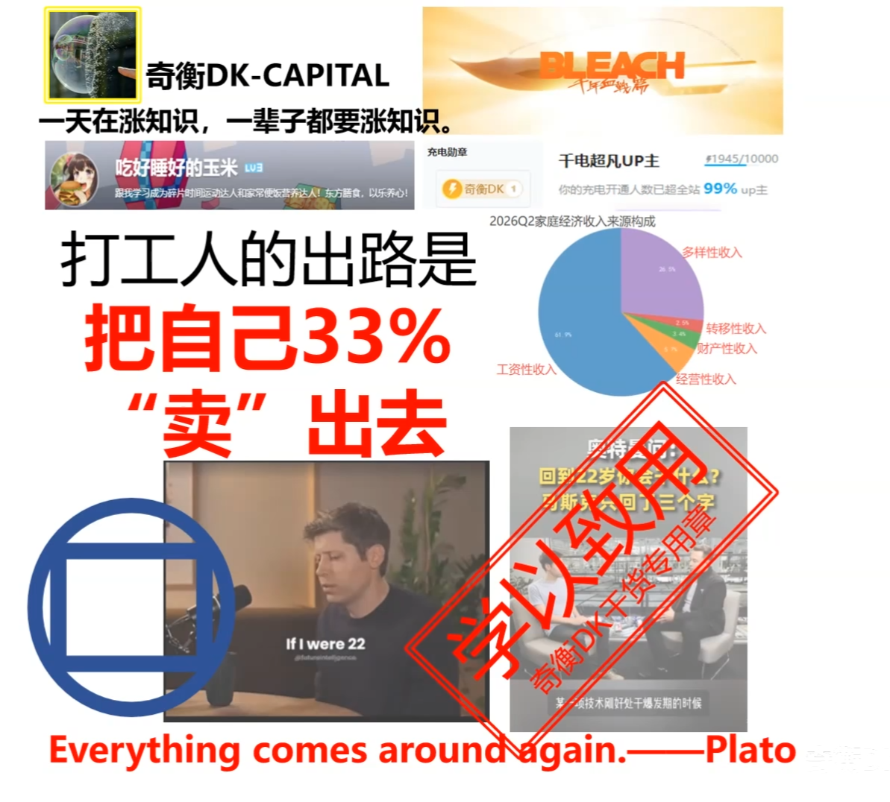
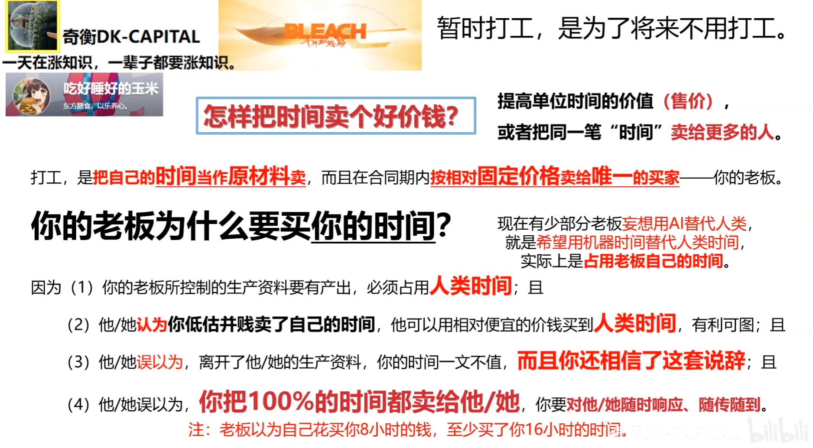
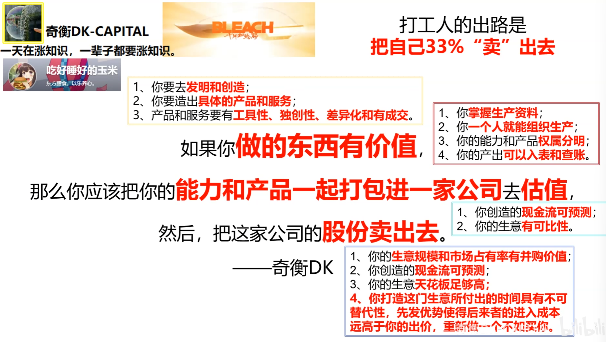
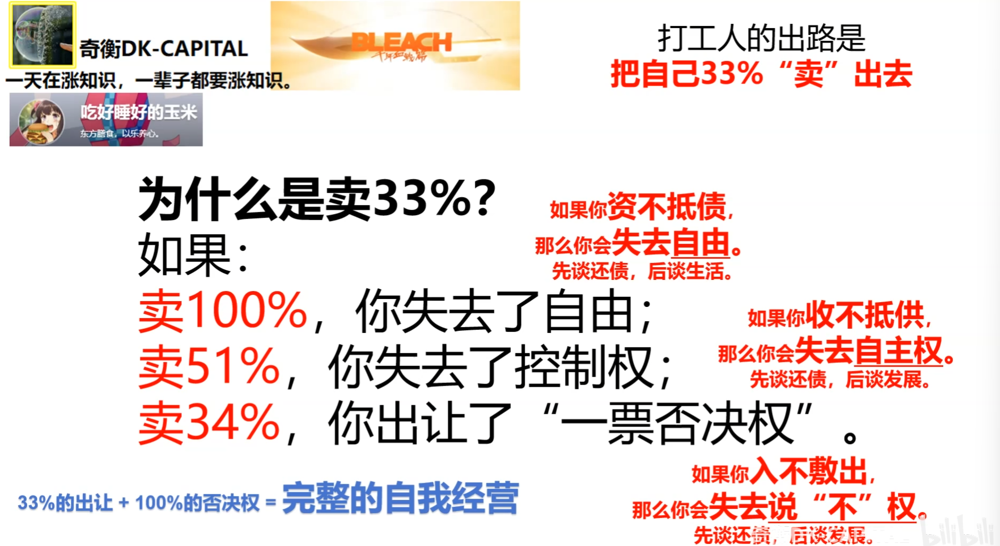
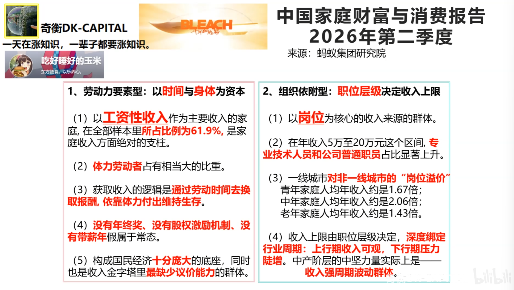
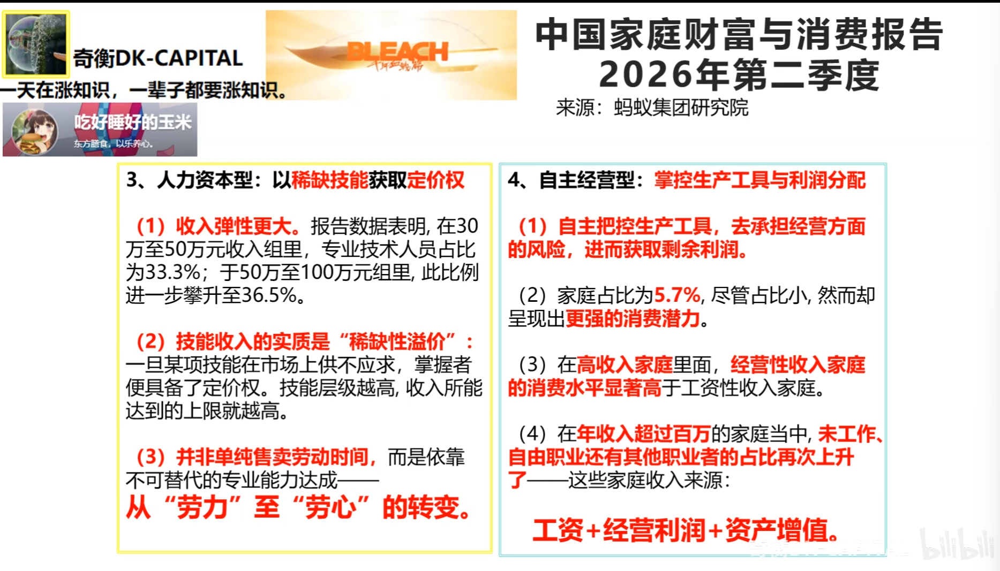
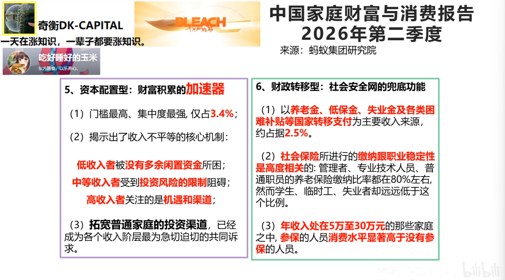
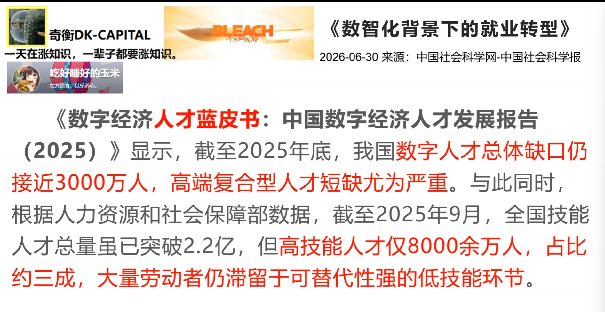
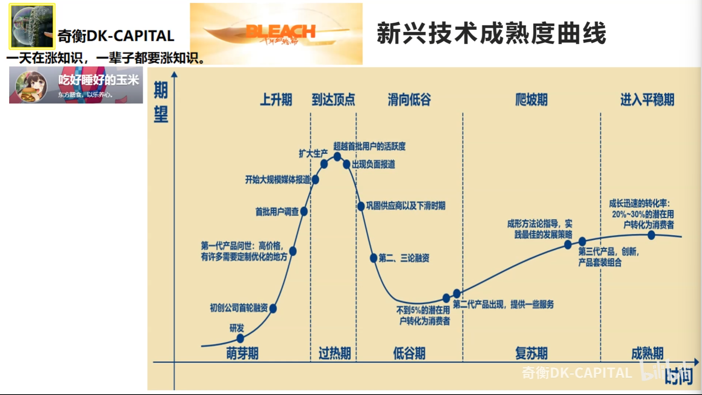
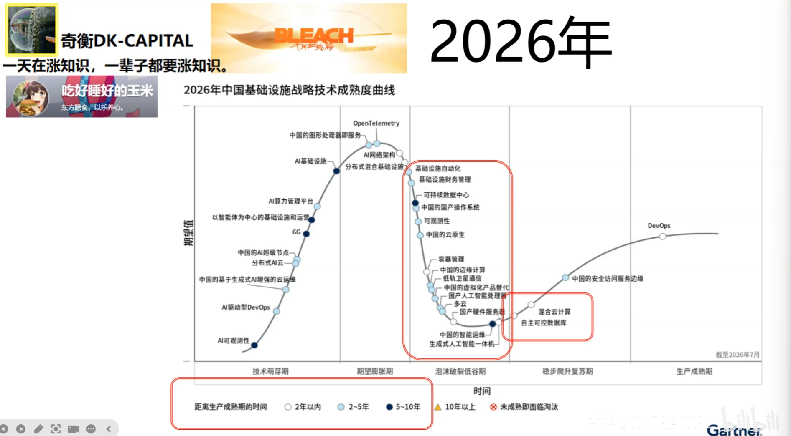

# 涨知识

## 20260704

## 20260815

https://www.bilibili.com/video/BV1RdbC6RE1r/?spm_id_from=333.1007.tianma.7-1-23.click&vd_source=2a2441551a55be16b9f3248ef7e6216c

## 20260824

https://www.bilibili.com/video/BV1H4886wEm4/?spm_id_from=333.1387.homepage.video_card.click&vd_source=2a2441551a55be16b9f3248ef7e6216c

**暂时打工是为了将来不用打工**

如果做的东西有价值，那么你应该把你的能力和产品一起打包进一家公司去估值，然后把这家公司的股份卖出去。

要发明和创造

承担风险，驾驭不确定性获得超预期结果。

产品和服务要有工具性、独创性、差异化和有成交。

股份才有估值和杠杆。

**打工人需要快速完成原始积累掌握生产资料**

完整的自我经营

人力资本型：能否在公司之外搭建能够创造现金流的链条

人力资本到自主经营最后才进入资本配置型，直接跃迁到资本配置型会承受异于常人的痛苦。

看数字经济人才蓝皮书，缺乏高端复合型人才

