# 涨知识

## 20260516 一生中最重要的机遇与2026职业生涯展望

https://www.bilibili.com/video/BV1nsL567E6j/?spm_id_from=333.1387.upload.video_card.click&vd_source=2a2441551a55be16b9f3248ef7e6216c

1. 过去式商品经济，未来是服务经济

商品只有在服务场景中才能卖出去

2. 所有传统行业都值得用AI重做一遍，应聘程序员会被要求先去养猪。

3. 当且仅当硬件成本陡峭下降的时候，以软件为载体的服务才能兴旺发达。

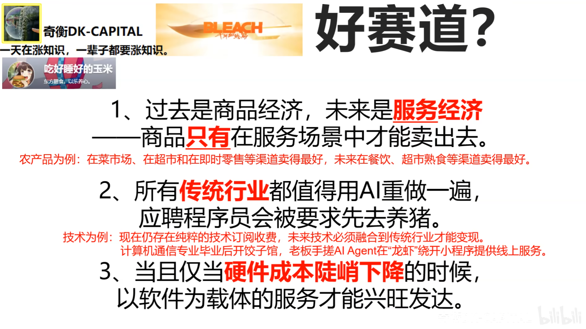

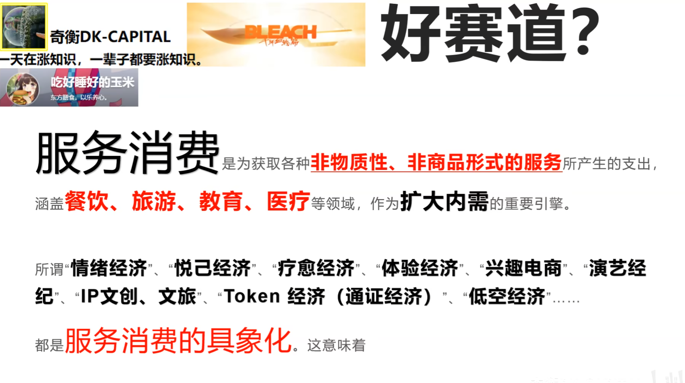

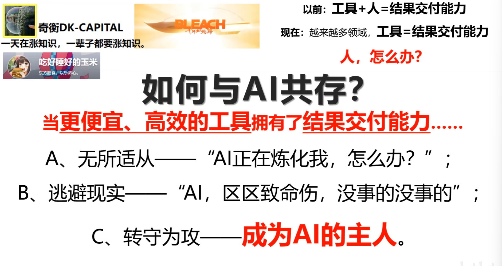

### 成为AI的主人

第一步：成为以掌握生产资料为首要目标的“泛创业者”

人需要的是工作，不是上班

不以待遇高低来评价岗位好坏

以离生产资料的远近来评价岗位好坏

用一切资源来组织自己的生产--掌握生产资料、组装生产工具和构建生产关系

总结：放下安稳妄想，用企业家精神指导行为，成为敢与老板say no的人力资本

**承担财务风险**以创立并**运营**新事业、**追求利润**的过程与行为，也被视为一种将变化转化为机遇的胆识、心态和生活方式。其核心内涵包括**创新精神、冒险精神、前瞻性与机会发现、责任意识与诚信**等多维度特征。

人力资源终将被AI炼化；

**人力资本终成AI主人。**

人力资本：能够带来经济和社会效益的个人拥有的知识、技能与能力。其主要特点在于它与人身自由联系在一起，不随产品的出卖而转移。

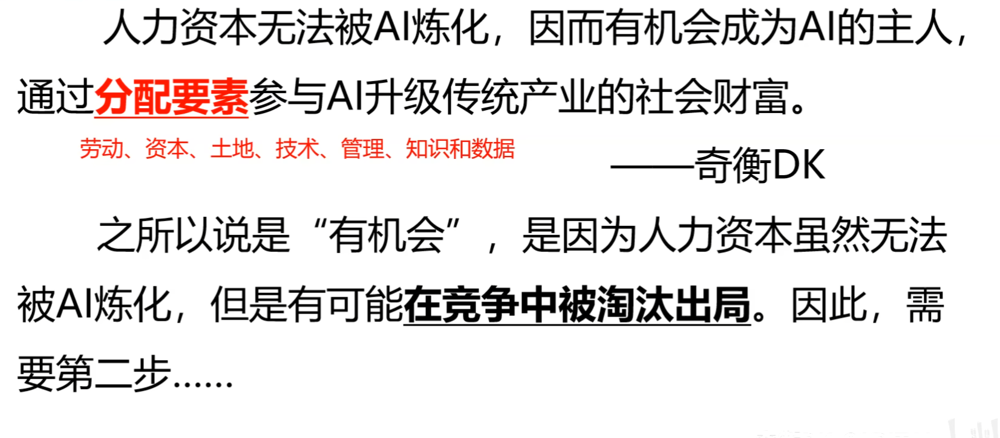

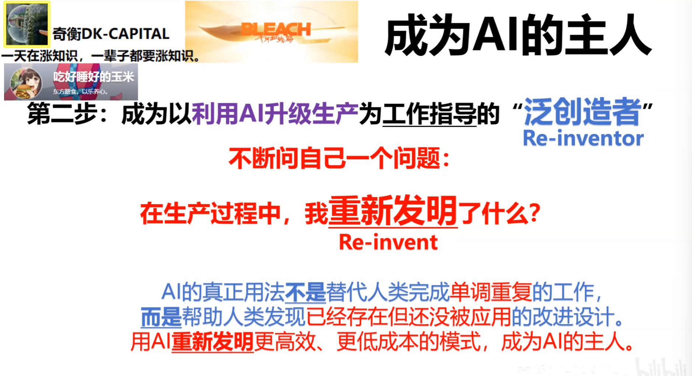

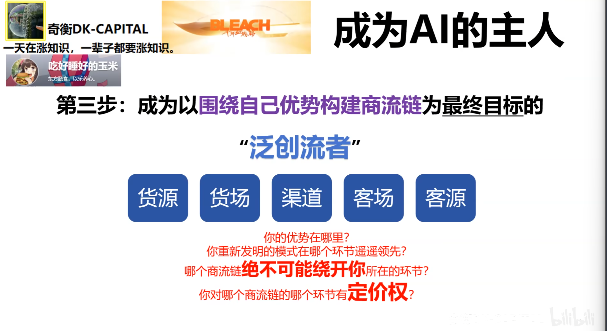

## 20260619 天生我材必有用，千金散尽还复来

https://www.bilibili.com/video/BV1nBj664EyJ/?spm_id_from=333.1387.upload.video_card.click&vd_source=2a2441551a55be16b9f3248ef7e6216c

相信自己，在天花板足够高的行业坚持，赢一次就能把所有赚回来

周而复始刚刚发生。

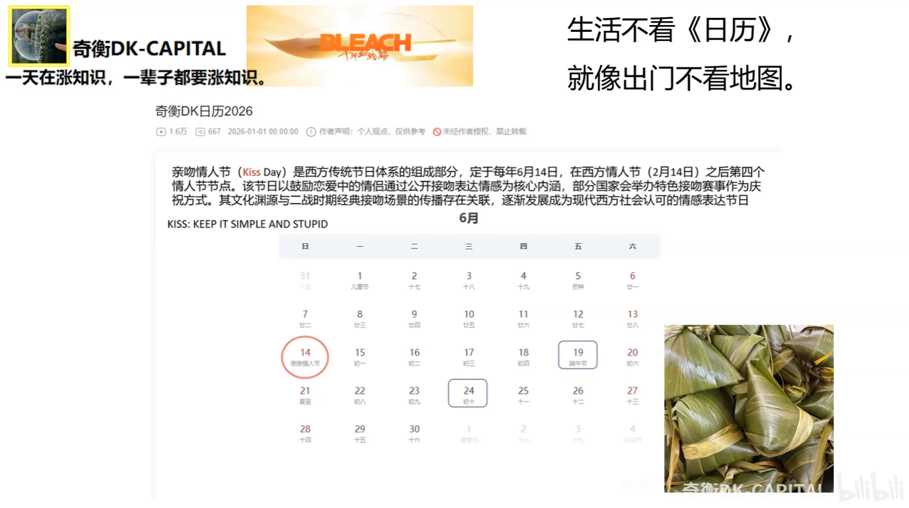

怎么弄才能把黑馒头变成积分商品

生产大量花卷并降价。

当花卷出问题，消费者就会买升价的馒头。

最后有消费者，下游锁定馒头。

开始生产黑馒头，并与白馒头一起卖，就这样黑馒头打开销路。

### 消费是最终需求

服务消费占比已经超过46%

文旅消费、信息消费等持续高于商品零售额增速

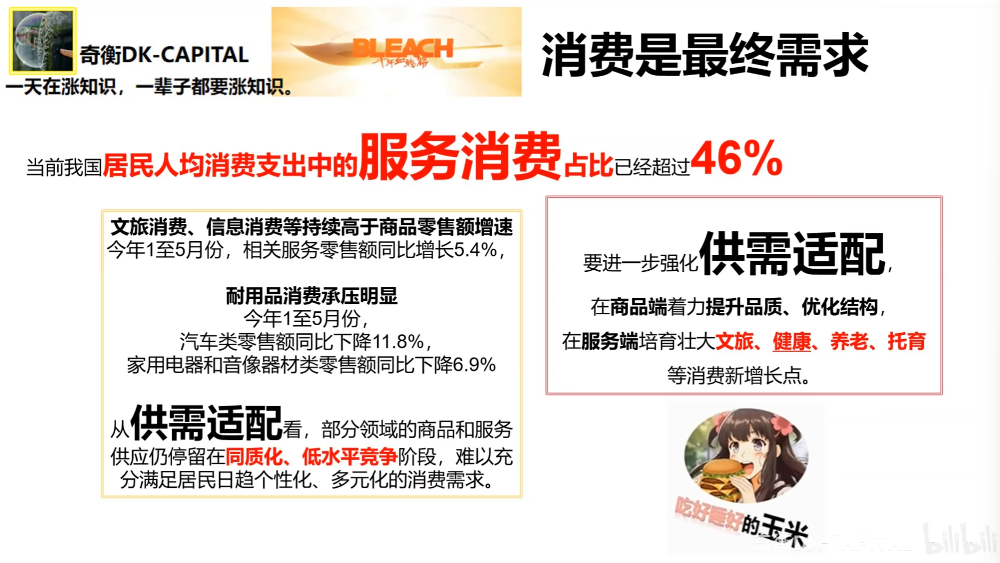

服务端的增长点在文旅、健康、养老、托育

## 20260704

https://www.bilibili.com/video/BV1QNMN6XEQX/?spm_id_from=333.1387.upload.video_card.click&vd_source=2a2441551a55be16b9f3248ef7e6216c

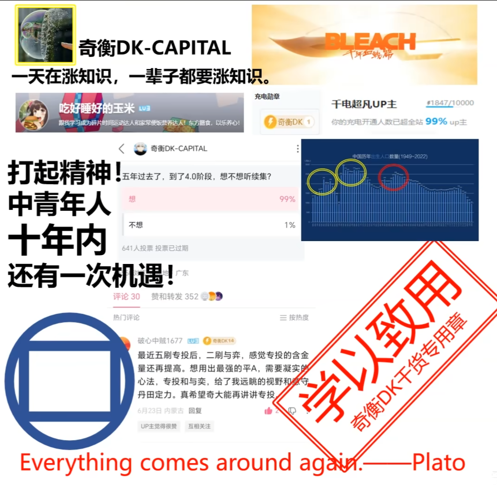

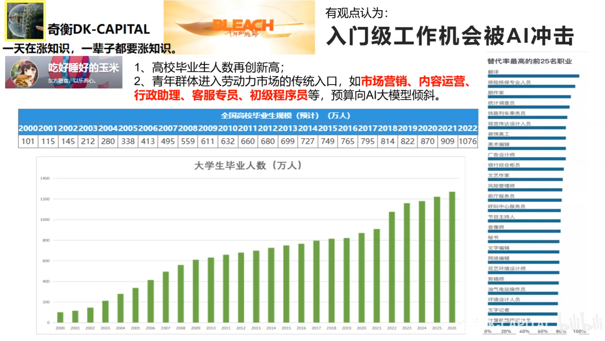

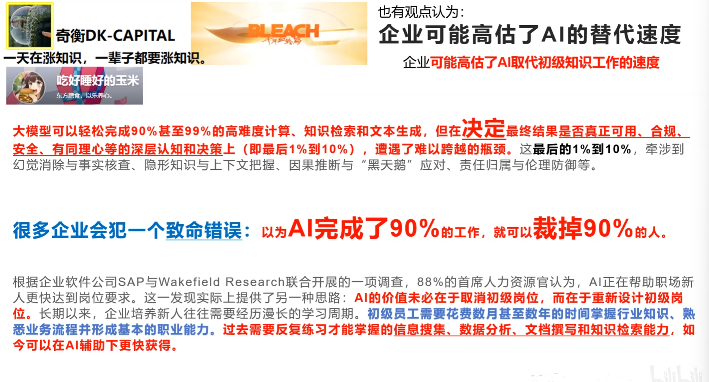

AI的价值在于重新设计初级岗位。

一人公司是企业的起点

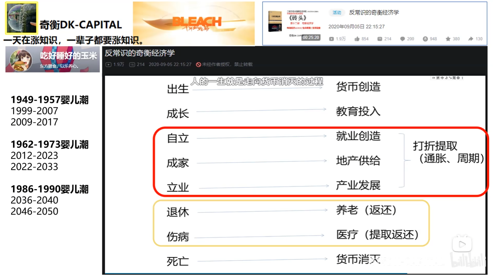

机会正在慢慢走来

财富消灭的过程产生需求

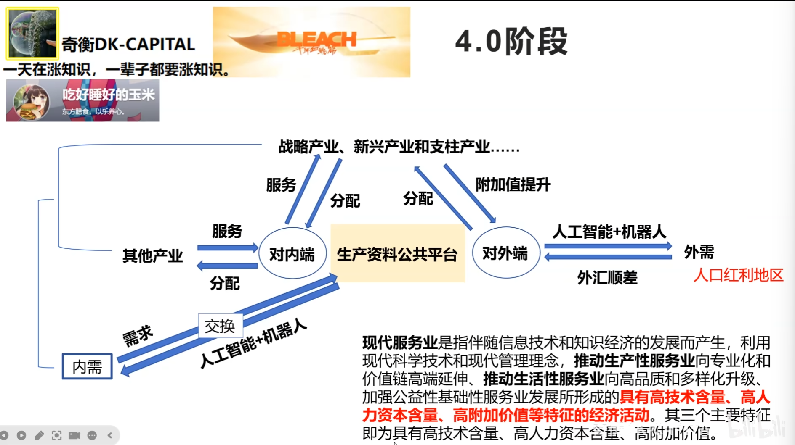

人力资本：不是出租时间，而是在一个项目里面承担风险，成本从而交付服务获取利润

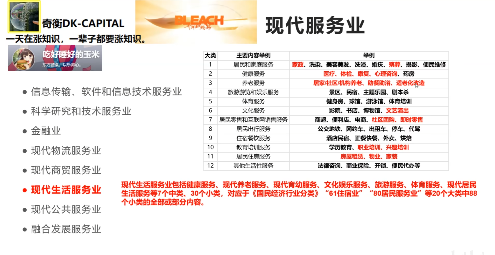

## 20260815

https://www.bilibili.com/video/BV1RdbC6RE1r/?spm_id_from=333.1007.tianma.7-1-23.click&vd_source=2a2441551a55be16b9f3248ef7e6216c

## 20260824

https://www.bilibili.com/video/BV1H4886wEm4/?spm_id_from=333.1387.homepage.video_card.click&vd_source=2a2441551a55be16b9f3248ef7e6216c

**暂时打工是为了将来不用打工**

如果做的东西有价值，那么你应该把你的能力和产品一起打包进一家公司去估值，然后把这家公司的股份卖出去。

要发明和创造

承担风险，驾驭不确定性获得超预期结果。

产品和服务要有工具性、独创性、差异化和有成交。

股份才有估值和杠杆。

**打工人需要快速完成原始积累掌握生产资料**

完整的自我经营

人力资本型：能否在公司之外搭建能够创造现金流的链条

人力资本到自主经营最后才进入资本配置型，直接跃迁到资本配置型会承受异于常人的痛苦。

看数字经济人才蓝皮书，缺乏高端复合型人才

